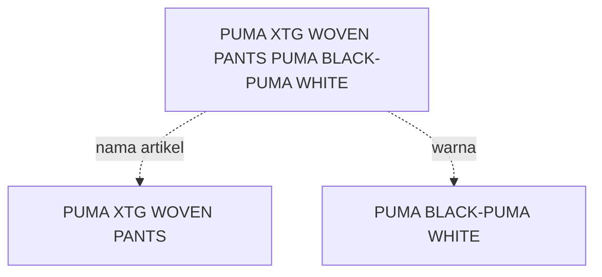

# Mengenai ColorSkim

<!-- ### Abstrak -->

### **Pendahuluan**

Di dalam dunia retail, suatu produk lebih dikenal dengan istilah artikel atau SKU (*Stock Keeping Unit*). Umumnya artikel atau SKU memiliki format dalam deret karakter alfanumerik yang dilabelkan pada suatu produk dan akan menjadi identitas pada produk tersebut.

Selain deret karakter alfanumerik, biasanya artikel juga memiliki beberapa atribut seperti `nama artikel`, `gender`, `ukuran`, `satuan`, `dimensi`, `warna` dan lain sebagainya yang mungkin cukup variatif tergantung jenis dari produknya.

Pada kasus kali ini, penulisan atribut `warna` dari sebuah artikel biasanya disatukan ke dalam `nama artikel` seperti misalnya 'PUMA XTG WOVEN PANTS PUMA BLACK-PUMA WHITE' dimana atribut `warna` dari artikel ini sebenarnya adalah 'PUMA BLACK-PUMA WHITE' sedangkan bagian 'PUMA XTG WOVEN PANTS' adalah bagian dari atribut `nama artikel`.

Terdapat kebutuhan untuk meng-ekstrak atribut `warna` ini dari `nama artikel` sehingga misalnya, `nama artikel` dapat dipergunakan sebagai tampilan yang lebih bersih di halaman produk di *e-commerce* tanpa kehilangan informasi mengenai `nama artikel` yang utuh, lengkap dengan atribut `warna`-nya yang diberikan oleh *vendor*.

Kebutuhan untuk meng-ekstrak `warna` dari `nama artikel` ini juga nantinya diharapkan dapat digunakan sebagai bagian dari pembelajaran mesin untuk mengklasifikasikan `warna` yang diekstrak menjadi `kode warna internal` yang lebih seragam seperti `BLA`, `GRN`, `WHT`, ..., `MTL`, `NOC`.

### **Metode**

#### Data Preprocessing

Sebelum data dapat dipergunakan dalam proses *training* jaringan saraf tiruan, beberapa hal berikut akan terlebih dahulu dilakukan:

* *Pemrosesan raw data ke dalam potongan kata*
  
    Pada awalnya data merupakan daftar (*list*) dari semua `nama artikel` beserta `brand` yang ada saat ini, dalam bentuk *csv* sebagai berikut

    | brand | nama_artikel                       |
    | ----- | ---------------------------------- |
    | ADI   | ADISSAGE-BLACK/BLACK/RUNWHT        |
    | ADI   | ADISSAGE-N.NAVY/N.NAVY/RUNWHT      |
    | ADI   | 3 STRIPE D 29.5-BASKETBALL NATURAL |
    | ADI   | 3S RUBBER X-BLACK                  |
    | ...   | ...                                |
    | WAR   | 125CM VINTAGE ORANGE               |

    Data ini akan dirubah menjadi 

    | brand | nama_artikel                | kata     | label | urut_kata | total_kata |
    | ----- | --------------------------- | -------- | ----- | --------- | ---------- |
    | ADI   | ADISSAGE-BLACK/BLACK/RUNWHT | ADISSAGE |       | 1         | 4          |
    | ADI   | ADISSAGE-BLACK/BLACK/RUNWHT | BLACK    |       | 2         | 4          |
    | ADI   | ADISSAGE-BLACK/BLACK/RUNWHT | BLACK    |       | 3         | 4          |
    | ADI   | ADISSAGE-BLACK/BLACK/RUNWHT | RUNWHT   |       | 4         | 4          |
    | ...   | ...                         | ...      |       | ...       | ...        |
    | WAR   | 125CM VINTAGE ORANGE        | 125CM    |       | 1         | 3          |
    | WAR   | 125CM VINTAGE ORANGE        | VINTAGE  |       | 2         | 3          |
    | WAR   | 125CM VINTAGE ORANGE        | ORANGE   |       | 3         | 3          |

    Lalu akan dilakukan pengisian label pada kolom `label` secara manual untuk dijadikan variabel dependen yang dijadikan sebagai target dalam proses *training* jaringan saraf tiruan seperti di bawah ini

    | brand | nama_artikel                | kata     | label       | urut_kata | total_kata |
    | ----- | --------------------------- | -------- | ----------- | --------- | ---------- |
    | ADI   | ADISSAGE-BLACK/BLACK/RUNWHT | ADISSAGE | bukan_warna | 1         | 4          |
    | ADI   | ADISSAGE-BLACK/BLACK/RUNWHT | BLACK    | warna       | 2         | 4          |
    | ADI   | ADISSAGE-BLACK/BLACK/RUNWHT | BLACK    | warna       | 3         | 4          |
    | ADI   | ADISSAGE-BLACK/BLACK/RUNWHT | RUNWHT   | warna       | 4         | 4          |
    | ...   | ...                         | ...      | ...         | ...       | ...        |
    | WAR   | 125CM VINTAGE ORANGE        | 125CM    | bukan_warna | 1         | 3          |
    | WAR   | 125CM VINTAGE ORANGE        | VINTAGE  | warna       | 2         | 3          |
    | WAR   | 125CM VINTAGE ORANGE        | ORANGE   | warna       | 3         | 3          |

* 

### **Hasil**

### **Kesimpulan**

### **Saran**