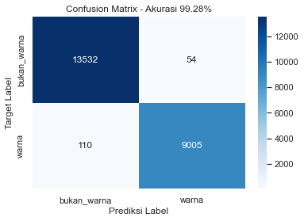
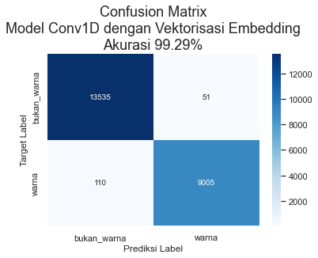
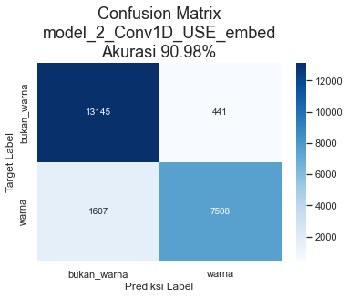

# ColorSkim Machine Learning AI


```python
# import modul dasar⁡⁡
import os
import random
import gc #garbage collector

# import pandas, numpy dan tensorflow⁡
import pandas as pd
import numpy as np
import tensorflow as tf

# import daftar device terdeteksi oleh tensorflow
from tensorflow.python.client.device_lib import list_local_devices

# import utilitas umum tensorflow
from tensorflow.config import run_functions_eagerly # type: ignore
from tensorflow.data.experimental import enable_debug_mode # type: ignore

# import pembuatan dataset
from sklearn.model_selection import train_test_split
"""
karena struktur objek dalam tf.data.Dataset, from_tensor_slices() 
tidak dapat dipanggil secara langsung dalam modul import
"""
from_tensor_slices = tf.data.Dataset.from_tensor_slices

# import preprocessing data
from sklearn.preprocessing import OneHotEncoder, LabelEncoder
import tensorflow_hub as hub


# import pipeline scikit untuk model_0
from sklearn.pipeline import Pipeline

# import layer neural network
from sklearn.feature_extraction.text import TfidfVectorizer
from sklearn.naive_bayes import MultinomialNB
from tensorflow.keras.layers import Input, Conv1D, Dense, GlobalMaxPooling1D# type: ignore
from tensorflow.keras.layers import TextVectorization # type: ignore
from tensorflow.keras.layers import Embedding # type: ignore

# import fungsi loss dan optimizer
from tensorflow.keras.losses import BinaryCrossentropy # type: ignore
from tensorflow.keras.optimizers import Adam # type: ignore

# import model Functional API tensorflow
from tensorflow.keras import Model # type: ignore

# import callbacks untuk tensorflow
from tensorflow.keras.callbacks import ModelCheckpoint, EarlyStopping, ReduceLROnPlateau # type: ignore

# import model terbaik, metriks dan alat evaluasi
from sklearn.metrics import accuracy_score, precision_recall_fscore_support, confusion_matrix
from tensorflow.keras.models import load_model # type: ignore

# import grafik
import matplotlib.pyplot as plt
import seaborn as sns
from tensorflow.keras.utils import plot_model # type: ignore

# import display untuk menampilkan dataframe berdasar settingan tertentu (situasional)
from IPython.display import display

# import library log untuk training
import wandb as wb
from wandb.keras import WandbCallback

# import kunci untuk login wandb
from rahasia import API_KEY_WANDB # type: ignore

# set output tensorflow
run_functions_eagerly(True)
enable_debug_mode()

# set matplotlib untuk menggunakan tampilan seaborn
sns.set()
```


```python
# cek ketersediaan GPU untuk modeling
# NVidia GeForce MX250 - office
# NVidia GeForce GTX1060 - home
list_local_devices()[1]
```


    name: "/device:GPU:0"
    device_type: "GPU"
    memory_limit: 1408103015
    locality {
      bus_id: 1
      links {
      }
    }
    incarnation: 16971607085435757720
    physical_device_desc: "device: 0, name: NVIDIA GeForce MX250, pci bus id: 0000:02:00.0, compute capability: 6.1"
    xla_global_id: 416903419


## Variabel Global


```python
DIR_MODEL_CHECKPOINT = 'colorskim_checkpoint'
# kita akan mengatur toleransi_es sebagai fraksi (fraksi_toleransi) tertentu dari jumlah total epoch
# dan toleransi_rlop sebagai toleransi_es dibagi dengan jumlah kesempatan (kesempatan_rlop)
# dilakukannya reduksi pada learning_rate 
EPOCHS = 1000
UKURAN_BATCH = 32
FRAKSI_TOLERANSI = 0.01
KESEMPATAN_RLOP = 5
TOLERANSI_ES = int(EPOCHS*FRAKSI_TOLERANSI)
TOLERANSI_RLOP = int(TOLERANSI_ES/KESEMPATAN_RLOP)
FRAKSI_REDUKSI_LR = 0.1
METRIK_MONITOR = 'val_accuracy'
RANDOM_STATE = 11
# untuk mencegah overfitting, kita akan memberikan ruang yang cukup besar 
# untuk test_data dan memperkecil porsi train_data dengan jumlah epoch
# yang besar sehingga model masih memiliki waktu untuk melakukan
# training pada train_data
RASIO_TEST_TRAIN = 0.4

# wandb init
wandb = {'proyek': 'ColorSkim',
         'user': 'jpao'}

# nama model
MODEL = ['model_0_multinomial_naive_bayes',
         'model_1_Conv1D_vektorisasi_embedding',
         'model_2_Conv1D_USE_embed',
         'model_3']
```

## Callbacks

Beberapa *callbacks* yang akan digunakan dalam proses *training* model diantaranya:

* `WandbCallback` - *Callback* ke [wandb.ai](https://wandb.ai) untuk mencatat log dari sesi *training* model.
* `ModelCheckpoint` - Untuk menyimpan model dengan *val_loss* terbaik dari seluruh *epoch* dalam *training* model.
* `EarlyStopping` (ES) - *Callback* ini digunakan untuk menghentikan proses *training* model jika selama beberapa *epoch* model tidak mengalami perbaikan pada metrik *val_loss*-nya. *Callback* ini juga digunakan bersama dengan `ReduceLROnPlateau` dimana *patience* ES > *patience* RLOP.
* `ReduceLROnPlateau` (RLOP) - *Callback* ini digunakan untuk memperkecil *learning_rate* dari model jika tidak mengalami perbaikan *val_loss* selama beberapa *epoch*.

*Patience* dari ES di-set lebih tinggi dari *patience* RLOP untuk memberikan kesempatan bagi RLOP untuk memperkecil *learning_rate* beberapa kali sebelum proses *training* model dihentikan oleh ES setelah tidak berhasil mendapatkan *val_loss* yang lebih baik selama beberapa *epoch*.


```python

# Login ke wandb
wb.login(key=API_KEY_WANDB)

# Pembuatan fungsi callback
def wandb_callback(data_training):
    return WandbCallback(save_model=False, # model akan disimpan menggunakan callback ModelCheckpoint
                         log_weights=True, # weight akan disimpan untuk visualisasi di wandb
                         log_gradients=True,
                         training_data=data_training) # gradient akan disimpan untuk visualisasi di wandb
def model_checkpoint(nama_model):
    return ModelCheckpoint(filepath=os.path.join(DIR_MODEL_CHECKPOINT, nama_model),
                           verbose=0,
                           monitor=METRIK_MONITOR,
                           save_best_only=True) # model dengan 'val_loss' terbaik akan disimpan
def early_stopping():
    return EarlyStopping(patience=TOLERANSI_ES,
                         monitor=METRIK_MONITOR)
def reduce_lr_on_plateau():
    return ReduceLROnPlateau(factor=FRAKSI_REDUKSI_LR, # pengurangan learning_rate diset sebesar 0.1 * learning_rate
                             patience=TOLERANSI_RLOP,
                             monitor=METRIK_MONITOR,
                             verbose=0)
```

    Failed to detect the name of this notebook, you can set it manually with the WANDB_NOTEBOOK_NAME environment variable to enable code saving.
    wandb: Currently logged in as: jpao (pri-data). Use `wandb login --relogin` to force relogin
    wandb: WARNING If you're specifying your api key in code, ensure this code is not shared publicly.
    wandb: WARNING Consider setting the WANDB_API_KEY environment variable, or running `wandb login` from the command line.
    wandb: Appending key for api.wandb.ai to your netrc file: C:\Users\jPao/.netrc
    

## Data

Data yang dipergunakan adalah sebanyak 101,077 kata. Terdapat 2 versi data, data versi 1 hanya memiliki 56,751 kata dan data versi 2 adalah data lengkap.

* Data 1: 56,751 kata, terdiri dari 34,174 kata dengan label `bukan_warna` dan 22,577 kata dengan label `warna` atau rasio 1.51 : 1 `bukan_warna` berbanding `warna`
* Data 2: 101,077 kata, rincian menyusul....

`brand`, `urut_kata` dan `total_kata` akan digunakan sebagai alternatif variabel independen tambahan dalam model tertentu.


```python
""" 
Membaca data ke dalam DataFrame pandas
Merubah kolom `urut_kata` dan 'total_kata' menjadi float32
"""
data = pd.read_csv('data/setengah_dataset_artikel.csv')
data = data.astype({'urut_kata': np.float32, 'total_kata': np.float32})
# Untuk dokumentasi, gunakan format markdown untuk rendering dataframe
# print(data.to_markdown())
data
```


<div>
<style scoped>
    .dataframe tbody tr th:only-of-type {
        vertical-align: middle;
    }

    .dataframe tbody tr th {
        vertical-align: top;
    }

    .dataframe thead th {
        text-align: right;
    }
</style>
<table border="1" class="dataframe">
  <thead>
    <tr style="text-align: right;">
      <th></th>
      <th>brand</th>
      <th>nama_artikel</th>
      <th>kata</th>
      <th>label</th>
      <th>urut_kata</th>
      <th>total_kata</th>
    </tr>
  </thead>
  <tbody>
    <tr>
      <th>0</th>
      <td>ADI</td>
      <td>ADISSAGE-BLACK/BLACK/RUNWHT</td>
      <td>ADISSAGE</td>
      <td>bukan_warna</td>
      <td>1.0</td>
      <td>4.0</td>
    </tr>
    <tr>
      <th>1</th>
      <td>ADI</td>
      <td>ADISSAGE-BLACK/BLACK/RUNWHT</td>
      <td>BLACK</td>
      <td>warna</td>
      <td>2.0</td>
      <td>4.0</td>
    </tr>
    <tr>
      <th>2</th>
      <td>ADI</td>
      <td>ADISSAGE-BLACK/BLACK/RUNWHT</td>
      <td>BLACK</td>
      <td>warna</td>
      <td>3.0</td>
      <td>4.0</td>
    </tr>
    <tr>
      <th>3</th>
      <td>ADI</td>
      <td>ADISSAGE-BLACK/BLACK/RUNWHT</td>
      <td>RUNWHT</td>
      <td>warna</td>
      <td>4.0</td>
      <td>4.0</td>
    </tr>
    <tr>
      <th>4</th>
      <td>ADI</td>
      <td>ADISSAGE-N.NAVY/N.NAVY/RUNWHT</td>
      <td>ADISSAGE</td>
      <td>bukan_warna</td>
      <td>1.0</td>
      <td>4.0</td>
    </tr>
    <tr>
      <th>...</th>
      <td>...</td>
      <td>...</td>
      <td>...</td>
      <td>...</td>
      <td>...</td>
      <td>...</td>
    </tr>
    <tr>
      <th>56746</th>
      <td>WAR</td>
      <td>125CM PAISLEY WHITE FLAT</td>
      <td>PAISLEY</td>
      <td>warna</td>
      <td>2.0</td>
      <td>4.0</td>
    </tr>
    <tr>
      <th>56747</th>
      <td>WAR</td>
      <td>125CM PAISLEY WHITE FLAT</td>
      <td>WHITE</td>
      <td>warna</td>
      <td>3.0</td>
      <td>4.0</td>
    </tr>
    <tr>
      <th>56748</th>
      <td>WAR</td>
      <td>125CM VINTAGE ORANGE</td>
      <td>125CM</td>
      <td>bukan_warna</td>
      <td>1.0</td>
      <td>3.0</td>
    </tr>
    <tr>
      <th>56749</th>
      <td>WAR</td>
      <td>125CM VINTAGE ORANGE</td>
      <td>VINTAGE</td>
      <td>warna</td>
      <td>2.0</td>
      <td>3.0</td>
    </tr>
    <tr>
      <th>56750</th>
      <td>WAR</td>
      <td>125CM VINTAGE ORANGE</td>
      <td>ORANGE</td>
      <td>warna</td>
      <td>3.0</td>
      <td>3.0</td>
    </tr>
  </tbody>
</table>
<p>56751 rows × 6 columns</p>
</div>


### Eksplorasi Data


```python
# distribusi label dalam data
print(data['label'].value_counts())
data['label'].value_counts().plot(kind='bar')
plt.gca().set_title('Distribusi Label', fontsize=18)
```

    bukan_warna    34174
    warna          22577
    Name: label, dtype: int64
    


    Text(0.5, 1.0, 'Distribusi Label')


    

    


```python
# distribusi label dalam brand (data hanya menunjukkan 10 teratas)
print(data[['brand', 'label']].value_counts().unstack().sort_values(by='bukan_warna', ascending=False)[:10])
data[['brand', 'label']].value_counts().unstack().sort_values(by='bukan_warna', ascending=False)[:10].plot(kind='bar')
plt.gca().set_title('Distribusi Label Berdasarkan Brand', fontsize=18)
```

    label  bukan_warna    warna
    brand                      
    NIK        13396.0  10807.0
    ADI        10028.0   7073.0
    PUM         4279.0   2062.0
    BBC         1174.0    367.0
    CAO          887.0     61.0
    HER          868.0    287.0
    AGL          611.0    212.0
    KIP          554.0    321.0
    STN          494.0    255.0
    WAR          404.0    298.0
    


    Text(0.5, 1.0, 'Distribusi Label Berdasarkan Brand')


    

    


### Konversi Fitur dan Label ke dalam numerik

Kita akan melakukan pengkonversian fitur dan label ke dalam bentuk numerik, dikarenakan jaringan saraf buatan hanya dapat bekerja dalam data numerik. 

Terdapat dua jenis *encoding* untuk data yang bersifat kategorikal:

* `OneHotEncoder`
* `LabelEncoder`

**OneHotEncoder**
*Encoding* ini akan merubah data satu kolom menjadi multi-kolom dengan nilai 1 dan 0 dimana jumlah kolom sama dengan jumlah kategori, seperti berikut:

| brand | brand_NIK | brand_ADI | brand_SPE | brand_PIE | brand_... |
| --- | --- | --- | --- | --- | --- |
| NIK | 1 | 0 | 0 | 0 | ... |
| SPE | 0 | 0 | 1 | 0 | ... |
| PIE | 0 | 0 | 0 | 1 | ... |
| ADI | 0 | 1 | 0 | 0 | ... |
| SPE | 0 | 0 | 1 | 0 | ... |
| ... | ... | ... | ... | ... | ... |

**LabelEncoder**
*Encoding* ini akan merubah data pada satu kolom menjadi 0, 1, 2, 3.. dstnya sesuai dengan jumlah kategorinya, seperti berikut:

| brand | brand_label_encoded |
| --- | --- |
| NIK | 0 |
| SPE | 1 |
| PIE | 2 |
| ADI | 3 |
| SPE | 1 |
| ... | ... |

**Kapan menggunakan `OneHotEncoder` atau `LabelEncoder` dalam sebuah proses encoding?** Kita dapat menggunakan `OneHotEncoder` ketika kita tidak menginginkan suatu bentuk hubungan hirarki di dalam data kategorikal yang kita miliki. Dalam hal ini ketika kita tidak ingin jaringan saraf buatan untuk memandang ADI (3) lebih signifikan dari NIK (0) dalam hal nilainya jika dilakukan label *encoding*, maka kita dapat menggunakan `OneHotEncoder`.
Jika kategori bersifat biner seperti 'Pria' atau 'Wanita', 'Ya' atau 'Tidak' dsbnya, penggunaan `LabelEncoder` dinilai lebih efektif.

> Dengan pertimbangan di atas dan melihat struktur data kita, maka kita akan menggunakan `OneHotEncoder` untuk kolom *brand* (fitur) dan menggunakan `LabelEncoder` untuk kolom *label* (target), kecuali untuk **Model 0** yang akan menggunakan fungsi ekstraksi fitur dengan `TfIdfVectorizer` kita hanya akan menggunakan kolom 'label' yang belum di-*encode*.


```python
# OneHotEncoding pada fitur brand
fitur_encoder = OneHotEncoder(sparse=False)
brand_encoded = fitur_encoder.fit_transform(data['brand'].to_numpy().reshape(-1, 1))
df_fitur_encoded = pd.DataFrame(brand_encoded, columns=fitur_encoder.get_feature_names_out(['brand']))

# LabelEncoding pada target label
label_encoder = LabelEncoder()
label_encoded = label_encoder.fit_transform(data['label'])
df_label_encoded = pd.DataFrame(label_encoded, columns=['label_encoded'])

# gabungkan dengan dataframe awal
data_encoded = data.copy()
data_encoded = pd.concat([data_encoded,df_fitur_encoded, df_label_encoded], axis=1)
data_encoded
```


<div>
<style scoped>
    .dataframe tbody tr th:only-of-type {
        vertical-align: middle;
    }

    .dataframe tbody tr th {
        vertical-align: top;
    }

    .dataframe thead th {
        text-align: right;
    }
</style>
<table border="1" class="dataframe">
  <thead>
    <tr style="text-align: right;">
      <th></th>
      <th>brand</th>
      <th>nama_artikel</th>
      <th>kata</th>
      <th>label</th>
      <th>urut_kata</th>
      <th>total_kata</th>
      <th>brand_ADI</th>
      <th>brand_ADS</th>
      <th>brand_AGL</th>
      <th>brand_AND</th>
      <th>...</th>
      <th>brand_PTG</th>
      <th>brand_PUM</th>
      <th>brand_REL</th>
      <th>brand_SAU</th>
      <th>brand_SOC</th>
      <th>brand_STN</th>
      <th>brand_UME</th>
      <th>brand_VAP</th>
      <th>brand_WAR</th>
      <th>label_encoded</th>
    </tr>
  </thead>
  <tbody>
    <tr>
      <th>0</th>
      <td>ADI</td>
      <td>ADISSAGE-BLACK/BLACK/RUNWHT</td>
      <td>ADISSAGE</td>
      <td>bukan_warna</td>
      <td>1.0</td>
      <td>4.0</td>
      <td>1.0</td>
      <td>0.0</td>
      <td>0.0</td>
      <td>0.0</td>
      <td>...</td>
      <td>0.0</td>
      <td>0.0</td>
      <td>0.0</td>
      <td>0.0</td>
      <td>0.0</td>
      <td>0.0</td>
      <td>0.0</td>
      <td>0.0</td>
      <td>0.0</td>
      <td>0</td>
    </tr>
    <tr>
      <th>1</th>
      <td>ADI</td>
      <td>ADISSAGE-BLACK/BLACK/RUNWHT</td>
      <td>BLACK</td>
      <td>warna</td>
      <td>2.0</td>
      <td>4.0</td>
      <td>1.0</td>
      <td>0.0</td>
      <td>0.0</td>
      <td>0.0</td>
      <td>...</td>
      <td>0.0</td>
      <td>0.0</td>
      <td>0.0</td>
      <td>0.0</td>
      <td>0.0</td>
      <td>0.0</td>
      <td>0.0</td>
      <td>0.0</td>
      <td>0.0</td>
      <td>1</td>
    </tr>
    <tr>
      <th>2</th>
      <td>ADI</td>
      <td>ADISSAGE-BLACK/BLACK/RUNWHT</td>
      <td>BLACK</td>
      <td>warna</td>
      <td>3.0</td>
      <td>4.0</td>
      <td>1.0</td>
      <td>0.0</td>
      <td>0.0</td>
      <td>0.0</td>
      <td>...</td>
      <td>0.0</td>
      <td>0.0</td>
      <td>0.0</td>
      <td>0.0</td>
      <td>0.0</td>
      <td>0.0</td>
      <td>0.0</td>
      <td>0.0</td>
      <td>0.0</td>
      <td>1</td>
    </tr>
    <tr>
      <th>3</th>
      <td>ADI</td>
      <td>ADISSAGE-BLACK/BLACK/RUNWHT</td>
      <td>RUNWHT</td>
      <td>warna</td>
      <td>4.0</td>
      <td>4.0</td>
      <td>1.0</td>
      <td>0.0</td>
      <td>0.0</td>
      <td>0.0</td>
      <td>...</td>
      <td>0.0</td>
      <td>0.0</td>
      <td>0.0</td>
      <td>0.0</td>
      <td>0.0</td>
      <td>0.0</td>
      <td>0.0</td>
      <td>0.0</td>
      <td>0.0</td>
      <td>1</td>
    </tr>
    <tr>
      <th>4</th>
      <td>ADI</td>
      <td>ADISSAGE-N.NAVY/N.NAVY/RUNWHT</td>
      <td>ADISSAGE</td>
      <td>bukan_warna</td>
      <td>1.0</td>
      <td>4.0</td>
      <td>1.0</td>
      <td>0.0</td>
      <td>0.0</td>
      <td>0.0</td>
      <td>...</td>
      <td>0.0</td>
      <td>0.0</td>
      <td>0.0</td>
      <td>0.0</td>
      <td>0.0</td>
      <td>0.0</td>
      <td>0.0</td>
      <td>0.0</td>
      <td>0.0</td>
      <td>0</td>
    </tr>
    <tr>
      <th>...</th>
      <td>...</td>
      <td>...</td>
      <td>...</td>
      <td>...</td>
      <td>...</td>
      <td>...</td>
      <td>...</td>
      <td>...</td>
      <td>...</td>
      <td>...</td>
      <td>...</td>
      <td>...</td>
      <td>...</td>
      <td>...</td>
      <td>...</td>
      <td>...</td>
      <td>...</td>
      <td>...</td>
      <td>...</td>
      <td>...</td>
      <td>...</td>
    </tr>
    <tr>
      <th>56746</th>
      <td>WAR</td>
      <td>125CM PAISLEY WHITE FLAT</td>
      <td>PAISLEY</td>
      <td>warna</td>
      <td>2.0</td>
      <td>4.0</td>
      <td>0.0</td>
      <td>0.0</td>
      <td>0.0</td>
      <td>0.0</td>
      <td>...</td>
      <td>0.0</td>
      <td>0.0</td>
      <td>0.0</td>
      <td>0.0</td>
      <td>0.0</td>
      <td>0.0</td>
      <td>0.0</td>
      <td>0.0</td>
      <td>1.0</td>
      <td>1</td>
    </tr>
    <tr>
      <th>56747</th>
      <td>WAR</td>
      <td>125CM PAISLEY WHITE FLAT</td>
      <td>WHITE</td>
      <td>warna</td>
      <td>3.0</td>
      <td>4.0</td>
      <td>0.0</td>
      <td>0.0</td>
      <td>0.0</td>
      <td>0.0</td>
      <td>...</td>
      <td>0.0</td>
      <td>0.0</td>
      <td>0.0</td>
      <td>0.0</td>
      <td>0.0</td>
      <td>0.0</td>
      <td>0.0</td>
      <td>0.0</td>
      <td>1.0</td>
      <td>1</td>
    </tr>
    <tr>
      <th>56748</th>
      <td>WAR</td>
      <td>125CM VINTAGE ORANGE</td>
      <td>125CM</td>
      <td>bukan_warna</td>
      <td>1.0</td>
      <td>3.0</td>
      <td>0.0</td>
      <td>0.0</td>
      <td>0.0</td>
      <td>0.0</td>
      <td>...</td>
      <td>0.0</td>
      <td>0.0</td>
      <td>0.0</td>
      <td>0.0</td>
      <td>0.0</td>
      <td>0.0</td>
      <td>0.0</td>
      <td>0.0</td>
      <td>1.0</td>
      <td>0</td>
    </tr>
    <tr>
      <th>56749</th>
      <td>WAR</td>
      <td>125CM VINTAGE ORANGE</td>
      <td>VINTAGE</td>
      <td>warna</td>
      <td>2.0</td>
      <td>3.0</td>
      <td>0.0</td>
      <td>0.0</td>
      <td>0.0</td>
      <td>0.0</td>
      <td>...</td>
      <td>0.0</td>
      <td>0.0</td>
      <td>0.0</td>
      <td>0.0</td>
      <td>0.0</td>
      <td>0.0</td>
      <td>0.0</td>
      <td>0.0</td>
      <td>1.0</td>
      <td>1</td>
    </tr>
    <tr>
      <th>56750</th>
      <td>WAR</td>
      <td>125CM VINTAGE ORANGE</td>
      <td>ORANGE</td>
      <td>warna</td>
      <td>3.0</td>
      <td>3.0</td>
      <td>0.0</td>
      <td>0.0</td>
      <td>0.0</td>
      <td>0.0</td>
      <td>...</td>
      <td>0.0</td>
      <td>0.0</td>
      <td>0.0</td>
      <td>0.0</td>
      <td>0.0</td>
      <td>0.0</td>
      <td>0.0</td>
      <td>0.0</td>
      <td>1.0</td>
      <td>1</td>
    </tr>
  </tbody>
</table>
<p>56751 rows × 44 columns</p>
</div>


### Konversi Data ke dalam Train dan Test untuk Model 0

Data akan dibagi ke dalam train dan test data menggunakan metode `train_test_split` dari modul *sklearn.model_selection* dengan menggunakan rasio dan keacakan yang telah ditentukan di variabel global (lihat *RASIO_TEST_TRAIN* dan *RANDOM_STATE*).


```python
# Menyimpan header data
data_header = data_encoded[['kata', 'brand', 'urut_kata', 'total_kata', 'label']].columns

"""
Model 0 adalah MultinomialNB yang akan menggunakan feature_extraction TfIdfVectorizer
dimana TfIdfVectorizer hanya dapat menerima satu kolom data yang akan diubah menjadi vector
(angka), kecuali kita dapat menggabungkan kembali brand kata dan kolom kolom lainnya ke dalam
satu kolom seperti['NIK GREEN 1 0 0 0 1'] alih - alih [['NIK', 'GREEN', '1', '0', '0', '0', '1']]
Maka untuk Model 0 kita tetap akan hanya menggunakan kolom 'kata' sebagai fitur.
kolom 'brand', 'urut_kata' 'total_kata' dan 'label' sebenarnya tidak akan 
digunakan untuk training, namun pada train_test_split ini kita akan menyimpan brand untuk 
display hasil prediksi berbanding dengan target label (ground truth)
"""
train_data_mnb, test_data_mnb, train_target_mnb, test_target_mnb = train_test_split(data_encoded[['kata', 'brand', 'urut_kata', 'total_kata', 'label']],
                                                                                    data_encoded['label_encoded'],
                                                                                    test_size=RASIO_TEST_TRAIN,
                                                                                    random_state=RANDOM_STATE)

# Untuk model lainnya kita akan menggunakan semua fitur minus 'brand', 'nama_artikel', 'label' dan 'label_encoded' .drop
train_data, test_data, train_target, test_target = train_test_split(data_encoded.drop(['brand', 'nama_artikel', 'label', 'label_encoded'], axis=1),
                                                                    data_encoded['label_encoded'],
                                                                    test_size=RASIO_TEST_TRAIN,
                                                                    random_state=RANDOM_STATE)
```


```python
# Eksplorasi contoh hasil split train dan test
train_target_unik, train_target_hitung = np.unique(train_target_mnb, return_counts=True)
test_target_unik, test_target_hitung = np.unique(test_target_mnb, return_counts=True)
print(f'2 data pertama di train_data_mnb:\n{train_data_mnb.iloc[:2, 0].tolist()}\n') # :2 menampilkan 2 data pertama, :1 hanya menampilkan kata
print(f'2 data pertama di train_data:')
with pd.option_context('display.max_columns', None):
    display(train_data[:2])
print(f'\n2 label pertama di train_target (mnb & non-mnb, sama):\n{train_target[:2].tolist()}\n') 
print(f'2 data pertama di test_data_mnb:\n{test_data_mnb.iloc[:2, 0].tolist()}\n') # :2 menampilkan 2 data pertama, :1 hanya menampilkan kata
print(f'2 data pertama di test_data:')
with pd.option_context('display.max_columns', None):
    display(test_data[:2])
print(f'2 label pertama di test_target (mnb & non-mnb, sama):\n{test_target[:2].tolist()}\n')
train_target_distribusi = np.column_stack((train_target_unik, train_target_hitung))
test_target_distribusi = np.column_stack((test_target_unik, test_target_hitung))
print(f'Distribusi label (target) di train: \n{train_target_distribusi}\n')
print(f'Distribusi label (target) di test: \n{test_target_distribusi}\n')
print('Dimana label 0 = bukan warna dan label 1 = warna')
```

    2 data pertama di train_data_mnb:
    ['BLACK', 'RED']
    
    2 data pertama di train_data:
    


<div>
<style scoped>
    .dataframe tbody tr th:only-of-type {
        vertical-align: middle;
    }

    .dataframe tbody tr th {
        vertical-align: top;
    }

    .dataframe thead th {
        text-align: right;
    }
</style>
<table border="1" class="dataframe">
  <thead>
    <tr style="text-align: right;">
      <th></th>
      <th>kata</th>
      <th>urut_kata</th>
      <th>total_kata</th>
      <th>brand_ADI</th>
      <th>brand_ADS</th>
      <th>brand_AGL</th>
      <th>brand_AND</th>
      <th>brand_ASC</th>
      <th>brand_BAL</th>
      <th>brand_BBC</th>
      <th>brand_BEA</th>
      <th>brand_CAO</th>
      <th>brand_CIT</th>
      <th>brand_CRP</th>
      <th>brand_DOM</th>
      <th>brand_FIS</th>
      <th>brand_GUE</th>
      <th>brand_HER</th>
      <th>brand_JAS</th>
      <th>brand_KIP</th>
      <th>brand_NEW</th>
      <th>brand_NFA</th>
      <th>brand_NFC</th>
      <th>brand_NFL</th>
      <th>brand_NIB</th>
      <th>brand_NIC</th>
      <th>brand_NIK</th>
      <th>brand_NPS</th>
      <th>brand_ODD</th>
      <th>brand_PBY</th>
      <th>brand_PSB</th>
      <th>brand_PTG</th>
      <th>brand_PUM</th>
      <th>brand_REL</th>
      <th>brand_SAU</th>
      <th>brand_SOC</th>
      <th>brand_STN</th>
      <th>brand_UME</th>
      <th>brand_VAP</th>
      <th>brand_WAR</th>
    </tr>
  </thead>
  <tbody>
    <tr>
      <th>30167</th>
      <td>BLACK</td>
      <td>11.0</td>
      <td>11.0</td>
      <td>0.0</td>
      <td>0.0</td>
      <td>0.0</td>
      <td>0.0</td>
      <td>0.0</td>
      <td>0.0</td>
      <td>0.0</td>
      <td>0.0</td>
      <td>0.0</td>
      <td>0.0</td>
      <td>0.0</td>
      <td>0.0</td>
      <td>0.0</td>
      <td>0.0</td>
      <td>0.0</td>
      <td>0.0</td>
      <td>0.0</td>
      <td>0.0</td>
      <td>0.0</td>
      <td>0.0</td>
      <td>0.0</td>
      <td>0.0</td>
      <td>0.0</td>
      <td>1.0</td>
      <td>0.0</td>
      <td>0.0</td>
      <td>0.0</td>
      <td>0.0</td>
      <td>0.0</td>
      <td>0.0</td>
      <td>0.0</td>
      <td>0.0</td>
      <td>0.0</td>
      <td>0.0</td>
      <td>0.0</td>
      <td>0.0</td>
      <td>0.0</td>
    </tr>
    <tr>
      <th>24191</th>
      <td>RED</td>
      <td>5.0</td>
      <td>9.0</td>
      <td>0.0</td>
      <td>0.0</td>
      <td>0.0</td>
      <td>0.0</td>
      <td>0.0</td>
      <td>0.0</td>
      <td>0.0</td>
      <td>0.0</td>
      <td>0.0</td>
      <td>0.0</td>
      <td>0.0</td>
      <td>0.0</td>
      <td>0.0</td>
      <td>0.0</td>
      <td>0.0</td>
      <td>0.0</td>
      <td>0.0</td>
      <td>0.0</td>
      <td>0.0</td>
      <td>0.0</td>
      <td>0.0</td>
      <td>0.0</td>
      <td>0.0</td>
      <td>1.0</td>
      <td>0.0</td>
      <td>0.0</td>
      <td>0.0</td>
      <td>0.0</td>
      <td>0.0</td>
      <td>0.0</td>
      <td>0.0</td>
      <td>0.0</td>
      <td>0.0</td>
      <td>0.0</td>
      <td>0.0</td>
      <td>0.0</td>
      <td>0.0</td>
    </tr>
  </tbody>
</table>
</div>


    
    2 label pertama di train_target (mnb & non-mnb, sama):
    [1, 1]
    
    2 data pertama di test_data_mnb:
    ['SESOYE', 'GHOST']
    
    2 data pertama di test_data:
    


<div>
<style scoped>
    .dataframe tbody tr th:only-of-type {
        vertical-align: middle;
    }

    .dataframe tbody tr th {
        vertical-align: top;
    }

    .dataframe thead th {
        text-align: right;
    }
</style>
<table border="1" class="dataframe">
  <thead>
    <tr style="text-align: right;">
      <th></th>
      <th>kata</th>
      <th>urut_kata</th>
      <th>total_kata</th>
      <th>brand_ADI</th>
      <th>brand_ADS</th>
      <th>brand_AGL</th>
      <th>brand_AND</th>
      <th>brand_ASC</th>
      <th>brand_BAL</th>
      <th>brand_BBC</th>
      <th>brand_BEA</th>
      <th>brand_CAO</th>
      <th>brand_CIT</th>
      <th>brand_CRP</th>
      <th>brand_DOM</th>
      <th>brand_FIS</th>
      <th>brand_GUE</th>
      <th>brand_HER</th>
      <th>brand_JAS</th>
      <th>brand_KIP</th>
      <th>brand_NEW</th>
      <th>brand_NFA</th>
      <th>brand_NFC</th>
      <th>brand_NFL</th>
      <th>brand_NIB</th>
      <th>brand_NIC</th>
      <th>brand_NIK</th>
      <th>brand_NPS</th>
      <th>brand_ODD</th>
      <th>brand_PBY</th>
      <th>brand_PSB</th>
      <th>brand_PTG</th>
      <th>brand_PUM</th>
      <th>brand_REL</th>
      <th>brand_SAU</th>
      <th>brand_SOC</th>
      <th>brand_STN</th>
      <th>brand_UME</th>
      <th>brand_VAP</th>
      <th>brand_WAR</th>
    </tr>
  </thead>
  <tbody>
    <tr>
      <th>16829</th>
      <td>SESOYE</td>
      <td>5.0</td>
      <td>6.0</td>
      <td>1.0</td>
      <td>0.0</td>
      <td>0.0</td>
      <td>0.0</td>
      <td>0.0</td>
      <td>0.0</td>
      <td>0.0</td>
      <td>0.0</td>
      <td>0.0</td>
      <td>0.0</td>
      <td>0.0</td>
      <td>0.0</td>
      <td>0.0</td>
      <td>0.0</td>
      <td>0.0</td>
      <td>0.0</td>
      <td>0.0</td>
      <td>0.0</td>
      <td>0.0</td>
      <td>0.0</td>
      <td>0.0</td>
      <td>0.0</td>
      <td>0.0</td>
      <td>0.0</td>
      <td>0.0</td>
      <td>0.0</td>
      <td>0.0</td>
      <td>0.0</td>
      <td>0.0</td>
      <td>0.0</td>
      <td>0.0</td>
      <td>0.0</td>
      <td>0.0</td>
      <td>0.0</td>
      <td>0.0</td>
      <td>0.0</td>
      <td>0.0</td>
    </tr>
    <tr>
      <th>5081</th>
      <td>GHOST</td>
      <td>1.0</td>
      <td>4.0</td>
      <td>1.0</td>
      <td>0.0</td>
      <td>0.0</td>
      <td>0.0</td>
      <td>0.0</td>
      <td>0.0</td>
      <td>0.0</td>
      <td>0.0</td>
      <td>0.0</td>
      <td>0.0</td>
      <td>0.0</td>
      <td>0.0</td>
      <td>0.0</td>
      <td>0.0</td>
      <td>0.0</td>
      <td>0.0</td>
      <td>0.0</td>
      <td>0.0</td>
      <td>0.0</td>
      <td>0.0</td>
      <td>0.0</td>
      <td>0.0</td>
      <td>0.0</td>
      <td>0.0</td>
      <td>0.0</td>
      <td>0.0</td>
      <td>0.0</td>
      <td>0.0</td>
      <td>0.0</td>
      <td>0.0</td>
      <td>0.0</td>
      <td>0.0</td>
      <td>0.0</td>
      <td>0.0</td>
      <td>0.0</td>
      <td>0.0</td>
      <td>0.0</td>
    </tr>
  </tbody>
</table>
</div>


    2 label pertama di test_target (mnb & non-mnb, sama):
    [1, 0]
    
    Distribusi label (target) di train: 
    [[    0 20588]
     [    1 13462]]
    
    Distribusi label (target) di test: 
    [[    0 13586]
     [    1  9115]]
    
    Dimana label 0 = bukan warna dan label 1 = warna
    

## Model 0: Model Dasar

Model pertama yang akan kita buat adalah model *Multinomial Naive-Bayes* yang akan mengkategorisasikan *input* ke dalam kategori *output*. *Multinomial Naive-Bayes* adalah sebuah algoritma dengan metode *supervised learning* yang paling umum digunakan dalam pengkategorisasian data tekstual.
Pada dasarnya *Naive-Bayes* merupakan algoritma yang menghitung probabilitas dari sebuah event (*output*) berdasarkan probabilitas akumulatif kejadian dari event sebelumnya. Secara singkat algoritma ini akan mempelajari berapa probabilitas dari sebuah kata, misalkan 'ADISSAGE' adalah sebuah label `bukan_warna` berdasarkan probabilitas kejadian 'ADISSAGE' adalah `bukan_warna` pada event - event sebelumnya.

Formula dari probabilitias algoritma *Naive-Bayes*:

$P(A|B) = \frac{P(A) * P(B|A)}{P(B)}$

Sebelum melakukan training menggunakan algoritma *Multinomial Naive-Bayes* kita perlu untuk merubah data kata menjadi bentuk numerik yang kali ini akan dikonversi menggunakan metode TF-IDF (*Term Frequency-Inverse Document Frequency*). TF-IDF sendiri merupakan metode yang akan berusaha memvaluasi nilai relevansi dan frekuensi dari sebuah kata dalam sekumpulan dokumen. *Term Frequency* merujuk pada seberapa sering sebuah kata muncul dalam 1 dokumen, sedangkan *Inverse Document Frequency* adalah perhitungan logaritma dari jumlah seluruh dokumen dibagi dengan jumlah dokumen dengan kata yang dimaksud terdapat di dalamnya. Hasil perhitungan dari TF dan IDF ini akan dikalikan untuk mendapatkan nilai dari seberapa sering dan seberapa relevan nilai dari sebuah kata. Misalkan 'ADISSAGE' sering muncul dalam 1 dokumen tapi tidak terlalu banyak muncul di dokumen - dokumen lainnya, maka hal ini dapat mengindikasikan bahwa kata 'ADISSAGE' mungkin memiliki relevansi yang tinggi dalam kategorisasi sebuah dokumen, sebaliknya jika kata 'WHITE' sering muncul di 1 dokumen dan juga sering muncul di dokumen - dokumen lainnya, maka kata 'WHITE' ini mungkin merupakan sebuah kata yang umum dan memiliki nilai relevansi yang rendah dalam pengkategorisasian sebuah dokumen.

Untuk lebih lengkapnya mengenai *Naive-Bayes* dan TF-IDF dapat merujuk pada sumber berikut:

* https://towardsdatascience.com/naive-bayes-classifier-81d512f50a7c
* https://monkeylearn.com/blog/what-is-tf-idf/


```python
# Membuat pipeline untuk mengubah kata ke dalam tf-idf
model_0 = Pipeline([
    ("tf-idf", TfidfVectorizer()),
    ("clf", MultinomialNB())
])

# Fit pipeline dengan data training
model_0.fit(X=np.squeeze(train_data_mnb.iloc[:, 0]), y=train_target_mnb)
```


<style>#sk-container-id-1 {color: black;background-color: white;}#sk-container-id-1 pre{padding: 0;}#sk-container-id-1 div.sk-toggleable {background-color: white;}#sk-container-id-1 label.sk-toggleable__label {cursor: pointer;display: block;width: 100%;margin-bottom: 0;padding: 0.3em;box-sizing: border-box;text-align: center;}#sk-container-id-1 label.sk-toggleable__label-arrow:before {content: "▸";float: left;margin-right: 0.25em;color: #696969;}#sk-container-id-1 label.sk-toggleable__label-arrow:hover:before {color: black;}#sk-container-id-1 div.sk-estimator:hover label.sk-toggleable__label-arrow:before {color: black;}#sk-container-id-1 div.sk-toggleable__content {max-height: 0;max-width: 0;overflow: hidden;text-align: left;background-color: #f0f8ff;}#sk-container-id-1 div.sk-toggleable__content pre {margin: 0.2em;color: black;border-radius: 0.25em;background-color: #f0f8ff;}#sk-container-id-1 input.sk-toggleable__control:checked~div.sk-toggleable__content {max-height: 200px;max-width: 100%;overflow: auto;}#sk-container-id-1 input.sk-toggleable__control:checked~label.sk-toggleable__label-arrow:before {content: "▾";}#sk-container-id-1 div.sk-estimator input.sk-toggleable__control:checked~label.sk-toggleable__label {background-color: #d4ebff;}#sk-container-id-1 div.sk-label input.sk-toggleable__control:checked~label.sk-toggleable__label {background-color: #d4ebff;}#sk-container-id-1 input.sk-hidden--visually {border: 0;clip: rect(1px 1px 1px 1px);clip: rect(1px, 1px, 1px, 1px);height: 1px;margin: -1px;overflow: hidden;padding: 0;position: absolute;width: 1px;}#sk-container-id-1 div.sk-estimator {font-family: monospace;background-color: #f0f8ff;border: 1px dotted black;border-radius: 0.25em;box-sizing: border-box;margin-bottom: 0.5em;}#sk-container-id-1 div.sk-estimator:hover {background-color: #d4ebff;}#sk-container-id-1 div.sk-parallel-item::after {content: "";width: 100%;border-bottom: 1px solid gray;flex-grow: 1;}#sk-container-id-1 div.sk-label:hover label.sk-toggleable__label {background-color: #d4ebff;}#sk-container-id-1 div.sk-serial::before {content: "";position: absolute;border-left: 1px solid gray;box-sizing: border-box;top: 0;bottom: 0;left: 50%;z-index: 0;}#sk-container-id-1 div.sk-serial {display: flex;flex-direction: column;align-items: center;background-color: white;padding-right: 0.2em;padding-left: 0.2em;position: relative;}#sk-container-id-1 div.sk-item {position: relative;z-index: 1;}#sk-container-id-1 div.sk-parallel {display: flex;align-items: stretch;justify-content: center;background-color: white;position: relative;}#sk-container-id-1 div.sk-item::before, #sk-container-id-1 div.sk-parallel-item::before {content: "";position: absolute;border-left: 1px solid gray;box-sizing: border-box;top: 0;bottom: 0;left: 50%;z-index: -1;}#sk-container-id-1 div.sk-parallel-item {display: flex;flex-direction: column;z-index: 1;position: relative;background-color: white;}#sk-container-id-1 div.sk-parallel-item:first-child::after {align-self: flex-end;width: 50%;}#sk-container-id-1 div.sk-parallel-item:last-child::after {align-self: flex-start;width: 50%;}#sk-container-id-1 div.sk-parallel-item:only-child::after {width: 0;}#sk-container-id-1 div.sk-dashed-wrapped {border: 1px dashed gray;margin: 0 0.4em 0.5em 0.4em;box-sizing: border-box;padding-bottom: 0.4em;background-color: white;}#sk-container-id-1 div.sk-label label {font-family: monospace;font-weight: bold;display: inline-block;line-height: 1.2em;}#sk-container-id-1 div.sk-label-container {text-align: center;}#sk-container-id-1 div.sk-container {/* jupyter's `normalize.less` sets `[hidden] { display: none; }` but bootstrap.min.css set `[hidden] { display: none !important; }` so we also need the `!important` here to be able to override the default hidden behavior on the sphinx rendered scikit-learn.org. See: https://github.com/scikit-learn/scikit-learn/issues/21755 */display: inline-block !important;position: relative;}#sk-container-id-1 div.sk-text-repr-fallback {display: none;}</style><div id="sk-container-id-1" class="sk-top-container"><div class="sk-text-repr-fallback"><pre>Pipeline(steps=[(&#x27;tf-idf&#x27;, TfidfVectorizer()), (&#x27;clf&#x27;, MultinomialNB())])</pre><b>In a Jupyter environment, please rerun this cell to show the HTML representation or trust the notebook. <br />On GitHub, the HTML representation is unable to render, please try loading this page with nbviewer.org.</b></div><div class="sk-container" hidden><div class="sk-item sk-dashed-wrapped"><div class="sk-label-container"><div class="sk-label sk-toggleable"><input class="sk-toggleable__control sk-hidden--visually" id="sk-estimator-id-1" type="checkbox" ><label for="sk-estimator-id-1" class="sk-toggleable__label sk-toggleable__label-arrow">Pipeline</label><div class="sk-toggleable__content"><pre>Pipeline(steps=[(&#x27;tf-idf&#x27;, TfidfVectorizer()), (&#x27;clf&#x27;, MultinomialNB())])</pre></div></div></div><div class="sk-serial"><div class="sk-item"><div class="sk-estimator sk-toggleable"><input class="sk-toggleable__control sk-hidden--visually" id="sk-estimator-id-2" type="checkbox" ><label for="sk-estimator-id-2" class="sk-toggleable__label sk-toggleable__label-arrow">TfidfVectorizer</label><div class="sk-toggleable__content"><pre>TfidfVectorizer()</pre></div></div></div><div class="sk-item"><div class="sk-estimator sk-toggleable"><input class="sk-toggleable__control sk-hidden--visually" id="sk-estimator-id-3" type="checkbox" ><label for="sk-estimator-id-3" class="sk-toggleable__label sk-toggleable__label-arrow">MultinomialNB</label><div class="sk-toggleable__content"><pre>MultinomialNB()</pre></div></div></div></div></div></div></div>


```python
# Evaluasi model_0 pada data test
skor_model_0 = model_0.score(X=np.squeeze(test_data_mnb.iloc[:, 0]), y=test_target_mnb)
skor_model_0
```


    0.9927756486498392


### Eksplorasi Hasil Model 0
Pada hasil training dengan menggunakan model algoritma *Multinomial Naive-Bayes* kita mendapatkan akurasi sebesar ~99.22%

Secara sekilas model yang pertama ini (model 0) memberikan akurasi yang sangat tinggi dalam membedakan kata `warna` dan `bukan_warna`. Namun secara brand speisifik, akurasi ini mungkin akan lebih buruk karena di beberapa brand terutama 'PUM' kita dapat menjumpai artikel dengan nama misalkan 'PUMA XTG WOVEN PANTS PUMA BLACK-PUMA WHITE' dimana kata PUMA pertama adalah `bukan_warna` namun kata PUMA kedua dan ketiga adalah bagian dari `warna`.

Dengan demikian, nanti kita mungkin akan mengulas lebih mendalam model pertama ini menggunakan dataset yang dipisahkan berdasar brand. Untuk sementara kita akan melanjutkan mengembangkan model - model alternatif untuk pemisahan `bukan_warna` dan `warna` dari nama artikel.


```python
# Membuat prediksi menggunakan data test
pred_model_0 = model_0.predict(np.squeeze(test_data_mnb.iloc[:, 0]))
pred_model_0
```


    array([1, 0, 1, ..., 0, 0, 0])


```python
# Membuat fungsi dasar untuk menghitung accuray, precision, recall, f1-score
def hitung_metrik(target, prediksi):
    """
    Menghitung accuracy, precision, recall dan f1-score dari model klasifikasi biner
    
    Args:
        target: label yang sebenarnya dalam bentuk 1D array
        prediksi: label yang diprediksi dalam bentuk 1D array
        
    Returns:
        nilai accuracy, precision, recall dan f1-score dalam bentuk dictionary
    """
    # Menghitung akurasi model
    model_akurasi = accuracy_score(target, prediksi)
    # Menghitung precision, recall, f1-score dan support dari model
    model_presisi, model_recall, model_f1, _ = precision_recall_fscore_support(target, prediksi, average='weighted')
    
    hasil_model = {'akurasi': model_akurasi,
                   'presisi': model_presisi,
                   'recall': model_recall,
                   'f1-score': model_f1}
    
    return hasil_model
```


```python
# Menghitung metrik dari model_0
model_0_metrik = hitung_metrik(target=test_target_mnb, 
                               prediksi=pred_model_0)
model_0_metrik
```


    {'akurasi': 0.9927756486498392,
     'presisi': 0.9927808349859054,
     'recall': 0.9927756486498392,
     'f1-score': 0.9927719475473187}


**Akurasi** merupakan metrik yang menghitung jumlah prediksi yang benar dibanding total jumlah label yang dijadikan evaluasi (test data, bukan training data).

$\frac{\text{prediksi benar}}{\text{total prediksi}}$

**Presisi** merupakan metrik yang menghitung *true positive* berbanding dengan *true positive* dan *false positive*

$\frac{\text{true positive}}{\text{true positive } + \text{ false positive}}$

**Recall** merupakan metrik yang menghitung *true positive* berbanding dengan *true positive* dan *false negative*

$\frac{\text{true positive}}{\text{true positive } + \text{ false negative}}$

**f1-score** merupakan metrik yang mengabungkan presisi dan recall

$2 * \frac{\text{presisi } * \text{ recall}}{\text{presisi } + \text{ recall}}$

Dimana:

* True Positive (TP): Prediksi `warna` pada target label `warna`
* False Positive (FP): Prediksi `warna` pada target label `bukan_warna`
* True Negative (TN): Prediksi `bukan_warna` pada target label `bukan_warna`
* False Negative (FN): Prediksi `bukan_warna` pada target label `warna`


```python
# Membuat confusion matrix untuk prediksi model_0
# cf_matrix = confusion_matrix(test_target_mnb, pred_model_0)

# Menampilkan confusion matrix menggunakan seaborn
# ax = sns.heatmap(cf_matrix, annot=True, fmt='d', cmap='Blues')

# ax.set_title(f'Confusion Matrix Model 0 - Akurasi {skor_model_0:.2%}')
# ax.set_xlabel('Prediksi')
# ax.set_ylabel('Label')

# label tick
# ax.xaxis.set_ticklabels(['bukan_warna', 'warna'])
# ax.yaxis.set_ticklabels(['bukan_warna', 'warna'])

# Tampilkan
# plt.show()

"""
Merubah confusion matrix ke dalam fungsi
"""
def plot_conf_matrix(target_label, 
                     prediksi_label, 
                     nama_model,
                     akurasi, 
                     label_titik_x, 
                     label_titik_y):
    """
    Fungsi ini akan menampilkan matrix confusion untuk perbandingan
    target label dan prediksi label dan memahami seberapa kesulitan
    sebuah model melakukan prediksi
    
    Args:
        target_label (list atau 1D-array): label yang sebenarnya dalam bentuk 1D array
        prediksi_label (list atau 1D-array): label yang diprediksi dalam bentuk 1D array
        akurasi (float): akurasi model dalam bentuk float
        label_titik_x dan label_titik_y, keduanya merupakan list dari sekumpulan
        string dan harus dalam vector shape yang sama
        label_titik_x (list str): label untuk x-axis dalam bentuk list
        label_titik_y (list str): label untuk y-axis dalam bentuk list
        
    Returns:
        plot_confusion_matrix
    """
    # Membuat confusion matrix
    cf_matrix = confusion_matrix(target_label,
                                 prediksi_label)
    # Pengaturan confusion_matrix menggunakan seaborn
    plot_confusion_matrix = sns.heatmap(cf_matrix, annot=True, fmt='d', cmap='Blues')
    plot_confusion_matrix.set_title(f'Confusion Matrix\n{nama_model}\nAkurasi {akurasi:.2%}', fontsize=18)
    plot_confusion_matrix.set_xlabel('Prediksi Label')
    plot_confusion_matrix.set_ylabel('Target Label')
    plot_confusion_matrix.xaxis.set_ticklabels(label_titik_x)
    plot_confusion_matrix.yaxis.set_ticklabels(label_titik_y)
    
    return plt.show()
```


```python
# Menampilkan confusion matrix untuk model_0
plot_conf_matrix(target_label=test_target_mnb,
                 prediksi_label=pred_model_0,
                 nama_model='Model 0 Multinomial Naive Bayes',
                 akurasi=model_0_metrik['akurasi'],
                 label_titik_x=['bukan_warna', 'warna'],
                 label_titik_y=['bukan_warna', 'warna'])
```


    

    


Pada tabel *Confusion Matrix* di atas kita dapat melihat bahwa Model 0 berhasil memprediksi secara tepat 6,786 kata dengan label `bukan_warna` dan 4,477 kata dengan label `warna`.

Terdapat setidaknya 55 kata yang merupakan `warna` namun diprediksi oleh Model 0 sebagai `bukan_warna` dan 34 kata yang merupakan `bukan_warna` namun diprediksi oleh Model 0 sebagai `warna`


```python
# Membuat fungsi untuk menampilkan kesalahan model dalam dataframe
def df_kesalahan_prediksi(label_encoder, test_data, prediksi, order_ulang_header=None):
    """
    (penting) Fungsi ini akan menerima objek label encoder sklearn, set test_data
    (penting) sebelum modifikasi encoding fitur dan label, prediksi dari model
    (penting) serta urutan order_ulang_header jika diperlukan
    
    Args:
        label_encoder (obyek LabelEncoder sklear.preprocessing): obyek label encoder dari sklearn.preprocessing
        test_data (pd.DataFrame): dataframe lengkap sebelum modifikasi fitur dan label
        prediksi (tf.Tensor): tensor dengan shape 1 dimensi yang memuat prediksi model
        order_ulang_header (list): list dengan urutan header yang diinginkan
        
    Returns:
        pd.DataFrame yang diprint dengan format markdown
    """
    inverse_label_encoder = list(label_encoder.inverse_transform([0, 1]))
    
    if order_ulang_header is None:
        data_final = pd.DataFrame(test_data)
    elif type(order_ulang_header) is list:
        data_final = pd.DataFrame(test_data)[order_ulang_header]
    else:
        raise TypeError('order_ulang_header harus berupa list')
    
    kolom_pred = pd.DataFrame(np.int8(prediksi), columns=['prediksi'])
    data_final['prediksi'] = kolom_pred.iloc[:, 0].tolist()
    data_final['prediksi'] = data_final['prediksi'].astype(int).map(lambda x: inverse_label_encoder[x])
    data_final = data_final.loc[data_final['label'] != data_final['prediksi']]
    with pd.option_context('display.max_rows', None):
        print(data_final.to_markdown())
```


```python
# Menampilkan kesalahan prediksi 
df_kesalahan_prediksi(label_encoder=label_encoder,
                      test_data=test_data_mnb,
                      prediksi=pred_model_0,
                      order_ulang_header=['brand', 
                                          'kata', 
                                          'urut_kata', 
                                          'total_kata', 
                                          'label'])
```

    |       | brand   | kata        |   urut_kata |   total_kata | label       | prediksi    |
    |------:|:--------|:------------|------------:|-------------:|:------------|:------------|
    | 55259 | STN     | AQUA        |           3 |            3 | warna       | bukan_warna |
    |    12 | ADI     | BASKETBALL  |           5 |            6 | warna       | bukan_warna |
    | 23355 | NIC     | 7           |          11 |           11 | warna       | bukan_warna |
    | 56444 | WAR     | OREO        |           2 |            3 | warna       | bukan_warna |
    | 46960 | NIK     | FTR10PURE   |           2 |            7 | warna       | bukan_warna |
    | 13918 | ADI     | CARDBOARD   |           2 |            2 | warna       | bukan_warna |
    |  8735 | ADI     | FULL        |           1 |            3 | bukan_warna | warna       |
    |  6976 | ADI     | BLUTIN      |           6 |            6 | warna       | bukan_warna |
    | 31091 | NIK     | VIALEBLACK  |           2 |            4 | warna       | bukan_warna |
    | 51267 | PUM     | TRACE       |           2 |            7 | bukan_warna | warna       |
    |  5964 | ADI     | CLOUD       |           2 |            3 | warna       | bukan_warna |
    | 36008 | NIK     | SIGNAL      |           2 |           11 | bukan_warna | warna       |
    |   808 | ADI     | LEGIVY      |           6 |            6 | warna       | bukan_warna |
    | 56083 | WAR     | GLOW        |           2 |            6 | bukan_warna | warna       |
    | 18933 | BBC     | FULL        |           1 |            8 | bukan_warna | warna       |
    | 55981 | STN     | OATMEAL     |           2 |            2 | warna       | bukan_warna |
    | 33831 | NIK     | EXPX14WHITE |           2 |            4 | warna       | bukan_warna |
    | 48650 | PUM     | CORE        |           2 |            6 | bukan_warna | warna       |
    | 56746 | WAR     | PAISLEY     |           2 |            4 | warna       | bukan_warna |
    |  1405 | ADI     | PK          |           2 |            4 | warna       | bukan_warna |
    | 56116 | WAR     | FULL        |           1 |            6 | bukan_warna | warna       |
    | 56086 | WAR     | GLOW        |           2 |            6 | bukan_warna | warna       |
    | 17275 | AGL     | 5           |           5 |            6 | warna       | bukan_warna |
    | 52109 | PUM     | GLOW        |           3 |            7 | bukan_warna | warna       |
    | 26752 | NIK     | PEELORANGE  |           6 |            7 | warna       | bukan_warna |
    | 55804 | STN     | VOLT        |           2 |            2 | warna       | bukan_warna |
    | 12023 | ADI     | LEGEND      |           2 |            3 | warna       | bukan_warna |
    |  8962 | ADI     | CORE        |           2 |            4 | bukan_warna | warna       |
    |  1039 | ADI     | TESIME      |           6 |            6 | warna       | bukan_warna |
    |  8759 | ADI     | ACTIVE      |           3 |            7 | warna       | bukan_warna |
    | 52114 | PUM     | GLOW        |           3 |            8 | bukan_warna | warna       |
    | 13740 | ADI     | MAROON      |           2 |            2 | warna       | bukan_warna |
    | 10573 | ADI     | METAL       |           2 |            3 | warna       | bukan_warna |
    | 56484 | WAR     | NEON        |           2 |            5 | warna       | bukan_warna |
    | 46940 | NIK     | REACTBRIGHT |           2 |            7 | warna       | bukan_warna |
    | 15761 | ADI     | ALUMINA     |           3 |            3 | warna       | bukan_warna |
    | 48805 | PUM     | CORE        |           2 |            7 | bukan_warna | warna       |
    | 16760 | ADI     | EQTBLU      |           4 |            4 | warna       | bukan_warna |
    |  2197 | ADI     | EASGRN      |           7 |            7 | warna       | bukan_warna |
    |  1031 | ADI     | BLUTIN      |           3 |            5 | warna       | bukan_warna |
    |  1403 | ADI     | F17         |           4 |            4 | warna       | bukan_warna |
    |   479 | ADI     | CCMELS      |           3 |            3 | warna       | bukan_warna |
    |  1361 | ADI     | BLUTIN      |           5 |            7 | warna       | bukan_warna |
    |  2592 | ADI     | ICEPUR      |           2 |            4 | warna       | bukan_warna |
    |  7372 | ADI     | SGREEN      |           2 |            4 | warna       | bukan_warna |
    | 10336 | ADI     | MAROON      |           2 |            2 | warna       | bukan_warna |
    | 15466 | ADI     | SAVANNAH    |           2 |            2 | warna       | bukan_warna |
    | 54951 | SAU     | TAN         |           2 |            3 | warna       | bukan_warna |
    | 22780 | KIP     | SHADOW      |           2 |            4 | warna       | bukan_warna |
    | 56226 | WAR     | ORANGE      |           2 |            5 | bukan_warna | warna       |
    | 56112 | WAR     | RED         |           1 |            7 | bukan_warna | warna       |
    | 17198 | AGL     | YELLOW      |           2 |            5 | bukan_warna | warna       |
    | 50395 | PUM     | PUMA        |           2 |            5 | warna       | bukan_warna |
    | 32998 | NIK     | 23          |          10 |           11 | warna       | bukan_warna |
    | 48075 | PTG     | ORANGE      |           2 |            3 | bukan_warna | warna       |
    | 54953 | SAU     | BRN         |           2 |            3 | warna       | bukan_warna |
    | 56661 | WAR     | THE         |           2 |            5 | warna       | bukan_warna |
    |  4222 | ADI     | SESAME      |           5 |            7 | warna       | bukan_warna |
    | 52841 | PUM     | CORE        |           1 |            7 | bukan_warna | warna       |
    |  8968 | ADI     | CORE        |           2 |            4 | bukan_warna | warna       |
    |  1407 | ADI     | CARGO       |           4 |            4 | warna       | bukan_warna |
    | 21603 | HER     | DARK        |           2 |            5 | warna       | bukan_warna |
    |  7274 | ADI     | SESAME      |           2 |            4 | warna       | bukan_warna |
    |  3490 | ADI     | SHOCK       |           2 |            3 | warna       | bukan_warna |
    | 21685 | HER     | NIGHT       |           2 |            3 | warna       | bukan_warna |
    | 18208 | BBC     | CLEAR       |           2 |            8 | bukan_warna | warna       |
    | 14727 | ADI     | LEGEND      |           2 |            3 | warna       | bukan_warna |
    | 33814 | NIK     | EXPZ07WHITE |           2 |            3 | warna       | bukan_warna |
    | 30639 | NIK     | 35          |           5 |           11 | bukan_warna | warna       |
    | 21386 | HER     | BRBDSCHRY   |           2 |            3 | warna       | bukan_warna |
    |  8965 | ADI     | CORE        |           2 |            4 | bukan_warna | warna       |
    | 16112 | ADI     | VAPOUR      |           2 |            3 | warna       | bukan_warna |
    | 11545 | ADI     | ACTIVE      |           3 |            4 | warna       | bukan_warna |
    |  4659 | ADI     | BOAQUA      |           2 |            4 | warna       | bukan_warna |
    | 21982 | HER     | FLORAL      |           2 |            3 | warna       | bukan_warna |
    | 21091 | HER     | 600D        |           3 |            6 | bukan_warna | warna       |
    | 17520 | AGL     | BROWN       |           1 |            4 | bukan_warna | warna       |
    | 10328 | ADI     | ACTIVE      |           2 |            3 | warna       | bukan_warna |
    | 48153 | PTG     | DOVE        |           2 |            3 | bukan_warna | warna       |
    | 19643 | BEA     | 35          |           2 |            3 | bukan_warna | warna       |
    | 16288 | ADI     | BLK         |           2 |            5 | bukan_warna | warna       |
    | 21174 | HER     | RED         |           4 |            8 | bukan_warna | warna       |
    | 30654 | NIK     | 35          |           5 |           10 | bukan_warna | warna       |
    | 29098 | NIK     | 8ASHEN      |           3 |            6 | warna       | bukan_warna |
    | 53459 | PUM     | GLOW        |           1 |            5 | bukan_warna | warna       |
    | 55759 | STN     | RASTA       |           2 |            2 | warna       | bukan_warna |
    | 18940 | BBC     | FULL        |           1 |            8 | bukan_warna | warna       |
    |   656 | ADI     | BGREEN      |           7 |            7 | warna       | bukan_warna |
    | 54972 | SAU     | VINTAGE     |           2 |            5 | bukan_warna | warna       |
    |  6532 | ADI     | SESAME      |           6 |            7 | warna       | bukan_warna |
    | 25371 | NIK     | 23          |           6 |            6 | warna       | bukan_warna |
    | 21687 | HER     | DARK        |           2 |            4 | warna       | bukan_warna |
    | 24154 | NIK     | CORE        |           2 |            6 | bukan_warna | warna       |
    | 31572 | NIK     | LIGHTCARBON |           4 |            6 | warna       | bukan_warna |
    | 12440 | ADI     | CORE        |           2 |            5 | bukan_warna | warna       |
    | 56160 | WAR     | BLUE        |           1 |            5 | bukan_warna | warna       |
    | 30630 | NIK     | 35          |           5 |           10 | bukan_warna | warna       |
    | 21143 | HER     | STELLAR     |           2 |            2 | warna       | bukan_warna |
    | 56200 | WAR     | WHITE       |           1 |            5 | bukan_warna | warna       |
    |  9984 | ADI     | SESAME      |           3 |            3 | warna       | bukan_warna |
    | 10338 | ADI     | ACTIVE      |           2 |            3 | warna       | bukan_warna |
    | 29157 | NIK     | 2BLACK      |           3 |            4 | warna       | bukan_warna |
    |   525 | ADI     | BLUTIN      |           6 |            6 | warna       | bukan_warna |
    |  1924 | ADI     | MYSRUB      |           2 |            4 | warna       | bukan_warna |
    | 26852 | NIK     | (GS)WHITE   |           5 |            6 | warna       | bukan_warna |
    | 21718 | HER     | VAPOR       |           2 |            3 | warna       | bukan_warna |
    | 56053 | WAR     | BLACK       |           1 |            5 | bukan_warna | warna       |
    | 30648 | NIK     | 35          |           5 |           12 | bukan_warna | warna       |
    | 19488 | BBC     | GLOW        |           1 |            7 | bukan_warna | warna       |
    | 23500 | NIC     | TRUE        |           2 |           10 | bukan_warna | warna       |
    |   921 | ADI     | CLAQUA      |           5 |            6 | warna       | bukan_warna |
    | 10392 | ADI     | CLOUD       |           2 |            3 | warna       | bukan_warna |
    | 56326 | WAR     | MIX         |           2 |            4 | warna       | bukan_warna |
    | 49966 | PUM     | CORE        |           2 |            6 | bukan_warna | warna       |
    |  1506 | ADI     | SIX         |           4 |            4 | warna       | bukan_warna |
    | 16143 | ADI     | VICTORY     |           2 |            3 | warna       | bukan_warna |
    |  6890 | ADI     | GUM1        |           5 |            5 | warna       | bukan_warna |
    | 36001 | NIK     | SIGNAL      |           2 |           12 | bukan_warna | warna       |
    | 21737 | HER     | RED         |           4 |            8 | bukan_warna | warna       |
    | 17271 | AGL     | 5           |           5 |            6 | warna       | bukan_warna |
    | 17100 | ADI     | BBANAT      |           3 |            3 | warna       | bukan_warna |
    | 10277 | ADI     | DARK        |           2 |            3 | warna       | bukan_warna |
    | 21141 | HER     | DKSHDW      |           2 |            3 | warna       | bukan_warna |
    | 33817 | NIK     | EXPX14BLACK |           2 |            5 | warna       | bukan_warna |
    | 12816 | ADI     | CREAM       |           2 |            3 | warna       | bukan_warna |
    |  3933 | ADI     | WINTER      |           1 |            3 | bukan_warna | warna       |
    | 47109 | NIK     | STRKWHITE   |           2 |            6 | warna       | bukan_warna |
    | 21029 | HER     | WINDSOR     |           2 |            3 | warna       | bukan_warna |
    | 16758 | ADI     | EQTBLU      |           2 |            4 | warna       | bukan_warna |
    | 28078 | NIK     | SLPBLACK    |           2 |            4 | warna       | bukan_warna |
    |   324 | ADI     | VIVGRN      |           5 |            6 | warna       | bukan_warna |
    |  5952 | ADI     | ACTIVE      |           3 |            4 | warna       | bukan_warna |
    | 15298 | ADI     | ROSE        |           2 |            4 | warna       | bukan_warna |
    |  8979 | ADI     | CORE        |           2 |            6 | bukan_warna | warna       |
    |  1449 | ADI     | FIVE        |           4 |            4 | warna       | bukan_warna |
    |  3850 | ADI     | POWER       |           2 |            7 | bukan_warna | warna       |
    | 28999 | NIK     | RAGEBLACK   |           2 |            4 | warna       | bukan_warna |
    | 21644 | HER     | NIGHT       |           2 |            3 | warna       | bukan_warna |
    | 56154 | WAR     | BLACK       |           1 |            5 | bukan_warna | warna       |
    |   465 | ADI     | EQTBLU      |           5 |            7 | warna       | bukan_warna |
    | 31118 | NIK     | 23          |           6 |            6 | warna       | bukan_warna |
    | 55344 | STN     | DARKSIDE    |           2 |            6 | warna       | bukan_warna |
    | 19807 | BEA     | &           |           7 |            9 | warna       | bukan_warna |
    | 18937 | BBC     | FULL        |           1 |            8 | bukan_warna | warna       |
    | 56636 | WAR     | THE         |           2 |            4 | warna       | bukan_warna |
    | 11703 | ADI     | LEGMAR      |           2 |            4 | warna       | bukan_warna |
    | 11150 | ADI     | LEGEND      |           2 |            3 | warna       | bukan_warna |
    | 56251 | WAR     | ORANGE      |           2 |            5 | bukan_warna | warna       |
    |  1104 | ADI     | REAPNK      |           7 |            7 | warna       | bukan_warna |
    | 52776 | PUM     | GLOW        |           2 |            5 | bukan_warna | warna       |
    | 56096 | WAR     | RED         |           1 |            5 | bukan_warna | warna       |
    | 10568 | ADI     | ORBIT       |           2 |            3 | warna       | bukan_warna |
    |  8971 | ADI     | CORE        |           2 |            5 | bukan_warna | warna       |
    | 34544 | NIK     | XBLACK      |           2 |            3 | warna       | bukan_warna |
    | 56659 | WAR     | THE         |           2 |            5 | warna       | bukan_warna |
    | 26397 | NIK     | SHOWERSOLAR |           2 |            5 | warna       | bukan_warna |
    | 21061 | HER     | WOODLAND    |           2 |            3 | warna       | bukan_warna |
    | 17893 | AGL     | HEATHERGREY |           2 |            2 | warna       | bukan_warna |
    |   476 | ADI     | CCMELS      |           3 |            3 | warna       | bukan_warna |
    | 56088 | WAR     | WHITE       |           1 |            5 | bukan_warna | warna       |
    | 56579 | WAR     | SALMON      |           2 |            2 | warna       | bukan_warna |
    | 28840 | NIK     | (GS)WHITE   |           4 |            5 | warna       | bukan_warna |
    | 10245 | ADI     | ACTIVE      |           2 |            3 | warna       | bukan_warna |
    | 49969 | PUM     | CORE        |           2 |            6 | bukan_warna | warna       |
    

## Model 1: Conv1D dengan Embedding

`Conv1D` atau *1-dimension convolution* merupakan satu jenis layer dari layer convolution yang umumnya digunakan untuk mengekstrak fitur penting dari input data.

Meskipun umumnya jaringan saraf tiruan *convolution* digunakan untuk klasifikasi gambar (`Conv2D`) pada pembelajaran *image recognition*, tidak jarang juga `Conv1D` dipergunakan dalam *natural language processing* atau *time series forecasting*.

Layer ini pada prinsipnya menggunakan *kernel_size*, *padding* dan juga *stride* untuk menciptakan sebuah jendela yang akan men-*scan* input matrix atau vektor secara perlahan dan melakukan *pooling* (*min*, *max* atau *average pooling*) untuk mengekstrak nilai yang menjadi fitur penting dari input data.


*contoh `Conv2D` pada jaringan saraf tiruan untuk klasifikasi biner/multiclass dari input gambar*

Lebih lanjut mengenai jaringan saraf tiruan *convolution* (convolutional neural network) dapat merujuk pada [CNN Explainer](https://poloclub.github.io/cnn-explainer/)

### Vektorisasi dan Embedding Kata

#### Membuat Lapisan Vektorisasi Kata

Vektorisasi sebenarnya merupakan proses yang cukup sederhana yang merubah kata menjadi representasi numerik berdasarkan total jumlah kata dalam *vocabulary* dari input data.

Di lapisan vektorisasi ini sebenarnya kita melakukan beberapa proses pengolahan terhadap teks yang bersifat opsional, diantaranya:

* Standarisasi kata, merubah semua kata menjadi *lowercase* dan menghilangkan tanda baca (*punctuation*)
* Split setiap input teks menjadi per kata (untuk input yang berupa kalimat)
* Pembentukan *ngrams* pada *corpus*. Apa itu [*ngrams*](https://en.wikipedia.org/wiki/N-gram) dan [*text corpus*](https://en.wikipedia.org/wiki/Text_corpus).
* Indeksasi token (kata)
* Transformasi setiap input menggunakan indeksasi token untuk menghasilkan vektor integer atau vektor angka *float*

Sedangkan *embedding* adalah proses lebih lanjut setelah vektorisasi kata ke dalam representasi numerik. Pada dasarnya embedding adalah sebuah lapisan yang akan memberikan kemampuan untuk menyimpan bobot awal (*initial weight*) dan juga bobot yang nilainya akan di*update* selama proses *training* untuk kata dalam input data.

Sebenarnya tujuan dari proses *embedding* adalah untuk merubah kata per kata dalam sebuah kalimat dalam satu representasi vektor dengan panjang yang sama (dalam kasus *universal sentence embedding* adalah vektor dengan panjang 512) dan merata - ratakan nilai dari kesemua vektor per kata dalam kalimat menjadi satu vektor yang digunakan sebagai acuan klasifikasi, pengelompokan (clustring) atau deteksi.

Meskipun dalam kasus ColorSkim ini yang coba kita lakukan adalah melakukan klasifikasi per kata dan bukan merupakan klasifikasi per kalimat, proses *embedding* masih dapat menjadi satu faktor yang penting dalam melakukan update bobot (*weights*) untuk setiap *neuron* di dalam lapisan model yang dipergunakan melalui proses *backpropagation*.


Pada akhir proses training, bobot dari suatu kata sudah melalui beberapa ratus putaran *training* (*epoch*) dari jaringan saraf tiruan dan diharapkan sudah memiliki nilai yang lebih akurat untuk merepresentasikan keadaan (*state*) dari suatu kata terhadap kategori kata atau kalimat yang menjadi target dari proses *training*.

Lebih lengkapnya dapat merujuk pada link berikut:

- Lapisan Vektorisasi Teks: https://www.tensorflow.org/api_docs/python/tf/keras/layers/TextVectorization
- Lapisan Embedding Teks: https://www.tensorflow.org/text/guide/word_embeddings


```python
# jumlah data (kata) dalam train_data
print(f'jumlah data: {len(train_data.kata)}\n')
train_data.kata[:3]
```

    jumlah data: 34050
    
    


    30167    BLACK
    24191      RED
    18190    BLACK
    Name: kata, dtype: object


```python
# jumlah data unik (kata unik) dalam train_data[:, 0]
jumlah_kata_train = len(np.unique(train_data.kata))
jumlah_kata_train
```


    2657


```python
tf.config.experimental.get_memory_info('GPU:0')
```


    {'current': 0, 'peak': 0}


```python
# Membuat lapisan vektorisasi kata
lapisan_vektorisasi = TextVectorization(max_tokens=jumlah_kata_train,
                                        output_sequence_length=1,
                                        standardize='lower_and_strip_punctuation',
                                        name='lapisan_vektorisasi')
```


```python
# Mengadaptasikan lapisan vektorisasi ke dalam train_kata
lapisan_vektorisasi.adapt(train_data.kata.tolist())
```


```python
# Uji vektorisasi kata
target_kata = random.choice(train_data.kata.tolist())
print(f'Kata:\n{target_kata}\n')
print(f'Kata setelah vektorisasi:\n{lapisan_vektorisasi([target_kata])}')
```

    Kata:
    FLEX
    
    Kata setelah vektorisasi:
    [[53]]
    


```python
lapisan_vektorisasi.get_config()
```


    {'name': 'lapisan_vektorisasi',
     'trainable': True,
     'batch_input_shape': (None,),
     'dtype': 'string',
     'max_tokens': 2657,
     'standardize': 'lower_and_strip_punctuation',
     'split': 'whitespace',
     'ngrams': None,
     'output_mode': 'int',
     'output_sequence_length': 1,
     'pad_to_max_tokens': False,
     'sparse': False,
     'ragged': False,
     'vocabulary': None,
     'idf_weights': None}


```python
# Jumlah vocabulary dalam lapisan_vektorisasi
jumlah_vocab = lapisan_vektorisasi.get_vocabulary()
len(jumlah_vocab)
```


    2616


```python
tf.config.experimental.get_memory_info('GPU:0')
```


    {'current': 23552, 'peak': 275200}


#### Membuat Lapisan Text Embedding


```python
# Membuat lapisan embedding kata
lapisan_embedding = Embedding(input_dim=len(jumlah_vocab),
                              output_dim=UKURAN_BATCH,
                              mask_zero=True,
                              name='lapisan_embedding')
```


```python
tf.config.experimental.get_memory_info('GPU:0')
```


    {'current': 23552, 'peak': 275200}


```python
# Contoh vektorisasi dan embedding
print(f'Kata sebelum vektorisasi:\n{target_kata}\n')
kata_tervektor = lapisan_vektorisasi([target_kata])
print(f'\nKata sesudah vektorisasi (sebelum embedding):\n{kata_tervektor}\n')
kata_terembed = lapisan_embedding(kata_tervektor)
print(f'\nKata setelah embedding:\n{kata_terembed}\n')
print(f'Shape dari kata setelah embedding:\n{kata_terembed.shape}')
```

    Kata sebelum vektorisasi:
    FLEX
    
    
    Kata sesudah vektorisasi (sebelum embedding):
    [[53]]
    
    
    Kata setelah embedding:
    [[[ 0.04908727  0.00489409  0.04614902 -0.02087823]]]
    
    Shape dari kata setelah embedding:
    (1, 1, 4)
    


```python
tf.config.experimental.get_memory_info('GPU:0')
```


    {'current': 66816, 'peak': 275200}


### Membuat TensorFlow Dataset, Batching dan Prefetching

Pada bagian ini kita akan merubah data menjadi *dataset* dan menerapkan *batching* serta *prefetching* pada dataset untuk mempercepat performa *training* model.


Lihat https://www.tensorflow.org/guide/data_performance


```python
# Membuat TensorFlow dataset
train_kata_dataset = from_tensor_slices((train_data.iloc[:, 0], train_target))
test_kata_dataset = from_tensor_slices((test_data.iloc[:, 0], test_target))
train_posisi_dataset = from_tensor_slices(((train_data.iloc[:, 1:3].to_numpy()), train_target))
test_posisi_dataset = from_tensor_slices(((test_data.iloc[:, 1:3].to_numpy()), test_target))
train_brand_dataset = from_tensor_slices(((train_data.iloc[:, 3:].to_numpy()), train_target))
test_brand_dataset = from_tensor_slices(((test_data.iloc[:, 3:].to_numpy()), test_target))

train_kata_dataset, test_kata_dataset, train_posisi_dataset, test_posisi_dataset, train_brand_dataset, test_brand_dataset
```


    (<TensorSliceDataset element_spec=(TensorSpec(shape=(), dtype=tf.string, name=None), TensorSpec(shape=(), dtype=tf.int32, name=None))>,
     <TensorSliceDataset element_spec=(TensorSpec(shape=(), dtype=tf.string, name=None), TensorSpec(shape=(), dtype=tf.int32, name=None))>,
     <TensorSliceDataset element_spec=(TensorSpec(shape=(2,), dtype=tf.float32, name=None), TensorSpec(shape=(), dtype=tf.int32, name=None))>,
     <TensorSliceDataset element_spec=(TensorSpec(shape=(2,), dtype=tf.float32, name=None), TensorSpec(shape=(), dtype=tf.int32, name=None))>,
     <TensorSliceDataset element_spec=(TensorSpec(shape=(37,), dtype=tf.float64, name=None), TensorSpec(shape=(), dtype=tf.int32, name=None))>,
     <TensorSliceDataset element_spec=(TensorSpec(shape=(37,), dtype=tf.float64, name=None), TensorSpec(shape=(), dtype=tf.int32, name=None))>)


```python
tf.config.experimental.get_memory_info('GPU:0')
```


    {'current': 17319936, 'peak': 17319936}


```python
# Membuat TensorSliceDataset menjadi prefetched dataset
train_kata_dataset = train_kata_dataset.batch(UKURAN_BATCH).prefetch(tf.data.AUTOTUNE)
test_kata_dataset = test_kata_dataset.batch(UKURAN_BATCH).prefetch(tf.data.AUTOTUNE)
train_posisi_dataset = train_posisi_dataset.batch(UKURAN_BATCH).prefetch(tf.data.AUTOTUNE)
test_posisi_dataset = test_posisi_dataset.batch(UKURAN_BATCH).prefetch(tf.data.AUTOTUNE)
train_brand_dataset = train_brand_dataset.batch(UKURAN_BATCH).prefetch(tf.data.AUTOTUNE)
test_brand_dataset = test_brand_dataset.batch(UKURAN_BATCH).prefetch(tf.data.AUTOTUNE)

train_kata_dataset, test_kata_dataset, train_posisi_dataset, test_posisi_dataset, train_brand_dataset, test_brand_dataset
```


    (<BatchDataset element_spec=(TensorSpec(shape=(None,), dtype=tf.string, name=None), TensorSpec(shape=(None,), dtype=tf.int32, name=None))>,
     <BatchDataset element_spec=(TensorSpec(shape=(None,), dtype=tf.string, name=None), TensorSpec(shape=(None,), dtype=tf.int32, name=None))>,
     <BatchDataset element_spec=(TensorSpec(shape=(None, 2), dtype=tf.float32, name=None), TensorSpec(shape=(None,), dtype=tf.int32, name=None))>,
     <BatchDataset element_spec=(TensorSpec(shape=(None, 2), dtype=tf.float32, name=None), TensorSpec(shape=(None,), dtype=tf.int32, name=None))>,
     <BatchDataset element_spec=(TensorSpec(shape=(None, 37), dtype=tf.float64, name=None), TensorSpec(shape=(None,), dtype=tf.int32, name=None))>,
     <BatchDataset element_spec=(TensorSpec(shape=(None, 37), dtype=tf.float64, name=None), TensorSpec(shape=(None,), dtype=tf.int32, name=None))>)


```python
tf.config.experimental.get_memory_info('GPU:0')
```


    {'current': 17320448, 'peak': 17320448}


### Membangun dan Menjalankan Training Model 1


```python
# Jika folder dengan path 'colorskim_checkpoint/{model.name}' sudah ada, maka skip fit model 
# untuk menghemat waktu pengembangan dan hanya load model yang sudah ada dalam folder tersebut saja
if not os.path.isdir(f'colorskim_checkpoint/{MODEL[1]}'):
        # set random.set_seed untuk konsistensi keacakan
        tf.random.set_seed(RANDOM_STATE)

        # * Membuat model_1 dengan layer Conv1D dan lapisan vektorisasi serta embedding input kata
        inputs = Input(shape=(1,), 
                       dtype=tf.string, 
                       name='lapisan_input')
        lapisan_vektor = lapisan_vektorisasi(inputs)
        lapisan_embed = lapisan_embedding(lapisan_vektor)
        x = Conv1D(filters=UKURAN_BATCH, 
                   kernel_size=5, 
                   padding='same', 
                   activation='relu',
                   name='lapisan_konvolusional_1_dimensi')(lapisan_embed)
        x = GlobalMaxPooling1D(name='lapisan_max_pool')(x)
        outputs = Dense(units=1, 
                        activation='sigmoid', 
                        name='lapisan_output')(x)
        model_1 = Model(inputs=inputs, 
                        outputs=outputs, 
                        name=model[1])

        # Compile
        model_1.compile(loss=BinaryCrossentropy(),
                        optimizer=Adam(),
                        metrics=['accuracy'])

        # Setup wandb init dan config
        wb.init(project=wandb['proyek'],
                entity=wandb['user'],
                name=model_1.name,
                config={'epochs': EPOCHS,
                        'n_layers': len(model_1.layers)})

        
        # Fit model_1
        model_1.fit(train_kata_dataset,
                    epochs=wb.config.epochs,
                    validation_data=test_kata_dataset,
                    callbacks=[wandb_callback(train_kata_dataset),
                               model_checkpoint(model_1.name),
                               early_stopping(),
                               reduce_lr_on_plateau()])
else:
        model_1 = load_model(f'colorskim_checkpoint/{MODEL[1]}')
```


```python
tf.config.experimental.get_memory_info('GPU:0')
```


    {'current': 18056960, 'peak': 20815872}


```python
# Ringkasan dari model_1
model_1.summary()
```

    Model: "model_1_Conv1D_vektorisasi_embedding"
    _________________________________________________________________
     Layer (type)                Output Shape              Param #   
    =================================================================
     lapisan_input (InputLayer)  [(None, 1)]               0         
                                                                     
     lapisan_vektorisasi (TextVe  (None, 1)                0         
     ctorization)                                                    
                                                                     
     lapisan_embedding (Embeddin  (None, 1, 64)            167424    
     g)                                                              
                                                                     
     lapisan_konvolusional_1_dim  (None, 1, 32)            10272     
     ensi (Conv1D)                                                   
                                                                     
     lapisan_max_pool (GlobalMax  (None, 32)               0         
     Pooling1D)                                                      
                                                                     
     lapisan_output (Dense)      (None, 1)                 33        
                                                                     
    =================================================================
    Total params: 177,729
    Trainable params: 177,729
    Non-trainable params: 0
    _________________________________________________________________
    


```python
tf.config.experimental.get_memory_info('GPU:0')
```


    {'current': 18056960, 'peak': 20815872}


```python
# Plot model_1
plot_model(model_1, show_shapes=True)
```


    

    


```python
tf.config.experimental.get_memory_info('GPU:0')
```


    {'current': 18056960, 'peak': 20815872}


### Eksplorasi Hasil Model 1

Setelah proses *training* pada model_1 yang terhenti di epoch 14 setelah melalui beberapa kali reduksi *learning_rate* namun dengan *val_accuracy* yang tidak meningkat setelah melalui sejumlah toleransi epoch dari `EarlyStopping` *callbacks*, kita mendapatkan *val_accuracy* terakhir di 99.28%.
Di bagian bawah kita akan melakukan beberapa evaluasi dari hasil *training* model_1:

1. Evaluasi *val_loss* dan *val_accuracy* model_1
2. Memuat model dengan *val_accuracy* terbaik selama *training* model_1 dan lakukan evaluasi
3. Membuat contoh prediksi dengan model terbaik selama *training* model_1
4. Hitung metrik dari model terbaik selama *training* model_1
5. *Plot confusion matrix* dari model terbaik selama *training* model_1
6. Tampilkan *False Negative* dan *False Positive* dari model terbaik selama *training* model_1 dalam dataframe


```python
# Evaluasi model_1
model_1.evaluate(test_kata_dataset)
```

    5676/5676 [==============================] - 293s 50ms/step - loss: 0.0308 - accuracy: 0.9929
    


    [0.030789442360401154, 0.9929078221321106]


```python
tf.config.experimental.get_memory_info('GPU:0')
```


    {'current': 18058496, 'peak': 57041152}


```python
# Membuat prodeksi menggunakan model_1
model_1_pred = tf.squeeze(tf.round(model_1.predict(test_kata_dataset)))
model_1_pred
```


    <tf.Tensor: shape=(22701,), dtype=float32, numpy=array([1., 0., 1., ..., 0., 0., 0.], dtype=float32)>


```python
tf.config.experimental.get_memory_info('GPU:0')
```


    {'current': 18149632, 'peak': 57041152}


```python
# Menghitung metriks dari model_1_terbaik
model_1_metrik = hitung_metrik(target=test_target,
                               prediksi=model_1_pred)
model_1_metrik
```


    {'akurasi': 0.9929078014184397,
     'presisi': 0.9929141168317963,
     'recall': 0.9929078014184397,
     'f1-score': 0.9929039706254636}


```python
tf.config.experimental.get_memory_info('GPU:0')
```


    {'current': 18149632, 'peak': 57041152}


```python
# Menampilkan confusion matrix dari model_1_terbaik
plot_conf_matrix(target_label=test_target,
                 prediksi_label=model_1_pred,
                 nama_model='Model Conv1D dengan Vektorisasi Embedding',
                 akurasi=model_1_metrik['akurasi'],
                 label_titik_x=['bukan_warna', 'warna'],
                 label_titik_y=['bukan_warna', 'warna'])
```


    

    


```python
tf.config.experimental.get_memory_info('GPU:0')
```


    {'current': 18149632, 'peak': 57041152}


```python
# Menampilkan kesalahan prediksi 
df_kesalahan_prediksi(label_encoder=label_encoder,
                      test_data=test_data_mnb,
                      prediksi=model_1_pred,
                      order_ulang_header=['brand', 
                                          'kata', 
                                          'urut_kata', 
                                          'total_kata', 
                                          'label'])
```

    |       | brand   | kata        |   urut_kata |   total_kata | label       | prediksi    |
    |------:|:--------|:------------|------------:|-------------:|:------------|:------------|
    | 55259 | STN     | AQUA        |           3 |            3 | warna       | bukan_warna |
    |    12 | ADI     | BASKETBALL  |           5 |            6 | warna       | bukan_warna |
    | 23355 | NIC     | 7           |          11 |           11 | warna       | bukan_warna |
    | 56444 | WAR     | OREO        |           2 |            3 | warna       | bukan_warna |
    | 46960 | NIK     | FTR10PURE   |           2 |            7 | warna       | bukan_warna |
    | 13918 | ADI     | CARDBOARD   |           2 |            2 | warna       | bukan_warna |
    |  8735 | ADI     | FULL        |           1 |            3 | bukan_warna | warna       |
    |  6976 | ADI     | BLUTIN      |           6 |            6 | warna       | bukan_warna |
    | 31091 | NIK     | VIALEBLACK  |           2 |            4 | warna       | bukan_warna |
    | 51267 | PUM     | TRACE       |           2 |            7 | bukan_warna | warna       |
    |  5964 | ADI     | CLOUD       |           2 |            3 | warna       | bukan_warna |
    |   808 | ADI     | LEGIVY      |           6 |            6 | warna       | bukan_warna |
    | 56083 | WAR     | GLOW        |           2 |            6 | bukan_warna | warna       |
    | 18933 | BBC     | FULL        |           1 |            8 | bukan_warna | warna       |
    | 55981 | STN     | OATMEAL     |           2 |            2 | warna       | bukan_warna |
    | 33831 | NIK     | EXPX14WHITE |           2 |            4 | warna       | bukan_warna |
    | 48650 | PUM     | CORE        |           2 |            6 | bukan_warna | warna       |
    | 56746 | WAR     | PAISLEY     |           2 |            4 | warna       | bukan_warna |
    |  1405 | ADI     | PK          |           2 |            4 | warna       | bukan_warna |
    | 56116 | WAR     | FULL        |           1 |            6 | bukan_warna | warna       |
    | 56086 | WAR     | GLOW        |           2 |            6 | bukan_warna | warna       |
    | 17275 | AGL     | 5           |           5 |            6 | warna       | bukan_warna |
    | 52109 | PUM     | GLOW        |           3 |            7 | bukan_warna | warna       |
    | 26752 | NIK     | PEELORANGE  |           6 |            7 | warna       | bukan_warna |
    | 55804 | STN     | VOLT        |           2 |            2 | warna       | bukan_warna |
    | 12023 | ADI     | LEGEND      |           2 |            3 | warna       | bukan_warna |
    |  8962 | ADI     | CORE        |           2 |            4 | bukan_warna | warna       |
    |  1039 | ADI     | TESIME      |           6 |            6 | warna       | bukan_warna |
    |  8759 | ADI     | ACTIVE      |           3 |            7 | warna       | bukan_warna |
    | 52114 | PUM     | GLOW        |           3 |            8 | bukan_warna | warna       |
    | 13740 | ADI     | MAROON      |           2 |            2 | warna       | bukan_warna |
    | 10573 | ADI     | METAL       |           2 |            3 | warna       | bukan_warna |
    | 56484 | WAR     | NEON        |           2 |            5 | warna       | bukan_warna |
    | 46940 | NIK     | REACTBRIGHT |           2 |            7 | warna       | bukan_warna |
    | 15761 | ADI     | ALUMINA     |           3 |            3 | warna       | bukan_warna |
    | 48805 | PUM     | CORE        |           2 |            7 | bukan_warna | warna       |
    | 16760 | ADI     | EQTBLU      |           4 |            4 | warna       | bukan_warna |
    |  2197 | ADI     | EASGRN      |           7 |            7 | warna       | bukan_warna |
    |  1031 | ADI     | BLUTIN      |           3 |            5 | warna       | bukan_warna |
    |  1403 | ADI     | F17         |           4 |            4 | warna       | bukan_warna |
    |   479 | ADI     | CCMELS      |           3 |            3 | warna       | bukan_warna |
    |  1361 | ADI     | BLUTIN      |           5 |            7 | warna       | bukan_warna |
    |  2592 | ADI     | ICEPUR      |           2 |            4 | warna       | bukan_warna |
    |  7372 | ADI     | SGREEN      |           2 |            4 | warna       | bukan_warna |
    | 10336 | ADI     | MAROON      |           2 |            2 | warna       | bukan_warna |
    | 15466 | ADI     | SAVANNAH    |           2 |            2 | warna       | bukan_warna |
    | 54951 | SAU     | TAN         |           2 |            3 | warna       | bukan_warna |
    | 22780 | KIP     | SHADOW      |           2 |            4 | warna       | bukan_warna |
    | 56226 | WAR     | ORANGE      |           2 |            5 | bukan_warna | warna       |
    | 56112 | WAR     | RED         |           1 |            7 | bukan_warna | warna       |
    | 17198 | AGL     | YELLOW      |           2 |            5 | bukan_warna | warna       |
    | 50395 | PUM     | PUMA        |           2 |            5 | warna       | bukan_warna |
    | 32998 | NIK     | 23          |          10 |           11 | warna       | bukan_warna |
    | 48075 | PTG     | ORANGE      |           2 |            3 | bukan_warna | warna       |
    | 54953 | SAU     | BRN         |           2 |            3 | warna       | bukan_warna |
    | 56661 | WAR     | THE         |           2 |            5 | warna       | bukan_warna |
    |  4222 | ADI     | SESAME      |           5 |            7 | warna       | bukan_warna |
    | 52841 | PUM     | CORE        |           1 |            7 | bukan_warna | warna       |
    |  8968 | ADI     | CORE        |           2 |            4 | bukan_warna | warna       |
    |  1407 | ADI     | CARGO       |           4 |            4 | warna       | bukan_warna |
    | 21603 | HER     | DARK        |           2 |            5 | warna       | bukan_warna |
    |  7274 | ADI     | SESAME      |           2 |            4 | warna       | bukan_warna |
    |  3490 | ADI     | SHOCK       |           2 |            3 | warna       | bukan_warna |
    | 21685 | HER     | NIGHT       |           2 |            3 | warna       | bukan_warna |
    | 14727 | ADI     | LEGEND      |           2 |            3 | warna       | bukan_warna |
    | 33814 | NIK     | EXPZ07WHITE |           2 |            3 | warna       | bukan_warna |
    | 30639 | NIK     | 35          |           5 |           11 | bukan_warna | warna       |
    | 21386 | HER     | BRBDSCHRY   |           2 |            3 | warna       | bukan_warna |
    |  8965 | ADI     | CORE        |           2 |            4 | bukan_warna | warna       |
    | 16112 | ADI     | VAPOUR      |           2 |            3 | warna       | bukan_warna |
    | 11545 | ADI     | ACTIVE      |           3 |            4 | warna       | bukan_warna |
    |  4659 | ADI     | BOAQUA      |           2 |            4 | warna       | bukan_warna |
    | 21982 | HER     | FLORAL      |           2 |            3 | warna       | bukan_warna |
    | 21091 | HER     | 600D        |           3 |            6 | bukan_warna | warna       |
    | 17520 | AGL     | BROWN       |           1 |            4 | bukan_warna | warna       |
    | 10328 | ADI     | ACTIVE      |           2 |            3 | warna       | bukan_warna |
    | 48153 | PTG     | DOVE        |           2 |            3 | bukan_warna | warna       |
    | 19643 | BEA     | 35          |           2 |            3 | bukan_warna | warna       |
    | 16288 | ADI     | BLK         |           2 |            5 | bukan_warna | warna       |
    | 21174 | HER     | RED         |           4 |            8 | bukan_warna | warna       |
    | 30654 | NIK     | 35          |           5 |           10 | bukan_warna | warna       |
    | 29098 | NIK     | 8ASHEN      |           3 |            6 | warna       | bukan_warna |
    | 53459 | PUM     | GLOW        |           1 |            5 | bukan_warna | warna       |
    | 55759 | STN     | RASTA       |           2 |            2 | warna       | bukan_warna |
    | 18940 | BBC     | FULL        |           1 |            8 | bukan_warna | warna       |
    |   656 | ADI     | BGREEN      |           7 |            7 | warna       | bukan_warna |
    | 54972 | SAU     | VINTAGE     |           2 |            5 | bukan_warna | warna       |
    |  6532 | ADI     | SESAME      |           6 |            7 | warna       | bukan_warna |
    | 25371 | NIK     | 23          |           6 |            6 | warna       | bukan_warna |
    | 21687 | HER     | DARK        |           2 |            4 | warna       | bukan_warna |
    | 24154 | NIK     | CORE        |           2 |            6 | bukan_warna | warna       |
    | 31572 | NIK     | LIGHTCARBON |           4 |            6 | warna       | bukan_warna |
    | 12440 | ADI     | CORE        |           2 |            5 | bukan_warna | warna       |
    | 56160 | WAR     | BLUE        |           1 |            5 | bukan_warna | warna       |
    | 30630 | NIK     | 35          |           5 |           10 | bukan_warna | warna       |
    | 21143 | HER     | STELLAR     |           2 |            2 | warna       | bukan_warna |
    | 56200 | WAR     | WHITE       |           1 |            5 | bukan_warna | warna       |
    |  9984 | ADI     | SESAME      |           3 |            3 | warna       | bukan_warna |
    | 10338 | ADI     | ACTIVE      |           2 |            3 | warna       | bukan_warna |
    | 29157 | NIK     | 2BLACK      |           3 |            4 | warna       | bukan_warna |
    |   525 | ADI     | BLUTIN      |           6 |            6 | warna       | bukan_warna |
    |  1924 | ADI     | MYSRUB      |           2 |            4 | warna       | bukan_warna |
    | 26852 | NIK     | (GS)WHITE   |           5 |            6 | warna       | bukan_warna |
    | 21718 | HER     | VAPOR       |           2 |            3 | warna       | bukan_warna |
    | 56053 | WAR     | BLACK       |           1 |            5 | bukan_warna | warna       |
    | 30648 | NIK     | 35          |           5 |           12 | bukan_warna | warna       |
    | 19488 | BBC     | GLOW        |           1 |            7 | bukan_warna | warna       |
    | 23500 | NIC     | TRUE        |           2 |           10 | bukan_warna | warna       |
    |   921 | ADI     | CLAQUA      |           5 |            6 | warna       | bukan_warna |
    | 10392 | ADI     | CLOUD       |           2 |            3 | warna       | bukan_warna |
    | 56326 | WAR     | MIX         |           2 |            4 | warna       | bukan_warna |
    | 49966 | PUM     | CORE        |           2 |            6 | bukan_warna | warna       |
    |  1506 | ADI     | SIX         |           4 |            4 | warna       | bukan_warna |
    | 16143 | ADI     | VICTORY     |           2 |            3 | warna       | bukan_warna |
    | 13801 | ADI     | SIGNAL      |           2 |            3 | warna       | bukan_warna |
    |  6890 | ADI     | GUM1        |           5 |            5 | warna       | bukan_warna |
    | 21737 | HER     | RED         |           4 |            8 | bukan_warna | warna       |
    | 17271 | AGL     | 5           |           5 |            6 | warna       | bukan_warna |
    | 17100 | ADI     | BBANAT      |           3 |            3 | warna       | bukan_warna |
    | 10277 | ADI     | DARK        |           2 |            3 | warna       | bukan_warna |
    | 21141 | HER     | DKSHDW      |           2 |            3 | warna       | bukan_warna |
    | 33817 | NIK     | EXPX14BLACK |           2 |            5 | warna       | bukan_warna |
    | 12816 | ADI     | CREAM       |           2 |            3 | warna       | bukan_warna |
    |  3933 | ADI     | WINTER      |           1 |            3 | bukan_warna | warna       |
    | 47109 | NIK     | STRKWHITE   |           2 |            6 | warna       | bukan_warna |
    | 21029 | HER     | WINDSOR     |           2 |            3 | warna       | bukan_warna |
    | 16758 | ADI     | EQTBLU      |           2 |            4 | warna       | bukan_warna |
    | 28078 | NIK     | SLPBLACK    |           2 |            4 | warna       | bukan_warna |
    |   324 | ADI     | VIVGRN      |           5 |            6 | warna       | bukan_warna |
    |  5952 | ADI     | ACTIVE      |           3 |            4 | warna       | bukan_warna |
    | 15298 | ADI     | ROSE        |           2 |            4 | warna       | bukan_warna |
    |  8979 | ADI     | CORE        |           2 |            6 | bukan_warna | warna       |
    |  1449 | ADI     | FIVE        |           4 |            4 | warna       | bukan_warna |
    |  3850 | ADI     | POWER       |           2 |            7 | bukan_warna | warna       |
    | 28999 | NIK     | RAGEBLACK   |           2 |            4 | warna       | bukan_warna |
    | 21644 | HER     | NIGHT       |           2 |            3 | warna       | bukan_warna |
    | 56154 | WAR     | BLACK       |           1 |            5 | bukan_warna | warna       |
    |   465 | ADI     | EQTBLU      |           5 |            7 | warna       | bukan_warna |
    | 31118 | NIK     | 23          |           6 |            6 | warna       | bukan_warna |
    | 55344 | STN     | DARKSIDE    |           2 |            6 | warna       | bukan_warna |
    | 19807 | BEA     | &           |           7 |            9 | warna       | bukan_warna |
    | 18937 | BBC     | FULL        |           1 |            8 | bukan_warna | warna       |
    | 56636 | WAR     | THE         |           2 |            4 | warna       | bukan_warna |
    | 11703 | ADI     | LEGMAR      |           2 |            4 | warna       | bukan_warna |
    | 11150 | ADI     | LEGEND      |           2 |            3 | warna       | bukan_warna |
    | 56251 | WAR     | ORANGE      |           2 |            5 | bukan_warna | warna       |
    |  1104 | ADI     | REAPNK      |           7 |            7 | warna       | bukan_warna |
    | 52776 | PUM     | GLOW        |           2 |            5 | bukan_warna | warna       |
    | 56096 | WAR     | RED         |           1 |            5 | bukan_warna | warna       |
    | 10568 | ADI     | ORBIT       |           2 |            3 | warna       | bukan_warna |
    |  8971 | ADI     | CORE        |           2 |            5 | bukan_warna | warna       |
    | 34544 | NIK     | XBLACK      |           2 |            3 | warna       | bukan_warna |
    | 56659 | WAR     | THE         |           2 |            5 | warna       | bukan_warna |
    | 26397 | NIK     | SHOWERSOLAR |           2 |            5 | warna       | bukan_warna |
    | 21061 | HER     | WOODLAND    |           2 |            3 | warna       | bukan_warna |
    | 17893 | AGL     | HEATHERGREY |           2 |            2 | warna       | bukan_warna |
    |   476 | ADI     | CCMELS      |           3 |            3 | warna       | bukan_warna |
    | 56088 | WAR     | WHITE       |           1 |            5 | bukan_warna | warna       |
    | 28840 | NIK     | (GS)WHITE   |           4 |            5 | warna       | bukan_warna |
    | 10245 | ADI     | ACTIVE      |           2 |            3 | warna       | bukan_warna |
    | 49969 | PUM     | CORE        |           2 |            6 | bukan_warna | warna       |
    


```python
tf.config.experimental.get_memory_info('GPU:0')
```


    {'current': 18149632, 'peak': 57041152}


```python
# selesai dengan model 1, bersihkan memori di GPU terkait model_1
del model_1
gc.collect()
```


    11574


```python
tf.config.experimental.get_memory_info('GPU:0')
```


    {'current': 18146560, 'peak': 57041152}


## Model 2: Transfer Learning pretrained feature exraction menggunakan Universal Sentence Encoder (USE)

Pada bagian ini kita akan mencoba untuk melakukan training pada data menggunakan lapisan *feature extraction* yang sudah ada dan sudah dilatih pada dataset tertentu. 
Proses embedding secara umum memiliki beberapa kelemahan diantaranya:

1. Kehilangan informasi, dimana dalam kasus kalimat "Produk ini bagus" dan kalimat "Ini" menggunakan rerata vektor memiliki tingkat kemiripan yg cukup tinggi meskipun keduanya merupakan kalimat yang memiliki makna cukup berbeda
2. Tidak memandang urutan, dimana kalimat "Makan ikan menggunakan sendok" dan kalimat "Makan sendok menggunakan ikan" akan memiliki kemiripan vektor 100%

Kita dapat menghindari permasalahan ini misalkan dengan menerapkan *feature engineering* untuk membuat input menjadi semakin kompleks dan menghindari masalah yang mungkin timbul dari proses *embedding*, namun hal ini dapat melibatkan beberapa proses seperti menghilangkan *stop-words*, pembobotan menggunakan TF-IDF, menambahkan *ngrams* untuk mendapatkan posisi kata dalam kalimat, penumpukan lapisan *MaxPooling* dan lain sebagainya.

Universal Sentence Encoder merupakan suatu lapisan yang sudah melakukan hampir kesemua proses ini dalam proses *embedding* input data.


```python
# Sama seperti model_1 jika sudah pernah ditrain dan ada model yang tersimpan
# seharusnya bagian ini bisa diskip, namun untuk kepentingan demonstrasi pada 
# bagian selanjutnya, kita akan tetap mendownload USE model
# dan menghapusnya setelah demonstrasi jika model sudah ditrain dan disimpan
# Jika tidak, biarkan tf_hub_embedding sampai model_2 selesai
# hapus tf_hub_embedding dan model_2 pada akhir sesi model_2
# Mengunduh pretrained USE dari tensorflow hub
tf_hub_embedding = hub.KerasLayer('https://tfhub.dev/google/universal-sentence-encoder/4',
                                  trainable=False,
                                  name='lapisan_embedding_USE')
```


```python
tf.config.experimental.get_memory_info('GPU:0')
```


    {'current': 1044620544, 'peak': 1044620544}


```python
# Melakukan tes pretrained embedding pada contoh kata
kata_acak = random.choice(train_data_mnb['kata'].tolist())
print(f'Kata acak:\n {kata_acak}')
kata_embed_pretrain = tf_hub_embedding([kata_acak])
print(f'\nKata setelah embed dengan USE:\n{kata_embed_pretrain[0][:30]}\n')
print(f'Panjang dari kata setelah embedding: {len(kata_embed_pretrain[0])}')
```

    Kata acak:
     QUESTAR
    
    Kata setelah embed dengan USE:
    [ 0.00866413 -0.06154143  0.05114514  0.04181407  0.0199904   0.05046864
     -0.01953758 -0.05738599  0.06517273 -0.00517753  0.00351421  0.02564281
      0.02964722  0.06797459 -0.00300142  0.0053544  -0.00830155 -0.03211842
      0.04801427 -0.00119406 -0.00043531  0.01120288  0.04401749 -0.01213133
     -0.00378824  0.04055084 -0.01255467  0.02171156  0.05214996  0.01138981]
    
    Panjang dari kata setelah embedding: 512
    


```python
tf.config.experimental.get_memory_info('GPU:0')
```


    {'current': 1044624384, 'peak': 1047814400}


### Membangun dan Menjalankan Training Model 2


```python
# Jika folder dengan path 'colorskim_checkpoint/{model.name}' sudah ada, maka skip fit model 
# untuk menghemat waktu pengembangan dan hanya load model yang sudah ada dalam folder tersebut 
# saja
# Terutama untuk model_2 yang sangat resource intensif, baik data yang didownload dari tfhub.dev
# maupun output model dari training yang cukup besar (~1GB) berbanding model_1 yang hanya menghasilkan
# model dengan ukuran 2MB, maka untuk output model dari model_2 akan disimpan di remote data version
# control dengan modul dvc atau dapat dipindahtangankan secara fisik melalui media penyimpanan
if not os.path.isdir(f'colorskim_checkpoint/{MODEL[2]}'):
        
        # Membuat model_2 menggunakan USE
        inputs = Input(shape=[], 
                dtype=tf.string, 
                name='lapisan_input')
        lapisan_embed_pretrained = tf_hub_embedding(inputs)
        x = Conv1D(filters=UKURAN_BATCH, 
                kernel_size=5, 
                padding='same', 
                activation='relu',
                name='lapisan_konvolusional_1_dimensi')(tf.expand_dims(lapisan_embed_pretrained, axis=-1))
        x = GlobalMaxPooling1D(name='lapisan_max_pooling')(x)
        outputs = Dense(units=1, 
                        activation='sigmoid', 
                        name='lapisan_output')(x)
        model_2 = tf.keras.Model(inputs=inputs, 
                                outputs=outputs, 
                                name=MODEL[2])

        # Compile model_2
        model_2.compile(loss=BinaryCrossentropy(),
                        optimizer=Adam(),
                        metrics=['accuracy'])


        # Setup wandb init dan config
        wb.init(project=wandb['proyek'],
                entity=wandb['user'],
                name=model_2.name,
                config={'epochs': EPOCHS,
                        'n_layers': len(model_2.layers)})

        # Fit model_2
        hist_model_2 = model_2.fit(train_kata_dataset,
                                epochs=EPOCHS,
                                validation_data=test_kata_dataset,
                                callbacks=[wandb_callback(train_kata_dataset),
                                           model_checkpoint(model_2.name),
                                           reduce_lr_on_plateau(),
                                           early_stopping()])
else:
        # hapus tf_hub_embedding
        del tf_hub_embedding
        gc.collect()
        # load model_2
        model_2 = load_model(f'colorskim_checkpoint/{MODEL[2]}')
```


```python
tf.config.experimental.get_memory_info('GPU:0')
```


    {'current': 1066766080, 'peak': 1066769920}


```python
# Ringkasan dari model_2
model_2.summary()
```

    Model: "model_2_Conv1D_USE_embed"
    _________________________________________________________________
     Layer (type)                Output Shape              Param #   
    =================================================================
     lapisan_input (InputLayer)  [(None,)]                 0         
                                                                     
     lapisan_embedding_USE (Kera  (None, 512)              256797824 
     sLayer)                                                         
                                                                     
     tf.expand_dims (TFOpLambda)  (None, 512, 1)           0         
                                                                     
     lapisan_konvolusional_1_dim  (None, 512, 32)          192       
     ensi (Conv1D)                                                   
                                                                     
     lapisan_max_pooling (Global  (None, 32)               0         
     MaxPooling1D)                                                   
                                                                     
     lapisan_output (Dense)      (None, 1)                 33        
                                                                     
    =================================================================
    Total params: 256,798,049
    Trainable params: 225
    Non-trainable params: 256,797,824
    _________________________________________________________________
    


```python
# Plot model_2
plot_model(model_2, show_shapes=True)
```


    

    


```python
tf.config.experimental.get_memory_info('GPU:0')
```


    {'current': 1066766080, 'peak': 1066769920}


### Eksplorasi Hasil Model 2


```python
# Evaluate model_2
model_2.evaluate(test_kata_dataset)
```

    5676/5676 [==============================] - 372s 65ms/step - loss: 0.3437 - accuracy: 0.9098
    


    [0.34365278482437134, 0.9097837209701538]


```python
tf.config.experimental.get_memory_info('GPU:0')
```


    {'current': 1066768640, 'peak': 1101423360}


```python
# Membuat prediksi dengan model_2
model_2_pred = tf.squeeze(tf.round(model_2.predict(test_kata_dataset)))
model_2_pred[:10]
```


    <tf.Tensor: shape=(10,), dtype=float32, numpy=array([1., 0., 1., 0., 1., 0., 0., 0., 1., 0.], dtype=float32)>


```python
tf.config.experimental.get_memory_info('GPU:0')
```


    {'current': 1066860032, 'peak': 1101423360}


```python
# Menghitung metriks dari model_2_terbaik
model_2_metrik = hitung_metrik(target=test_target,
                               prediksi=model_2_pred)
model_2_metrik
```


    {'akurasi': 0.9097837099687238,
     'presisi': 0.9125293754584137,
     'recall': 0.9097837099687238,
     'f1-score': 0.9085574529378789}


```python
# Confusion matrix dari model_2_terbaik
plot_conf_matrix(target_label=test_target,
                 prediksi_label=model_2_pred,
                 nama_model=MODEL[2],
                 akurasi=model_2_metrik['akurasi'],
                 label_titik_x=['bukan_warna', 'warna'],
                 label_titik_y=['bukan_warna', 'warna'])
```


    

    


```python
# Menampilkan kesalahan prediksi dalam dataframe
df_kesalahan_prediksi(label_encoder=label_encoder,
                      test_data=test_data_mnb,
                      prediksi=model_2_pred,
                      order_ulang_header=['brand',
                                          'kata',
                                          'urut_kata',
                                          'total_kata',
                                          'label'])
```

    |       | brand   | kata                  |   urut_kata |   total_kata | label       | prediksi    |
    |------:|:--------|:----------------------|------------:|-------------:|:------------|:------------|
    |  3210 | ADI     | FTWWHT                |           5 |            5 | warna       | bukan_warna |
    | 55259 | STN     | AQUA                  |           3 |            3 | warna       | bukan_warna |
    |  2899 | ADI     | SOBAKOV               |           1 |            4 | bukan_warna | warna       |
    | 26661 | NIK     | BROWN                 |           9 |            9 | warna       | bukan_warna |
    | 25079 | NIK     | FFF                   |           1 |            7 | bukan_warna | warna       |
    | 15999 | ADI     | SPECTOO               |           2 |            4 | warna       | bukan_warna |
    | 44392 | NIK     | PINK                  |           7 |           11 | warna       | bukan_warna |
    |  5166 | ADI     | FEF                   |           1 |            5 | bukan_warna | warna       |
    |  8219 | ADI     | OWHITE                |           5 |            7 | warna       | bukan_warna |
    | 45441 | NIK     | PURPLE                |           7 |            9 | warna       | bukan_warna |
    |  4138 | ADI     | SOLRED                |           7 |            7 | warna       | bukan_warna |
    | 39928 | NIK     | PINK                  |          10 |           12 | warna       | bukan_warna |
    | 12192 | ADI     | WAISTBAG              |           1 |            3 | bukan_warna | warna       |
    |    12 | ADI     | BASKETBALL            |           5 |            6 | warna       | bukan_warna |
    | 27594 | NIK     | HYPERVENOM            |           1 |            9 | bukan_warna | warna       |
    | 23355 | NIC     | 7                     |          11 |           11 | warna       | bukan_warna |
    | 34040 | NIK     | SUPRFLY               |           2 |            8 | bukan_warna | warna       |
    |  5347 | ADI     | FTWWHT                |           6 |            8 | warna       | bukan_warna |
    | 56031 | VAP     | PINK                  |           3 |            3 | warna       | bukan_warna |
    |  6515 | ADI     | FTWWHT                |           5 |            5 | warna       | bukan_warna |
    | 21620 | HER     | PINE                  |           2 |            4 | warna       | bukan_warna |
    | 39509 | NIK     | PINK                  |          10 |           14 | warna       | bukan_warna |
    |  7564 | ADI     | OWHITE                |           3 |            5 | warna       | bukan_warna |
    | 25404 | NIK     | NAVY                  |           8 |            9 | warna       | bukan_warna |
    | 30968 | NIK     | PURPLE                |           9 |            9 | warna       | bukan_warna |
    | 15182 | ADI     | FBIRD                 |           1 |            3 | bukan_warna | warna       |
    |  4084 | ADI     | ICEPNK                |           5 |            6 | warna       | bukan_warna |
    |  1516 | ADI     | RAWGRN                |           6 |            6 | warna       | bukan_warna |
    | 29951 | NIK     | MERCURIALX            |           1 |           10 | bukan_warna | warna       |
    | 40513 | NIK     | PINK                  |           8 |           11 | warna       | bukan_warna |
    |  8407 | ADI     | FTWWHT                |           6 |            7 | warna       | bukan_warna |
    |  5484 | ADI     | FTWWHT                |           6 |            6 | warna       | bukan_warna |
    | 10768 | ADI     | FORTARUN              |           1 |            7 | bukan_warna | warna       |
    | 55505 | STN     | JOVEN                 |           2 |            6 | bukan_warna | warna       |
    | 39913 | NIK     | PINK                  |          12 |           12 | warna       | bukan_warna |
    | 50284 | PUM     | TISHATSU              |           1 |            7 | bukan_warna | warna       |
    |  4616 | ADI     | GREONE                |           5 |            6 | warna       | bukan_warna |
    | 21145 | HER     | ECLIPSE               |           2 |            3 | warna       | bukan_warna |
    |  2181 | ADI     | PURPLE                |           5 |            5 | warna       | bukan_warna |
    | 11290 | ADI     | FTWR                  |           2 |            3 | warna       | bukan_warna |
    | 56008 | VAP     | 0.7L                  |           1 |            3 | bukan_warna | warna       |
    | 24335 | NIK     | PINK                  |           7 |           10 | warna       | bukan_warna |
    | 20470 | CAO     | 3ADR                  |           3 |            3 | bukan_warna | warna       |
    | 30730 | NIK     | PINK                  |           7 |            8 | warna       | bukan_warna |
    | 51332 | PUM     | LEADCAT               |           1 |            6 | bukan_warna | warna       |
    | 27962 | NIK     | PURPLE                |           8 |            9 | warna       | bukan_warna |
    | 36580 | NIK     | GLOW                  |          11 |           11 | warna       | bukan_warna |
    | 43279 | NIK     | PINK                  |           8 |           12 | warna       | bukan_warna |
    | 55857 | STN     | BROWN                 |           2 |            2 | warna       | bukan_warna |
    |  4381 | ADI     | FTWWHT                |           6 |            6 | warna       | bukan_warna |
    | 16759 | ADI     | FTWWHT                |           3 |            4 | warna       | bukan_warna |
    | 41465 | NIK     | PURPLE                |           6 |            9 | warna       | bukan_warna |
    | 10071 | ADI     | BROWN                 |           5 |            5 | warna       | bukan_warna |
    |  1605 | ADI     | GOLDMT                |           6 |            6 | warna       | bukan_warna |
    | 14598 | ADI     | WAISTBAG              |           1 |            2 | bukan_warna | warna       |
    | 11061 | ADI     | CORE                  |           2 |            3 | warna       | bukan_warna |
    | 56608 | WAR     | 140CM                 |           1 |            5 | bukan_warna | warna       |
    |  8197 | ADI     | FTWWHT                |           6 |            6 | warna       | bukan_warna |
    |  6900 | ADI     | FTWWHT                |           7 |            7 | warna       | bukan_warna |
    | 33862 | NIK     | NAVY                  |           5 |            9 | warna       | bukan_warna |
    |  3218 | ADI     | CONAVY                |           3 |            5 | warna       | bukan_warna |
    |  6860 | ADI     | FTWWHT                |           6 |            6 | warna       | bukan_warna |
    | 26327 | NIK     | PINK                  |           9 |           10 | warna       | bukan_warna |
    | 30388 | NIK     | PINK                  |           6 |            8 | warna       | bukan_warna |
    |  6373 | ADI     | FTWWHT                |           5 |            6 | warna       | bukan_warna |
    |  4176 | ADI     | SOLRED                |           7 |            7 | warna       | bukan_warna |
    | 38003 | NIK     | PINK                  |           7 |            8 | warna       | bukan_warna |
    |  9750 | ADI     | NAVY                  |           5 |            5 | warna       | bukan_warna |
    |  2896 | ADI     | CLEORA                |           2 |            4 | warna       | bukan_warna |
    | 12201 | ADI     | UNIFO                 |           1 |            3 | bukan_warna | warna       |
    | 16907 | ADI     | LEGINK                |           7 |            7 | warna       | bukan_warna |
    | 56444 | WAR     | OREO                  |           2 |            3 | warna       | bukan_warna |
    | 42406 | NIK     | GLOW                  |           9 |            9 | warna       | bukan_warna |
    |  8131 | ADI     | SILVMT                |           4 |            6 | warna       | bukan_warna |
    | 46390 | NIK     | PINK                  |           9 |           12 | warna       | bukan_warna |
    | 30205 | NIK     | NAVY                  |           5 |            9 | warna       | bukan_warna |
    |  2046 | ADI     | FTWWHT                |           5 |            6 | warna       | bukan_warna |
    |  9347 | ADI     | FL_SPR                |           1 |            5 | bukan_warna | warna       |
    | 20276 | CAO     | 100BB                 |           2 |            3 | bukan_warna | warna       |
    | 17080 | ADI     | WHT                   |           6 |            6 | warna       | bukan_warna |
    | 13176 | ADI     | MUTATOR               |           2 |            7 | bukan_warna | warna       |
    |  4757 | ADI     | FTWWHT                |           4 |            6 | warna       | bukan_warna |
    |  3421 | ADI     | CBROWN                |           6 |            6 | warna       | bukan_warna |
    | 46960 | NIK     | FTR10PURE             |           2 |            7 | warna       | bukan_warna |
    | 20310 | CAO     | 100BT                 |           2 |            4 | bukan_warna | warna       |
    | 55868 | STN     | PINK                  |           3 |            3 | warna       | bukan_warna |
    | 21745 | HER     | KHAKIGR               |           2 |            2 | warna       | bukan_warna |
    |  9791 | ADI     | CORE                  |           2 |            3 | warna       | bukan_warna |
    | 12007 | ADI     | CORE                  |           2 |            3 | warna       | bukan_warna |
    | 50145 | PUM     | PURPLE                |          10 |           10 | warna       | bukan_warna |
    |   780 | ADI     | FTWWHT                |           6 |            6 | warna       | bukan_warna |
    | 30760 | NIK     | CARBON                |           9 |           10 | warna       | bukan_warna |
    | 24919 | NIK     | YTH                   |           2 |           11 | bukan_warna | warna       |
    | 34846 | NIK     | PINK                  |          10 |           10 | warna       | bukan_warna |
    |  7175 | ADI     | HIRAQU                |           3 |            4 | warna       | bukan_warna |
    |  6393 | ADI     | FTWWHT                |           3 |            5 | warna       | bukan_warna |
    |  7054 | ADI     | WHITIN                |           6 |            6 | warna       | bukan_warna |
    |  1178 | ADI     | FTWWHT                |           5 |            6 | warna       | bukan_warna |
    | 21092 | HER     | NAVY                  |           5 |            6 | warna       | bukan_warna |
    |  9256 | ADI     | PINK                  |           5 |            5 | warna       | bukan_warna |
    |  2840 | ADI     | FTWWHT                |           7 |            7 | warna       | bukan_warna |
    | 55487 | STN     | JOVEN                 |           2 |            6 | bukan_warna | warna       |
    |  4054 | ADI     | TRAPNK                |           7 |            7 | warna       | bukan_warna |
    | 45615 | NIK     | NAVY                  |           7 |            9 | warna       | bukan_warna |
    |  1412 | ADI     | SOLRED                |           5 |            5 | warna       | bukan_warna |
    |  9282 | ADI     | NAVY                  |           5 |            8 | warna       | bukan_warna |
    | 12340 | ADI     | TOPLOADER             |           2 |            5 | bukan_warna | warna       |
    |  6830 | ADI     | OWHITE                |           6 |            6 | warna       | bukan_warna |
    | 40688 | NIK     | PINK                  |           9 |           12 | warna       | bukan_warna |
    | 36182 | NIK     | BROWN                 |          11 |           11 | warna       | bukan_warna |
    |  3315 | ADI     | CARBON                |           3 |            4 | warna       | bukan_warna |
    | 20530 | CAO     | 700SK                 |           2 |            3 | bukan_warna | warna       |
    |   325 | ADI     | BRBLUE                |           6 |            6 | warna       | bukan_warna |
    | 34704 | NIK     | EBERNON               |           2 |            7 | bukan_warna | warna       |
    |  5632 | ADI     | S3.1                  |           2 |            4 | bukan_warna | warna       |
    |  1869 | ADI     | SILVMT                |           6 |            6 | warna       | bukan_warna |
    | 41000 | NIK     | PURPLE                |          10 |           10 | warna       | bukan_warna |
    | 13918 | ADI     | CARDBOARD             |           2 |            2 | warna       | bukan_warna |
    | 56043 | VAP     | VAPUR                 |           1 |            3 | bukan_warna | warna       |
    | 27450 | NIK     | GLOW                  |           7 |            9 | warna       | bukan_warna |
    |  5260 | ADI     | SOLRED                |           7 |            8 | warna       | bukan_warna |
    |  8073 | ADI     | FTWWHT                |           5 |            6 | warna       | bukan_warna |
    | 16521 | ADI     | RUNWHT                |           3 |            5 | warna       | bukan_warna |
    | 29512 | NIK     | NAVY                  |           9 |           11 | warna       | bukan_warna |
    |  2865 | ADI     | FTWWHT                |           4 |            6 | warna       | bukan_warna |
    | 45932 | NIK     | PINK                  |          11 |           11 | warna       | bukan_warna |
    |  2313 | ADI     | FTWWHT                |           8 |            8 | warna       | bukan_warna |
    | 10150 | ADI     | S3.1                  |           2 |            5 | bukan_warna | warna       |
    | 34903 | NIK     | NAVY                  |           7 |           11 | warna       | bukan_warna |
    |  1799 | ADI     | SOBAKOV               |           1 |            4 | bukan_warna | warna       |
    | 54580 | REL     | 49                    |           6 |            6 | warna       | bukan_warna |
    | 55642 | STN     | MOUSEKETEER           |           2 |            6 | bukan_warna | warna       |
    |  6372 | ADI     | FTWWHT                |           4 |            6 | warna       | bukan_warna |
    | 22729 | KIP     | BEIGE                 |           2 |            4 | warna       | bukan_warna |
    | 37378 | NIK     | ACDMY                 |           2 |            6 | bukan_warna | warna       |
    | 32120 | NIK     | OBRAX                 |           1 |           10 | bukan_warna | warna       |
    |  5892 | ADI     | ASHSIL                |           3 |            5 | warna       | bukan_warna |
    |  7818 | ADI     | GREONE                |           6 |            6 | warna       | bukan_warna |
    | 54596 | REL     | 35                    |           5 |            5 | warna       | bukan_warna |
    |  5908 | ADI     | BLUSPI                |           5 |            5 | warna       | bukan_warna |
    | 48089 | PTG     | VERMI                 |           1 |            3 | bukan_warna | warna       |
    |  9207 | ADI     | CONAVY                |           3 |            4 | warna       | bukan_warna |
    |  4248 | ADI     | GREFIV                |           6 |            6 | warna       | bukan_warna |
    | 15946 | ADI     | CORE                  |           2 |            3 | warna       | bukan_warna |
    |  1749 | ADI     | DKBLUE                |           4 |            5 | warna       | bukan_warna |
    |   681 | ADI     | GOLDMT                |           6 |            6 | warna       | bukan_warna |
    |  2627 | ADI     | FTWWHT                |           5 |            5 | warna       | bukan_warna |
    | 56037 | VAP     | 0.7L                  |           1 |            3 | bukan_warna | warna       |
    |  6683 | ADI     | SILVMT                |           6 |            6 | warna       | bukan_warna |
    |  1270 | ADI     | SHOLIM                |           4 |            4 | warna       | bukan_warna |
    |  6345 | ADI     | FTWWHT                |           5 |            6 | warna       | bukan_warna |
    | 27364 | NIK     | NAVY                  |           5 |            8 | warna       | bukan_warna |
    |  5630 | ADI     | BROWN                 |           5 |            5 | warna       | bukan_warna |
    | 56618 | WAR     | 140CM                 |           1 |            4 | bukan_warna | warna       |
    |  8081 | ADI     | FTWWHT                |           5 |            6 | warna       | bukan_warna |
    |   813 | ADI     | FTWWHT                |           5 |            5 | warna       | bukan_warna |
    | 16229 | ADI     | CLSC                  |           1 |            4 | bukan_warna | warna       |
    |  2482 | ADI     | LEGINK                |           4 |            6 | warna       | bukan_warna |
    |  6201 | ADI     | FTWWHT                |           6 |            7 | warna       | bukan_warna |
    |   518 | ADI     | SCARLE                |           5 |            6 | warna       | bukan_warna |
    |  6682 | ADI     | FTWWHT                |           4 |            6 | warna       | bukan_warna |
    | 56041 | VAP     | VAPUR                 |           1 |            3 | bukan_warna | warna       |
    |  3535 | ADI     | POWRED                |           4 |            5 | warna       | bukan_warna |
    | 51116 | PUM     | PINK                  |           5 |            7 | warna       | bukan_warna |
    | 22744 | KIP     | TAUPE                 |           2 |            4 | warna       | bukan_warna |
    |  8187 | ADI     | OWHITE                |           6 |            6 | warna       | bukan_warna |
    |  1090 | ADI     | FTWWHT                |           7 |            7 | warna       | bukan_warna |
    | 37442 | NIK     | ELMNTL                |           2 |           10 | bukan_warna | warna       |
    | 17300 | AGL     | L750                  |           1 |            4 | bukan_warna | warna       |
    |  2613 | ADI     | ENEBLU                |           6 |            6 | warna       | bukan_warna |
    | 24932 | NIK     | PINK                  |           8 |           11 | warna       | bukan_warna |
    |  5289 | ADI     | GREFIV                |           5 |            7 | warna       | bukan_warna |
    |  9671 | ADI     | CARBON                |           4 |            4 | warna       | bukan_warna |
    |  1619 | ADI     | FTWWHT                |           4 |            5 | warna       | bukan_warna |
    | 21242 | HER     | WINE                  |           2 |            3 | warna       | bukan_warna |
    | 19832 | CAO     | 591BB                 |           2 |            3 | bukan_warna | warna       |
    | 52163 | PUM     | FTR                   |           2 |            9 | bukan_warna | warna       |
    |  6713 | ADI     | GREONE                |           6 |            7 | warna       | bukan_warna |
    |   774 | ADI     | TRAPNK                |           6 |            6 | warna       | bukan_warna |
    |  1196 | ADI     | S3.1                  |           2 |            5 | bukan_warna | warna       |
    | 18880 | BBC     | OVERDYED              |           1 |            6 | bukan_warna | warna       |
    | 26315 | NIK     | MERCURIALX            |           1 |            9 | bukan_warna | warna       |
    |  1572 | ADI     | FTWWHT                |           3 |            4 | warna       | bukan_warna |
    | 56101 | WAR     | PINK                  |           2 |            5 | warna       | bukan_warna |
    | 25788 | NIK     | GLOW                  |           7 |           11 | warna       | bukan_warna |
    | 27017 | NIK     | NAVY                  |           6 |            7 | warna       | bukan_warna |
    |  8109 | ADI     | FTWWHT                |           6 |            7 | warna       | bukan_warna |
    |  6976 | ADI     | BLUTIN                |           6 |            6 | warna       | bukan_warna |
    |  2673 | ADI     | CONAVY                |           2 |            4 | warna       | bukan_warna |
    | 22680 | KIP     | FS64                  |           1 |            5 | bukan_warna | warna       |
    |  7623 | ADI     | ORCTIN                |           5 |            6 | warna       | bukan_warna |
    |  5757 | ADI     | ALTARUN               |           1 |            5 | bukan_warna | warna       |
    | 15871 | ADI     | CARBON                |           2 |            2 | warna       | bukan_warna |
    |  4344 | ADI     | SILVMT                |           4 |            5 | warna       | bukan_warna |
    | 41971 | NIK     | PINK                  |          11 |           13 | warna       | bukan_warna |
    | 53639 | PUM     | PINK                  |           7 |            7 | warna       | bukan_warna |
    | 12104 | ADI     | GLOW                  |           5 |            5 | warna       | bukan_warna |
    | 32951 | NIK     | HYPERVENOM            |           2 |           10 | bukan_warna | warna       |
    | 10929 | ADI     | CORE                  |           2 |            3 | warna       | bukan_warna |
    |  5151 | ADI     | GREFOU                |           6 |            6 | warna       | bukan_warna |
    |  8428 | ADI     | FTWWHT                |           3 |            5 | warna       | bukan_warna |
    | 43160 | NIK     | GLOW                  |          11 |           11 | warna       | bukan_warna |
    |  5964 | ADI     | CLOUD                 |           2 |            3 | warna       | bukan_warna |
    |  2801 | ADI     | CROYAL                |           6 |            7 | warna       | bukan_warna |
    |  1562 | ADI     | RAWGRE                |           3 |            5 | warna       | bukan_warna |
    | 37431 | NIK     | ELMNTL                |           2 |            8 | bukan_warna | warna       |
    | 21248 | HER     | LILAMER               |           2 |            7 | bukan_warna | warna       |
    | 16594 | ADI     | X9000L4               |           1 |            4 | bukan_warna | warna       |
    |  5099 | ADI     | EQTGRN                |           5 |            5 | warna       | bukan_warna |
    | 11472 | ADI     | FTWWHT                |           5 |            5 | warna       | bukan_warna |
    |   302 | ADI     | FORTAPLAY             |           1 |            6 | bukan_warna | warna       |
    |  2168 | ADI     | DKBLUE                |           6 |            6 | warna       | bukan_warna |
    |  2884 | ADI     | LGSOGR                |           6 |            6 | warna       | bukan_warna |
    |  7671 | ADI     | FTWWHT                |           7 |            7 | warna       | bukan_warna |
    | 20182 | CAO     | 5600HR                |           2 |            3 | bukan_warna | warna       |
    |  9222 | ADI     | NAVY                  |           4 |            4 | warna       | bukan_warna |
    |  7285 | ADI     | FTWWHT                |           2 |            4 | warna       | bukan_warna |
    | 22752 | KIP     | METRO                 |           2 |            4 | warna       | bukan_warna |
    | 34540 | NIK     | NAVY                  |           5 |            8 | warna       | bukan_warna |
    |  1708 | ADI     | GREONE                |           3 |            5 | warna       | bukan_warna |
    |  2279 | ADI     | CBROWN                |           5 |            5 | warna       | bukan_warna |
    |   808 | ADI     | LEGIVY                |           6 |            6 | warna       | bukan_warna |
    | 23381 | NIC     | NAVY                  |          10 |           11 | warna       | bukan_warna |
    |  6873 | ADI     | FTWWHT                |           3 |            5 | warna       | bukan_warna |
    |  6865 | ADI     | BLUSPI                |           6 |            6 | warna       | bukan_warna |
    |  2066 | ADI     | CRYWHT                |           5 |            5 | warna       | bukan_warna |
    |   988 | ADI     | FTWWHT                |           3 |            4 | warna       | bukan_warna |
    |  3254 | ADI     | FTWWHT                |           6 |            7 | warna       | bukan_warna |
    | 15088 | ADI     | WAISTBAG              |           2 |            5 | bukan_warna | warna       |
    | 12118 | ADI     | CONAVY                |           6 |            6 | warna       | bukan_warna |
    |   751 | ADI     | SOLRED                |           5 |            5 | warna       | bukan_warna |
    |  1126 | ADI     | GUM4                  |           5 |            5 | warna       | bukan_warna |
    | 11605 | ADI     | PINK                  |           7 |            9 | warna       | bukan_warna |
    |  8629 | ADI     | CARBON                |           4 |            4 | warna       | bukan_warna |
    | 37005 | NIK     | ELMNTL                |           2 |            7 | bukan_warna | warna       |
    |  6980 | ADI     | FTWWHT                |           4 |            6 | warna       | bukan_warna |
    |  8013 | ADI     | FTWWHT                |           6 |            6 | warna       | bukan_warna |
    |   494 | ADI     | SOLRED                |           5 |            5 | warna       | bukan_warna |
    |  1466 | ADI     | CARBON                |           5 |            5 | warna       | bukan_warna |
    | 35687 | NIK     | BROWN                 |          13 |           13 | warna       | bukan_warna |
    | 24250 | NIK     | AW77                  |           2 |            6 | bukan_warna | warna       |
    |  1729 | ADI     | FTWWHT                |           4 |            5 | warna       | bukan_warna |
    | 22541 | KIP     | RS53                  |           1 |            5 | bukan_warna | warna       |
    |  1796 | ADI     | REAMAG                |           3 |            5 | warna       | bukan_warna |
    | 33731 | NIK     | PINK                  |           8 |            9 | warna       | bukan_warna |
    | 12189 | ADI     | PARKHOOD              |           1 |            3 | bukan_warna | warna       |
    |  4639 | ADI     | FTWWHT                |           7 |            7 | warna       | bukan_warna |
    | 41017 | NIK     | CARBON                |           8 |           10 | warna       | bukan_warna |
    |  3658 | ADI     | VIVTEA                |           5 |            6 | warna       | bukan_warna |
    |  6438 | ADI     | FTWWHT                |           5 |            6 | warna       | bukan_warna |
    |  6992 | ADI     | CARBON                |           5 |            6 | warna       | bukan_warna |
    |   392 | ADI     | FTWWHT                |           5 |            6 | warna       | bukan_warna |
    |  6913 | ADI     | OWHITE                |           5 |            5 | warna       | bukan_warna |
    | 26544 | NIK     | ACDMY                 |           3 |           10 | bukan_warna | warna       |
    |  6108 | ADI     | FTWWHT                |           6 |            6 | warna       | bukan_warna |
    |  6582 | ADI     | FTWWHT                |           6 |            6 | warna       | bukan_warna |
    | 55064 | SOC     | NAVY                  |           3 |            4 | warna       | bukan_warna |
    |  3906 | ADI     | REARED                |           4 |            6 | warna       | bukan_warna |
    |  1153 | ADI     | FTWWHT                |           5 |            6 | warna       | bukan_warna |
    | 54866 | SAU     | NAVY                  |           3 |            4 | warna       | bukan_warna |
    | 20004 | CAO     | PURPLE                |           7 |            8 | warna       | bukan_warna |
    |  1798 | ADI     | CLPINK                |           5 |            5 | warna       | bukan_warna |
    | 39325 | NIK     | RUNALLDAY             |           2 |            7 | bukan_warna | warna       |
    | 48138 | PTG     | NAVY                  |           2 |            3 | warna       | bukan_warna |
    | 14072 | ADI     | BREAKNET              |           1 |            3 | bukan_warna | warna       |
    | 21095 | HER     | NAVY                  |           6 |            7 | warna       | bukan_warna |
    |  3279 | ADI     | FTWWHT                |           4 |            6 | warna       | bukan_warna |
    | 32944 | NIK     | HYPERVENOM            |           1 |            9 | bukan_warna | warna       |
    |  7038 | ADI     | WHITIN                |           5 |            7 | warna       | bukan_warna |
    | 26999 | NIK     | PINK                  |          10 |           12 | warna       | bukan_warna |
    | 15571 | ADI     | SAND                  |           2 |            2 | warna       | bukan_warna |
    | 13811 | ADI     | OWNTHEGAME            |           1 |            3 | bukan_warna | warna       |
    | 51324 | PUM     | BROWN                 |           5 |            6 | warna       | bukan_warna |
    | 27162 | NIK     | GLOW                  |           8 |            9 | warna       | bukan_warna |
    | 55981 | STN     | OATMEAL               |           2 |            2 | warna       | bukan_warna |
    | 52228 | PUM     | LEADCAT               |           2 |            6 | bukan_warna | warna       |
    |   540 | ADI     | REATEA                |           4 |            5 | warna       | bukan_warna |
    |  5521 | ADI     | FTWWHT                |           5 |            5 | warna       | bukan_warna |
    | 33831 | NIK     | EXPX14WHITE           |           2 |            4 | warna       | bukan_warna |
    |  7555 | ADI     | WHITIN                |           4 |            5 | warna       | bukan_warna |
    | 14594 | ADI     | PINK                  |           3 |            4 | warna       | bukan_warna |
    | 20191 | CAO     | 5600MS                |           2 |            3 | bukan_warna | warna       |
    |   296 | ADI     | GREONE                |           4 |            5 | warna       | bukan_warna |
    | 40401 | NIK     | PINK                  |          10 |           11 | warna       | bukan_warna |
    | 47036 | NIK     | PURPLE                |           4 |            5 | warna       | bukan_warna |
    |  4988 | ADI     | SILVMT                |           6 |            6 | warna       | bukan_warna |
    | 54157 | PUM     | FIGC                  |           1 |            7 | bukan_warna | warna       |
    | 16644 | ADI     | FTWWHT                |           5 |            5 | warna       | bukan_warna |
    |  1054 | ADI     | FTWWHT                |           5 |            5 | warna       | bukan_warna |
    |   620 | ADI     | SILVMT                |           5 |            6 | warna       | bukan_warna |
    | 54576 | REL     | 49                    |           6 |            6 | warna       | bukan_warna |
    | 14766 | ADI     | WAISTBAG              |           1 |            2 | bukan_warna | warna       |
    |  1826 | ADI     | FTWWHT                |           7 |            7 | warna       | bukan_warna |
    |  5583 | ADI     | FTWWHT                |           5 |            6 | warna       | bukan_warna |
    |  8858 | ADI     | ONIX                  |           4 |            4 | warna       | bukan_warna |
    | 22756 | KIP     | METRO                 |           2 |            4 | warna       | bukan_warna |
    | 38254 | NIK     | NAVY                  |           8 |           11 | warna       | bukan_warna |
    | 11354 | ADI     | NAVY                  |           5 |            5 | warna       | bukan_warna |
    | 56006 | UME     | UMBRE                 |           1 |            5 | bukan_warna | warna       |
    |  6246 | ADI     | SOLRED                |           7 |            7 | warna       | bukan_warna |
    |  7879 | ADI     | FTWWHT                |           5 |            7 | warna       | bukan_warna |
    | 36024 | NIK     | N110                  |           2 |           12 | bukan_warna | warna       |
    | 40676 | NIK     | PINK                  |          10 |           10 | warna       | bukan_warna |
    | 30815 | NIK     | PINK                  |           8 |            8 | warna       | bukan_warna |
    | 12807 | ADI     | SAMBAROSE             |           1 |            4 | bukan_warna | warna       |
    | 56746 | WAR     | PAISLEY               |           2 |            4 | warna       | bukan_warna |
    |  1817 | ADI     | FTWWHT                |           2 |            4 | warna       | bukan_warna |
    | 16729 | ADI     | SOLRED                |           5 |            6 | warna       | bukan_warna |
    | 26324 | NIK     | MERCURIALX            |           1 |           10 | bukan_warna | warna       |
    |  4711 | ADI     | FTWWHT                |           5 |            7 | warna       | bukan_warna |
    |  1405 | ADI     | PK                    |           2 |            4 | warna       | bukan_warna |
    | 17275 | AGL     | 5                     |           5 |            6 | warna       | bukan_warna |
    | 21507 | HER     | FOREST                |           2 |            5 | warna       | bukan_warna |
    | 54562 | REL     | 49                    |           6 |            6 | warna       | bukan_warna |
    | 15616 | ADI     | EDGE.3                |           2 |            5 | bukan_warna | warna       |
    |  8172 | ADI     | WHITIN                |           7 |            7 | warna       | bukan_warna |
    |  8091 | ADI     | CLEORA                |           6 |            7 | warna       | bukan_warna |
    |  6316 | ADI     | FTWWHT                |           6 |            7 | warna       | bukan_warna |
    | 10046 | ADI     | FTWR                  |           2 |            3 | warna       | bukan_warna |
    |   762 | ADI     | MSILVE                |           6 |            6 | warna       | bukan_warna |
    | 32754 | NIK     | NAVY                  |           9 |           12 | warna       | bukan_warna |
    | 35271 | NIK     | PINK                  |           9 |           13 | warna       | bukan_warna |
    |  6536 | ADI     | LEGINK                |           5 |            7 | warna       | bukan_warna |
    |  6001 | ADI     | SOLRED                |           6 |            7 | warna       | bukan_warna |
    |  7272 | ADI     | GREFIV                |           4 |            4 | warna       | bukan_warna |
    |  7336 | ADI     | FORTARUN              |           1 |            6 | bukan_warna | warna       |
    |  5830 | ADI     | FTWWHT                |           6 |            7 | warna       | bukan_warna |
    | 26752 | NIK     | PEELORANGE            |           6 |            7 | warna       | bukan_warna |
    |  4070 | ADI     | LEGINK                |           8 |            8 | warna       | bukan_warna |
    | 43531 | NIK     | PINK                  |           8 |           10 | warna       | bukan_warna |
    |  6869 | ADI     | SOLRED                |           4 |            5 | warna       | bukan_warna |
    |   880 | ADI     | FTWWHT                |           5 |            5 | warna       | bukan_warna |
    | 52602 | PUM     | PINK                  |           8 |            9 | warna       | bukan_warna |
    | 55804 | STN     | VOLT                  |           2 |            2 | warna       | bukan_warna |
    | 38091 | NIK     | GLOW                  |           9 |            9 | warna       | bukan_warna |
    | 54652 | REL     | PINK                  |           4 |            6 | warna       | bukan_warna |
    |   522 | ADI     | CLIMA                 |           3 |            6 | bukan_warna | warna       |
    |  3997 | ADI     | GREONE                |           6 |            6 | warna       | bukan_warna |
    | 44843 | NIK     | NAVY                  |           8 |           11 | warna       | bukan_warna |
    | 12023 | ADI     | LEGEND                |           2 |            3 | warna       | bukan_warna |
    |  6095 | ADI     | CONAVY                |           5 |            6 | warna       | bukan_warna |
    | 38387 | NIK     | CARBON                |          10 |           13 | warna       | bukan_warna |
    | 10776 | ADI     | CRYSTAL               |           2 |            3 | warna       | bukan_warna |
    | 21519 | HER     | PRPL                  |           2 |            3 | warna       | bukan_warna |
    | 31880 | NIK     | CARBON                |           5 |            8 | warna       | bukan_warna |
    | 32109 | NIK     | OBRAX                 |           1 |           11 | bukan_warna | warna       |
    |  1079 | ADI     | SAMBAROSE             |           1 |            5 | bukan_warna | warna       |
    |  7290 | ADI     | FTWWHT                |           3 |            5 | warna       | bukan_warna |
    |  2598 | ADI     | FTWWHT                |           6 |            7 | warna       | bukan_warna |
    | 20708 | CAO     | 5600B                 |           2 |            3 | bukan_warna | warna       |
    | 27568 | NIK     | HYPERVENOM            |           1 |           10 | bukan_warna | warna       |
    |  7013 | ADI     | FTWWHT                |           3 |            4 | warna       | bukan_warna |
    |  2055 | ADI     | TECINK                |           5 |            6 | warna       | bukan_warna |
    | 19794 | BEA     | BE@RBRICK             |           1 |            5 | bukan_warna | warna       |
    |  4803 | ADI     | FTWWHT                |           5 |            7 | warna       | bukan_warna |
    |   891 | ADI     | FTWWHT                |           5 |            5 | warna       | bukan_warna |
    |  1656 | ADI     | ONIX                  |           8 |            8 | warna       | bukan_warna |
    | 46057 | NIK     | NAVY                  |           9 |           11 | warna       | bukan_warna |
    | 14748 | ADI     | NAVY                  |           7 |            7 | warna       | bukan_warna |
    | 51425 | PUM     | SCARLE                |           7 |            7 | warna       | bukan_warna |
    |  6570 | ADI     | CRYWHT                |           5 |            6 | warna       | bukan_warna |
    |  6786 | ADI     | RAWGRE                |           5 |            7 | warna       | bukan_warna |
    |   626 | ADI     | FTWWHT                |           5 |            6 | warna       | bukan_warna |
    |   850 | ADI     | SILVMT                |           3 |            4 | warna       | bukan_warna |
    |  4289 | ADI     | SILVMT                |           6 |            6 | warna       | bukan_warna |
    | 13531 | ADI     | NAVY                  |           7 |            7 | warna       | bukan_warna |
    |  8185 | ADI     | OWHITE                |           4 |            6 | warna       | bukan_warna |
    | 20418 | CAO     | 2000SU                |           2 |            3 | bukan_warna | warna       |
    | 26015 | NIK     | WHT                   |          11 |           11 | warna       | bukan_warna |
    |  3685 | ADI     | LEGINK                |           6 |            6 | warna       | bukan_warna |
    |   399 | ADI     | POWRED                |           6 |            6 | warna       | bukan_warna |
    | 21264 | HER     | FROG                  |           2 |            3 | warna       | bukan_warna |
    | 56735 | WAR     | 140CM                 |           1 |            3 | bukan_warna | warna       |
    |  6726 | ADI     | GREONE                |           6 |            7 | warna       | bukan_warna |
    |  3992 | ADI     | TRACAR                |           5 |            6 | warna       | bukan_warna |
    |  8759 | ADI     | ACTIVE                |           3 |            7 | warna       | bukan_warna |
    | 37425 | NIK     | ELMNTL                |           2 |            7 | bukan_warna | warna       |
    | 16048 | ADI     | PINK                  |           4 |            4 | warna       | bukan_warna |
    | 47055 | NIK     | STRK                  |           2 |            8 | bukan_warna | warna       |
    | 55998 | UME     | UMBRE                 |           1 |            3 | bukan_warna | warna       |
    |   790 | ADI     | SUPPNK                |           4 |            6 | warna       | bukan_warna |
    |  5935 | ADI     | TRACAR                |           4 |            5 | warna       | bukan_warna |
    | 11694 | ADI     | CORE                  |           2 |            3 | warna       | bukan_warna |
    | 16702 | ADI     | LEGINK                |           6 |            6 | warna       | bukan_warna |
    |  2027 | ADI     | MSILVE                |           5 |            5 | warna       | bukan_warna |
    | 22760 | KIP     | ARMOR                 |           2 |            4 | warna       | bukan_warna |
    | 32507 | NIK     | METCON                |           2 |            5 | bukan_warna | warna       |
    |   256 | ADI     | TECINK                |           4 |            6 | warna       | bukan_warna |
    |  6510 | ADI     | FTWWHT                |           5 |            5 | warna       | bukan_warna |
    |  4318 | ADI     | DKBLUE                |           4 |            6 | warna       | bukan_warna |
    | 13740 | ADI     | MAROON                |           2 |            2 | warna       | bukan_warna |
    | 10573 | ADI     | METAL                 |           2 |            3 | warna       | bukan_warna |
    | 56484 | WAR     | NEON                  |           2 |            5 | warna       | bukan_warna |
    |  7602 | ADI     | SOLRED                |           6 |            6 | warna       | bukan_warna |
    | 31743 | NIK     | CARBON                |           7 |           10 | warna       | bukan_warna |
    | 33469 | NIK     | BROWN                 |           9 |            9 | warna       | bukan_warna |
    |  6331 | ADI     | FTWWHT                |           6 |            7 | warna       | bukan_warna |
    | 14254 | ADI     | NAVY                  |           5 |            9 | warna       | bukan_warna |
    |  1919 | ADI     | QTFLEX                |           1 |            4 | bukan_warna | warna       |
    | 13304 | ADI     | X9000L4               |           1 |            4 | bukan_warna | warna       |
    | 56664 | WAR     | 140CM                 |           1 |            4 | bukan_warna | warna       |
    | 24214 | NIK     | OKWAHN                |           1 |            9 | bukan_warna | warna       |
    | 12386 | ADI     | TRF                   |           1 |            4 | bukan_warna | warna       |
    | 26189 | NIK     | PINK                  |           9 |           10 | warna       | bukan_warna |
    |   920 | ADI     | BYELLO                |           4 |            6 | warna       | bukan_warna |
    | 19482 | BBC     | NAVY                  |           4 |            4 | warna       | bukan_warna |
    | 54571 | REL     | 49                    |           8 |            8 | warna       | bukan_warna |
    | 37945 | NIK     | PINK                  |          12 |           12 | warna       | bukan_warna |
    | 14875 | ADI     | WAISTBAG              |           2 |            3 | bukan_warna | warna       |
    |   269 | ADI     | FTWWHT                |           6 |            6 | warna       | bukan_warna |
    |  3774 | ADI     | PETNIT                |           5 |            5 | warna       | bukan_warna |
    | 11589 | ADI     | PINK                  |           8 |            8 | warna       | bukan_warna |
    | 11431 | ADI     | CONAVY                |           3 |            3 | warna       | bukan_warna |
    | 40860 | NIK     | NAVY                  |          10 |           10 | warna       | bukan_warna |
    | 45302 | NIK     | GLOW                  |           9 |            9 | warna       | bukan_warna |
    | 20270 | CAO     | D5500BB               |           2 |            3 | bukan_warna | warna       |
    |  4155 | ADI     | MYSINK                |           4 |            5 | warna       | bukan_warna |
    |  6513 | ADI     | FTWWHT                |           3 |            5 | warna       | bukan_warna |
    | 45336 | NIK     | ELMNTL                |           2 |            8 | bukan_warna | warna       |
    | 40681 | NIK     | PINK                  |          10 |           10 | warna       | bukan_warna |
    |  2071 | ADI     | FTWWHT                |           5 |            6 | warna       | bukan_warna |
    |  2461 | ADI     | GREONE                |           5 |            5 | warna       | bukan_warna |
    | 11185 | ADI     | X9000L3               |           1 |            4 | bukan_warna | warna       |
    |   331 | ADI     | HIRAQU                |           6 |            7 | warna       | bukan_warna |
    | 28741 | NIK     | ARROWZ                |           2 |            6 | bukan_warna | warna       |
    |  1493 | ADI     | FTWWHT                |           5 |            6 | warna       | bukan_warna |
    | 46189 | NIK     | PINK                  |           6 |           10 | warna       | bukan_warna |
    | 27626 | NIK     | METCON                |           2 |            7 | bukan_warna | warna       |
    | 21043 | HER     | NAVY                  |           4 |            4 | warna       | bukan_warna |
    |  7699 | ADI     | CARBON                |           7 |            7 | warna       | bukan_warna |
    |  4331 | ADI     | FTWWHT                |           7 |            7 | warna       | bukan_warna |
    |  6701 | ADI     | CRYWHT                |           6 |            6 | warna       | bukan_warna |
    | 51188 | PUM     | BROWN                 |           8 |            9 | warna       | bukan_warna |
    |  7860 | ADI     | GREONE                |           7 |            7 | warna       | bukan_warna |
    | 29471 | NIK     | PINK                  |           6 |            9 | warna       | bukan_warna |
    | 50514 | PUM     | PEACOAT               |           2 |            3 | warna       | bukan_warna |
    | 54011 | PUM     | TEAMRISE              |           1 |            6 | bukan_warna | warna       |
    |  7769 | ADI     | FTWWHT                |           5 |            5 | warna       | bukan_warna |
    | 16630 | ADI     | FTWWHT                |           5 |            7 | warna       | bukan_warna |
    | 17318 | AGL     | PURPLE                |           6 |            6 | warna       | bukan_warna |
    | 13975 | ADI     | ASWEETRAIN            |           1 |            3 | bukan_warna | warna       |
    | 13815 | ADI     | FTWR                  |           2 |            3 | warna       | bukan_warna |
    | 16925 | ADI     | ENEBLU                |           6 |            7 | warna       | bukan_warna |
    | 11997 | ADI     | CORE                  |           2 |            3 | warna       | bukan_warna |
    |  6039 | ADI     | GREFOU                |           4 |            6 | warna       | bukan_warna |
    | 20369 | CAO     | CSWGYOSA              |           1 |            3 | bukan_warna | warna       |
    | 35725 | NIK     | PINK                  |           8 |           12 | warna       | bukan_warna |
    | 17926 | AGL     | TACOLOCAL             |           1 |            3 | bukan_warna | warna       |
    |  3555 | ADI     | CONAVY                |           6 |            7 | warna       | bukan_warna |
    |  9541 | ADI     | CONAVY                |           2 |            3 | warna       | bukan_warna |
    | 21167 | HER     | FOREST                |           2 |            2 | warna       | bukan_warna |
    | 37445 | NIK     | PINK                  |           8 |           10 | warna       | bukan_warna |
    | 12017 | ADI     | CORE                  |           2 |            3 | warna       | bukan_warna |
    | 11732 | ADI     | PINK                  |           5 |            5 | warna       | bukan_warna |
    | 53679 | PUM     | PINK                  |           7 |            7 | warna       | bukan_warna |
    | 21457 | HER     | ARROWWOOD             |           2 |            2 | warna       | bukan_warna |
    | 42357 | NIK     | ONDECK                |           2 |            7 | bukan_warna | warna       |
    |   836 | ADI     | CONAVY                |           5 |            6 | warna       | bukan_warna |
    |  2850 | ADI     | FTWWHT                |           5 |            6 | warna       | bukan_warna |
    | 29739 | NIK     | BROWN                 |           8 |            8 | warna       | bukan_warna |
    | 29082 | NIK     | CARBON                |           5 |           10 | warna       | bukan_warna |
    | 42835 | NIK     | NAVY                  |           9 |           12 | warna       | bukan_warna |
    |  2621 | ADI     | LEGINK                |           3 |            5 | warna       | bukan_warna |
    | 12005 | ADI     | RAW                   |           2 |            3 | warna       | bukan_warna |
    |  1759 | ADI     | BRBLUE                |           3 |            5 | warna       | bukan_warna |
    |  2308 | ADI     | FTWWHT                |           5 |            5 | warna       | bukan_warna |
    | 11286 | ADI     | RETRORUN              |           1 |            3 | bukan_warna | warna       |
    |  3406 | ADI     | BROWN                 |           4 |            4 | warna       | bukan_warna |
    |   190 | ADI     | DKBLUE                |           4 |            5 | warna       | bukan_warna |
    | 19813 | BEA     | BE@RBRICK             |           1 |            6 | bukan_warna | warna       |
    | 20675 | CAO     | 3DR                   |           3 |            3 | bukan_warna | warna       |
    | 30495 | NIK     | AROBILL               |           3 |           12 | bukan_warna | warna       |
    | 10335 | ADI     | RUN60S                |           1 |            2 | bukan_warna | warna       |
    | 46940 | NIK     | REACTBRIGHT           |           2 |            7 | warna       | bukan_warna |
    |  2061 | ADI     | RAWGRN                |           5 |            6 | warna       | bukan_warna |
    |  6076 | ADI     | CARBON                |           5 |            5 | warna       | bukan_warna |
    |  8269 | ADI     | FTWWHT                |           7 |            8 | warna       | bukan_warna |
    |  2080 | ADI     | FTWWHT                |           4 |            5 | warna       | bukan_warna |
    |  8054 | ADI     | TRAPNK                |           7 |            7 | warna       | bukan_warna |
    |  5402 | ADI     | FTWWHT                |           6 |            6 | warna       | bukan_warna |
    | 15761 | ADI     | ALUMINA               |           3 |            3 | warna       | bukan_warna |
    | 11107 | ADI     | MULTICOLOR            |           2 |            4 | bukan_warna | warna       |
    |  4355 | ADI     | ICEPNK                |           4 |            6 | warna       | bukan_warna |
    | 55911 | STN     | MELANGE               |           2 |            3 | warna       | bukan_warna |
    |  5862 | ADI     | FTWWHT                |           5 |            5 | warna       | bukan_warna |
    | 10357 | ADI     | FTWR                  |           2 |            3 | warna       | bukan_warna |
    |  8292 | ADI     | CLEORA                |           6 |            8 | warna       | bukan_warna |
    |  2698 | ADI     | CARBON                |           6 |            6 | warna       | bukan_warna |
    |  1159 | ADI     | FTWWHT                |           5 |            6 | warna       | bukan_warna |
    | 12263 | ADI     | CLSC                  |           1 |            4 | bukan_warna | warna       |
    | 16660 | ADI     | FTWWHT                |           6 |            8 | warna       | bukan_warna |
    | 26231 | NIK     | PINK                  |           7 |            9 | warna       | bukan_warna |
    | 15600 | ADI     | SPEEDFLOW.3           |           2 |            5 | bukan_warna | warna       |
    | 19926 | CAO     | 2B1DR                 |           3 |            3 | bukan_warna | warna       |
    |   536 | ADI     | FTWWHT                |           5 |            5 | warna       | bukan_warna |
    |  1066 | ADI     | FTWWHT                |           4 |            5 | warna       | bukan_warna |
    |  1134 | ADI     | GREONE                |           2 |            4 | warna       | bukan_warna |
    | 54184 | PUM     | FIGC                  |           1 |            7 | bukan_warna | warna       |
    |  2828 | ADI     | SOBAKOV               |           1 |            4 | bukan_warna | warna       |
    |  5793 | ADI     | FTWWHT                |           5 |            6 | warna       | bukan_warna |
    | 12666 | ADI     | FTWR                  |           2 |            3 | warna       | bukan_warna |
    |   969 | ADI     | SHOYEL                |           6 |            7 | warna       | bukan_warna |
    | 10249 | ADI     | GLOW                  |           2 |            3 | warna       | bukan_warna |
    | 42963 | NIK     | PINK                  |           5 |            9 | warna       | bukan_warna |
    |  4132 | ADI     | LEGINK                |           6 |            7 | warna       | bukan_warna |
    | 45362 | NIK     | BROWN                 |           6 |           10 | warna       | bukan_warna |
    | 54527 | REL     | 49                    |           7 |            7 | warna       | bukan_warna |
    |  2784 | ADI     | FTWWHT                |           5 |            5 | warna       | bukan_warna |
    | 50317 | PUM     | INTERFLEX             |           1 |            5 | bukan_warna | warna       |
    |   558 | ADI     | FTWWHT                |           3 |            5 | warna       | bukan_warna |
    |  2074 | ADI     | FTWWHT                |           3 |            5 | warna       | bukan_warna |
    | 36635 | NIK     | PURPLE                |           9 |            9 | warna       | bukan_warna |
    |  1930 | ADI     | FTWWHT                |           6 |            6 | warna       | bukan_warna |
    | 21469 | HER     | IVY                   |           2 |            5 | warna       | bukan_warna |
    | 10134 | ADI     | CORE                  |           2 |            3 | warna       | bukan_warna |
    |  1031 | ADI     | BLUTIN                |           3 |            5 | warna       | bukan_warna |
    |  7915 | ADI     | FTWWHT                |           5 |            6 | warna       | bukan_warna |
    | 41253 | NIK     | PINK                  |           7 |           10 | warna       | bukan_warna |
    | 46493 | NIK     | PINK                  |           7 |           11 | warna       | bukan_warna |
    | 52162 | PUM     | LEADCAT               |           1 |            9 | bukan_warna | warna       |
    | 30229 | NIK     | LUNARCHARGE           |           2 |            8 | bukan_warna | warna       |
    | 36821 | NIK     | NAVY                  |           5 |            7 | warna       | bukan_warna |
    |  1276 | ADI     | GREONE                |           6 |            6 | warna       | bukan_warna |
    | 14131 | ADI     | X9000L4               |           1 |            5 | bukan_warna | warna       |
    | 30705 | NIK     | CARBON                |           9 |           10 | warna       | bukan_warna |
    | 56002 | UME     | UMBRE                 |           1 |            3 | bukan_warna | warna       |
    | 10424 | ADI     | CORE                  |           2 |            7 | warna       | bukan_warna |
    |  7764 | ADI     | FTWWHT                |           4 |            5 | warna       | bukan_warna |
    |  5372 | ADI     | CARBON                |           6 |            6 | warna       | bukan_warna |
    | 11241 | ADI     | S.RDY                 |           2 |            5 | bukan_warna | warna       |
    | 52652 | PUM     | GLOW                  |           4 |            6 | warna       | bukan_warna |
    |  7565 | ADI     | VAPGRE                |           5 |            5 | warna       | bukan_warna |
    | 13824 | ADI     | SENSE.3               |           2 |            5 | bukan_warna | warna       |
    | 46841 | NIK     | PINK                  |           6 |            8 | warna       | bukan_warna |
    | 54557 | REL     | 49                    |           6 |            6 | warna       | bukan_warna |
    |   519 | ADI     | FTWWHT                |           6 |            6 | warna       | bukan_warna |
    | 10029 | ADI     | ASH                   |           3 |            4 | warna       | bukan_warna |
    |  1655 | ADI     | SILVMT                |           7 |            8 | warna       | bukan_warna |
    |   479 | ADI     | CCMELS                |           3 |            3 | warna       | bukan_warna |
    |  2338 | ADI     | FTWWHT                |           5 |            7 | warna       | bukan_warna |
    |  2883 | ADI     | SILVMT                |           5 |            6 | warna       | bukan_warna |
    |  1361 | ADI     | BLUTIN                |           5 |            7 | warna       | bukan_warna |
    | 16247 | ADI     | MULTICOLOR            |           2 |            2 | bukan_warna | warna       |
    | 20155 | CAO     | 5600BBMA              |           2 |            3 | bukan_warna | warna       |
    |  4035 | ADI     | FTWWHT                |           6 |            6 | warna       | bukan_warna |
    | 21042 | HER     | 600D                  |           2 |            4 | warna       | bukan_warna |
    |  3659 | ADI     | SILVMT                |           6 |            6 | warna       | bukan_warna |
    | 29426 | NIK     | PINK                  |           8 |            8 | warna       | bukan_warna |
    | 35206 | NIK     | BROWN                 |          12 |           12 | warna       | bukan_warna |
    | 44628 | NIK     | NAVY                  |           7 |            9 | warna       | bukan_warna |
    |  2575 | ADI     | FTWWHT                |           4 |            6 | warna       | bukan_warna |
    | 56521 | WAR     | PINK                  |           3 |            3 | warna       | bukan_warna |
    | 22789 | KIP     | BROWN                 |           3 |            4 | warna       | bukan_warna |
    |  5488 | ADI     | CBROWN                |           4 |            6 | warna       | bukan_warna |
    |  2592 | ADI     | ICEPUR                |           2 |            4 | warna       | bukan_warna |
    |  5265 | ADI     | CONAVY                |           4 |            6 | warna       | bukan_warna |
    |  7372 | ADI     | SGREEN                |           2 |            4 | warna       | bukan_warna |
    | 13706 | ADI     | SPEEDFLOW.3           |           2 |            5 | bukan_warna | warna       |
    | 56715 | WAR     | MINT                  |           2 |            5 | warna       | bukan_warna |
    | 27571 | NIK     | HYPERVENOM            |           1 |           10 | bukan_warna | warna       |
    |  1697 | ADI     | CONAVY                |           4 |            4 | warna       | bukan_warna |
    |  9989 | ADI     | FTWR                  |           2 |            3 | warna       | bukan_warna |
    |   824 | ADI     | FTWWHT                |           5 |            6 | warna       | bukan_warna |
    | 27515 | NIK     | PINK                  |           6 |            9 | warna       | bukan_warna |
    |  8701 | ADI     | CONAVY                |           4 |            5 | warna       | bukan_warna |
    | 15937 | ADI     | FUSIO                 |           2 |            4 | bukan_warna | warna       |
    |  2552 | ADI     | FTWWHT                |           6 |            7 | warna       | bukan_warna |
    | 25205 | NIK     | HYPERVENOM            |           1 |            9 | bukan_warna | warna       |
    |   319 | ADI     | CLEMIN                |           6 |            6 | warna       | bukan_warna |
    |  8451 | ADI     | ASH                   |           3 |            5 | warna       | bukan_warna |
    | 30620 | NIK     | PINK                  |          10 |           12 | warna       | bukan_warna |
    | 20727 | CAO     | S6900MC               |           2 |            3 | bukan_warna | warna       |
    | 10336 | ADI     | MAROON                |           2 |            2 | warna       | bukan_warna |
    | 50705 | PUM     | TSUGI                 |           1 |            6 | bukan_warna | warna       |
    | 16826 | ADI     | FORTAPLAY             |           1 |            6 | bukan_warna | warna       |
    | 55080 | SOC     | SNIPPLE               |           1 |            5 | bukan_warna | warna       |
    |  4418 | ADI     | FTWWHT                |           7 |            7 | warna       | bukan_warna |
    | 13012 | ADI     | FTWR                  |           2 |            3 | warna       | bukan_warna |
    | 30510 | NIK     | AROBILL               |           3 |           13 | bukan_warna | warna       |
    | 15466 | ADI     | SAVANNAH              |           2 |            2 | warna       | bukan_warna |
    | 54951 | SAU     | TAN                   |           2 |            3 | warna       | bukan_warna |
    | 22780 | KIP     | SHADOW                |           2 |            4 | warna       | bukan_warna |
    |  8171 | ADI     | ASHSIL                |           6 |            7 | warna       | bukan_warna |
    | 15766 | ADI     | CHALK                 |           2 |            3 | warna       | bukan_warna |
    | 41161 | NIK     | PINK                  |           8 |            9 | warna       | bukan_warna |
    |  1914 | ADI     | DKBLUE                |           3 |            5 | warna       | bukan_warna |
    | 14592 | ADI     | WAISTBAG              |           1 |            4 | bukan_warna | warna       |
    | 56226 | WAR     | ORANGE                |           2 |            5 | bukan_warna | warna       |
    | 20660 | CAO     | 200RD                 |           2 |            3 | bukan_warna | warna       |
    |  7638 | ADI     | QTFLEX                |           2 |            6 | bukan_warna | warna       |
    | 56112 | WAR     | RED                   |           1 |            7 | bukan_warna | warna       |
    | 16801 | ADI     | FTWWHT                |           4 |            6 | warna       | bukan_warna |
    |  4808 | ADI     | SHOBLU                |           6 |            8 | warna       | bukan_warna |
    | 50982 | PUM     | TSUGI                 |           1 |            9 | bukan_warna | warna       |
    |  9134 | ADI     | NAVY                  |           5 |            5 | warna       | bukan_warna |
    |  7286 | ADI     | FTWWHT                |           3 |            4 | warna       | bukan_warna |
    |  7748 | ADI     | LTPINK                |           5 |            6 | warna       | bukan_warna |
    |  4385 | ADI     | GREFIV                |           4 |            5 | warna       | bukan_warna |
    |  4600 | ADI     | GREONE                |           4 |            6 | warna       | bukan_warna |
    | 39962 | NIK     | PINK                  |           9 |           11 | warna       | bukan_warna |
    |  6642 | ADI     | FTWWHT                |           4 |            6 | warna       | bukan_warna |
    | 32645 | NIK     | BROWN                 |           5 |            9 | warna       | bukan_warna |
    |  1728 | ADI     | FTWWHT                |           3 |            5 | warna       | bukan_warna |
    |  1071 | ADI     | FTWR                  |           4 |            5 | warna       | bukan_warna |
    |  3245 | ADI     | GREFIV                |           6 |            6 | warna       | bukan_warna |
    | 56014 | VAP     | 0.7L                  |           1 |            5 | bukan_warna | warna       |
    | 10359 | ADI     | FORTARUN              |           1 |            5 | bukan_warna | warna       |
    | 35720 | NIK     | PINK                  |          12 |           12 | warna       | bukan_warna |
    | 29432 | NIK     | PINK                  |           8 |           10 | warna       | bukan_warna |
    | 11491 | ADI     | NAVY                  |           5 |            5 | warna       | bukan_warna |
    | 28249 | NIK     | GLOW                  |          10 |           12 | warna       | bukan_warna |
    |  7677 | ADI     | CRYWHT                |           6 |            7 | warna       | bukan_warna |
    | 56649 | WAR     | 140CM                 |           1 |            4 | bukan_warna | warna       |
    |  7988 | ADI     | SOLRED                |           6 |            6 | warna       | bukan_warna |
    | 14005 | ADI     | NAVY                  |           4 |            4 | warna       | bukan_warna |
    | 43477 | NIK     | PINK                  |           7 |            9 | warna       | bukan_warna |
    |  1063 | ADI     | SAMBAROSE             |           1 |            5 | bukan_warna | warna       |
    | 14073 | ADI     | FTWR                  |           2 |            3 | warna       | bukan_warna |
    | 12260 | ADI     | CLSC                  |           1 |            4 | bukan_warna | warna       |
    | 17198 | AGL     | YELLOW                |           2 |            5 | bukan_warna | warna       |
    | 11359 | ADI     | C40                   |           2 |            4 | bukan_warna | warna       |
    |  4108 | ADI     | SOLRED                |           6 |            8 | warna       | bukan_warna |
    | 20466 | CAO     | 2110ET                |           2 |            3 | bukan_warna | warna       |
    | 11293 | ADI     | PINK                  |           2 |            3 | warna       | bukan_warna |
    | 16824 | ADI     | ICEPNK                |           5 |            6 | warna       | bukan_warna |
    | 43632 | NIK     | PINK                  |           9 |           12 | warna       | bukan_warna |
    | 50395 | PUM     | PUMA                  |           2 |            5 | warna       | bukan_warna |
    |  6090 | ADI     | GREFIV                |           5 |            6 | warna       | bukan_warna |
    | 34700 | NIK     | EBERNON               |           2 |            5 | bukan_warna | warna       |
    |  7745 | ADI     | FTWWHT                |           5 |            5 | warna       | bukan_warna |
    | 32998 | NIK     | 23                    |          10 |           11 | warna       | bukan_warna |
    |  6907 | ADI     | FTWWHT                |           5 |            6 | warna       | bukan_warna |
    |  1686 | ADI     | ORCTIN                |           5 |            6 | warna       | bukan_warna |
    | 20168 | CAO     | 8DR                   |           3 |            3 | bukan_warna | warna       |
    |  7978 | ADI     | FTWWHT                |           6 |            6 | warna       | bukan_warna |
    |  1257 | ADI     | PROPHERE              |           1 |            4 | bukan_warna | warna       |
    | 31343 | NIK     | BROWN                 |          10 |           10 | warna       | bukan_warna |
    |   895 | ADI     | CONFED                |           1 |            6 | bukan_warna | warna       |
    |  2861 | ADI     | FTWWHT                |           4 |            5 | warna       | bukan_warna |
    | 12714 | ADI     | CTY                   |           2 |            4 | bukan_warna | warna       |
    | 48075 | PTG     | ORANGE                |           2 |            3 | bukan_warna | warna       |
    | 20988 | HER     | NAVY                  |           4 |            5 | warna       | bukan_warna |
    |  8818 | ADI     | CONEXT19              |           1 |            3 | bukan_warna | warna       |
    |  3965 | ADI     | CONAVY                |           4 |            5 | warna       | bukan_warna |
    |  5718 | ADI     | ALTARUN               |           1 |            7 | bukan_warna | warna       |
    | 28969 | NIK     | CARBON                |           8 |           10 | warna       | bukan_warna |
    | 20987 | HER     | 600D                  |           2 |            5 | warna       | bukan_warna |
    |  2834 | ADI     | SHOPNK                |           6 |            7 | warna       | bukan_warna |
    | 25550 | NIK     | MERCURIALX            |           1 |           12 | bukan_warna | warna       |
    |  2307 | ADI     | FTWWHT                |           4 |            5 | warna       | bukan_warna |
    |  6603 | ADI     | FTWWHT                |           8 |            8 | warna       | bukan_warna |
    | 22828 | KIP     | VANILLA               |           2 |            4 | warna       | bukan_warna |
    | 12025 | ADI     | CORE                  |           2 |            3 | warna       | bukan_warna |
    |  9534 | ADI     | CONAVY                |           2 |            2 | warna       | bukan_warna |
    |  4237 | ADI     | GREFIV                |           5 |            5 | warna       | bukan_warna |
    |  9537 | ADI     | CONAVY                |           3 |            3 | warna       | bukan_warna |
    | 19829 | CAO     | AW5914ADR             |           2 |            3 | bukan_warna | warna       |
    | 54953 | SAU     | BRN                   |           2 |            3 | warna       | bukan_warna |
    |  1135 | ADI     | GREONE                |           3 |            4 | warna       | bukan_warna |
    |  1810 | ADI     | REAMAG                |           3 |            5 | warna       | bukan_warna |
    | 38103 | NIK     | PINK                  |           7 |           11 | warna       | bukan_warna |
    | 42240 | NIK     | BROWN                 |          10 |           10 | warna       | bukan_warna |
    | 33926 | NIK     | PINK                  |           8 |            8 | warna       | bukan_warna |
    |  2581 | ADI     | FTWWHT                |           4 |            5 | warna       | bukan_warna |
    | 45351 | NIK     | NAVY                  |           9 |           10 | warna       | bukan_warna |
    | 56661 | WAR     | THE                   |           2 |            5 | warna       | bukan_warna |
    | 46828 | NIK     | BROWN                 |           7 |           10 | warna       | bukan_warna |
    |  4411 | ADI     | FTWWHT                |           7 |            7 | warna       | bukan_warna |
    |  3866 | ADI     | REARED                |           4 |            5 | warna       | bukan_warna |
    |  1751 | ADI     | FORTARUN              |           1 |            7 | bukan_warna | warna       |
    |  1609 | ADI     | CBURGU                |           4 |            5 | warna       | bukan_warna |
    | 21032 | HER     | NAVY                  |           3 |            6 | warna       | bukan_warna |
    |  2047 | ADI     | FTWWHT                |           6 |            6 | warna       | bukan_warna |
    |  7864 | ADI     | CARBON                |           4 |            6 | warna       | bukan_warna |
    |  8313 | ADI     | OWHITE                |           5 |            7 | warna       | bukan_warna |
    |  4222 | ADI     | SESAME                |           5 |            7 | warna       | bukan_warna |
    |  5715 | ADI     | PROPHERE              |           1 |            4 | bukan_warna | warna       |
    | 29687 | NIK     | BROWN                 |           8 |            8 | warna       | bukan_warna |
    | 10996 | ADI     | CORE                  |           2 |            3 | warna       | bukan_warna |
    | 32901 | NIK     | HYPERVENOM            |           1 |           10 | bukan_warna | warna       |
    | 19810 | BEA     | BE@RBRICK             |           1 |            6 | bukan_warna | warna       |
    |  9636 | ADI     | INF                   |           2 |            3 | bukan_warna | warna       |
    |  8622 | ADI     | LEGINK                |           7 |            7 | warna       | bukan_warna |
    |  6806 | ADI     | CARBON                |           6 |            8 | warna       | bukan_warna |
    |  5324 | ADI     | FTWWHT                |           7 |            8 | warna       | bukan_warna |
    | 54017 | PUM     | FIGC                  |           1 |            6 | bukan_warna | warna       |
    |  7049 | ADI     | CARBON                |           5 |            6 | warna       | bukan_warna |
    |  3677 | ADI     | REARED                |           5 |            7 | warna       | bukan_warna |
    |  3314 | ADI     | FTWWHT                |           2 |            4 | warna       | bukan_warna |
    | 23451 | NIC     | NAVY                  |          10 |           14 | warna       | bukan_warna |
    | 56022 | VAP     | 0.7L                  |           1 |            4 | bukan_warna | warna       |
    |  5509 | ADI     | SCARLE                |           5 |            7 | warna       | bukan_warna |
    | 46128 | NIK     | BROWN                 |           8 |           10 | warna       | bukan_warna |
    | 52579 | PUM     | PINK                  |           5 |            8 | warna       | bukan_warna |
    | 42952 | NIK     | PINK                  |           5 |            9 | warna       | bukan_warna |
    |   725 | ADI     | CLEORA                |           6 |            7 | warna       | bukan_warna |
    | 13687 | ADI     | X9000L4               |           1 |            3 | bukan_warna | warna       |
    | 52297 | PUM     | PURPLE                |           4 |            7 | warna       | bukan_warna |
    | 22374 | KIP     | F17                   |           2 |            4 | bukan_warna | warna       |
    | 15047 | ADI     | WAISTBAG              |           1 |            2 | bukan_warna | warna       |
    |  6346 | ADI     | SOLRED                |           6 |            6 | warna       | bukan_warna |
    |  1115 | ADI     | FTWWHT                |           5 |            6 | warna       | bukan_warna |
    | 23997 | NIK     | PINK                  |           8 |           10 | warna       | bukan_warna |
    | 14544 | ADI     | WHT                   |           3 |            3 | warna       | bukan_warna |
    | 27059 | NIK     | MAGISTAX              |           1 |            8 | bukan_warna | warna       |
    | 16588 | ADI     | X9000L4               |           1 |            4 | bukan_warna | warna       |
    |  2569 | ADI     | OWHITE                |           4 |            6 | warna       | bukan_warna |
    | 42549 | NIK     | PINK                  |           7 |            8 | warna       | bukan_warna |
    | 56000 | UME     | UMBRE                 |           1 |            3 | bukan_warna | warna       |
    |  6760 | ADI     | TRACAR                |           4 |            4 | warna       | bukan_warna |
    | 24924 | NIK     | YTH                   |           2 |            9 | bukan_warna | warna       |
    |  5500 | ADI     | FTWWHT                |           6 |            6 | warna       | bukan_warna |
    |  1407 | ADI     | CARGO                 |           4 |            4 | warna       | bukan_warna |
    |  6566 | ADI     | FTWWHT                |           5 |            6 | warna       | bukan_warna |
    |  2001 | ADI     | NGTCAR                |           4 |            6 | warna       | bukan_warna |
    | 52039 | PUM     | PURPLE                |           5 |            7 | warna       | bukan_warna |
    | 12481 | ADI     | UNIFO                 |           1 |            3 | bukan_warna | warna       |
    | 27134 | NIK     | OBRA                  |           2 |           10 | bukan_warna | warna       |
    |  1206 | ADI     | S3.1                  |           2 |            5 | bukan_warna | warna       |
    | 28657 | NIK     | RUNALLDAY             |           2 |            6 | bukan_warna | warna       |
    |  3694 | ADI     | LEGINK                |           5 |            5 | warna       | bukan_warna |
    | 51354 | PUM     | PURPLE                |           6 |            7 | warna       | bukan_warna |
    |  8359 | ADI     | FTWWHT                |           6 |            6 | warna       | bukan_warna |
    | 21603 | HER     | DARK                  |           2 |            5 | warna       | bukan_warna |
    |  7274 | ADI     | SESAME                |           2 |            4 | warna       | bukan_warna |
    |  4699 | ADI     | FTWWHT                |           4 |            5 | warna       | bukan_warna |
    |  4879 | ADI     | HIRERE                |           4 |            6 | warna       | bukan_warna |
    | 49263 | PUM     | GAVETTO               |           1 |            9 | bukan_warna | warna       |
    | 26239 | NIK     | MERCURIALX            |           2 |           10 | bukan_warna | warna       |
    |  7870 | ADI     | VAPGRE                |           7 |            7 | warna       | bukan_warna |
    | 36627 | NIK     | NAVY                  |           5 |            8 | warna       | bukan_warna |
    |  6586 | ADI     | FTWWHT                |           5 |            6 | warna       | bukan_warna |
    | 55463 | STN     | JOVEN                 |           2 |            4 | bukan_warna | warna       |
    | 43556 | NIK     | PINK                  |          10 |           12 | warna       | bukan_warna |
    | 46663 | NIK     | ASUNK                 |           1 |            8 | bukan_warna | warna       |
    | 21604 | HER     | BROWN                 |           5 |            5 | warna       | bukan_warna |
    | 19524 | BBC     | BLEACHED              |           1 |            6 | bukan_warna | warna       |
    | 42311 | NIK     | PURPLE                |           7 |           11 | warna       | bukan_warna |
    | 46829 | NIK     | BROWN                 |           9 |           10 | warna       | bukan_warna |
    | 25646 | NIK     | PINK                  |           7 |           11 | warna       | bukan_warna |
    | 13069 | ADI     | BROWN                 |           4 |            4 | warna       | bukan_warna |
    |  6399 | ADI     | FTWWHT                |           4 |            6 | warna       | bukan_warna |
    | 54661 | REL     | 35                    |           5 |            5 | warna       | bukan_warna |
    | 10576 | ADI     | SAND                  |           2 |            2 | warna       | bukan_warna |
    |  3490 | ADI     | SHOCK                 |           2 |            3 | warna       | bukan_warna |
    | 30736 | NIK     | PURPLE                |           6 |            8 | warna       | bukan_warna |
    |  9936 | ADI     | MAGMUR                |           1 |            6 | bukan_warna | warna       |
    | 21085 | HER     | POLY                  |           2 |            5 | warna       | bukan_warna |
    | 10316 | ADI     | OWNTHEGAME            |           1 |            3 | bukan_warna | warna       |
    |  5879 | ADI     | NOBMAR                |           5 |            6 | warna       | bukan_warna |
    |  1563 | ADI     | RAWGRE                |           4 |            5 | warna       | bukan_warna |
    | 21685 | HER     | NIGHT                 |           2 |            3 | warna       | bukan_warna |
    | 16626 | ADI     | OWHITE                |           7 |            7 | warna       | bukan_warna |
    |   800 | ADI     | CONAVY                |           3 |            5 | warna       | bukan_warna |
    | 45342 | NIK     | ELMNTL                |           2 |           10 | bukan_warna | warna       |
    | 21037 | HER     | 600D                  |           2 |            4 | warna       | bukan_warna |
    |   857 | ADI     | FTWWHT                |           2 |            4 | warna       | bukan_warna |
    |  6195 | ADI     | FTWWHT                |           5 |            7 | warna       | bukan_warna |
    |  7052 | ADI     | CRYWHT                |           4 |            6 | warna       | bukan_warna |
    | 23757 | NIK     | BROWN                 |          10 |           10 | warna       | bukan_warna |
    | 24983 | NIK     | MERCURIALX            |           2 |           12 | bukan_warna | warna       |
    |  4815 | ADI     | GREFIV                |           6 |            6 | warna       | bukan_warna |
    |  5818 | ADI     | FTWWHT                |           5 |            6 | warna       | bukan_warna |
    |  7740 | ADI     | RAWGRE                |           6 |            6 | warna       | bukan_warna |
    | 30907 | NIK     | BROWN                 |          11 |           12 | warna       | bukan_warna |
    | 11704 | ADI     | FTWWHT                |           4 |            4 | warna       | bukan_warna |
    | 54031 | PUM     | BORUSSE               |           2 |            7 | bukan_warna | warna       |
    | 10910 | ADI     | MUTATOR               |           2 |            7 | bukan_warna | warna       |
    |  8523 | ADI     | CBURGU                |           5 |            5 | warna       | bukan_warna |
    |  5159 | ADI     | SHOEBAG               |           2 |            4 | bukan_warna | warna       |
    |  2438 | ADI     | FTWWHT                |           6 |            7 | warna       | bukan_warna |
    |  6852 | ADI     | PROPHERE              |           1 |            5 | bukan_warna | warna       |
    | 15190 | ADI     | NAVY                  |           4 |            4 | warna       | bukan_warna |
    |  2866 | ADI     | FTWWHT                |           5 |            6 | warna       | bukan_warna |
    | 14069 | ADI     | SAMBAROSE             |           1 |            4 | bukan_warna | warna       |
    |  8479 | ADI     | CORE                  |           2 |            3 | warna       | bukan_warna |
    | 54612 | REL     | 35                    |           7 |            7 | warna       | bukan_warna |
    | 27193 | NIK     | PINK                  |           6 |            8 | warna       | bukan_warna |
    | 28689 | NIK     | GLOW                  |           9 |           11 | warna       | bukan_warna |
    | 12923 | ADI     | CORE                  |           2 |            3 | warna       | bukan_warna |
    | 20513 | CAO     | 3ADR                  |           3 |            3 | bukan_warna | warna       |
    |  6772 | ADI     | OWHITE                |           7 |            7 | warna       | bukan_warna |
    | 14727 | ADI     | LEGEND                |           2 |            3 | warna       | bukan_warna |
    |  6770 | ADI     | CBROWN                |           5 |            7 | warna       | bukan_warna |
    |  1899 | ADI     | HIRAQU                |           3 |            5 | warna       | bukan_warna |
    |  4254 | ADI     | CONAVY                |           6 |            6 | warna       | bukan_warna |
    |  7958 | ADI     | FTWWHT                |           6 |            6 | warna       | bukan_warna |
    |  1900 | ADI     | HIRAQU                |           4 |            5 | warna       | bukan_warna |
    | 22378 | KIP     | F17                   |           2 |            4 | bukan_warna | warna       |
    | 33814 | NIK     | EXPZ07WHITE           |           2 |            3 | warna       | bukan_warna |
    |  1022 | ADI     | FTWWHT                |           4 |            5 | warna       | bukan_warna |
    |  7805 | ADI     | CARBON                |           4 |            6 | warna       | bukan_warna |
    | 20055 | CAO     | 560CF                 |           2 |            3 | bukan_warna | warna       |
    |  6551 | ADI     | FTWWHT                |           7 |            9 | warna       | bukan_warna |
    |  2207 | ADI     | TURBO                 |           6 |            6 | warna       | bukan_warna |
    | 21386 | HER     | BRBDSCHRY             |           2 |            3 | warna       | bukan_warna |
    |  2424 | ADI     | TURBO                 |           7 |            7 | warna       | bukan_warna |
    |  5505 | ADI     | FTWWHT                |           6 |            6 | warna       | bukan_warna |
    | 12835 | ADI     | PINK                  |           5 |            5 | warna       | bukan_warna |
    |  1216 | ADI     | FTWWHT                |           7 |            7 | warna       | bukan_warna |
    |  7389 | ADI     | FTWWHT                |           4 |            5 | warna       | bukan_warna |
    | 17813 | AGL     | AGLXYXHONU            |           1 |            2 | bukan_warna | warna       |
    | 46731 | NIK     | CARBON                |           5 |           10 | warna       | bukan_warna |
    |  6474 | ADI     | FTWWHT                |           4 |            5 | warna       | bukan_warna |
    |  2448 | ADI     | FTWWHT                |           4 |            6 | warna       | bukan_warna |
    |  1862 | ADI     | FTWWHT                |           5 |            6 | warna       | bukan_warna |
    |  5295 | ADI     | FTWWHT                |           5 |            7 | warna       | bukan_warna |
    |  5204 | ADI     | TRAPNK                |           5 |            6 | warna       | bukan_warna |
    |  7371 | ADI     | PROPHERE              |           1 |            4 | bukan_warna | warna       |
    | 11314 | ADI     | MUTATOR               |           2 |            6 | bukan_warna | warna       |
    | 10320 | ADI     | CORE                  |           2 |            7 | warna       | bukan_warna |
    |  3183 | ADI     | MYSINK                |           7 |            7 | warna       | bukan_warna |
    | 28665 | NIK     | RUNALLDAY             |           2 |            5 | bukan_warna | warna       |
    | 35213 | NIK     | GLOW                  |          10 |           10 | warna       | bukan_warna |
    |  5170 | ADI     | FEF                   |           1 |            5 | bukan_warna | warna       |
    | 16112 | ADI     | VAPOUR                |           2 |            3 | warna       | bukan_warna |
    | 50313 | PUM     | INTERFLEX             |           1 |            6 | bukan_warna | warna       |
    |  4572 | ADI     | FTWWHT                |           6 |            7 | warna       | bukan_warna |
    |  1911 | ADI     | GREFIV                |           6 |            6 | warna       | bukan_warna |
    | 13184 | ADI     | PINK                  |           5 |            5 | warna       | bukan_warna |
    | 11545 | ADI     | ACTIVE                |           3 |            4 | warna       | bukan_warna |
    |  9705 | ADI     | ASH                   |           3 |            5 | warna       | bukan_warna |
    | 43926 | NIK     | NAVY                  |           8 |            8 | warna       | bukan_warna |
    |  4659 | ADI     | BOAQUA                |           2 |            4 | warna       | bukan_warna |
    | 38771 | NIK     | BROWN                 |          10 |           10 | warna       | bukan_warna |
    | 41345 | NIK     | PURPLE                |          12 |           12 | warna       | bukan_warna |
    | 54733 | REL     | 49                    |           7 |            8 | warna       | bukan_warna |
    |  2588 | ADI     | CONAVY                |           2 |            4 | warna       | bukan_warna |
    |  1725 | ADI     | FTWWHT                |           5 |            5 | warna       | bukan_warna |
    |  5329 | ADI     | SOLRED                |           6 |            8 | warna       | bukan_warna |
    |  4867 | ADI     | LEGINK                |           5 |            5 | warna       | bukan_warna |
    |  6884 | ADI     | GREFOU                |           4 |            5 | warna       | bukan_warna |
    |  4083 | ADI     | ICEPNK                |           4 |            6 | warna       | bukan_warna |
    |  2357 | ADI     | FTWWHT                |           3 |            5 | warna       | bukan_warna |
    |   674 | ADI     | FTWWHT                |           5 |            6 | warna       | bukan_warna |
    | 22824 | KIP     | VANILLA               |           2 |            4 | warna       | bukan_warna |
    |   273 | ADI     | FTWWHT                |           4 |            6 | warna       | bukan_warna |
    | 46230 | NIK     | NAVY                  |           7 |            9 | warna       | bukan_warna |
    |   577 | ADI     | HIRAQU                |           6 |            6 | warna       | bukan_warna |
    | 21106 | HER     | POLY                  |           2 |            4 | warna       | bukan_warna |
    | 48162 | PTG     | GREEN                 |           2 |            3 | bukan_warna | warna       |
    |  6086 | ADI     | HIRERE                |           6 |            6 | warna       | bukan_warna |
    |  5236 | ADI     | C40                   |           1 |            8 | bukan_warna | warna       |
    |   408 | ADI     | ANTH                  |           2 |            8 | bukan_warna | warna       |
    | 21755 | HER     | KHAKIGR               |           2 |            2 | warna       | bukan_warna |
    |   731 | ADI     | FTWWHT                |           5 |            6 | warna       | bukan_warna |
    | 46947 | NIK     | STRK                  |           2 |            7 | bukan_warna | warna       |
    | 21982 | HER     | FLORAL                |           2 |            3 | warna       | bukan_warna |
    |  2268 | ADI     | MYSINK                |           6 |            7 | warna       | bukan_warna |
    | 42234 | NIK     | NAVY                  |           6 |           10 | warna       | bukan_warna |
    | 24523 | NIK     | ANTHRACITE            |           3 |            5 | warna       | bukan_warna |
    |   778 | ADI     | SCARLE                |           4 |            6 | warna       | bukan_warna |
    | 17938 | AND     | BROWN                 |           4 |            4 | warna       | bukan_warna |
    | 11697 | ADI     | CORE                  |           2 |            3 | warna       | bukan_warna |
    | 54636 | REL     | 35                    |           6 |            6 | warna       | bukan_warna |
    |  2653 | ADI     | FTWWHT                |           4 |            4 | warna       | bukan_warna |
    |  2910 | ADI     | ONIX                  |           4 |            5 | warna       | bukan_warna |
    |  3701 | ADI     | CROYAL                |           5 |            5 | warna       | bukan_warna |
    | 50320 | PUM     | INTERFLEX             |           1 |            5 | bukan_warna | warna       |
    | 51120 | PUM     | TSUGI                 |           1 |            4 | bukan_warna | warna       |
    |   236 | ADI     | WHITIN                |           7 |            7 | warna       | bukan_warna |
    | 23016 | KIP     | NAVY                  |           3 |            4 | warna       | bukan_warna |
    |  2909 | ADI     | CARBON                |           3 |            5 | warna       | bukan_warna |
    | 16935 | ADI     | LEGINK                |           7 |            7 | warna       | bukan_warna |
    |  4020 | ADI     | FTWWHT                |           7 |            7 | warna       | bukan_warna |
    |  1186 | ADI     | S3.1                  |           2 |            5 | bukan_warna | warna       |
    |  6845 | ADI     | OWHITE                |           6 |            7 | warna       | bukan_warna |
    | 52023 | PUM     | ANZARUN               |           1 |            6 | bukan_warna | warna       |
    | 21517 | HER     | SNW                   |           2 |            3 | warna       | bukan_warna |
    | 22725 | KIP     | FS68                  |           1 |            4 | bukan_warna | warna       |
    | 21170 | HER     | 1751                  |           5 |            7 | bukan_warna | warna       |
    | 12117 | ADI     | FTWWHT                |           5 |            6 | warna       | bukan_warna |
    |  2479 | ADI     | FTWWHT                |           6 |            6 | warna       | bukan_warna |
    |  6943 | ADI     | HIRERE                |           4 |            6 | warna       | bukan_warna |
    | 39041 | NIK     | PINK                  |           8 |           11 | warna       | bukan_warna |
    | 47169 | NIK     | STRK                  |           2 |            8 | bukan_warna | warna       |
    |  1830 | ADI     | FTWWHT                |           5 |            6 | warna       | bukan_warna |
    | 12683 | ADI     | NAVY                  |           3 |            3 | warna       | bukan_warna |
    |  6514 | ADI     | GREONE                |           4 |            5 | warna       | bukan_warna |
    | 13709 | ADI     | SPEEDFLOW.3           |           2 |            5 | bukan_warna | warna       |
    | 32639 | NIK     | BROWN                 |           9 |            9 | warna       | bukan_warna |
    |   588 | ADI     | CARBON                |           5 |            6 | warna       | bukan_warna |
    |   777 | ADI     | INF                   |           3 |            6 | bukan_warna | warna       |
    | 48114 | PTG     | NAVY                  |           8 |            8 | warna       | bukan_warna |
    | 40901 | NIK     | GLOW                  |          11 |           11 | warna       | bukan_warna |
    | 14243 | ADI     | CORE                  |           2 |            7 | warna       | bukan_warna |
    |   275 | ADI     | FTWWHT                |           6 |            6 | warna       | bukan_warna |
    | 20256 | CAO     | 8DR                   |           3 |            4 | bukan_warna | warna       |
    | 18825 | BBC     | PINK                  |           5 |            5 | warna       | bukan_warna |
    |  1264 | ADI     | FTWWHT                |           4 |            6 | warna       | bukan_warna |
    | 35587 | NIK     | PINK                  |          10 |           11 | warna       | bukan_warna |
    | 39749 | NIK     | ATSUMA                |           2 |            8 | bukan_warna | warna       |
    |  9908 | ADI     | FUTUREPACER           |           1 |            3 | bukan_warna | warna       |
    |  1239 | ADI     | S3.1                  |           2 |            5 | bukan_warna | warna       |
    |  7116 | ADI     | POWRED                |           5 |            5 | warna       | bukan_warna |
    | 10328 | ADI     | ACTIVE                |           2 |            3 | warna       | bukan_warna |
    |  4573 | ADI     | GREONE                |           7 |            7 | warna       | bukan_warna |
    | 44562 | NIK     | PINK                  |           8 |           10 | warna       | bukan_warna |
    | 15225 | ADI     | NAVY                  |           6 |            6 | warna       | bukan_warna |
    | 37802 | NIK     | PINK                  |           7 |           12 | warna       | bukan_warna |
    | 54549 | REL     | 49                    |           8 |            8 | warna       | bukan_warna |
    | 27543 | NIK     | MERCURIALX            |           1 |           11 | bukan_warna | warna       |
    | 46696 | NIK     | PURPLE                |          10 |           10 | warna       | bukan_warna |
    |  3316 | ADI     | BLUSPI                |           4 |            4 | warna       | bukan_warna |
    | 33002 | NIK     | NAVY                  |          10 |           11 | warna       | bukan_warna |
    | 51532 | PUM     | PINK                  |           7 |            7 | warna       | bukan_warna |
    |  5902 | ADI     | FTWWHT                |           4 |            5 | warna       | bukan_warna |
    |  1152 | ADI     | FTWWHT                |           4 |            6 | warna       | bukan_warna |
    | 48475 | PUM     | EVOSPEED              |           1 |            8 | bukan_warna | warna       |
    |   263 | ADI     | BLUSPI                |           5 |            5 | warna       | bukan_warna |
    |   244 | ADI     | CARBON                |           3 |            4 | warna       | bukan_warna |
    |  8771 | ADI     | CONEXT19              |           1 |            3 | bukan_warna | warna       |
    | 16288 | ADI     | BLK                   |           2 |            5 | bukan_warna | warna       |
    | 13114 | ADI     | NAVY                  |           4 |            4 | warna       | bukan_warna |
    | 22701 | KIP     | FS66                  |           1 |            5 | bukan_warna | warna       |
    | 21174 | HER     | RED                   |           4 |            8 | bukan_warna | warna       |
    |  5607 | ADI     | SUPPNK                |           4 |            6 | warna       | bukan_warna |
    |  5285 | ADI     | BLUSPI                |           5 |            5 | warna       | bukan_warna |
    |  5608 | ADI     | FTWWHT                |           5 |            6 | warna       | bukan_warna |
    |  5471 | ADI     | FTWWHT                |           4 |            6 | warna       | bukan_warna |
    |  7761 | ADI     | FTWWHT                |           4 |            4 | warna       | bukan_warna |
    | 35941 | NIK     | GLOW                  |           9 |            9 | warna       | bukan_warna |
    | 17081 | ADI     | ADISOCK               |           1 |            4 | bukan_warna | warna       |
    |  9755 | ADI     | PINK                  |           4 |            5 | warna       | bukan_warna |
    |  3993 | ADI     | GREONE                |           6 |            6 | warna       | bukan_warna |
    |  4283 | ADI     | SCARLE                |           6 |            6 | warna       | bukan_warna |
    | 11176 | ADI     | X9000L3               |           1 |            4 | bukan_warna | warna       |
    | 40776 | NIK     | BROWN                 |          11 |           11 | warna       | bukan_warna |
    | 21034 | HER     | 600D                  |           2 |            5 | warna       | bukan_warna |
    |  1471 | ADI     | FTWWHT                |           5 |            6 | warna       | bukan_warna |
    | 13299 | ADI     | CORE                  |           2 |            3 | warna       | bukan_warna |
    |  1715 | ADI     | OWHITE                |           5 |            5 | warna       | bukan_warna |
    | 29098 | NIK     | 8ASHEN                |           3 |            6 | warna       | bukan_warna |
    | 40232 | NIK     | GLOW                  |           7 |           11 | warna       | bukan_warna |
    | 54901 | SAU     | LOWPRO                |           2 |            4 | bukan_warna | warna       |
    | 44227 | NIK     | PURPLE                |           7 |            9 | warna       | bukan_warna |
    | 39284 | NIK     | PURPLE                |           8 |            8 | warna       | bukan_warna |
    | 16035 | ADI     | OWNTHEGAME            |           1 |            4 | bukan_warna | warna       |
    |  8669 | ADI     | CARBON                |           4 |            5 | warna       | bukan_warna |
    |  6470 | ADI     | SILVMT                |           7 |            7 | warna       | bukan_warna |
    |  6764 | ADI     | CARBON                |           5 |            7 | warna       | bukan_warna |
    |  1527 | ADI     | CARBON                |           5 |            6 | warna       | bukan_warna |
    |  7910 | ADI     | GREONE                |           5 |            6 | warna       | bukan_warna |
    | 55984 | UME     | UMBRE                 |           1 |            5 | bukan_warna | warna       |
    |  2531 | ADI     | SILVMT                |           5 |            5 | warna       | bukan_warna |
    |  4389 | ADI     | GREONE                |           3 |            5 | warna       | bukan_warna |
    | 31116 | NIK     | ANTHRACITE            |           3 |            6 | warna       | bukan_warna |
    | 35227 | NIK     | PURPLE                |           5 |            8 | warna       | bukan_warna |
    | 31261 | NIK     | VARSITY               |           2 |            6 | warna       | bukan_warna |
    | 18808 | BBC     | NAVY                  |           5 |            5 | warna       | bukan_warna |
    |  9246 | ADI     | 2PP                   |           3 |            5 | bukan_warna | warna       |
    | 27576 | NIK     | HYPERVENOM            |           1 |            9 | bukan_warna | warna       |
    | 55555 | STN     | LOGOMAN               |           2 |            5 | bukan_warna | warna       |
    |  4620 | ADI     | FTWWHT                |           7 |            7 | warna       | bukan_warna |
    |  1663 | ADI     | SILVMT                |           7 |            8 | warna       | bukan_warna |
    | 21384 | HER     | ASH                   |           2 |            3 | warna       | bukan_warna |
    | 32114 | NIK     | OBRAX                 |           1 |           10 | bukan_warna | warna       |
    |  3783 | ADI     | EQTGRN                |           4 |            6 | warna       | bukan_warna |
    | 54724 | REL     | 35                    |           5 |            6 | warna       | bukan_warna |
    |  1514 | ADI     | GREONE                |           4 |            6 | warna       | bukan_warna |
    |  2403 | ADI     | OWHITE                |           8 |            8 | warna       | bukan_warna |
    | 55759 | STN     | RASTA                 |           2 |            2 | warna       | bukan_warna |
    | 51322 | PUM     | LEADCAT               |           1 |            6 | bukan_warna | warna       |
    | 41607 | NIK     | PINK                  |           9 |           10 | warna       | bukan_warna |
    |   535 | ADI     | MGSOGR                |           4 |            5 | warna       | bukan_warna |
    |  2267 | ADI     | MYSINK                |           5 |            7 | warna       | bukan_warna |
    |  3843 | ADI     | PETNIT                |           4 |            6 | warna       | bukan_warna |
    |  9519 | ADI     | FL_SPR                |           1 |            6 | bukan_warna | warna       |
    |  1020 | ADI     | S3.1                  |           2 |            5 | bukan_warna | warna       |
    | 13308 | ADI     | CORE                  |           2 |            3 | warna       | bukan_warna |
    | 13296 | ADI     | X9000L4               |           1 |            3 | bukan_warna | warna       |
    |  4141 | ADI     | FTWWHT                |           5 |            6 | warna       | bukan_warna |
    |  3088 | ADI     | OWHITE                |           6 |            7 | warna       | bukan_warna |
    |  3715 | ADI     | GREFIV                |           6 |            6 | warna       | bukan_warna |
    | 16153 | ADI     | WAISTBAG              |           1 |            3 | bukan_warna | warna       |
    |  7816 | ADI     | FTWWHT                |           4 |            6 | warna       | bukan_warna |
    | 16063 | ADI     | PRIMEBLUE             |           2 |            4 | warna       | bukan_warna |
    |  2227 | ADI     | MYSINK                |           4 |            6 | warna       | bukan_warna |
    |   656 | ADI     | BGREEN                |           7 |            7 | warna       | bukan_warna |
    |  1386 | ADI     | PROPHERE              |           1 |            4 | bukan_warna | warna       |
    |   873 | ADI     | VAPGRE                |           4 |            6 | warna       | bukan_warna |
    |  5248 | ADI     | CORBLU                |           4 |            6 | warna       | bukan_warna |
    | 14406 | ADI     | MICROPACER_R1         |           1 |            3 | bukan_warna | warna       |
    | 32893 | NIK     | HYPERVENOM            |           1 |           13 | bukan_warna | warna       |
    | 21428 | HER     | ASH                   |           2 |            3 | warna       | bukan_warna |
    | 42214 | NIK     | NAVY                  |           7 |            9 | warna       | bukan_warna |
    |  2773 | ADI     | FTWWHT                |           8 |            8 | warna       | bukan_warna |
    |   235 | ADI     | ASHSIL                |           6 |            7 | warna       | bukan_warna |
    | 50951 | PUM     | TSUGI                 |           1 |            6 | bukan_warna | warna       |
    | 24199 | NIK     | BROWN                 |           5 |            6 | warna       | bukan_warna |
    |  3977 | ADI     | CLONIX                |           8 |            8 | warna       | bukan_warna |
    | 41886 | NIK     | PINK                  |          11 |           12 | warna       | bukan_warna |
    | 23752 | NIK     | NAVY                  |           6 |           10 | warna       | bukan_warna |
    |  6532 | ADI     | SESAME                |           6 |            7 | warna       | bukan_warna |
    | 19936 | CAO     | PINK                  |           3 |            3 | warna       | bukan_warna |
    | 38724 | NIK     | PURPLE                |           7 |           10 | warna       | bukan_warna |
    |  6870 | ADI     | BLUBIR                |           5 |            5 | warna       | bukan_warna |
    | 32913 | NIK     | HYPERVENOM            |           1 |            8 | bukan_warna | warna       |
    | 25371 | NIK     | 23                    |           6 |            6 | warna       | bukan_warna |
    | 13895 | ADI     | FORTARUN              |           1 |            7 | bukan_warna | warna       |
    | 21687 | HER     | DARK                  |           2 |            4 | warna       | bukan_warna |
    | 22291 | KIP     | BROWN                 |           3 |            4 | warna       | bukan_warna |
    |  3981 | ADI     | GREFIV                |           5 |            6 | warna       | bukan_warna |
    | 22804 | KIP     | POWDER                |           2 |            4 | warna       | bukan_warna |
    | 35787 | NIK     | VARSITY               |           2 |           10 | warna       | bukan_warna |
    | 15445 | ADI     | CORE                  |           2 |            3 | warna       | bukan_warna |
    | 25943 | NIK     | ESSENTIALIST          |           2 |            7 | bukan_warna | warna       |
    |  1673 | ADI     | SHOPNK                |           4 |            6 | warna       | bukan_warna |
    | 39788 | NIK     | PINK                  |           9 |           11 | warna       | bukan_warna |
    |  3487 | ADI     | FUTUREPACER           |           1 |            4 | bukan_warna | warna       |
    | 47988 | PSB     | PERSIB                |           2 |            4 | bukan_warna | warna       |
    |  5873 | ADI     | ASHSIL                |           5 |            7 | warna       | bukan_warna |
    | 46834 | NIK     | PINK                  |          10 |           11 | warna       | bukan_warna |
    | 27044 | NIK     | MAGISTAX              |           1 |            8 | bukan_warna | warna       |
    |  6665 | ADI     | FTWWHT                |           4 |            5 | warna       | bukan_warna |
    | 22176 | KIP     | BROWN                 |           3 |            4 | warna       | bukan_warna |
    | 30182 | NIK     | NAVY                  |           5 |            9 | warna       | bukan_warna |
    |  8776 | ADI     | CONEXT19              |           1 |            4 | bukan_warna | warna       |
    | 10083 | ADI     | NAVY                  |           3 |            3 | warna       | bukan_warna |
    | 43561 | NIK     | PINK                  |           9 |           11 | warna       | bukan_warna |
    |  1664 | ADI     | ONIX                  |           8 |            8 | warna       | bukan_warna |
    | 12728 | ADI     | FTWR                  |           2 |            3 | warna       | bukan_warna |
    | 21051 | HER     | NAVY                  |           4 |            4 | warna       | bukan_warna |
    |  6422 | ADI     | FORTAPLAY             |           1 |            6 | bukan_warna | warna       |
    |  7370 | ADI     | SHOYEL                |           5 |            5 | warna       | bukan_warna |
    |  5576 | ADI     | RAWGRE                |           4 |            6 | warna       | bukan_warna |
    | 22787 | KIP     | FS73                  |           1 |            4 | bukan_warna | warna       |
    |  3844 | ADI     | PETNIT                |           5 |            6 | warna       | bukan_warna |
    | 16701 | ADI     | FTWWHT                |           5 |            6 | warna       | bukan_warna |
    |  6935 | ADI     | FTWWHT                |           5 |            6 | warna       | bukan_warna |
    |   886 | ADI     | FTWWHT                |           6 |            6 | warna       | bukan_warna |
    |  7952 | ADI     | FTWWHT                |           5 |            6 | warna       | bukan_warna |
    | 15727 | ADI     | NAVY                  |           5 |            5 | warna       | bukan_warna |
    | 19929 | CAO     | 150PG                 |           2 |            3 | bukan_warna | warna       |
    | 31572 | NIK     | LIGHTCARBON           |           4 |            6 | warna       | bukan_warna |
    |  1921 | ADI     | RAWGRN                |           3 |            4 | warna       | bukan_warna |
    |   652 | ADI     | STLT                  |           3 |            7 | bukan_warna | warna       |
    |  8894 | ADI     | ONIX                  |           6 |            8 | warna       | bukan_warna |
    |  7170 | ADI     | SHOYEL                |           3 |            5 | warna       | bukan_warna |
    | 30506 | NIK     | AROBILL               |           3 |           10 | bukan_warna | warna       |
    |  1017 | ADI     | NTGREY                |           4 |            5 | warna       | bukan_warna |
    | 37383 | NIK     | ACDMY                 |           2 |            8 | bukan_warna | warna       |
    | 10099 | ADI     | PINK                  |           5 |            5 | warna       | bukan_warna |
    | 13380 | ADI     | CORE                  |           2 |            3 | warna       | bukan_warna |
    | 10199 | ADI     | GLOW                  |           3 |            4 | warna       | bukan_warna |
    | 56691 | WAR     | 140CM                 |           1 |            5 | bukan_warna | warna       |
    | 44816 | NIK     | PINK                  |           8 |           10 | warna       | bukan_warna |
    | 18406 | BBC     | NAVY                  |           6 |            7 | warna       | bukan_warna |
    |  1121 | ADI     | GUM4                  |           5 |            5 | warna       | bukan_warna |
    |  7760 | ADI     | FTWWHT                |           3 |            4 | warna       | bukan_warna |
    | 13682 | ADI     | PINK                  |           6 |            6 | warna       | bukan_warna |
    |  7968 | ADI     | TRAPNK                |           6 |            6 | warna       | bukan_warna |
    | 21009 | HER     | NAVY                  |           3 |            3 | warna       | bukan_warna |
    | 10969 | ADI     | CORE                  |           2 |            3 | warna       | bukan_warna |
    | 19290 | BBC     | BB04C                 |           2 |            5 | bukan_warna | warna       |
    |  6445 | ADI     | FTWWHT                |           5 |            6 | warna       | bukan_warna |
    |  6615 | ADI     | CARBON                |           3 |            5 | warna       | bukan_warna |
    | 42664 | NIK     | GLOW                  |           8 |            8 | warna       | bukan_warna |
    | 45088 | NIK     | PINK                  |           8 |           11 | warna       | bukan_warna |
    | 55105 | SOC     | NAVY                  |           3 |            5 | warna       | bukan_warna |
    | 16032 | ADI     | OWNTHEGAME            |           1 |            4 | bukan_warna | warna       |
    |  1685 | ADI     | ORCTIN                |           4 |            6 | warna       | bukan_warna |
    | 52223 | PUM     | LEADCAT               |           2 |            6 | bukan_warna | warna       |
    | 25309 | NIK     | NAVY                  |           6 |            9 | warna       | bukan_warna |
    |  7632 | ADI     | QTFLEX                |           2 |            6 | bukan_warna | warna       |
    |   274 | ADI     | SILVMT                |           5 |            6 | warna       | bukan_warna |
    | 56160 | WAR     | BLUE                  |           1 |            5 | bukan_warna | warna       |
    | 55838 | STN     | YSIDRO                |           1 |            2 | bukan_warna | warna       |
    | 48059 | PTG     | NAVY                  |           3 |            3 | warna       | bukan_warna |
    |  8348 | ADI     | GOLDMT                |           8 |            8 | warna       | bukan_warna |
    |  5990 | ADI     | SOLRED                |           6 |            7 | warna       | bukan_warna |
    |  1735 | ADI     | FTWWHT                |           5 |            5 | warna       | bukan_warna |
    | 15448 | ADI     | FTWR                  |           2 |            3 | warna       | bukan_warna |
    | 16730 | ADI     | SOLRED                |           6 |            6 | warna       | bukan_warna |
    |  1001 | ADI     | FTWWHT                |           7 |            7 | warna       | bukan_warna |
    | 20327 | CAO     | BROWN                 |           4 |            4 | warna       | bukan_warna |
    | 10155 | ADI     | SAMBAROSE             |           1 |            4 | bukan_warna | warna       |
    |  1989 | ADI     | ONIX                  |           5 |            5 | warna       | bukan_warna |
    |  1533 | ADI     | FTWWHT                |           5 |            5 | warna       | bukan_warna |
    |  5656 | ADI     | GUM3                  |           6 |            6 | warna       | bukan_warna |
    | 17653 | AGL     | CYLONE                |           1 |            5 | bukan_warna | warna       |
    | 12333 | ADI     | WAISTBAG              |           1 |            3 | bukan_warna | warna       |
    |  5689 | ADI     | PURPLE                |           5 |            5 | warna       | bukan_warna |
    |  4738 | ADI     | CARBON                |           5 |            6 | warna       | bukan_warna |
    | 52175 | PUM     | FTR                   |           2 |            8 | bukan_warna | warna       |
    | 39421 | NIK     | GLOW                  |           9 |            9 | warna       | bukan_warna |
    |  8281 | ADI     | FTWWHT                |           7 |            8 | warna       | bukan_warna |
    |  6085 | ADI     | CARBON                |           5 |            6 | warna       | bukan_warna |
    | 56675 | WAR     | 140CM                 |           1 |            3 | bukan_warna | warna       |
    | 53550 | PUM     | PINK                  |           6 |            6 | warna       | bukan_warna |
    |  7113 | ADI     | FBL                   |           2 |            5 | bukan_warna | warna       |
    |  4516 | ADI     | FTWWHT                |           7 |            7 | warna       | bukan_warna |
    |  7120 | ADI     | GREONE                |           5 |            6 | warna       | bukan_warna |
    | 22740 | KIP     | TAUPE                 |           2 |            4 | warna       | bukan_warna |
    | 14589 | ADI     | WAISTBAG              |           1 |            3 | bukan_warna | warna       |
    |  3136 | ADI     | OWHITE                |           4 |            6 | warna       | bukan_warna |
    | 21637 | HER     | ARROWWOODX            |           2 |            2 | warna       | bukan_warna |
    | 10086 | ADI     | PINK                  |           4 |            4 | warna       | bukan_warna |
    |  1623 | ADI     | CBURGU                |           3 |            5 | warna       | bukan_warna |
    |   993 | ADI     | FTWWHT                |           4 |            5 | warna       | bukan_warna |
    | 21143 | HER     | STELLAR               |           2 |            2 | warna       | bukan_warna |
    | 11248 | ADI     | CORE                  |           2 |            3 | warna       | bukan_warna |
    | 12319 | ADI     | 2PP                   |           3 |            4 | bukan_warna | warna       |
    |  2278 | ADI     | SILVMT                |           4 |            5 | warna       | bukan_warna |
    | 22553 | KIP     | RS53                  |           1 |            5 | bukan_warna | warna       |
    | 28219 | NIK     | FFF                   |           1 |            7 | bukan_warna | warna       |
    |  6759 | ADI     | FTWWHT                |           3 |            4 | warna       | bukan_warna |
    |  5655 | ADI     | FTWWHT                |           5 |            6 | warna       | bukan_warna |
    |  1247 | ADI     | FTWWHT                |           5 |            6 | warna       | bukan_warna |
    |  4483 | ADI     | FTWWHT                |           6 |            6 | warna       | bukan_warna |
    |  4351 | ADI     | GUM3                  |           6 |            6 | warna       | bukan_warna |
    |  2721 | ADI     | SOLRED                |           6 |            6 | warna       | bukan_warna |
    | 29305 | NIK     | PINK                  |           8 |           10 | warna       | bukan_warna |
    | 56200 | WAR     | WHITE                 |           1 |            5 | bukan_warna | warna       |
    |  1776 | ADI     | GOLDMT                |           5 |            6 | warna       | bukan_warna |
    |  2434 | ADI     | CBROWN                |           5 |            6 | warna       | bukan_warna |
    |  2895 | ADI     | SOBAKOV               |           1 |            4 | bukan_warna | warna       |
    | 16670 | ADI     | FTWWHT                |           5 |            6 | warna       | bukan_warna |
    | 26933 | NIK     | ORDEN                 |           2 |            9 | bukan_warna | warna       |
    |  8090 | ADI     | CLEORA                |           5 |            7 | warna       | bukan_warna |
    |  2202 | ADI     | OWHITE                |           7 |            7 | warna       | bukan_warna |
    |  6851 | ADI     | FTWWHT                |           5 |            5 | warna       | bukan_warna |
    |  5312 | ADI     | SOLRED                |           5 |            7 | warna       | bukan_warna |
    | 21077 | HER     | TARPAULIN             |           2 |            4 | warna       | bukan_warna |
    |  6545 | ADI     | FTWWHT                |           6 |            8 | warna       | bukan_warna |
    |  1283 | ADI     | PROPHERE              |           1 |            4 | bukan_warna | warna       |
    |  1198 | ADI     | FTWWHT                |           4 |            5 | warna       | bukan_warna |
    |   634 | ADI     | FTWWHT                |           7 |            7 | warna       | bukan_warna |
    | 13397 | ADI     | CORE                  |           2 |            3 | warna       | bukan_warna |
    | 27146 | NIK     | OBRA                  |           2 |            9 | bukan_warna | warna       |
    | 32890 | NIK     | HYPERVENOM            |           2 |           10 | bukan_warna | warna       |
    | 40036 | NIK     | LGC                   |           2 |            7 | bukan_warna | warna       |
    | 32579 | NIK     | PURPLE                |           8 |            8 | warna       | bukan_warna |
    |  9909 | ADI     | SILVER                |           2 |            3 | warna       | bukan_warna |
    |  7138 | ADI     | SOLRED                |           5 |            6 | warna       | bukan_warna |
    |  2216 | ADI     | FTWWHT                |           5 |            5 | warna       | bukan_warna |
    | 46703 | NIK     | PINK                  |           8 |           11 | warna       | bukan_warna |
    | 22800 | KIP     | WALNUT                |           2 |            4 | warna       | bukan_warna |
    | 12116 | ADI     | FTWWHT                |           4 |            6 | warna       | bukan_warna |
    |  3200 | ADI     | CONAVY                |           4 |            5 | warna       | bukan_warna |
    | 46700 | NIK     | PURPLE                |          11 |           11 | warna       | bukan_warna |
    |  9984 | ADI     | SESAME                |           3 |            3 | warna       | bukan_warna |
    | 10338 | ADI     | ACTIVE                |           2 |            3 | warna       | bukan_warna |
    | 19463 | BBC     | NAVY                  |           5 |            5 | warna       | bukan_warna |
    | 12931 | ADI     | CORE                  |           2 |            3 | warna       | bukan_warna |
    |  7275 | ADI     | TRACAR                |           3 |            4 | warna       | bukan_warna |
    |  6552 | ADI     | FTWWHT                |           8 |            9 | warna       | bukan_warna |
    |  7932 | ADI     | DKBLUE                |           3 |            5 | warna       | bukan_warna |
    |  9113 | ADI     | PURPLE                |           3 |            3 | warna       | bukan_warna |
    |  2604 | ADI     | SOLRED                |           6 |            6 | warna       | bukan_warna |
    | 14236 | ADI     | BLACK1                |           3 |            5 | warna       | bukan_warna |
    | 21097 | HER     | CTTN                  |           2 |            5 | bukan_warna | warna       |
    | 45494 | NIK     | BROWN                 |           7 |           12 | warna       | bukan_warna |
    | 22865 | KIP     | XS20                  |           1 |            3 | bukan_warna | warna       |
    | 27555 | NIK     | MERCURIALX            |           1 |            9 | bukan_warna | warna       |
    |  1599 | ADI     | GOLDMT                |           6 |            6 | warna       | bukan_warna |
    | 47607 | NIK     | YTH                   |           1 |            9 | bukan_warna | warna       |
    | 48608 | PUM     | PURPLE                |           5 |            5 | warna       | bukan_warna |
    |  5920 | ADI     | SCARLE                |           4 |            5 | warna       | bukan_warna |
    |  1836 | ADI     | DKBLUE                |           5 |            5 | warna       | bukan_warna |
    | 55558 | STN     | LOGOMAN               |           2 |            5 | bukan_warna | warna       |
    | 17046 | ADI     | ENEBLU                |           6 |            6 | warna       | bukan_warna |
    | 40078 | NIK     | PINK                  |           5 |            8 | warna       | bukan_warna |
    | 56677 | WAR     | 140CM                 |           1 |            3 | bukan_warna | warna       |
    | 56749 | WAR     | VINTAGE               |           2 |            3 | warna       | bukan_warna |
    |  8076 | ADI     | ASHSIL                |           4 |            6 | warna       | bukan_warna |
    |  6311 | ADI     | FTWWHT                |           5 |            7 | warna       | bukan_warna |
    | 15943 | ADI     | FTWR                  |           2 |            3 | warna       | bukan_warna |
    | 29690 | NIK     | ASSERSION             |           3 |            7 | bukan_warna | warna       |
    | 21511 | HER     | SNW                   |           2 |            3 | warna       | bukan_warna |
    |  2872 | ADI     | SCARLE                |           5 |            6 | warna       | bukan_warna |
    |  1259 | ADI     | FTWWHT                |           3 |            4 | warna       | bukan_warna |
    |   735 | ADI     | FTWWHT                |           3 |            5 | warna       | bukan_warna |
    | 10351 | ADI     | GLOW                  |           2 |            3 | warna       | bukan_warna |
    |  4536 | ADI     | OWHITE                |           4 |            6 | warna       | bukan_warna |
    |  8489 | ADI     | WHT                   |           3 |            5 | warna       | bukan_warna |
    | 44738 | NIK     | PINK                  |           7 |           10 | warna       | bukan_warna |
    |  5844 | ADI     | FTWWHT                |           6 |            7 | warna       | bukan_warna |
    |  8659 | ADI     | CARBON                |           4 |            5 | warna       | bukan_warna |
    | 21240 | HER     | PCT                   |           2 |            3 | warna       | bukan_warna |
    | 15996 | ADI     | SPECTOO               |           2 |            4 | warna       | bukan_warna |
    | 53156 | PUM     | PINK                  |           5 |            6 | warna       | bukan_warna |
    |  5533 | ADI     | CARBON                |           5 |            6 | warna       | bukan_warna |
    |  5868 | ADI     | CARBON                |           2 |            4 | warna       | bukan_warna |
    | 39870 | NIK     | PINK                  |           8 |           10 | warna       | bukan_warna |
    | 55629 | STN     | NAVY                  |           2 |            2 | warna       | bukan_warna |
    |  1967 | ADI     | FTWWHT                |           5 |            5 | warna       | bukan_warna |
    |  8035 | ADI     | CLEORA                |           6 |            7 | warna       | bukan_warna |
    |  1374 | ADI     | GLOW                  |           4 |            5 | warna       | bukan_warna |
    | 37838 | NIK     | AMBER                 |           3 |            4 | warna       | bukan_warna |
    |  7783 | ADI     | WHITIN                |           5 |            6 | warna       | bukan_warna |
    | 25081 | NIK     | NAVY                  |           4 |            7 | warna       | bukan_warna |
    |  6576 | ADI     | FTWWHT                |           6 |            6 | warna       | bukan_warna |
    |  8443 | ADI     | S3.1                  |           2 |            5 | bukan_warna | warna       |
    |  4304 | ADI     | FTWWHT                |           5 |            6 | warna       | bukan_warna |
    |  6084 | ADI     | CARBON                |           4 |            6 | warna       | bukan_warna |
    |  1877 | ADI     | FTWWHT                |           5 |            5 | warna       | bukan_warna |
    | 55726 | STN     | THUNDERHEAD           |           1 |            2 | bukan_warna | warna       |
    | 31026 | NIK     | TESSEN                |           2 |            8 | bukan_warna | warna       |
    | 15863 | ADI     | MNVN                  |           2 |            3 | bukan_warna | warna       |
    | 39064 | NIK     | PURPLE                |          11 |           11 | warna       | bukan_warna |
    | 42814 | NIK     | GLOW                  |           8 |           11 | warna       | bukan_warna |
    | 21594 | HER     | ASH                   |           2 |            3 | warna       | bukan_warna |
    |  2687 | ADI     | FTWWHT                |           4 |            5 | warna       | bukan_warna |
    | 21259 | HER     | (21L)                 |           3 |            3 | bukan_warna | warna       |
    | 44147 | NIK     | GLOW                  |           9 |           10 | warna       | bukan_warna |
    |   745 | ADI     | CLEMIN                |           4 |            5 | warna       | bukan_warna |
    | 16689 | ADI     | LEGINK                |           6 |            6 | warna       | bukan_warna |
    | 36979 | NIK     | NAVY                  |           6 |            9 | warna       | bukan_warna |
    | 20506 | CAO     | 700BMC                |           2 |            3 | bukan_warna | warna       |
    |   525 | ADI     | BLUTIN                |           6 |            6 | warna       | bukan_warna |
    | 41254 | NIK     | PINK                  |           9 |           10 | warna       | bukan_warna |
    | 43555 | NIK     | PINK                  |           8 |           12 | warna       | bukan_warna |
    | 23414 | NIC     | NAVY                  |           6 |            9 | warna       | bukan_warna |
    |  4785 | ADI     | FTWWHT                |           3 |            5 | warna       | bukan_warna |
    | 42317 | NIK     | PINK                  |           7 |           11 | warna       | bukan_warna |
    |  5445 | ADI     | FTWWHT                |           3 |            5 | warna       | bukan_warna |
    | 44845 | NIK     | PURPLE                |          11 |           11 | warna       | bukan_warna |
    |   279 | ADI     | SOLRED                |           4 |            6 | warna       | bukan_warna |
    |  2684 | ADI     | GREFOU                |           5 |            5 | warna       | bukan_warna |
    |  3302 | ADI     | FTWWHT                |           5 |            6 | warna       | bukan_warna |
    | 53928 | PUM     | NAVY                  |           5 |            6 | warna       | bukan_warna |
    |  8690 | ADI     | MYSINK                |           4 |            6 | warna       | bukan_warna |
    | 15791 | ADI     | PINK                  |           4 |            4 | warna       | bukan_warna |
    | 11128 | ADI     | GHOSTED.3             |           2 |            6 | bukan_warna | warna       |
    | 20283 | CAO     | 3DR                   |           3 |            4 | bukan_warna | warna       |
    | 41056 | NIK     | NAVY                  |           8 |            8 | warna       | bukan_warna |
    | 16902 | ADI     | ENEBLU                |           6 |            7 | warna       | bukan_warna |
    |  1635 | ADI     | FTWWHT                |           5 |            6 | warna       | bukan_warna |
    | 24047 | NIK     | PINK                  |           6 |            8 | warna       | bukan_warna |
    | 54536 | REL     | 49                    |           6 |            6 | warna       | bukan_warna |
    | 37032 | NIK     | NAVY                  |           8 |           10 | warna       | bukan_warna |
    | 52220 | PUM     | LEADCAT               |           2 |            7 | bukan_warna | warna       |
    |   740 | ADI     | FTWWHT                |           3 |            4 | warna       | bukan_warna |
    |  1884 | ADI     | TECINK                |           4 |            6 | warna       | bukan_warna |
    | 54832 | SAU     | NAVY                  |           4 |            4 | warna       | bukan_warna |
    |  6647 | ADI     | FTWWHT                |           4 |            6 | warna       | bukan_warna |
    |  1924 | ADI     | MYSRUB                |           2 |            4 | warna       | bukan_warna |
    | 13394 | ADI     | CORE                  |           2 |            3 | warna       | bukan_warna |
    |   498 | ADI     | SOLRED                |           4 |            4 | warna       | bukan_warna |
    | 25906 | NIK     | WHT                   |           9 |           11 | warna       | bukan_warna |
    |  9616 | ADI     | PINK                  |           4 |            5 | warna       | bukan_warna |
    |   718 | ADI     | FTWWHT                |           3 |            4 | warna       | bukan_warna |
    |  1957 | ADI     | SCARLE                |           6 |            6 | warna       | bukan_warna |
    |  3260 | ADI     | TRACAR                |           6 |            6 | warna       | bukan_warna |
    | 47125 | NIK     | PURPLE                |           7 |            8 | warna       | bukan_warna |
    |  7517 | ADI     | SOLRED                |           5 |            6 | warna       | bukan_warna |
    |  4004 | ADI     | MYSINK                |           4 |            6 | warna       | bukan_warna |
    | 55603 | STN     | NAVY                  |           4 |            7 | warna       | bukan_warna |
    | 30619 | NIK     | PINK                  |           8 |           12 | warna       | bukan_warna |
    | 20052 | CAO     | 560CF                 |           2 |            3 | bukan_warna | warna       |
    | 51204 | PUM     | PINK                  |           5 |            5 | warna       | bukan_warna |
    |  3281 | ADI     | FTWWHT                |           6 |            6 | warna       | bukan_warna |
    | 16929 | ADI     | SOLRED                |           6 |            7 | warna       | bukan_warna |
    | 18915 | BBC     | NAVY                  |           4 |            4 | warna       | bukan_warna |
    |  7947 | ADI     | CLEORA                |           5 |            6 | warna       | bukan_warna |
    |  4281 | ADI     | FTWWHT                |           4 |            6 | warna       | bukan_warna |
    | 48151 | PTG     | NAVY                  |           4 |            4 | warna       | bukan_warna |
    | 19713 | BEA     | MANEKINEKO            |           2 |            5 | bukan_warna | warna       |
    |  2611 | ADI     | LEGINK                |           4 |            6 | warna       | bukan_warna |
    | 30187 | NIK     | PINK                  |           4 |            8 | warna       | bukan_warna |
    |  8364 | ADI     | FTWWHT                |           6 |            7 | warna       | bukan_warna |
    | 24210 | NIK     | OKWAHN                |           1 |            8 | bukan_warna | warna       |
    | 11552 | ADI     | ONIX                  |           4 |            4 | warna       | bukan_warna |
    | 38654 | NIK     | PURPLE                |          10 |           10 | warna       | bukan_warna |
    | 11919 | ADI     | FTWWHT                |           3 |            5 | warna       | bukan_warna |
    | 38474 | NIK     | BROWN                 |          10 |           10 | warna       | bukan_warna |
    | 55101 | SOC     | NAVY                  |           4 |            6 | warna       | bukan_warna |
    |  5494 | ADI     | GREONE                |           4 |            6 | warna       | bukan_warna |
    | 16655 | ADI     | FTWWHT                |           3 |            4 | warna       | bukan_warna |
    |  2820 | ADI     | CARBON                |           3 |            5 | warna       | bukan_warna |
    |  4525 | ADI     | FTWWHT                |           4 |            5 | warna       | bukan_warna |
    | 56705 | WAR     | BROWN                 |           2 |            4 | warna       | bukan_warna |
    |  1703 | ADI     | FTWWHT                |           2 |            4 | warna       | bukan_warna |
    | 14283 | ADI     | FTWWHT                |           4 |            4 | warna       | bukan_warna |
    | 26166 | NIK     | PINK                  |           6 |           11 | warna       | bukan_warna |
    | 12615 | ADI     | NAVY                  |           5 |            5 | warna       | bukan_warna |
    |   250 | ADI     | GREFIV                |           5 |            7 | warna       | bukan_warna |
    |  2339 | ADI     | FTWWHT                |           6 |            7 | warna       | bukan_warna |
    | 48915 | PUM     | EVOPLUS               |           1 |            5 | bukan_warna | warna       |
    |  1834 | ADI     | DKBLUE                |           3 |            5 | warna       | bukan_warna |
    | 21718 | HER     | VAPOR                 |           2 |            3 | warna       | bukan_warna |
    | 10098 | ADI     | GLOW                  |           4 |            5 | warna       | bukan_warna |
    | 27493 | NIK     | PINK                  |          11 |           12 | warna       | bukan_warna |
    |  6259 | ADI     | SOLRED                |           7 |            7 | warna       | bukan_warna |
    |  8029 | ADI     | FTWWHT                |           6 |            7 | warna       | bukan_warna |
    |  2366 | ADI     | SOLRED                |           6 |            6 | warna       | bukan_warna |
    | 37266 | NIK     | PINK                  |           8 |           10 | warna       | bukan_warna |
    | 33730 | NIK     | ACMI                  |           3 |            9 | bukan_warna | warna       |
    | 16742 | ADI     | SOLRED                |           7 |            7 | warna       | bukan_warna |
    | 29925 | NIK     | MERCURIALX            |           2 |           11 | bukan_warna | warna       |
    |  2232 | ADI     | CONAVY                |           4 |            6 | warna       | bukan_warna |
    |  1470 | ADI     | ICEPNK                |           4 |            6 | warna       | bukan_warna |
    | 52791 | PUM     | PINK                  |           9 |            9 | warna       | bukan_warna |
    | 21279 | HER     | 1771                  |           5 |            7 | bukan_warna | warna       |
    | 15733 | ADI     | GLOW                  |           3 |            4 | warna       | bukan_warna |
    | 55028 | SAU     | NAVY                  |           3 |            4 | warna       | bukan_warna |
    | 56053 | WAR     | BLACK                 |           1 |            5 | bukan_warna | warna       |
    | 32917 | NIK     | HYPERVENOM            |           1 |           11 | bukan_warna | warna       |
    | 38521 | NIK     | NAVY                  |           6 |           10 | warna       | bukan_warna |
    | 46174 | NIK     | NAVY                  |          10 |           10 | warna       | bukan_warna |
    |  6817 | ADI     | CBROWN                |           5 |            6 | warna       | bukan_warna |
    | 11944 | ADI     | FTWWHT                |           4 |            5 | warna       | bukan_warna |
    | 29430 | NIK     | PINK                  |           6 |           10 | warna       | bukan_warna |
    |  1748 | ADI     | DKBLUE                |           3 |            5 | warna       | bukan_warna |
    |  6292 | ADI     | FTWWHT                |           4 |            6 | warna       | bukan_warna |
    | 45350 | NIK     | NAVY                  |           7 |           10 | warna       | bukan_warna |
    |  3229 | ADI     | FTWWHT                |           6 |            6 | warna       | bukan_warna |
    |   639 | ADI     | OWHITE                |           5 |            5 | warna       | bukan_warna |
    |  4769 | ADI     | FTWWHT                |           4 |            6 | warna       | bukan_warna |
    | 22410 | KIP     | BRIGHT                |           2 |            4 | warna       | bukan_warna |
    | 20404 | CAO     | 3ADR                  |           3 |            3 | bukan_warna | warna       |
    |   333 | ADI     | FORTARUN              |           1 |            7 | bukan_warna | warna       |
    | 17089 | ADI     | ADISOCK               |           1 |            4 | bukan_warna | warna       |
    |   921 | ADI     | CLAQUA                |           5 |            6 | warna       | bukan_warna |
    |  2167 | ADI     | FTWWHT                |           5 |            6 | warna       | bukan_warna |
    |  4776 | ADI     | FTWWHT                |           5 |            6 | warna       | bukan_warna |
    |  2240 | ADI     | FTWWHT                |           6 |            6 | warna       | bukan_warna |
    | 10392 | ADI     | CLOUD                 |           2 |            3 | warna       | bukan_warna |
    |  1895 | ADI     | FTWWHT                |           5 |            6 | warna       | bukan_warna |
    | 44566 | NIK     | PINK                  |           7 |            9 | warna       | bukan_warna |
    |  4030 | ADI     | GREFOU                |           6 |            6 | warna       | bukan_warna |
    | 19828 | CAO     | CSWGYOSA              |           1 |            3 | bukan_warna | warna       |
    | 56326 | WAR     | MIX                   |           2 |            4 | warna       | bukan_warna |
    | 51422 | PUM     | TSUGI                 |           1 |            7 | bukan_warna | warna       |
    | 12955 | ADI     | PINK                  |           5 |            5 | warna       | bukan_warna |
    |  5348 | ADI     | ENEBLU                |           7 |            8 | warna       | bukan_warna |
    | 22663 | KIP     | MINT                  |           2 |            4 | warna       | bukan_warna |
    | 13901 | ADI     | NAVY                  |           4 |            4 | warna       | bukan_warna |
    | 54422 | PUM     | WHT                   |           7 |            9 | warna       | bukan_warna |
    |  8062 | ADI     | FTWWHT                |           5 |            6 | warna       | bukan_warna |
    |  3054 | ADI     | OWHITE                |           5 |            6 | warna       | bukan_warna |
    | 34145 | NIK     | PURPLE                |           8 |           10 | warna       | bukan_warna |
    | 43709 | NIK     | PINK                  |           7 |           10 | warna       | bukan_warna |
    | 46824 | NIK     | NAVY                  |          11 |           11 | warna       | bukan_warna |
    | 41051 | NIK     | BROWN                 |           8 |           10 | warna       | bukan_warna |
    |  3129 | ADI     | OWHITE                |           6 |            7 | warna       | bukan_warna |
    |  1819 | ADI     | GOLDMT                |           4 |            4 | warna       | bukan_warna |
    | 16745 | ADI     | FTWWHT                |           5 |            7 | warna       | bukan_warna |
    |  5906 | ADI     | RAWGRE                |           3 |            5 | warna       | bukan_warna |
    |  4708 | ADI     | GREFIV                |           5 |            5 | warna       | bukan_warna |
    | 16697 | ADI     | FTWWHT                |           6 |            7 | warna       | bukan_warna |
    |  2730 | ADI     | SOLRED                |           6 |            6 | warna       | bukan_warna |
    | 13208 | ADI     | GHOSTED.3             |           2 |            6 | bukan_warna | warna       |
    | 16389 | ADI     | TRCK                  |           2 |            4 | bukan_warna | warna       |
    | 41969 | NIK     | GLOW                  |           8 |           13 | warna       | bukan_warna |
    | 55374 | STN     | BARDER                |           2 |            7 | bukan_warna | warna       |
    |  8147 | ADI     | FTWWHT                |           6 |            6 | warna       | bukan_warna |
    | 13688 | ADI     | FTWR                  |           2 |            3 | warna       | bukan_warna |
    |  8170 | ADI     | ASHSIL                |           5 |            7 | warna       | bukan_warna |
    | 31031 | NIK     | TESSEN                |           2 |            8 | bukan_warna | warna       |
    | 21065 | HER     | TARPAULIN             |           2 |            4 | warna       | bukan_warna |
    |  6938 | ADI     | FTWWHT                |           4 |            6 | warna       | bukan_warna |
    | 39164 | NIK     | NAVY                  |          10 |           10 | warna       | bukan_warna |
    | 20005 | CAO     | PINK                  |           8 |            8 | warna       | bukan_warna |
    |  7395 | ADI     | GUM3                  |           5 |            5 | warna       | bukan_warna |
    |  9287 | ADI     | NAVY                  |           7 |            8 | warna       | bukan_warna |
    | 12900 | ADI     | FTWR                  |           2 |            3 | warna       | bukan_warna |
    |  1506 | ADI     | SIX                   |           4 |            4 | warna       | bukan_warna |
    | 12050 | ADI     | FTWR                  |           2 |            3 | warna       | bukan_warna |
    | 56688 | WAR     | 140CM                 |           1 |            3 | bukan_warna | warna       |
    | 21513 | HER     | WINTER                |           2 |            3 | warna       | bukan_warna |
    | 14694 | ADI     | TRF                   |           2 |            6 | bukan_warna | warna       |
    |  8413 | ADI     | FTWWHT                |           7 |            7 | warna       | bukan_warna |
    | 13728 | ADI     | FUSIO                 |           2 |            4 | bukan_warna | warna       |
    | 23936 | NIK     | NAVY                  |           4 |            5 | warna       | bukan_warna |
    |  2221 | ADI     | ALTARUN               |           1 |            5 | bukan_warna | warna       |
    | 27540 | NIK     | MERCURIALX            |           1 |           11 | bukan_warna | warna       |
    |  4902 | ADI     | CONAVY                |           6 |            7 | warna       | bukan_warna |
    | 16648 | ADI     | FTWWHT                |           5 |            6 | warna       | bukan_warna |
    | 16688 | ADI     | FTWWHT                |           5 |            6 | warna       | bukan_warna |
    | 16143 | ADI     | VICTORY               |           2 |            3 | warna       | bukan_warna |
    | 56610 | WAR     | 140CM                 |           1 |            4 | bukan_warna | warna       |
    | 34711 | NIK     | NAVY                  |           6 |            9 | warna       | bukan_warna |
    | 10272 | ADI     | PINK                  |           3 |            3 | warna       | bukan_warna |
    | 52304 | PUM     | LEADCAT               |           1 |            7 | bukan_warna | warna       |
    | 52812 | PUM     | BROWN                 |           5 |            7 | warna       | bukan_warna |
    |  1160 | ADI     | SHOPNK                |           6 |            6 | warna       | bukan_warna |
    | 11516 | ADI     | PINK                  |           5 |            5 | warna       | bukan_warna |
    | 55142 | SOC     | NAVY                  |           3 |            4 | warna       | bukan_warna |
    | 10162 | ADI     | NAVY                  |           4 |            4 | warna       | bukan_warna |
    |  1465 | ADI     | SHOPNK                |           4 |            5 | warna       | bukan_warna |
    |  5476 | ADI     | TRAPNK                |           4 |            6 | warna       | bukan_warna |
    | 48081 | PTG     | NAVY                  |           2 |            3 | warna       | bukan_warna |
    | 17815 | AGL     | AGLXYXHONU            |           1 |            3 | bukan_warna | warna       |
    |  8668 | ADI     | RAWGRE                |           3 |            5 | warna       | bukan_warna |
    |  1537 | ADI     | CONAVY                |           4 |            5 | warna       | bukan_warna |
    |  9269 | ADI     | PARKHOOD              |           1 |            6 | bukan_warna | warna       |
    |  8097 | ADI     | FTWWHT                |           6 |            7 | warna       | bukan_warna |
    | 55091 | SOC     | NAVY                  |           3 |            5 | warna       | bukan_warna |
    |  7245 | ADI     | NGTCAR                |           4 |            5 | warna       | bukan_warna |
    |  6509 | ADI     | VAPGRE                |           4 |            5 | warna       | bukan_warna |
    |  6802 | ADI     | VAPGRE                |           7 |            8 | warna       | bukan_warna |
    | 12161 | ADI     | UNIFO                 |           1 |            3 | bukan_warna | warna       |
    | 47126 | NIK     | PURPLE                |           8 |            8 | warna       | bukan_warna |
    |   714 | ADI     | FTWWHT                |           7 |            8 | warna       | bukan_warna |
    | 13801 | ADI     | SIGNAL                |           2 |            3 | warna       | bukan_warna |
    | 54324 | PUM     | ESS+                  |           1 |            7 | bukan_warna | warna       |
    |  6890 | ADI     | GUM1                  |           5 |            5 | warna       | bukan_warna |
    |  4664 | ADI     | FTWWHT                |           3 |            4 | warna       | bukan_warna |
    | 22438 | KIP     | TRUE                  |           2 |            4 | warna       | bukan_warna |
    |   837 | ADI     | CONAVY                |           6 |            6 | warna       | bukan_warna |
    |  1569 | ADI     | FTWWHT                |           5 |            5 | warna       | bukan_warna |
    | 21737 | HER     | RED                   |           4 |            8 | bukan_warna | warna       |
    | 14459 | ADI     | CORE                  |           2 |            3 | warna       | bukan_warna |
    | 19908 | CAO     | 8DR                   |           3 |            3 | bukan_warna | warna       |
    | 34981 | NIK     | NAVY                  |           7 |           11 | warna       | bukan_warna |
    | 54981 | SAU     | NAVY                  |           4 |            5 | warna       | bukan_warna |
    | 56710 | WAR     | 140CM                 |           1 |            3 | bukan_warna | warna       |
    |  7598 | ADI     | CRYWHT                |           6 |            6 | warna       | bukan_warna |
    | 13802 | ADI     | PINK                  |           3 |            3 | warna       | bukan_warna |
    | 40815 | NIK     | PINK                  |          11 |           11 | warna       | bukan_warna |
    | 23372 | NIC     | PURPLE                |           8 |           12 | warna       | bukan_warna |
    |  1769 | ADI     | FTWWHT                |           4 |            6 | warna       | bukan_warna |
    |  7297 | ADI     | FTWWHT                |           6 |            7 | warna       | bukan_warna |
    | 37009 | NIK     | ELMNTL                |           2 |            8 | bukan_warna | warna       |
    |  6607 | ADI     | CRYWHT                |           7 |            8 | warna       | bukan_warna |
    |  3466 | ADI     | PROPHERE              |           1 |            3 | bukan_warna | warna       |
    |  7004 | ADI     | CONAVY                |           5 |            6 | warna       | bukan_warna |
    | 10128 | ADI     | PINK                  |           4 |            4 | warna       | bukan_warna |
    |  3622 | ADI     | LEGINK                |           4 |            4 | warna       | bukan_warna |
    |  7354 | ADI     | PINK                  |           9 |           11 | warna       | bukan_warna |
    |   239 | ADI     | RAWGRE                |           3 |            5 | warna       | bukan_warna |
    |  5243 | ADI     | SUPPNK                |           4 |            6 | warna       | bukan_warna |
    |  6652 | ADI     | FTWWHT                |           3 |            5 | warna       | bukan_warna |
    | 42988 | NIK     | PINK                  |           8 |           12 | warna       | bukan_warna |
    |  3741 | ADI     | SCARLE                |           5 |            5 | warna       | bukan_warna |
    |  7993 | ADI     | FTWWHT                |           6 |            6 | warna       | bukan_warna |
    | 12035 | ADI     | PINK                  |           5 |           10 | warna       | bukan_warna |
    | 52191 | PUM     | PURPLE                |           7 |           10 | warna       | bukan_warna |
    | 47218 | NIK     | STRK                  |           2 |            7 | bukan_warna | warna       |
    |   760 | ADI     | FTWWHT                |           4 |            6 | warna       | bukan_warna |
    | 44556 | NIK     | NAVY                  |           6 |           10 | warna       | bukan_warna |
    |  5614 | ADI     | GREONE                |           7 |            7 | warna       | bukan_warna |
    |  2415 | ADI     | TURBO                 |           5 |            7 | warna       | bukan_warna |
    | 11430 | ADI     | TRKPNT                |           2 |            3 | bukan_warna | warna       |
    | 22705 | KIP     | FS66                  |           1 |            5 | bukan_warna | warna       |
    | 29947 | NIK     | MERCURIALX            |           1 |           10 | bukan_warna | warna       |
    | 12676 | ADI     | MAGMUR                |           1 |            5 | bukan_warna | warna       |
    | 48137 | PTG     | VERMI                 |           1 |            3 | bukan_warna | warna       |
    | 17271 | AGL     | 5                     |           5 |            6 | warna       | bukan_warna |
    | 31744 | NIK     | CARBON                |           9 |           10 | warna       | bukan_warna |
    | 50062 | PUM     | NETFIT                |           2 |            5 | bukan_warna | warna       |
    |  3066 | ADI     | OWHITE                |           6 |            7 | warna       | bukan_warna |
    |  7824 | ADI     | FTWWHT                |           6 |            6 | warna       | bukan_warna |
    | 24040 | NIK     | PINK                  |          11 |           11 | warna       | bukan_warna |
    |  1915 | ADI     | FTWWHT                |           4 |            5 | warna       | bukan_warna |
    |  7730 | ADI     | FTWWHT                |           4 |            6 | warna       | bukan_warna |
    |   330 | ADI     | MYSINK                |           5 |            7 | warna       | bukan_warna |
    | 28914 | NIK     | NAVY                  |           6 |           10 | warna       | bukan_warna |
    |  5396 | ADI     | CONAVY                |           6 |            6 | warna       | bukan_warna |
    | 21045 | HER     | NAVY                  |           2 |            2 | warna       | bukan_warna |
    | 27602 | NIK     | HYPERVENOM            |           1 |            9 | bukan_warna | warna       |
    | 25680 | NIK     | PINK                  |           6 |            9 | warna       | bukan_warna |
    | 17100 | ADI     | BBANAT                |           3 |            3 | warna       | bukan_warna |
    |  5748 | ADI     | LTPINK                |           3 |            5 | warna       | bukan_warna |
    | 10277 | ADI     | DARK                  |           2 |            3 | warna       | bukan_warna |
    | 10463 | ADI     | NAVY                  |           5 |            5 | warna       | bukan_warna |
    | 37265 | NIK     | PINK                  |           6 |           10 | warna       | bukan_warna |
    |  9771 | ADI     | PINK                  |           3 |            4 | warna       | bukan_warna |
    |  1992 | ADI     | GUM4                  |           5 |            5 | warna       | bukan_warna |
    |  8084 | ADI     | ASHSIL                |           4 |            6 | warna       | bukan_warna |
    | 54641 | REL     | 35                    |           6 |            6 | warna       | bukan_warna |
    | 52437 | PUM     | GLOW                  |           9 |            9 | warna       | bukan_warna |
    | 32935 | NIK     | HYPERVENOM            |           1 |           11 | bukan_warna | warna       |
    | 21414 | HER     | 1771                  |           6 |            8 | bukan_warna | warna       |
    | 43610 | NIK     | KD14                  |           1 |            8 | bukan_warna | warna       |
    |  5496 | ADI     | FTWWHT                |           6 |            6 | warna       | bukan_warna |
    |   853 | ADI     | TECSTE                |           2 |            4 | warna       | bukan_warna |
    | 30121 | NIK     | BROWN                 |           6 |            9 | warna       | bukan_warna |
    | 40057 | NIK     | PINK                  |           6 |            8 | warna       | bukan_warna |
    |  3940 | ADI     | VIVTEA                |           5 |            6 | warna       | bukan_warna |
    |    27 | ADI     | ADISSAGE              |           1 |            4 | bukan_warna | warna       |
    |   786 | ADI     | FTWWHT                |           6 |            6 | warna       | bukan_warna |
    | 39448 | NIK     | NAVY                  |           9 |            9 | warna       | bukan_warna |
    |  8274 | ADI     | CLEORA                |           6 |            8 | warna       | bukan_warna |
    |  6688 | ADI     | FTWWHT                |           5 |            6 | warna       | bukan_warna |
    | 36997 | NIK     | ELMNTL                |           2 |            7 | bukan_warna | warna       |
    |  4601 | ADI     | GREONE                |           5 |            6 | warna       | bukan_warna |
    |  1415 | ADI     | STLT                  |           3 |            7 | bukan_warna | warna       |
    | 16940 | ADI     | LEGINK                |           7 |            7 | warna       | bukan_warna |
    |  1445 | ADI     | CLPINK                |           5 |            5 | warna       | bukan_warna |
    | 46352 | NIK     | NAVY                  |          10 |           12 | warna       | bukan_warna |
    | 22726 | KIP     | BEIGE                 |           2 |            4 | warna       | bukan_warna |
    | 32100 | NIK     | OBRA                  |           1 |           11 | bukan_warna | warna       |
    |  2354 | ADI     | GOLDMT                |           4 |            4 | warna       | bukan_warna |
    |   854 | ADI     | FTWWHT                |           3 |            4 | warna       | bukan_warna |
    | 12347 | ADI     | WAISTBAG              |           2 |            3 | bukan_warna | warna       |
    | 15778 | ADI     | CLIMA                 |           2 |            5 | bukan_warna | warna       |
    | 54935 | SAU     | NAVY                  |           4 |            5 | warna       | bukan_warna |
    | 22709 | KIP     | FS66                  |           1 |            5 | bukan_warna | warna       |
    | 18735 | BBC     | ASTORNAUT             |           3 |            7 | bukan_warna | warna       |
    |   307 | ADI     | OWHITE                |           6 |            6 | warna       | bukan_warna |
    | 12816 | ADI     | CREAM                 |           2 |            3 | warna       | bukan_warna |
    | 17145 | AGL     | PINK                  |           4 |            4 | warna       | bukan_warna |
    |  7105 | ADI     | CLEORA                |           4 |            5 | warna       | bukan_warna |
    | 41524 | NIK     | GLOW                  |          12 |           12 | warna       | bukan_warna |
    |  5280 | ADI     | ENEINK                |           6 |            6 | warna       | bukan_warna |
    | 32125 | NIK     | OBRA                  |           2 |           12 | bukan_warna | warna       |
    |  5371 | ADI     | FTWWHT                |           5 |            6 | warna       | bukan_warna |
    | 28417 | NIK     | N17                   |           1 |           11 | bukan_warna | warna       |
    | 13827 | ADI     | SENSE.3               |           2 |            4 | bukan_warna | warna       |
    |  8498 | ADI     | RAW                   |           2 |            3 | warna       | bukan_warna |
    | 55380 | STN     | PINK                  |           5 |            5 | warna       | bukan_warna |
    | 22868 | KIP     | XS20                  |           1 |            3 | bukan_warna | warna       |
    | 42540 | NIK     | PINK                  |           9 |            9 | warna       | bukan_warna |
    | 10998 | ADI     | X9000L3               |           1 |            4 | bukan_warna | warna       |
    |   229 | ADI     | FTWWHT                |           7 |            7 | warna       | bukan_warna |
    | 41390 | NIK     | PINK                  |           9 |           11 | warna       | bukan_warna |
    |   959 | ADI     | CORGRN                |           4 |            4 | warna       | bukan_warna |
    |  4537 | ADI     | OWHITE                |           5 |            6 | warna       | bukan_warna |
    | 34415 | NIK     | PINK                  |           8 |           10 | warna       | bukan_warna |
    | 36929 | NIK     | NAVY                  |           6 |            8 | warna       | bukan_warna |
    |  5495 | ADI     | SILVMT                |           5 |            6 | warna       | bukan_warna |
    | 10595 | ADI     | FTWR                  |           2 |            3 | warna       | bukan_warna |
    |  2166 | ADI     | DKBLUE                |           4 |            6 | warna       | bukan_warna |
    | 10131 | ADI     | GLOW                  |           3 |            4 | warna       | bukan_warna |
    | 51522 | PUM     | PINK                  |           7 |            7 | warna       | bukan_warna |
    | 22683 | KIP     | FS64                  |           1 |            5 | bukan_warna | warna       |
    | 51766 | PUM     | HYPERTECH             |           2 |            6 | bukan_warna | warna       |
    |   649 | ADI     | FTWWHT                |           7 |            7 | warna       | bukan_warna |
    | 17711 | AGL     | BROWN                 |           3 |            3 | warna       | bukan_warna |
    |  4305 | ADI     | SESOPK                |           6 |            6 | warna       | bukan_warna |
    |  7881 | ADI     | CONAVY                |           7 |            7 | warna       | bukan_warna |
    | 14741 | ADI     | PINK                  |           6 |            6 | warna       | bukan_warna |
    |  9006 | ADI     | H90                   |           1 |            5 | bukan_warna | warna       |
    | 51182 | PUM     | BROWN                 |           8 |            9 | warna       | bukan_warna |
    | 17243 | AGL     | ADIOSAGLXY            |           1 |            4 | bukan_warna | warna       |
    |  4571 | ADI     | FTWWHT                |           5 |            7 | warna       | bukan_warna |
    |  4357 | ADI     | GUM3                  |           6 |            6 | warna       | bukan_warna |
    | 21029 | HER     | WINDSOR               |           2 |            3 | warna       | bukan_warna |
    |  6485 | ADI     | FTWWHT                |           6 |            6 | warna       | bukan_warna |
    |  2603 | ADI     | FTWWHT                |           5 |            6 | warna       | bukan_warna |
    |  3306 | ADI     | FTWWHT                |           5 |            6 | warna       | bukan_warna |
    | 13818 | ADI     | SENSE.3               |           2 |            5 | bukan_warna | warna       |
    | 51302 | PUM     | TSUGI                 |           1 |            7 | bukan_warna | warna       |
    | 47048 | NIK     | PURPLE                |           5 |            6 | warna       | bukan_warna |
    |  4712 | ADI     | FTWWHT                |           6 |            7 | warna       | bukan_warna |
    | 23031 | NEW     | PINK                  |           4 |            5 | warna       | bukan_warna |
    | 29992 | NIK     | NAVY                  |           7 |            8 | warna       | bukan_warna |
    | 52170 | PUM     | LEADCAT               |           1 |            8 | bukan_warna | warna       |
    | 54604 | REL     | 49                    |           7 |            7 | warna       | bukan_warna |
    | 38675 | NIK     | PURPLE                |           9 |           10 | warna       | bukan_warna |
    | 28078 | NIK     | SLPBLACK              |           2 |            4 | warna       | bukan_warna |
    | 54515 | REL     | 49                    |           6 |            6 | warna       | bukan_warna |
    |  2388 | ADI     | CONAVY                |           3 |            5 | warna       | bukan_warna |
    |  6754 | ADI     | PETNIT                |           2 |            4 | warna       | bukan_warna |
    |  3189 | ADI     | CONAVY                |           3 |            5 | warna       | bukan_warna |
    |  6547 | ADI     | HIRERE                |           8 |            8 | warna       | bukan_warna |
    | 51257 | PUM     | PURPLE                |           6 |            7 | warna       | bukan_warna |
    |  6484 | ADI     | POWRED                |           5 |            6 | warna       | bukan_warna |
    |   975 | ADI     | FTWWHT                |           5 |            6 | warna       | bukan_warna |
    |  5276 | ADI     | FTWWHT                |           6 |            6 | warna       | bukan_warna |
    | 51459 | PUM     | PINK                  |           6 |            8 | warna       | bukan_warna |
    |  1165 | ADI     | FTWWHT                |           5 |            7 | warna       | bukan_warna |
    |  3726 | ADI     | NGTCAR                |           5 |            5 | warna       | bukan_warna |
    | 16862 | ADI     | SOLRED                |           5 |            6 | warna       | bukan_warna |
    |   291 | ADI     | FTWWHT                |           5 |            6 | warna       | bukan_warna |
    |  6367 | ADI     | FTWWHT                |           3 |            4 | warna       | bukan_warna |
    | 24035 | NIK     | PINK                  |           5 |            7 | warna       | bukan_warna |
    |  1538 | ADI     | FTWWHT                |           5 |            5 | warna       | bukan_warna |
    | 10372 | ADI     | SENSEBOUNCE           |           1 |            6 | bukan_warna | warna       |
    | 26904 | NIK     | LUNARGLIDE            |           2 |            6 | bukan_warna | warna       |
    | 19558 | BBC     | NAVY                  |           5 |            6 | warna       | bukan_warna |
    | 45073 | NIK     | PINK                  |           9 |            9 | warna       | bukan_warna |
    |  8506 | ADI     | S3.1                  |           2 |            4 | bukan_warna | warna       |
    |  1814 | ADI     | FTWR                  |           2 |            3 | warna       | bukan_warna |
    |  8676 | ADI     | CONAVY                |           3 |            3 | warna       | bukan_warna |
    | 16671 | ADI     | LEGINK                |           6 |            6 | warna       | bukan_warna |
    |  8434 | ADI     | FTWWHT                |           5 |            6 | warna       | bukan_warna |
    |  2437 | ADI     | FTWWHT                |           5 |            7 | warna       | bukan_warna |
    | 17040 | ADI     | MYSBLU                |           4 |            6 | warna       | bukan_warna |
    | 56121 | WAR     | PURPLE                |           4 |            5 | warna       | bukan_warna |
    |  2065 | ADI     | FTWWHT                |           3 |            5 | warna       | bukan_warna |
    | 19259 | BBC     | NAVY                  |           5 |            6 | warna       | bukan_warna |
    | 12045 | ADI     | PINK                  |           3 |            4 | warna       | bukan_warna |
    | 29439 | NIK     | PINK                  |           8 |           11 | warna       | bukan_warna |
    | 30745 | NIK     | PINK                  |           7 |            8 | warna       | bukan_warna |
    | 12558 | ADI     | UNIFO                 |           1 |            5 | bukan_warna | warna       |
    | 16716 | ADI     | SOLRED                |           6 |            6 | warna       | bukan_warna |
    | 21238 | HER     | BDL                   |           2 |            3 | warna       | bukan_warna |
    | 14289 | ADI     | SILVMT                |           3 |            4 | warna       | bukan_warna |
    |   324 | ADI     | VIVGRN                |           5 |            6 | warna       | bukan_warna |
    | 51421 | PUM     | VIKKY                 |           2 |            7 | bukan_warna | warna       |
    |  5173 | ADI     | POWRED                |           4 |            5 | warna       | bukan_warna |
    |    30 | ADI     | RUNWHT                |           4 |            4 | warna       | bukan_warna |
    |  2212 | ADI     | FTWWHT                |           5 |            5 | warna       | bukan_warna |
    |  1000 | ADI     | FTWWHT                |           6 |            7 | warna       | bukan_warna |
    | 26077 | NIK     | GLOW                  |           9 |           11 | warna       | bukan_warna |
    |  1692 | ADI     | FTWWHT                |           5 |            6 | warna       | bukan_warna |
    | 30879 | NIK     | GLOW                  |          10 |           12 | warna       | bukan_warna |
    | 26295 | NIK     | MERCURIALX            |           1 |           10 | bukan_warna | warna       |
    |  1558 | ADI     | PALE                  |           3 |            4 | warna       | bukan_warna |
    | 29841 | NIK     | NAVY                  |           7 |           10 | warna       | bukan_warna |
    |  7684 | ADI     | SILVMT                |           6 |            7 | warna       | bukan_warna |
    |  6732 | ADI     | VAPGRE                |           2 |            4 | warna       | bukan_warna |
    |  8151 | ADI     | FTWWHT                |           5 |            6 | warna       | bukan_warna |
    |  7739 | ADI     | CONAVY                |           5 |            6 | warna       | bukan_warna |
    | 22418 | KIP     | BRIGHT                |           2 |            4 | warna       | bukan_warna |
    | 47434 | NIK     | NAVY                  |           6 |            7 | warna       | bukan_warna |
    |  7111 | ADI     | LEGINK                |           5 |            5 | warna       | bukan_warna |
    | 20630 | CAO     | 800UC                 |           2 |            3 | bukan_warna | warna       |
    | 26794 | NIK     | CARBON                |           5 |            9 | warna       | bukan_warna |
    |  5354 | ADI     | LEGINK                |           7 |            8 | warna       | bukan_warna |
    |  7150 | ADI     | SOLRED                |           6 |            7 | warna       | bukan_warna |
    |  1288 | ADI     | S3.1                  |           2 |            6 | bukan_warna | warna       |
    | 39729 | NIK     | AMIXA                 |           3 |            5 | bukan_warna | warna       |
    | 37549 | NIK     | PURPLE                |           7 |           10 | warna       | bukan_warna |
    |  2346 | ADI     | LGSOGR                |           2 |            4 | warna       | bukan_warna |
    | 19614 | BBC     | NAVY                  |           5 |            5 | warna       | bukan_warna |
    | 37056 | NIK     | ACDMY                 |           2 |            6 | bukan_warna | warna       |
    | 33224 | NIK     | PURPLE                |          10 |           11 | warna       | bukan_warna |
    | 15258 | ADI     | MULTICOLOR            |           2 |            2 | bukan_warna | warna       |
    |  7790 | ADI     | GREFOU                |           6 |            6 | warna       | bukan_warna |
    |  5858 | ADI     | AQUALETTE             |           1 |            5 | bukan_warna | warna       |
    | 16910 | ADI     | FTWWHT                |           4 |            6 | warna       | bukan_warna |
    |  1363 | ADI     | HIRERE                |           7 |            7 | warna       | bukan_warna |
    |  6497 | ADI     | FTWWHT                |           7 |            7 | warna       | bukan_warna |
    |  5952 | ADI     | ACTIVE                |           3 |            4 | warna       | bukan_warna |
    |   583 | ADI     | GREFIV                |           6 |            6 | warna       | bukan_warna |
    | 45450 | NIK     | NAVY                  |           8 |            9 | warna       | bukan_warna |
    | 15298 | ADI     | ROSE                  |           2 |            4 | warna       | bukan_warna |
    |  4652 | ADI     | LEGINK                |           2 |            4 | warna       | bukan_warna |
    | 24913 | NIK     | FFF                   |           1 |            9 | bukan_warna | warna       |
    |  5771 | ADI     | ALTARUN               |           1 |            9 | bukan_warna | warna       |
    | 15033 | ADI     | WAISTBAG              |           2 |            3 | bukan_warna | warna       |
    | 50194 | PUM     | PURPLE                |           9 |            9 | warna       | bukan_warna |
    | 27913 | NIK     | PINK                  |          10 |           12 | warna       | bukan_warna |
    | 12903 | ADI     | CORE                  |           2 |            3 | warna       | bukan_warna |
    |  6834 | ADI     | OWHITE                |           6 |            6 | warna       | bukan_warna |
    |  7532 | ADI     | OWHITE                |           5 |            7 | warna       | bukan_warna |
    | 41987 | NIK     | NAVY                  |           9 |            9 | warna       | bukan_warna |
    | 52518 | PUM     | PINK                  |           6 |            9 | warna       | bukan_warna |
    |   861 | ADI     | FTWWHT                |           2 |            4 | warna       | bukan_warna |
    |  1568 | ADI     | FTWWHT                |           4 |            5 | warna       | bukan_warna |
    | 31173 | NIK     | NAVY                  |           4 |            7 | warna       | bukan_warna |
    | 26333 | NIK     | MERCURIALX            |           1 |            8 | bukan_warna | warna       |
    | 41450 | NIK     | PINK                  |           7 |           12 | warna       | bukan_warna |
    |  8530 | ADI     | WAISTBAG              |           1 |            4 | bukan_warna | warna       |
    | 28357 | NIK     | FPF                   |           1 |           10 | bukan_warna | warna       |
    |  2293 | ADI     | FTWWHT                |           5 |            5 | warna       | bukan_warna |
    |  2129 | ADI     | FTWWHT                |           5 |            7 | warna       | bukan_warna |
    |  8042 | ADI     | SOLRED                |           7 |            7 | warna       | bukan_warna |
    | 21024 | HER     | NAVY                  |           2 |            2 | warna       | bukan_warna |
    | 14307 | ADI     | FTWWHT                |           5 |            5 | warna       | bukan_warna |
    |  7547 | ADI     | SOBAKOV               |           1 |            4 | bukan_warna | warna       |
    | 44898 | NIK     | PURPLE                |           9 |           10 | warna       | bukan_warna |
    | 39365 | NIK     | PURPLE                |           9 |           11 | warna       | bukan_warna |
    |  3823 | ADI     | CONAVY                |           5 |            6 | warna       | bukan_warna |
    |  1449 | ADI     | FIVE                  |           4 |            4 | warna       | bukan_warna |
    |  7714 | ADI     | FTWWHT                |           5 |            6 | warna       | bukan_warna |
    |  6917 | ADI     | FTWWHT                |           4 |            5 | warna       | bukan_warna |
    | 28999 | NIK     | RAGEBLACK             |           2 |            4 | warna       | bukan_warna |
    | 22793 | KIP     | BROWN                 |           3 |            4 | warna       | bukan_warna |
    | 14413 | ADI     | CORE                  |           2 |            3 | warna       | bukan_warna |
    | 13206 | ADI     | PINK                  |           6 |            6 | warna       | bukan_warna |
    | 10983 | ADI     | STREETMIGHTY          |           1 |            3 | bukan_warna | warna       |
    | 15043 | ADI     | NAVY                  |           6 |            6 | warna       | bukan_warna |
    | 39734 | NIK     | AMIXA                 |           3 |            9 | bukan_warna | warna       |
    |  8209 | ADI     | FTWWHT                |           7 |            7 | warna       | bukan_warna |
    | 44393 | NIK     | PINK                  |           9 |           11 | warna       | bukan_warna |
    |  9028 | ADI     | NAVY                  |           5 |            5 | warna       | bukan_warna |
    |  5874 | ADI     | CARBON                |           6 |            7 | warna       | bukan_warna |
    |  6332 | ADI     | SOLRED                |           7 |            7 | warna       | bukan_warna |
    | 36552 | NIK     | PURPLE                |          12 |           12 | warna       | bukan_warna |
    |  1805 | ADI     | MYSINK                |           3 |            5 | warna       | bukan_warna |
    | 21478 | HER     | DEEP                  |           2 |            3 | warna       | bukan_warna |
    | 12493 | ADI     | FEF                   |           1 |            5 | bukan_warna | warna       |
    |  4985 | ADI     | GOLDMT                |           6 |            6 | warna       | bukan_warna |
    | 48908 | PUM     | EVOPLUS               |           1 |            5 | bukan_warna | warna       |
    |  6102 | ADI     | FTWWHT                |           6 |            6 | warna       | bukan_warna |
    | 21021 | HER     | 600D                  |           2 |            4 | warna       | bukan_warna |
    |  4596 | ADI     | DKBLUE                |           5 |            6 | warna       | bukan_warna |
    |  5749 | ADI     | FTWWHT                |           4 |            5 | warna       | bukan_warna |
    | 12330 | ADI     | TOPLOADER             |           1 |            3 | bukan_warna | warna       |
    | 30750 | NIK     | PURPLE                |           6 |            8 | warna       | bukan_warna |
    |  8085 | ADI     | ASHSIL                |           5 |            6 | warna       | bukan_warna |
    | 21644 | HER     | NIGHT                 |           2 |            3 | warna       | bukan_warna |
    |  1226 | ADI     | FTWWHT                |           3 |            4 | warna       | bukan_warna |
    | 10819 | ADI     | PINK                  |           5 |            5 | warna       | bukan_warna |
    |   201 | ADI     | TRASCA                |           4 |            6 | warna       | bukan_warna |
    |  4025 | ADI     | FTWWHT                |           5 |            5 | warna       | bukan_warna |
    | 21698 | HER     | BARK                  |           3 |            3 | warna       | bukan_warna |
    | 10993 | ADI     | FTWR                  |           2 |            3 | warna       | bukan_warna |
    |  1048 | ADI     | FTWWHT                |           4 |            5 | warna       | bukan_warna |
    |  8707 | ADI     | NGTMET                |           5 |            5 | warna       | bukan_warna |
    | 22312 | KIP     | PINK                  |           3 |            4 | warna       | bukan_warna |
    |  2042 | ADI     | FTWWHT                |           6 |            6 | warna       | bukan_warna |
    |  4186 | ADI     | MYSINK                |           5 |            6 | warna       | bukan_warna |
    | 22445 | KIP     | RS45                  |           1 |            5 | bukan_warna | warna       |
    | 11427 | ADI     | TRKPNT                |           2 |            3 | bukan_warna | warna       |
    | 56154 | WAR     | BLACK                 |           1 |            5 | bukan_warna | warna       |
    |  7225 | ADI     | CARBON                |           3 |            3 | warna       | bukan_warna |
    | 43530 | NIK     | PINK                  |           6 |           10 | warna       | bukan_warna |
    |  7597 | ADI     | FTWWHT                |           5 |            6 | warna       | bukan_warna |
    | 26436 | NIK     | PINK                  |           5 |            7 | warna       | bukan_warna |
    |  3386 | ADI     | TRUE                  |           2 |            3 | warna       | bukan_warna |
    | 31118 | NIK     | 23                    |           6 |            6 | warna       | bukan_warna |
    | 56637 | WAR     | 140CM                 |           1 |            6 | bukan_warna | warna       |
    | 56062 | WAR     | GREEN                 |           2 |            7 | bukan_warna | warna       |
    | 19899 | CAO     | 2CDR                  |           3 |            3 | bukan_warna | warna       |
    |  8186 | ADI     | FTWWHT                |           5 |            6 | warna       | bukan_warna |
    |  8036 | ADI     | TRAPNK                |           7 |            7 | warna       | bukan_warna |
    | 31693 | NIK     | PURPLE                |          10 |           10 | warna       | bukan_warna |
    |  5806 | ADI     | FTWWHT                |           4 |            6 | warna       | bukan_warna |
    | 30126 | NIK     | NAVY                  |           6 |           10 | warna       | bukan_warna |
    | 10823 | ADI     | PURPLE                |           5 |            5 | warna       | bukan_warna |
    |  2449 | ADI     | FTWWHT                |           5 |            6 | warna       | bukan_warna |
    | 55344 | STN     | DARKSIDE              |           2 |            6 | warna       | bukan_warna |
    |  2558 | ADI     | FTWWHT                |           6 |            7 | warna       | bukan_warna |
    | 39929 | NIK     | PINK                  |          12 |           12 | warna       | bukan_warna |
    |  3301 | ADI     | CONAVY                |           4 |            6 | warna       | bukan_warna |
    |  1021 | ADI     | FTWWHT                |           3 |            5 | warna       | bukan_warna |
    |  8248 | ADI     | FTWWHT                |           6 |            7 | warna       | bukan_warna |
    | 14339 | ADI     | SENSEBOUNCE           |           1 |            6 | bukan_warna | warna       |
    |  3310 | ADI     | PETNIT                |           4 |            6 | warna       | bukan_warna |
    | 34620 | NIK     | PINK                  |           6 |            8 | warna       | bukan_warna |
    | 55049 | SOC     | SNIPPLE               |           1 |            6 | bukan_warna | warna       |
    |  3775 | ADI     | FEF                   |           1 |            5 | bukan_warna | warna       |
    | 51890 | PUM     | LEADCAT               |           1 |            6 | bukan_warna | warna       |
    | 25782 | NIK     | PINK                  |           8 |           10 | warna       | bukan_warna |
    | 56531 | WAR     | PINK                  |           2 |            4 | warna       | bukan_warna |
    |   680 | ADI     | FTWWHT                |           5 |            6 | warna       | bukan_warna |
    | 44871 | NIK     | PURPLE                |           5 |            8 | warna       | bukan_warna |
    |  1881 | ADI     | FTWWHT                |           6 |            6 | warna       | bukan_warna |
    |  1487 | ADI     | CORE                  |           3 |            4 | warna       | bukan_warna |
    | 50795 | PUM     | IGNITELIMITLESSNETFIT |           1 |            6 | bukan_warna | warna       |
    |  1896 | ADI     | HIRERE                |           6 |            6 | warna       | bukan_warna |
    | 18973 | BBC     | NAVY                  |           5 |            5 | warna       | bukan_warna |
    |  7381 | ADI     | SHOYEL                |           4 |            4 | warna       | bukan_warna |
    | 28670 | NIK     | NAVY                  |           4 |            8 | warna       | bukan_warna |
    |  2811 | ADI     | LEGINK                |           4 |            5 | warna       | bukan_warna |
    |  4444 | ADI     | FTWWHT                |           5 |            7 | warna       | bukan_warna |
    | 16921 | ADI     | LEGINK                |           6 |            6 | warna       | bukan_warna |
    | 35660 | NIK     | GLOW                  |          11 |           11 | warna       | bukan_warna |
    | 39628 | NIK     | PURPLE                |           8 |            8 | warna       | bukan_warna |
    |  1542 | ADI     | FTWWHT                |           4 |            5 | warna       | bukan_warna |
    |  7406 | ADI     | GUM3                  |           6 |            6 | warna       | bukan_warna |
    |  3271 | ADI     | FTWWHT                |           7 |            7 | warna       | bukan_warna |
    | 39803 | NIK     | PURPLE                |           6 |            6 | warna       | bukan_warna |
    | 44169 | NIK     | PINK                  |          11 |           11 | warna       | bukan_warna |
    | 20705 | CAO     | 5600B                 |           2 |            3 | bukan_warna | warna       |
    | 55401 | STN     | NAVY                  |           6 |            7 | warna       | bukan_warna |
    | 16736 | ADI     | LEGINK                |           7 |            7 | warna       | bukan_warna |
    |  4001 | ADI     | FTWWHT                |           5 |            6 | warna       | bukan_warna |
    |  6463 | ADI     | HIRERE                |           4 |            6 | warna       | bukan_warna |
    | 14695 | ADI     | NAVY                  |           6 |            6 | warna       | bukan_warna |
    | 19807 | BEA     | &                     |           7 |            9 | warna       | bukan_warna |
    | 12723 | ADI     | SUPPLIER              |           2 |            3 | warna       | bukan_warna |
    | 14806 | ADI     | PINK                  |           5 |            5 | warna       | bukan_warna |
    | 13563 | ADI     | CORE                  |           2 |            3 | warna       | bukan_warna |
    | 10193 | ADI     | GLOW                  |           4 |            5 | warna       | bukan_warna |
    |  7298 | ADI     | FTWWHT                |           7 |            7 | warna       | bukan_warna |
    |  5033 | ADI     | DKBLUE                |           4 |            5 | warna       | bukan_warna |
    | 21327 | HER     | DEEP                  |           2 |            3 | warna       | bukan_warna |
    |  8128 | ADI     | FTWWHT                |           7 |            7 | warna       | bukan_warna |
    | 34490 | NIK     | PINK                  |           9 |           10 | warna       | bukan_warna |
    |  8377 | ADI     | FTWWHT                |           7 |            7 | warna       | bukan_warna |
    | 10465 | ADI     | MUTATOR               |           2 |            6 | bukan_warna | warna       |
    | 37559 | NIK     | NAVY                  |           7 |            9 | warna       | bukan_warna |
    | 29907 | NIK     | PURPLE                |          10 |           10 | warna       | bukan_warna |
    | 47949 | ODD     | NAVY                  |           4 |            4 | warna       | bukan_warna |
    |   553 | ADI     | CBROWN                |           4 |            6 | warna       | bukan_warna |
    |  1182 | ADI     | CLEORA                |           3 |            5 | warna       | bukan_warna |
    | 14390 | ADI     | CONAVY                |           5 |            5 | warna       | bukan_warna |
    |  3709 | ADI     | LEGINK                |           5 |            6 | warna       | bukan_warna |
    |  2790 | ADI     | FTWWHT                |           7 |            7 | warna       | bukan_warna |
    |  8663 | ADI     | DKBLUE                |           3 |            5 | warna       | bukan_warna |
    | 10330 | ADI     | CORE                  |           2 |            3 | warna       | bukan_warna |
    | 51426 | PUM     | TSUGI                 |           1 |            7 | bukan_warna | warna       |
    | 13093 | ADI     | RETROSET              |           1 |            4 | bukan_warna | warna       |
    |  6580 | ADI     | FTWWHT                |           4 |            6 | warna       | bukan_warna |
    | 32525 | NIK     | CARBON                |           8 |            9 | warna       | bukan_warna |
    | 16399 | ADI     | BROWN                 |           6 |            6 | warna       | bukan_warna |
    |  4487 | ADI     | FTWWHT                |           4 |            6 | warna       | bukan_warna |
    | 18841 | BBC     | NAVY                  |           5 |            5 | warna       | bukan_warna |
    | 13374 | ADI     | CORE                  |           2 |            3 | warna       | bukan_warna |
    | 16838 | ADI     | FTWWHT                |           5 |            7 | warna       | bukan_warna |
    | 40605 | NIK     | PINK                  |           9 |            9 | warna       | bukan_warna |
    |  4521 | ADI     | GUM3                  |           5 |            5 | warna       | bukan_warna |
    | 56636 | WAR     | THE                   |           2 |            4 | warna       | bukan_warna |
    | 27556 | NIK     | PROXIMO               |           2 |            9 | bukan_warna | warna       |
    |  1861 | ADI     | ONIX                  |           4 |            6 | warna       | bukan_warna |
    | 11703 | ADI     | LEGMAR                |           2 |            4 | warna       | bukan_warna |
    | 47210 | NIK     | PURPLE                |           8 |            8 | warna       | bukan_warna |
    |   688 | ADI     | FTWWHT                |           7 |            8 | warna       | bukan_warna |
    | 17097 | ADI     | WHT                   |           4 |            4 | warna       | bukan_warna |
    |  2839 | ADI     | LEGINK                |           6 |            7 | warna       | bukan_warna |
    |  6981 | ADI     | FTWWHT                |           5 |            6 | warna       | bukan_warna |
    |  3181 | ADI     | FTWWHT                |           5 |            7 | warna       | bukan_warna |
    |  4495 | ADI     | FTWWHT                |           6 |            6 | warna       | bukan_warna |
    | 15557 | ADI     | SENSE.3               |           2 |            6 | bukan_warna | warna       |
    | 54850 | SAU     | NAVY                  |           4 |            4 | warna       | bukan_warna |
    |   985 | ADI     | CRYWHT                |           5 |            5 | warna       | bukan_warna |
    | 26909 | NIK     | LUNARGLIDE            |           2 |            9 | bukan_warna | warna       |
    |  3286 | ADI     | FTWWHT                |           6 |            6 | warna       | bukan_warna |
    | 39744 | NIK     | ATSUMA                |           2 |            5 | bukan_warna | warna       |
    |   261 | ADI     | TECINK                |           3 |            5 | warna       | bukan_warna |
    |  5325 | ADI     | LEGINK                |           8 |            8 | warna       | bukan_warna |
    | 23426 | NIC     | PINK                  |          12 |           14 | warna       | bukan_warna |
    | 26312 | NIK     | PINK                  |           6 |            8 | warna       | bukan_warna |
    |  6849 | ADI     | REATEA                |           3 |            5 | warna       | bukan_warna |
    |  5308 | ADI     | LEGINK                |           7 |            7 | warna       | bukan_warna |
    | 26804 | NIK     | CARBON                |           7 |           10 | warna       | bukan_warna |
    |   281 | ADI     | BLUBIR                |           6 |            6 | warna       | bukan_warna |
    | 20104 | CAO     | 3DR                   |           3 |            3 | bukan_warna | warna       |
    | 39775 | NIK     | PINK                  |          10 |           12 | warna       | bukan_warna |
    | 13203 | ADI     | GHOSTED.3             |           2 |            6 | bukan_warna | warna       |
    |  4090 | ADI     | SOLRED                |           7 |            7 | warna       | bukan_warna |
    | 15519 | ADI     | PURPLE                |           6 |            6 | warna       | bukan_warna |
    | 15209 | ADI     | PINK                  |           5 |            5 | warna       | bukan_warna |
    | 11150 | ADI     | LEGEND                |           2 |            3 | warna       | bukan_warna |
    | 56251 | WAR     | ORANGE                |           2 |            5 | bukan_warna | warna       |
    |  4553 | ADI     | FTWWHT                |           6 |            6 | warna       | bukan_warna |
    | 25823 | NIK     | PURPLE                |           6 |           10 | warna       | bukan_warna |
    | 14738 | ADI     | NAVY                  |           4 |            4 | warna       | bukan_warna |
    | 55018 | SAU     | BROWN                 |           5 |            5 | warna       | bukan_warna |
    | 36989 | NIK     | ELMNTL                |           2 |            9 | bukan_warna | warna       |
    | 31543 | NIK     | PURPLE                |          10 |           10 | warna       | bukan_warna |
    |  1404 | ADI     | NMD_TS1               |           1 |            4 | bukan_warna | warna       |
    |  2835 | ADI     | FTWWHT                |           7 |            7 | warna       | bukan_warna |
    | 41233 | NIK     | GLOW                  |          10 |           12 | warna       | bukan_warna |
    |  1536 | ADI     | CONAVY                |           3 |            5 | warna       | bukan_warna |
    |  1104 | ADI     | REAPNK                |           7 |            7 | warna       | bukan_warna |
    |   875 | ADI     | FTWWHT                |           6 |            6 | warna       | bukan_warna |
    |  8221 | ADI     | OWHITE                |           7 |            7 | warna       | bukan_warna |
    |  9821 | ADI     | CORE                  |           2 |            3 | warna       | bukan_warna |
    | 15396 | ADI     | 2PP                   |           3 |            4 | bukan_warna | warna       |
    | 40213 | NIK     | PINK                  |           5 |            9 | warna       | bukan_warna |
    |   942 | ADI     | REARED                |           6 |            6 | warna       | bukan_warna |
    | 13562 | ADI     | BREAKNET              |           1 |            3 | bukan_warna | warna       |
    | 20984 | HER     | 600D                  |           2 |            4 | warna       | bukan_warna |
    |  2245 | ADI     | FTWWHT                |           6 |            6 | warna       | bukan_warna |
    | 38625 | NIK     | PINK                  |           9 |           10 | warna       | bukan_warna |
    | 33311 | NIK     | BROWN                 |           7 |           11 | warna       | bukan_warna |
    |  6885 | ADI     | FTWWHT                |           5 |            5 | warna       | bukan_warna |
    | 46252 | NIK     | PINK                  |           8 |            8 | warna       | bukan_warna |
    |   608 | ADI     | LEGINK                |           6 |            6 | warna       | bukan_warna |
    | 32897 | NIK     | HYPERVENOM            |           1 |           11 | bukan_warna | warna       |
    |  2743 | ADI     | FTWWHT                |           6 |            6 | warna       | bukan_warna |
    |  6944 | ADI     | FTWWHT                |           5 |            6 | warna       | bukan_warna |
    | 14730 | ADI     | NAVY                  |           5 |            5 | warna       | bukan_warna |
    | 29679 | NIK     | ASSERSION             |           3 |            7 | bukan_warna | warna       |
    | 56096 | WAR     | RED                   |           1 |            5 | bukan_warna | warna       |
    |  1952 | ADI     | CLONIX                |           5 |            5 | warna       | bukan_warna |
    | 55150 | SOC     | BROWN                 |           5 |            6 | warna       | bukan_warna |
    | 10568 | ADI     | ORBIT                 |           2 |            3 | warna       | bukan_warna |
    | 52040 | PUM     | PINK                  |           7 |            7 | warna       | bukan_warna |
    | 45671 | NIK     | PURPLE                |           8 |           11 | warna       | bukan_warna |
    | 38760 | NIK     | BROWN                 |           9 |            9 | warna       | bukan_warna |
    |  5383 | ADI     | ROCKADIA              |           1 |            6 | bukan_warna | warna       |
    | 56478 | WAR     | MINT                  |           2 |            5 | warna       | bukan_warna |
    | 29384 | NIK     | NAVY                  |           9 |            9 | warna       | bukan_warna |
    | 13227 | ADI     | CORE                  |           2 |            3 | warna       | bukan_warna |
    |  1444 | ADI     | FTWWHT                |           4 |            5 | warna       | bukan_warna |
    |  4310 | ADI     | FTWWHT                |           4 |            6 | warna       | bukan_warna |
    |  3007 | ADI     | OWHITE                |           4 |            6 | warna       | bukan_warna |
    | 20421 | CAO     | 2000SU                |           2 |            3 | bukan_warna | warna       |
    | 27758 | NIK     | PURPLE                |          11 |           11 | warna       | bukan_warna |
    | 12078 | ADI     | SENSEBOUNCE           |           1 |            7 | bukan_warna | warna       |
    | 41351 | NIK     | STRK                  |           2 |            6 | bukan_warna | warna       |
    | 56659 | WAR     | THE                   |           2 |            5 | warna       | bukan_warna |
    | 51388 | PUM     | LEADCAT               |           1 |            7 | bukan_warna | warna       |
    | 44189 | NIK     | GLOW                  |          10 |           10 | warna       | bukan_warna |
    |  7768 | ADI     | FTWWHT                |           4 |            5 | warna       | bukan_warna |
    | 16720 | ADI     | ONIX                  |           5 |            6 | warna       | bukan_warna |
    | 44877 | NIK     | STRK                  |           2 |            7 | bukan_warna | warna       |
    | 26397 | NIK     | SHOWERSOLAR           |           2 |            5 | warna       | bukan_warna |
    | 16898 | ADI     | LEGINK                |           6 |            6 | warna       | bukan_warna |
    |  9532 | ADI     | TRIPUR                |           2 |            2 | warna       | bukan_warna |
    | 16939 | ADI     | LEGINK                |           6 |            7 | warna       | bukan_warna |
    | 52167 | PUM     | FTR                   |           2 |            6 | bukan_warna | warna       |
    | 21061 | HER     | WOODLAND              |           2 |            3 | warna       | bukan_warna |
    |  1430 | ADI     | CLEORA                |           5 |            5 | warna       | bukan_warna |
    |  1286 | ADI     | SHOLIM                |           4 |            4 | warna       | bukan_warna |
    | 22594 | KIP     | SUNLIGHT              |           2 |            4 | warna       | bukan_warna |
    |  3320 | ADI     | CARBON                |           4 |            5 | warna       | bukan_warna |
    |   744 | ADI     | CLEMIN                |           3 |            5 | warna       | bukan_warna |
    | 17296 | AGL     | L750                  |           1 |            5 | bukan_warna | warna       |
    | 38065 | NIK     | PINK                  |           8 |            9 | warna       | bukan_warna |
    |   755 | ADI     | ENEINK                |           4 |            5 | warna       | bukan_warna |
    | 51121 | PUM     | NETFIT                |           2 |            4 | bukan_warna | warna       |
    | 55850 | STN     | NAVY                  |           3 |            3 | warna       | bukan_warna |
    |   970 | ADI     | FTWWHT                |           7 |            7 | warna       | bukan_warna |
    | 21071 | HER     | 600D                  |           2 |            5 | warna       | bukan_warna |
    |  1693 | ADI     | ORCTIN                |           6 |            6 | warna       | bukan_warna |
    |  1628 | ADI     | CONAVY                |           3 |            5 | warna       | bukan_warna |
    | 22309 | KIP     | PINK                  |           3 |            4 | warna       | bukan_warna |
    | 11465 | ADI     | PINK                  |           4 |            4 | warna       | bukan_warna |
    | 37643 | NIK     | NAVY                  |           7 |            9 | warna       | bukan_warna |
    |  1203 | ADI     | VAPGRN                |           4 |            5 | warna       | bukan_warna |
    |  1548 | ADI     | SHOPNK                |           5 |            6 | warna       | bukan_warna |
    | 11283 | ADI     | RETRORUN              |           1 |            3 | bukan_warna | warna       |
    | 28669 | NIK     | RUNALLDAY             |           2 |            8 | bukan_warna | warna       |
    |  7134 | ADI     | SOLRED                |           6 |            7 | warna       | bukan_warna |
    |  7486 | ADI     | FTWWHT                |           6 |            6 | warna       | bukan_warna |
    |  8402 | ADI     | SILVMT                |           4 |            6 | warna       | bukan_warna |
    |  2302 | ADI     | FTWWHT                |           4 |            5 | warna       | bukan_warna |
    | 21461 | HER     | ARROWWOOD             |           2 |            2 | warna       | bukan_warna |
    | 56685 | WAR     | 140CM                 |           1 |            3 | bukan_warna | warna       |
    | 23012 | KIP     | NAVY                  |           3 |            4 | warna       | bukan_warna |
    | 16541 | ADI     | COLLEGIATE            |           2 |            3 | warna       | bukan_warna |
    | 17041 | ADI     | MYSBLU                |           5 |            6 | warna       | bukan_warna |
    |  6822 | ADI     | CARBON                |           4 |            6 | warna       | bukan_warna |
    |   565 | ADI     | SOLRED                |           5 |            5 | warna       | bukan_warna |
    | 51886 | PUM     | LEADCAT               |           1 |            7 | bukan_warna | warna       |
    | 29544 | NIK     | PINK                  |          11 |           11 | warna       | bukan_warna |
    | 15990 | ADI     | PRIMEBLUE             |           2 |            4 | warna       | bukan_warna |
    |  1133 | ADI     | PROPHERE              |           1 |            4 | bukan_warna | warna       |
    |  7911 | ADI     | CARBON                |           6 |            6 | warna       | bukan_warna |
    |  8239 | ADI     | FTWWHT                |           7 |            7 | warna       | bukan_warna |
    |  5861 | ADI     | FTWWHT                |           4 |            5 | warna       | bukan_warna |
    |  7554 | ADI     | FTWWHT                |           3 |            5 | warna       | bukan_warna |
    |  3531 | ADI     | ONIX                  |           5 |            6 | warna       | bukan_warna |
    |  7183 | ADI     | SOLRED                |           4 |            4 | warna       | bukan_warna |
    | 28112 | NIK     | CELSO                 |           2 |            6 | bukan_warna | warna       |
    |  4630 | ADI     | SOLRED                |           5 |            5 | warna       | bukan_warna |
    |  7201 | ADI     | SOLRED                |           4 |            5 | warna       | bukan_warna |
    |  1132 | ADI     | GUM4                  |           6 |            6 | warna       | bukan_warna |
    |  6824 | ADI     | OWHITE                |           6 |            6 | warna       | bukan_warna |
    |   847 | ADI     | CONAVY                |           5 |            5 | warna       | bukan_warna |
    |  7404 | ADI     | FTWWHT                |           4 |            6 | warna       | bukan_warna |
    |   662 | ADI     | BLUSPI                |           6 |            7 | warna       | bukan_warna |
    |  4303 | ADI     | FTWWHT                |           4 |            6 | warna       | bukan_warna |
    |   476 | ADI     | CCMELS                |           3 |            3 | warna       | bukan_warna |
    |  1564 | ADI     | OWHITE                |           5 |            5 | warna       | bukan_warna |
    |   655 | ADI     | NOBGRN                |           6 |            7 | warna       | bukan_warna |
    |  9613 | ADI     | ASH                   |           3 |            5 | warna       | bukan_warna |
    |  7390 | ADI     | GUM3                  |           5 |            5 | warna       | bukan_warna |
    | 22791 | KIP     | FS73                  |           1 |            4 | bukan_warna | warna       |
    | 11636 | ADI     | AERO                  |           3 |            9 | warna       | bukan_warna |
    |  7736 | ADI     | BLUSPI                |           6 |            6 | warna       | bukan_warna |
    |  1250 | ADI     | VAPGRE                |           2 |            4 | warna       | bukan_warna |
    |  7306 | ADI     | FTWWHT                |           2 |            4 | warna       | bukan_warna |
    | 24667 | NIK     | CARBON                |           5 |            8 | warna       | bukan_warna |
    | 16024 | ADI     | CORE                  |           2 |            3 | warna       | bukan_warna |
    |  1461 | ADI     | CRYWHT                |           5 |            5 | warna       | bukan_warna |
    |  4546 | ADI     | GREFIV                |           5 |            6 | warna       | bukan_warna |
    | 15548 | ADI     | NAVY                  |           4 |            4 | warna       | bukan_warna |
    |  4367 | ADI     | FTWWHT                |           5 |            7 | warna       | bukan_warna |
    | 10381 | ADI     | FTWWHT                |           3 |            4 | warna       | bukan_warna |
    | 50326 | PUM     | INTERFLEX             |           1 |            5 | bukan_warna | warna       |
    | 56088 | WAR     | WHITE                 |           1 |            5 | bukan_warna | warna       |
    |  1207 | ADI     | TRACAR                |           3 |            5 | warna       | bukan_warna |
    | 24254 | NIK     | AW77                  |           2 |            8 | bukan_warna | warna       |
    |  7546 | ADI     | RAW                   |           2 |            3 | warna       | bukan_warna |
    | 21446 | HER     | 1771                  |           5 |            7 | bukan_warna | warna       |
    | 10352 | ADI     | PINK                  |           3 |            3 | warna       | bukan_warna |
    | 15385 | ADI     | WAISTBAG              |           1 |            3 | bukan_warna | warna       |
    |  6630 | ADI     | SOLRED                |           4 |            4 | warna       | bukan_warna |
    | 29349 | NIK     | PINK                  |          10 |           10 | warna       | bukan_warna |
    | 25140 | NIK     | NAVY                  |           6 |            8 | warna       | bukan_warna |
    | 52111 | PUM     | PURPLE                |           7 |            7 | warna       | bukan_warna |
    |  1459 | ADI     | FTWWHT                |           3 |            5 | warna       | bukan_warna |
    | 37152 | NIK     | PINK                  |          10 |           10 | warna       | bukan_warna |
    | 16676 | ADI     | SOLRED                |           6 |            6 | warna       | bukan_warna |
    | 40041 | NIK     | AJ11                  |           3 |            7 | bukan_warna | warna       |
    |  1265 | ADI     | FTWWHT                |           5 |            6 | warna       | bukan_warna |
    | 37173 | NIK     | PINK                  |           7 |           12 | warna       | bukan_warna |
    |  5006 | ADI     | CBURGU                |           4 |            4 | warna       | bukan_warna |
    |  7114 | ADI     | REARED                |           3 |            5 | warna       | bukan_warna |
    | 13695 | ADI     | X9000L4               |           1 |            5 | bukan_warna | warna       |
    |  2460 | ADI     | CRYWHT                |           4 |            5 | warna       | bukan_warna |
    |  6932 | ADI     | FTWWHT                |           5 |            6 | warna       | bukan_warna |
    | 26283 | NIK     | PINK                  |           6 |            8 | warna       | bukan_warna |
    |  2876 | ADI     | FTWWHT                |           5 |            7 | warna       | bukan_warna |
    | 16839 | ADI     | FTWWHT                |           6 |            7 | warna       | bukan_warna |
    |  6417 | ADI     | FTWWHT                |           5 |            6 | warna       | bukan_warna |
    |  1710 | ADI     | AERBLU                |           5 |            5 | warna       | bukan_warna |
    |  3616 | ADI     | LEGINK                |           4 |            5 | warna       | bukan_warna |
    |  2200 | ADI     | FTWWHT                |           5 |            7 | warna       | bukan_warna |
    |  9160 | ADI     | PINK                  |           5 |            5 | warna       | bukan_warna |
    |  2150 | ADI     | FTWWHT                |           5 |            5 | warna       | bukan_warna |
    | 17344 | AGL     | PURPLE                |           6 |            6 | warna       | bukan_warna |
    | 16806 | ADI     | TRACAR                |           4 |            6 | warna       | bukan_warna |
    | 56579 | WAR     | SALMON                |           2 |            2 | warna       | bukan_warna |
    |  6461 | ADI     | FORTARUN              |           1 |            6 | bukan_warna | warna       |
    | 14506 | ADI     | FTWR                  |           2 |            3 | warna       | bukan_warna |
    | 13830 | ADI     | SENSE.3               |           2 |            5 | bukan_warna | warna       |
    | 45077 | NIK     | PURPLE                |           8 |            8 | warna       | bukan_warna |
    |   570 | ADI     | SILVMT                |           5 |            6 | warna       | bukan_warna |
    |  9861 | ADI     | CARBON                |           3 |            3 | warna       | bukan_warna |
    |  1614 | ADI     | CONAVY                |           4 |            5 | warna       | bukan_warna |
    |   922 | ADI     | ENEBLU                |           6 |            6 | warna       | bukan_warna |
    | 24910 | NIK     | FFF                   |           1 |            9 | bukan_warna | warna       |
    |  8243 | ADI     | CLEORA                |           6 |            7 | warna       | bukan_warna |
    |  4023 | ADI     | FTWWHT                |           3 |            5 | warna       | bukan_warna |
    | 16821 | ADI     | FORTAPLAY             |           1 |            6 | bukan_warna | warna       |
    | 30772 | NIK     | CARBON                |           8 |            9 | warna       | bukan_warna |
    |  6880 | ADI     | FTWWHT                |           5 |            5 | warna       | bukan_warna |
    |  3833 | ADI     | PETNIT                |           5 |            7 | warna       | bukan_warna |
    | 14286 | ADI     | FTWWHT                |           4 |            4 | warna       | bukan_warna |
    | 41054 | NIK     | NAVY                  |           5 |            8 | warna       | bukan_warna |
    | 41840 | NIK     | NAVY                  |           9 |           10 | warna       | bukan_warna |
    |   600 | ADI     | CARBON                |           4 |            6 | warna       | bukan_warna |
    | 11621 | ADI     | PURPLE                |           8 |            8 | warna       | bukan_warna |
    | 30389 | NIK     | PINK                  |           8 |            8 | warna       | bukan_warna |
    |  4787 | ADI     | FTWWHT                |           5 |            5 | warna       | bukan_warna |
    |  7039 | ADI     | GUM3                  |           7 |            7 | warna       | bukan_warna |
    |  7885 | ADI     | NAVY                  |           6 |           11 | warna       | bukan_warna |
    | 45367 | NIK     | PINK                  |           6 |            8 | warna       | bukan_warna |
    | 48918 | PUM     | EVOPLUS               |           1 |            5 | bukan_warna | warna       |
    | 35237 | NIK     | PURPLE                |           5 |            8 | warna       | bukan_warna |
    | 51374 | PUM     | PURPLE                |           6 |            7 | warna       | bukan_warna |
    |  7573 | ADI     | CARBON                |           3 |            5 | warna       | bukan_warna |
    | 45473 | NIK     | NAVY                  |           7 |            9 | warna       | bukan_warna |
    |   989 | ADI     | FTWWHT                |           4 |            4 | warna       | bukan_warna |
    | 51827 | PUM     | PURPLE                |           6 |            7 | warna       | bukan_warna |
    |  4581 | ADI     | CRYWHT                |           3 |            5 | warna       | bukan_warna |
    |  6677 | ADI     | FTWWHT                |           5 |            6 | warna       | bukan_warna |
    |  7827 | ADI     | CONAVY                |           3 |            5 | warna       | bukan_warna |
    |  3305 | ADI     | SUPPNK                |           4 |            6 | warna       | bukan_warna |
    | 10245 | ADI     | ACTIVE                |           2 |            3 | warna       | bukan_warna |
    |  4029 | ADI     | GREONE                |           5 |            6 | warna       | bukan_warna |
    | 21218 | HER     | 1771                  |           6 |            8 | bukan_warna | warna       |
    | 51406 | PUM     | TSUGI                 |           1 |            9 | bukan_warna | warna       |
    | 39273 | NIK     | PURPLE                |           7 |           10 | warna       | bukan_warna |
    | 38075 | NIK     | PINK                  |           7 |           10 | warna       | bukan_warna |
    |  3625 | ADI     | LEGINK                |           3 |            5 | warna       | bukan_warna |
    |  5284 | ADI     | CARBON                |           4 |            5 | warna       | bukan_warna |
    |  7933 | ADI     | FTWWHT                |           4 |            5 | warna       | bukan_warna |
    |  7935 | ADI     | PROPHERE              |           1 |            4 | bukan_warna | warna       |
    | 27700 | NIK     | NAVY                  |           8 |            8 | warna       | bukan_warna |
    | 38478 | NIK     | BROWN                 |          10 |           10 | warna       | bukan_warna |
    |  1456 | ADI     | CLEORA                |           7 |            7 | warna       | bukan_warna |
    | 44911 | NIK     | NAVY                  |           8 |           10 | warna       | bukan_warna |
    | 52176 | PUM     | PINK                  |           5 |            8 | warna       | bukan_warna |
    | 41847 | NIK     | PINK                  |           7 |           10 | warna       | bukan_warna |
    | 10984 | ADI     | FTWR                  |           2 |            3 | warna       | bukan_warna |
    | 13330 | ADI     | MUTATOR               |           2 |            7 | bukan_warna | warna       |
    |  5898 | ADI     | ASHSIL                |           5 |            5 | warna       | bukan_warna |
    | 32907 | NIK     | HYPERVENOM            |           1 |            9 | bukan_warna | warna       |
    | 53776 | PUM     | ASPHALT               |           3 |            5 | warna       | bukan_warna |
    | 48236 | PUM     | PINK                  |           7 |            7 | warna       | bukan_warna |
    | 31265 | NIK     | VARSITY               |           2 |            6 | warna       | bukan_warna |
    | 52922 | PUM     | GLOW                  |           6 |            7 | warna       | bukan_warna |
    | 28007 | NIK     | PINK                  |           6 |           10 | warna       | bukan_warna |
    | 10314 | ADI     | CORE                  |           2 |            3 | warna       | bukan_warna |
    | 14311 | ADI     | PINK                  |           5 |            5 | warna       | bukan_warna |
    |  4820 | ADI     | FTWWHT                |           5 |            7 | warna       | bukan_warna |
    | 16643 | ADI     | FTWWHT                |           4 |            5 | warna       | bukan_warna |
    |  6868 | ADI     | SOLRED                |           3 |            5 | warna       | bukan_warna |
    | 54747 | SAU     | NAVY                  |           3 |            4 | warna       | bukan_warna |
    | 55118 | SOC     | NAVY                  |           3 |            4 | warna       | bukan_warna |
    | 41523 | NIK     | PINK                  |          10 |           12 | warna       | bukan_warna |
    | 13891 | ADI     | FORTARUN              |           1 |            6 | bukan_warna | warna       |
    | 22788 | KIP     | WALNUT                |           2 |            4 | warna       | bukan_warna |
    |  4680 | ADI     | FTWWHT                |           6 |            6 | warna       | bukan_warna |
    


```python
# selesai dengan model 1, bersihkan memori di GPU terkait model_1
del model_2
gc.collect()
```


    15325


```python
tf.config.experimental.get_memory_info('GPU:0')
```


    {'current': 17507328, 'peak': 1101423360}


## Model 3: Menggunakan Posisi Kata, Tipe Brand dan Lapisan Embed Custom yang diconcatenate

Pada skenario training ini, kita akan mencoba untuk tidak hanya menggunakan input data kata dan label saja, tetapi juga menambahkan posisi kata dalam kalimat dan juga tipe brand sebagai variabel independen (fitur) yang mungkin dapat menentukan apakah sebuah kata adalah `bukan_warna` atau `warna`.
Pada dasarnya kita akan membuat tumpukan layer yang mempelajari input data per kata dan juga mempelajari posisi dari kata dan juga tipe brand yang kemudian akan ditumpuk (*stack*) menjadi satu lapisan baru.

### Preprocessing 'urut_kata' dan 'total_kata'
Sebelum kita melakukan *training* pada variabel 'urut_kata' dan juga 'total_kata', kita perlu untuk terlebih dahulu melakukan *preprocessing* pada kedua input ini.
Hal yang akan kita lakukan diantaranya:

1. Cek train_data


```python

```
