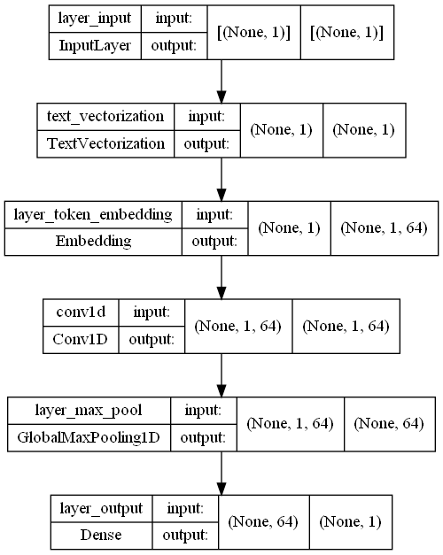
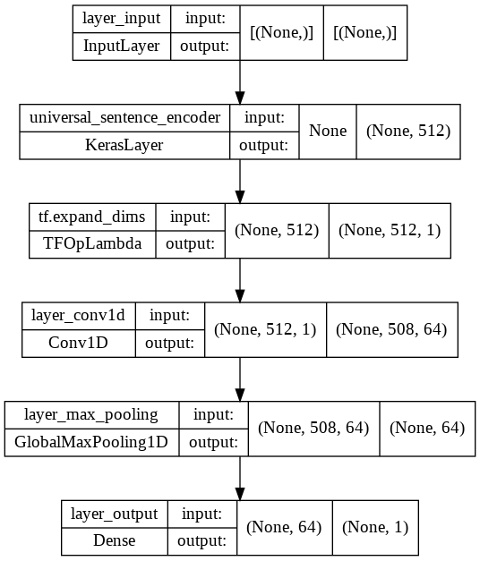

# ColorSkim Machine Learning AI

Saat ini `item_description` untuk artikel ditulis dalam bentuk/format `nama_artikel + warna` dimana pemisahan `nama_artikel` dan `warna` bervariasi antar brand, beberapa menggunakan spasi, dash, garis miring dsbnya.

Pembelajaran mesin ini merupakan pembelajaran yang akan menerapkan jaringan saraf buatan (neural network) untuk mempelajari pola penulisan artikel yang bercampur dengan warna untuk mengekstrak warna saja dari artikel.

Akan dilakukan beberapa scenario modelling **Natural Language Procesing** untuk permasalahan *sequence to sequence* ini. Pada intinya kita akan membagi kalimat (`item_description`) berdasarkan kata per kata dan mengkategorisasikan masing - masing kata ke dalam satu dari dua kategori warna atau bukan_warna (logistik biner).


```python
# import modul
import tensorflow as tf
from tensorflow.python.client import device_lib
import pandas as pd
import numpy as np
import matplotlib.pyplot as plt
import wandb as wb
from rahasia import API_KEY_WANDB # type: ignore
tf.config.run_functions_eagerly(True)
tf.data.experimental.enable_debug_mode()
```


```python
# cek ketersediaan GPU untuk modeling
# NVidia GeForce MX250 - office
# NVidia GeForce GTX1060 - home
device_lib.list_local_devices()[1]
```


    name: "/device:GPU:0"
    device_type: "GPU"
    memory_limit: 1408103015
    locality {
      bus_id: 1
      links {
      }
    }
    incarnation: 5514232586070941878
    physical_device_desc: "device: 0, name: NVIDIA GeForce MX250, pci bus id: 0000:02:00.0, compute capability: 6.1"
    xla_global_id: 416903419


```python
# login ke wandb
wb.login(key=API_KEY_WANDB)
```

    Failed to detect the name of this notebook, you can set it manually with the WANDB_NOTEBOOK_NAME environment variable to enable code saving.
    wandb: Currently logged in as: jpao (pri-data). Use `wandb login --relogin` to force relogin
    wandb: WARNING If you're specifying your api key in code, ensure this code is not shared publicly.
    wandb: WARNING Consider setting the WANDB_API_KEY environment variable, or running `wandb login` from the command line.
    wandb: Appending key for api.wandb.ai to your netrc file: C:\Users\jPao/.netrc
    


    True


## Membaca data

Data yang dipergunakan adalah sebanyak 101,077 kata. Terdapat 2 versi data, data versi 1 hanya memiliki 56,751 kata dan data versi 2 adalah data lengkap.
* Data 1: 56,751 kata, terdiri dari 34,174 kata dengan label `bukan_warna` dan 22,577 kata dengan label `warna` atau rasio 1.51 : 1 `bukan_warna` berbanding `warna`
* Data 2: 101,077 kata, rincian menyusul....


```python
# Membaca data ke dalam DataFrame pandas
data = pd.read_csv('data/setengah_dataset_artikel.csv')
data[:10]
```


<div>
<style scoped>
    .dataframe tbody tr th:only-of-type {
        vertical-align: middle;
    }

    .dataframe tbody tr th {
        vertical-align: top;
    }

    .dataframe thead th {
        text-align: right;
    }
</style>
<table border="1" class="dataframe">
  <thead>
    <tr style="text-align: right;">
      <th></th>
      <th>nama_artikel</th>
      <th>kata</th>
      <th>label</th>
      <th>urut_kata</th>
      <th>total_kata</th>
    </tr>
  </thead>
  <tbody>
    <tr>
      <th>0</th>
      <td>ADISSAGE-BLACK/BLACK/RUNWHT</td>
      <td>ADISSAGE</td>
      <td>bukan_warna</td>
      <td>1</td>
      <td>4</td>
    </tr>
    <tr>
      <th>1</th>
      <td>ADISSAGE-BLACK/BLACK/RUNWHT</td>
      <td>BLACK</td>
      <td>warna</td>
      <td>2</td>
      <td>4</td>
    </tr>
    <tr>
      <th>2</th>
      <td>ADISSAGE-BLACK/BLACK/RUNWHT</td>
      <td>BLACK</td>
      <td>warna</td>
      <td>3</td>
      <td>4</td>
    </tr>
    <tr>
      <th>3</th>
      <td>ADISSAGE-BLACK/BLACK/RUNWHT</td>
      <td>RUNWHT</td>
      <td>warna</td>
      <td>4</td>
      <td>4</td>
    </tr>
    <tr>
      <th>4</th>
      <td>ADISSAGE-N.NAVY/N.NAVY/RUNWHT</td>
      <td>ADISSAGE</td>
      <td>bukan_warna</td>
      <td>1</td>
      <td>4</td>
    </tr>
    <tr>
      <th>5</th>
      <td>ADISSAGE-N.NAVY/N.NAVY/RUNWHT</td>
      <td>N.NAVY</td>
      <td>warna</td>
      <td>2</td>
      <td>4</td>
    </tr>
    <tr>
      <th>6</th>
      <td>ADISSAGE-N.NAVY/N.NAVY/RUNWHT</td>
      <td>N.NAVY</td>
      <td>warna</td>
      <td>3</td>
      <td>4</td>
    </tr>
    <tr>
      <th>7</th>
      <td>ADISSAGE-N.NAVY/N.NAVY/RUNWHT</td>
      <td>RUNWHT</td>
      <td>warna</td>
      <td>4</td>
      <td>4</td>
    </tr>
    <tr>
      <th>8</th>
      <td>3 STRIPE D 29.5-BASKETBALL NATURAL</td>
      <td>3</td>
      <td>bukan_warna</td>
      <td>1</td>
      <td>6</td>
    </tr>
    <tr>
      <th>9</th>
      <td>3 STRIPE D 29.5-BASKETBALL NATURAL</td>
      <td>STRIPE</td>
      <td>bukan_warna</td>
      <td>2</td>
      <td>6</td>
    </tr>
  </tbody>
</table>
</div>


## Eksplorasi data


```python
# distribusi label dalam data
data['label'].value_counts()
```


    bukan_warna    34174
    warna          22577
    Name: label, dtype: int64


## Konversi data ke dalam train dan test

Berdasarkan porsi data 1 yang cukup berimbang dengan rasio 1.51:1 `bukan_warna` : `warna`, maka data dianggap cukup valid untuk dilakukan training ke dalam model. Data dibagi ke dalam train dan test data menggunakan metode `train_test_split` dari modul *sklearn.model_selection* dengan random seed yang ditetapkan di 42 dan test_size sebesar 50% (untuk menghindari overfit pada data train, variabel split ini masih bisa berubah tergantung seberapa akurat training pada model dan derajat overfit dari training).

Kita akan membuat fungsi untuk mempermudah perubahan nilai rasio train dan test data yang akan digunakan dalam training dari model yang akan kita buat. Fungsi ini akan menerima tiga argumen yaitu `data_kata`, `data_label` dan terutama adalah **`test_size`** yang merupakan rasio dari train berbanding dengan test. Fungsi ini akan mengembalikan tuple dalam bentuk `train_kata`, `test_kata`, `train_label` dan `test_label`


```python
from sklearn.model_selection import train_test_split

def data_train_test(data_kata, data_label, test_size):
    """
    Melakukan split pada data training dan test berdasarkan rasio tertentu yang diberikan
    
    Args:
        data_kata (pandas.DataFrame): Dataframe yang berisi kata
        data_label (pandas.DataFrame): Dataframe yang berisi label
        test_size (float): Rasio data test yang akan diberikan
    
    Returns:
        train_kata (numpy.array): Dataframe yang berisi kata training
        test_kata (numpy.array): Dataframe yang berisi kata test
        train_label (numpy.array): Dataframe yang berisi label training
        test_label (numpy.array): Dataframe yang berisi label test
    """
    train_kata, test_kata, train_label, test_label = train_test_split(data_kata, data_label, test_size=test_size, random_state=42)
    return train_kata, test_kata, train_label, test_label

rasio = 0.5 # set rasio data training dan data testing
train_kata, test_kata, train_label, test_label = data_train_test(data['kata'].to_numpy(), data['label'].to_numpy(), rasio)

train_label_unik, train_label_hitung = np.unique(train_label, return_counts=True)
test_label_unik, test_label_hitung = np.unique(test_label, return_counts=True)
print(f'{train_kata[:5]}\n') 
print(f'{test_kata[:5]}\n')
train_label_distribusi = np.column_stack((train_label_unik, train_label_hitung))
test_label_distribusi = np.column_stack((test_label_unik, test_label_hitung))
print(f'Distribusi label di train: \n{train_label_distribusi}\n')
print(f'Distribusi label di test: \n{test_label_distribusi}')
```

    ['6' 'ADJUST' 'BLACK' 'RESPONSE' 'PINK']
    
    ['6' 'GA' 'NIKE' 'BLUE' 'BLACK']
    
    Distribusi label di train: 
    [['bukan_warna' 17120]
     ['warna' 11255]]
    
    Distribusi label di test: 
    [['bukan_warna' 17054]
     ['warna' 11322]]
    

## Konversi label ke dalam numerik

Kita akan melakukan pengkonversian data label ke dalam bentuk numerik, dikarenakan jaringan saraf buatan hanya dapat bekerja dalam data numerik. Data label diubah dalam format numerik menggunakan metode `LabelEncoder` dari modul *sklearn.preprocessing*. Alternatif lainnya adalah menggunakan OneHotEncoder dimana data label akan ditranslasi menjadi jumlah kolom sesuai dengan jumlah output dan output tertentu akan memiliki nilai 1 pada kolom nilai yang menjadi sasaran.
Contoh:
* LabelEncoder akan merubah `bukan_warna` dan `warna` menjadi 1 dan 0
* OneHotEncoder akan merubah `bukan_warna` dan `warna` menjadi [1, 0] dan [0, 1]

Tergantung kasus dan loss function yang akan digunakan, pada kasus multiclass classification, pelabelan dalam bentuk LabelEncoder atau lebih dikenal dengan istilah sparse_category akan menggunakan loss function `SparseCategoricalCrossEntropy` sedangkan pelabelan dalam bentuk `OneHotEncoder` membutuhkan loss function `CategoricalCrossEntropy` atau dalam kasus Binomial Classification akan menggunakan loss function `BinaryCrossEntropy`. Dimana dalam kasus ini dikarenakan hanya terdapat dua kemungkinan output yang akan diprediksi dan dinilai akurasinya, maka kita akan menggunakan `LabelEncoder` dan `BinaryCrossEntropy` untuk loss function-nya.


```python
from sklearn.preprocessing import LabelEncoder
label_encoder = LabelEncoder()
train_label_encode = label_encoder.fit_transform(train_label)
test_label_encode = label_encoder.transform(test_label)
train_label_encode[:5], test_label_encode[:5]
```


    (array([0, 0, 1, 0, 1]), array([0, 0, 0, 1, 1]))


## Model 0: model dasar

Model pertama yang akan kita buat adalah model *Multinomial Naive-Bayes* yang akan mengkategorisasikan input ke dalam kategori output. *Multinomial Naive-Bayes* adalah sebuah algoritma dengan metode *supervised learning* yang paling umum digunakan dalam pengkategorisasian data tekstual.
Pada dasarnya *Naive-Bayes* merupakan algoritma yang menghitung probabilitas dari sebuah event (output) berdasarkan probabilitas akumulatif kejadian dari event sebelumnya. Secara singkat algoritma ini akan mempelajari berapa probabilitas dari sebuah kata, misalkan 'ADISSAGE' adalah sebuah label `bukan_warna` berdasarkan probabilitas kejadian 'ADISSAGE' adalah `bukan_warna` pada event - event sebelumnya.

Formula dari probabilitias algoritma Naive-Bayes:

$P(A|B) = \frac{P(A) * P(B|A)}{P(B)}$

Sebelum melakukan training menggunakan algoritma *Multinomial Naive-Bayes* kita perlu untuk merubah data kata menjadi bentuk numerik yang kali ini akan dikonversi menggunakan metode TF-IDF (*Term Frequency-Inverse Document Frequency*). TF-IDF sendiri merupakan metode yang akan berusaha memvaluasi nilai relevansi dan frekuensi dari sebuah kata dalam sekumpulan dokumen. *Term Frequency* merujuk pada seberapa sering sebuah kata muncul dalam 1 dokumen, sedangkan *Inverse Document Frequency* adalah perhitungan logaritma dari jumlah seluruh dokumen dibagi dengan jumlah dokumen dengan kata yang dimaksud terdapat di dalamnya. Hasil perhitungan dari TF dan IDF ini akan dikalikan untuk mendapatkan nilai dari seberapa sering dan seberapa relevan nilai dari sebuah kata. Misalkan 'ADISSAGE' sering muncul dalam 1 dokumen tapi tidak terlalu banyak muncul di dokumen - dokumen lainnya, maka hal ini dapat mengindikasikan bahwa kata 'ADISSAGE' mungkin memiliki relevansi yang tinggi dalam kategorisasi sebuah dokumen, sebaliknya jika kata 'WHITE' sering muncul di 1 dokumen dan juga sering muncul di dokumen - dokumen lainnya, maka kata 'WHITE' ini mungkin merupakan sebuah kata yang umum dan memiliki nilai relevansi yang rendah dalam pengkategorisasian sebuah dokumen.

Untuk lebih lengkapnya mengenai *Naive-Bayes* dan TF-IDF dapat merujuk pada sumber berikut:
* https://towardsdatascience.com/naive-bayes-classifier-81d512f50a7c
* https://monkeylearn.com/blog/what-is-tf-idf/


```python
from sklearn.feature_extraction.text import TfidfVectorizer
from sklearn.naive_bayes import MultinomialNB
from sklearn.pipeline import Pipeline

# Membuat pipeline untuk mengubah kata ke dalam tf-idf
model_0 = Pipeline([
    ("tf-idf", TfidfVectorizer()),
    ("clf", MultinomialNB())
])

# Fit pipeline dengan data training
model_0.fit(X=train_kata, y=train_label_encode)
```


<style>#sk-container-id-1 {color: black;background-color: white;}#sk-container-id-1 pre{padding: 0;}#sk-container-id-1 div.sk-toggleable {background-color: white;}#sk-container-id-1 label.sk-toggleable__label {cursor: pointer;display: block;width: 100%;margin-bottom: 0;padding: 0.3em;box-sizing: border-box;text-align: center;}#sk-container-id-1 label.sk-toggleable__label-arrow:before {content: "▸";float: left;margin-right: 0.25em;color: #696969;}#sk-container-id-1 label.sk-toggleable__label-arrow:hover:before {color: black;}#sk-container-id-1 div.sk-estimator:hover label.sk-toggleable__label-arrow:before {color: black;}#sk-container-id-1 div.sk-toggleable__content {max-height: 0;max-width: 0;overflow: hidden;text-align: left;background-color: #f0f8ff;}#sk-container-id-1 div.sk-toggleable__content pre {margin: 0.2em;color: black;border-radius: 0.25em;background-color: #f0f8ff;}#sk-container-id-1 input.sk-toggleable__control:checked~div.sk-toggleable__content {max-height: 200px;max-width: 100%;overflow: auto;}#sk-container-id-1 input.sk-toggleable__control:checked~label.sk-toggleable__label-arrow:before {content: "▾";}#sk-container-id-1 div.sk-estimator input.sk-toggleable__control:checked~label.sk-toggleable__label {background-color: #d4ebff;}#sk-container-id-1 div.sk-label input.sk-toggleable__control:checked~label.sk-toggleable__label {background-color: #d4ebff;}#sk-container-id-1 input.sk-hidden--visually {border: 0;clip: rect(1px 1px 1px 1px);clip: rect(1px, 1px, 1px, 1px);height: 1px;margin: -1px;overflow: hidden;padding: 0;position: absolute;width: 1px;}#sk-container-id-1 div.sk-estimator {font-family: monospace;background-color: #f0f8ff;border: 1px dotted black;border-radius: 0.25em;box-sizing: border-box;margin-bottom: 0.5em;}#sk-container-id-1 div.sk-estimator:hover {background-color: #d4ebff;}#sk-container-id-1 div.sk-parallel-item::after {content: "";width: 100%;border-bottom: 1px solid gray;flex-grow: 1;}#sk-container-id-1 div.sk-label:hover label.sk-toggleable__label {background-color: #d4ebff;}#sk-container-id-1 div.sk-serial::before {content: "";position: absolute;border-left: 1px solid gray;box-sizing: border-box;top: 0;bottom: 0;left: 50%;z-index: 0;}#sk-container-id-1 div.sk-serial {display: flex;flex-direction: column;align-items: center;background-color: white;padding-right: 0.2em;padding-left: 0.2em;position: relative;}#sk-container-id-1 div.sk-item {position: relative;z-index: 1;}#sk-container-id-1 div.sk-parallel {display: flex;align-items: stretch;justify-content: center;background-color: white;position: relative;}#sk-container-id-1 div.sk-item::before, #sk-container-id-1 div.sk-parallel-item::before {content: "";position: absolute;border-left: 1px solid gray;box-sizing: border-box;top: 0;bottom: 0;left: 50%;z-index: -1;}#sk-container-id-1 div.sk-parallel-item {display: flex;flex-direction: column;z-index: 1;position: relative;background-color: white;}#sk-container-id-1 div.sk-parallel-item:first-child::after {align-self: flex-end;width: 50%;}#sk-container-id-1 div.sk-parallel-item:last-child::after {align-self: flex-start;width: 50%;}#sk-container-id-1 div.sk-parallel-item:only-child::after {width: 0;}#sk-container-id-1 div.sk-dashed-wrapped {border: 1px dashed gray;margin: 0 0.4em 0.5em 0.4em;box-sizing: border-box;padding-bottom: 0.4em;background-color: white;}#sk-container-id-1 div.sk-label label {font-family: monospace;font-weight: bold;display: inline-block;line-height: 1.2em;}#sk-container-id-1 div.sk-label-container {text-align: center;}#sk-container-id-1 div.sk-container {/* jupyter's `normalize.less` sets `[hidden] { display: none; }` but bootstrap.min.css set `[hidden] { display: none !important; }` so we also need the `!important` here to be able to override the default hidden behavior on the sphinx rendered scikit-learn.org. See: https://github.com/scikit-learn/scikit-learn/issues/21755 */display: inline-block !important;position: relative;}#sk-container-id-1 div.sk-text-repr-fallback {display: none;}</style><div id="sk-container-id-1" class="sk-top-container"><div class="sk-text-repr-fallback"><pre>Pipeline(steps=[(&#x27;tf-idf&#x27;, TfidfVectorizer()), (&#x27;clf&#x27;, MultinomialNB())])</pre><b>In a Jupyter environment, please rerun this cell to show the HTML representation or trust the notebook. <br />On GitHub, the HTML representation is unable to render, please try loading this page with nbviewer.org.</b></div><div class="sk-container" hidden><div class="sk-item sk-dashed-wrapped"><div class="sk-label-container"><div class="sk-label sk-toggleable"><input class="sk-toggleable__control sk-hidden--visually" id="sk-estimator-id-1" type="checkbox" ><label for="sk-estimator-id-1" class="sk-toggleable__label sk-toggleable__label-arrow">Pipeline</label><div class="sk-toggleable__content"><pre>Pipeline(steps=[(&#x27;tf-idf&#x27;, TfidfVectorizer()), (&#x27;clf&#x27;, MultinomialNB())])</pre></div></div></div><div class="sk-serial"><div class="sk-item"><div class="sk-estimator sk-toggleable"><input class="sk-toggleable__control sk-hidden--visually" id="sk-estimator-id-2" type="checkbox" ><label for="sk-estimator-id-2" class="sk-toggleable__label sk-toggleable__label-arrow">TfidfVectorizer</label><div class="sk-toggleable__content"><pre>TfidfVectorizer()</pre></div></div></div><div class="sk-item"><div class="sk-estimator sk-toggleable"><input class="sk-toggleable__control sk-hidden--visually" id="sk-estimator-id-3" type="checkbox" ><label for="sk-estimator-id-3" class="sk-toggleable__label sk-toggleable__label-arrow">MultinomialNB</label><div class="sk-toggleable__content"><pre>MultinomialNB()</pre></div></div></div></div></div></div></div>


```python
# Evaluasi model_0 pada data test
model_0.score(X=test_kata, y=test_label_encode)
```


    0.9925641387087679


Pada hasil training dengan menggunakan model algoritma Multinomial Naive-Bayes kita mendapatkan akurasi sebesar 


```python
# Membuat prediksi menggunakan data test
pred_model_0 = model_0.predict(test_kata)
pred_model_0
```


    array([0, 0, 0, ..., 1, 0, 1])


```python
# Membuat fungsi dasar untuk menghitung accuray, precision, recall, f1-score
from sklearn.metrics import accuracy_score, precision_recall_fscore_support
def hitung_metrik(target, prediksi):
    """
    Menghitung accuracy, precision, recall dan f1-score dari model klasifikasi biner
    
    Args:
        target: label yang sebenarnya dalam bentuk 1D array
        prediksi: label yang diprediksi dalam bentuk 1D array
        
    Returns:
        nilai accuracy, precision, recall dan f1-score dalam bentuk dictionary
    """
    # Menghitung akurasi model
    model_akurasi = accuracy_score(target, prediksi)
    # Menghitung precision, recall, f1-score dan support dari model
    model_presisi, model_recall, model_f1, _ = precision_recall_fscore_support(target, prediksi, average='weighted')
    
    hasil_model = {'akurasi': model_akurasi,
                   'presisi': model_presisi,
                   'recall': model_recall,
                   'f1-score': model_f1}
    
    return hasil_model
```


```python
# Menghitung metrik dari model_0
model_0_metrik = hitung_metrik(target=test_label_encode, 
                               prediksi=pred_model_0)
model_0_metrik
```


    {'akurasi': 0.9925641387087679,
     'presisi': 0.9925843096339476,
     'recall': 0.9925641387087679,
     'f1-score': 0.9925577689780182}


## Menyiapkan data (text) untuk model deep sequence

### Text Vectorizer Layer


```python
# jumlah data (kata) dalam train_data
len(train_kata)
```


    28375


```python
# jumlah data unik (kata unik) dalam train_kata
jumlah_kata_train = len(np.unique(train_kata))
jumlah_kata_train
```


    2448


```python
# Membuat text vectorizer
from tensorflow.keras.layers import TextVectorization # type: ignore
vectorizer_kata = TextVectorization(max_tokens=jumlah_kata_train,
                                    output_sequence_length=1,
                                    standardize='lower')
```


```python
# Mengadaptaasikan text vectorizer ke dalam train_kata
vectorizer_kata.adapt(train_kata)
```


```python
# Test vectorizer kata
import random
target_kata = random.choice(train_kata)
print(f'Kata:\n{target_kata}\n')
print(f'Kata setelah vektorisasi:\n{vectorizer_kata([target_kata])}')
```

    Kata:
    WMNS
    
    Kata setelah vektorisasi:
    [[18]]
    


```python
vectorizer_kata.get_config()
```


    {'name': 'text_vectorization',
     'trainable': True,
     'batch_input_shape': (None,),
     'dtype': 'string',
     'max_tokens': 2448,
     'standardize': 'lower',
     'split': 'whitespace',
     'ngrams': None,
     'output_mode': 'int',
     'output_sequence_length': 1,
     'pad_to_max_tokens': False,
     'sparse': False,
     'ragged': False,
     'vocabulary': None,
     'idf_weights': None}


```python
# Jumlah vocabulary dalam vectorizer_kata
jumlah_vocab = vectorizer_kata.get_vocabulary()
len(jumlah_vocab)
```


    2448


### Membuat Text Embedding


```python
# Membuat text embedding layer
from tensorflow.keras.layers import Embedding # type: ignore
kata_embed = Embedding(input_dim=len(jumlah_vocab),
                       output_dim=64,
                       mask_zero=True,
                       name='layer_token_embedding')
```


```python
# Contoh vectorizer dan embedding
print(f'Kata sebelum vektorisasi:\n{target_kata}\n')
kata_tervektor = vectorizer_kata([target_kata])
print(f'\nKata sesudah vektorisasi (sebelum embedding):\n{kata_tervektor}\n')
kata_terembed = kata_embed(kata_tervektor)
print(f'\nKata setelah embedding:\n{kata_terembed}\n')
print(f'Shape dari kata setelah embedding:\n{kata_terembed.shape}')
```

    Kata sebelum vektorisasi:
    WMNS
    
    
    Kata sesudah vektorisasi (sebelum embedding):
    [[18]]
    
    
    Kata setelah embedding:
    [[[ 3.4963731e-02  4.8215393e-02  6.2733516e-03  5.1901340e-03
        2.2898983e-02 -3.9663114e-02  4.8714224e-02 -3.7121892e-02
        2.7161241e-03 -8.7516084e-03  4.7124591e-02  1.4262687e-02
        7.5260289e-03 -2.4054421e-02  2.6290867e-02 -4.9074378e-02
        2.9274199e-02  5.0576106e-03  3.5100948e-02  1.1594355e-02
        2.0217869e-02  3.5937894e-02 -8.7981932e-03 -2.4823522e-02
       -1.6386397e-03  4.4990648e-02 -1.5357364e-02  3.2790724e-02
       -4.8587073e-02  7.9304948e-03  6.3098967e-05  1.4596883e-02
        3.4207132e-02 -9.8742247e-03 -2.2936240e-03 -4.9581755e-02
        4.0270891e-02  4.0548768e-02  1.3687339e-02 -3.7664153e-02
        4.8339281e-02  2.3454953e-02  4.1899238e-02 -2.0059235e-03
        1.0535013e-02 -8.5597746e-03 -1.9007698e-03 -3.8338244e-02
       -9.9762529e-04  2.0842645e-02 -2.3960805e-02 -3.8633596e-02
       -1.3471007e-02 -2.2540843e-02  2.4116103e-02 -5.6176186e-03
       -4.7617674e-02  3.7474785e-02  4.8199687e-02  7.5462349e-03
       -4.7364842e-02 -5.5571087e-03 -1.2407742e-02  3.1438183e-02]]]
    
    Shape dari kata setelah embedding:
    (1, 1, 64)
    

### Membuat TensorFlow Dataset


```python
# Membuat TensorFlow dataset
train_dataset = tf.data.Dataset.from_tensor_slices((train_kata, train_label_encode))
test_dataset = tf.data.Dataset.from_tensor_slices((test_kata, test_label_encode))

train_dataset
```


    <TensorSliceDataset element_spec=(TensorSpec(shape=(), dtype=tf.string, name=None), TensorSpec(shape=(), dtype=tf.int32, name=None))>


```python
# Membuat TensorSliceDataset menjadi prefetched dataset
train_dataset = train_dataset.batch(32).prefetch(tf.data.AUTOTUNE)
test_dataset = test_dataset.batch(32).prefetch(tf.data.AUTOTUNE)

train_dataset
```


    <BatchDataset element_spec=(TensorSpec(shape=(None,), dtype=tf.string, name=None), TensorSpec(shape=(None,), dtype=tf.int32, name=None))>


## Model 1: Conv1D dengan embedding


```python
# Membuat model_1 dengan layer Conv1D dari kata yang divektorisasi dan di-embed
from tensorflow.keras import layers # type: ignore

inputs = layers.Input(shape=(1,), dtype=tf.string, name='layer_input')
layer_vektor = vectorizer_kata(inputs)
layer_embed = kata_embed(layer_vektor)
x = layers.Conv1D(filters=64, kernel_size=5, padding='same', activation='relu')(layer_embed)
x = layers.GlobalMaxPooling1D(name='layer_max_pool')(x)
outputs = layers.Dense(units=1, activation='sigmoid', name='layer_output')(x)
model_1 = tf.keras.Model(inputs=inputs, outputs=outputs, name='model_1_Conv1D_embed')

# Compile
model_1.compile(loss=tf.keras.losses.BinaryCrossentropy(),
                optimizer=tf.keras.optimizers.Adam(),
                metrics=['accuracy'])
```


```python
# Ringkasa model_1
model_1.summary()
```

    Model: "model_1_Conv1D_embed"
    _________________________________________________________________
     Layer (type)                Output Shape              Param #   
    =================================================================
     layer_input (InputLayer)    [(None, 1)]               0         
                                                                     
     text_vectorization (TextVec  (None, 1)                0         
     torization)                                                     
                                                                     
     layer_token_embedding (Embe  (None, 1, 64)            156672    
     dding)                                                          
                                                                     
     conv1d (Conv1D)             (None, 1, 64)             20544     
                                                                     
     layer_max_pool (GlobalMaxPo  (None, 64)               0         
     oling1D)                                                        
                                                                     
     layer_output (Dense)        (None, 1)                 65        
                                                                     
    =================================================================
    Total params: 177,281
    Trainable params: 177,281
    Non-trainable params: 0
    _________________________________________________________________
    


```python
# Plot model_1
from tensorflow.keras.utils import plot_model # type: ignore
plot_model(model_1, show_shapes=True)
```


    

    


```python
# import WandbCallback
from wandb.keras import WandbCallback

# Setup wandb init dan config
wb.init(project='ColorSkim',
        entity='jpao',
        name='model_1_Conv1D_embed',
        config={'epochs': 3,
                'n_layers': len(model_1.layers)})

# Fit model_1
hist_model_1 = model_1.fit(train_dataset,
                           epochs=wb.config.epochs,
                           validation_data=test_dataset,
                           callbacks=[WandbCallback()])
```

    wandb: Currently logged in as: jpao. Use `wandb login --relogin` to force relogin
    


Tracking run with wandb version 0.12.21


Run data is saved locally in <code>d:\ColorSkim\wandb\run-20220711_115920-o6q99kym</code>


Syncing run <strong><a href="https://wandb.ai/jpao/ColorSkim/runs/o6q99kym" target="_blank">model_1_Conv1D_embed</a></strong> to <a href="https://wandb.ai/jpao/ColorSkim" target="_blank">Weights & Biases</a> (<a href="https://wandb.me/run" target="_blank">docs</a>)<br/>


    wandb: WARNING The save_model argument by default saves the model in the HDF5 format that cannot save custom objects like subclassed models and custom layers. This behavior will be deprecated in a future release in favor of the SavedModel format. Meanwhile, the HDF5 model is saved as W&B files and the SavedModel as W&B Artifacts.
    

    WARNING:tensorflow:Issue encountered when serializing table_initializer.
    Type is unsupported, or the types of the items don't match field type in CollectionDef. Note this is a warning and probably safe to ignore.
    'NoneType' object has no attribute 'name'
    WARNING:tensorflow:From c:\Users\jPao\anaconda3\envs\tf-py39\lib\site-packages\tensorflow\python\profiler\internal\flops_registry.py:138: tensor_shape_from_node_def_name (from tensorflow.python.framework.graph_util_impl) is deprecated and will be removed in a future version.
    Instructions for updating:
    Use `tf.compat.v1.graph_util.tensor_shape_from_node_def_name`
    Epoch 1/3
    887/887 [==============================] - ETA: 0s - loss: 0.1017 - accuracy: 0.9794

    wandb: ERROR Can't save model in the h5py format. The model will be saved as W&B Artifacts in the SavedModel format.
    WARNING:absl:Found untraced functions such as adapt_step while saving (showing 1 of 1). These functions will not be directly callable after loading.
    

    INFO:tensorflow:Assets written to: d:\ColorSkim\wandb\run-20220711_115920-o6q99kym\files\model-best\assets
    

    INFO:tensorflow:Assets written to: d:\ColorSkim\wandb\run-20220711_115920-o6q99kym\files\model-best\assets
    wandb: Adding directory to artifact (d:\ColorSkim\wandb\run-20220711_115920-o6q99kym\files\model-best)... Done. 0.3s
    

    887/887 [==============================] - 210s 225ms/step - loss: 0.1017 - accuracy: 0.9794 - val_loss: 0.0326 - val_accuracy: 0.9922 - _timestamp: 1657515766.0000 - _runtime: 205.0000
    Epoch 2/3
    887/887 [==============================] - ETA: 0s - loss: 0.0191 - accuracy: 0.9952

    WARNING:absl:Found untraced functions such as adapt_step while saving (showing 1 of 1). These functions will not be directly callable after loading.
    

    INFO:tensorflow:Assets written to: d:\ColorSkim\wandb\run-20220711_115920-o6q99kym\files\model-best\assets
    

    INFO:tensorflow:Assets written to: d:\ColorSkim\wandb\run-20220711_115920-o6q99kym\files\model-best\assets
    wandb: Adding directory to artifact (d:\ColorSkim\wandb\run-20220711_115920-o6q99kym\files\model-best)... Done. 0.1s
    

    887/887 [==============================] - 149s 168ms/step - loss: 0.0191 - accuracy: 0.9952 - val_loss: 0.0300 - val_accuracy: 0.9925 - _timestamp: 1657515924.0000 - _runtime: 363.0000
    Epoch 3/3
    887/887 [==============================] - 129s 146ms/step - loss: 0.0163 - accuracy: 0.9956 - val_loss: 0.0303 - val_accuracy: 0.9926 - _timestamp: 1657516060.0000 - _runtime: 499.0000
    


```python
# Evaluasi model_1
model_1.evaluate(test_dataset)
```

    887/887 [==============================] - 45s 51ms/step - loss: 0.0303 - accuracy: 0.9926
    


    [0.03030860796570778, 0.9925641417503357]


```python
# Membuat prediksi berdasarkan model_1
model_1_pred_prob = model_1.predict(test_dataset)
model_1_pred_prob[:10]
```


    array([[5.1793031e-05],
           [6.5180029e-05],
           [8.7126767e-07],
           [9.9771899e-01],
           [9.9969602e-01],
           [2.4920701e-06],
           [2.1196477e-04],
           [2.2293185e-03],
           [1.2963725e-04],
           [9.9663699e-01]], dtype=float32)


```python
# Mengkonversi model_1_pred_prob ke dalam label
model_1_pred = tf.squeeze(tf.round(model_1_pred_prob))
model_1_pred
```


    <tf.Tensor: shape=(28376,), dtype=float32, numpy=array([0., 0., 0., ..., 1., 0., 1.], dtype=float32)>


```python
# Menghitung metriks dari model_1
model_1_metrik = hitung_metrik(target=test_label_encode,
                              prediksi=model_1_pred)
model_1_metrik
```


    {'akurasi': 0.9925641387087679,
     'presisi': 0.9925790596107587,
     'recall': 0.9925641387087679,
     'f1-score': 0.9925584581306051}


## Model 2: Transfer Learning pretrained feature exraction menggunakan Universal Sentence Encoder (USE)


```python
# Download pretrained USE
import tensorflow_hub as hub
tf_hub_embedding = hub.KerasLayer('https://tfhub.dev/google/universal-sentence-encoder/4',
                                  trainable=False,
                                  name='universal_sentence_encoder')
```


```python
# Melakukan tes pretrained embedding pada contoh kata
kata_acak = random.choice(train_kata)
print(f'Kata acak:\n {kata_acak}')
kata_embed_pretrain = tf_hub_embedding([kata_acak])
print(f'\nKata setelah embed dengan USE:\n{kata_embed_pretrain[0][:30]}\n')
print(f'Panjang dari kata setelah embedding: {len(kata_embed_pretrain[0])}')
```

    Kata acak:
     QUESTAR
    
    Kata setelah embed dengan USE:
    [ 0.00866413 -0.06154143  0.05114514  0.04181407  0.0199904   0.05046864
     -0.01953758 -0.05738599  0.06517273 -0.00517753  0.00351421  0.02564281
      0.02964722  0.06797459 -0.00300142  0.0053544  -0.00830155 -0.03211842
      0.04801427 -0.00119406 -0.00043531  0.01120288  0.04401749 -0.01213133
     -0.00378824  0.04055084 -0.01255467  0.02171156  0.05214996  0.01138981]
    
    Panjang dari kata setelah embedding: 512
    


```python
# Membuat model_2 menggunakan USE
inputs = layers.Input(shape=[], dtype=tf.string, name='layer_input')
layer_embed_pretrained = tf_hub_embedding(inputs)
x = layers.Conv1D(filters=64, kernel_size=5, padding='same', activation='relu')(tf.expand_dims(layer_embed_pretrained, axis=-1))
x = layers.GlobalMaxPooling1D(name='layer_max_pooling')(x)
outputs = layers.Dense(1, activation='sigmoid', name='layer_output')(x)
model_2 = tf.keras.Model(inputs=inputs, outputs=outputs, name='model_2_Conv1D_USE_embed')
```


```python
# Ringkasan model_2
model_2.summary()
```

    Model: "model_2_Conv1D_USE_embed"
    _________________________________________________________________
     Layer (type)                Output Shape              Param #   
    =================================================================
     layer_input (InputLayer)    [(None,)]                 0         
                                                                     
     universal_sentence_encoder   (None, 512)              256797824 
     (KerasLayer)                                                    
                                                                     
     tf.expand_dims (TFOpLambda)  (None, 512, 1)           0         
                                                                     
     conv1d (Conv1D)             (None, 512, 64)           384       
                                                                     
     layer_max_pooling (GlobalMa  (None, 64)               0         
     xPooling1D)                                                     
                                                                     
     layer_output (Dense)        (None, 1)                 65        
                                                                     
    =================================================================
    Total params: 256,798,273
    Trainable params: 449
    Non-trainable params: 256,797,824
    _________________________________________________________________
    


```python
# Plot model_2
plot_model(model_2, show_shapes=True)
```


    

    


```python
# Compile model_2
model_2.compile(loss=tf.keras.losses.BinaryCrossentropy(),
                optimizer=tf.keras.optimizers.Adam(),
                metrics=['accuracy'])
```


```python
# Setup wandb init dan config
wb.init(project='ColorSkim',
        entity='jpao',
        name='model_2_Conv1D_USE_embed',
        config={'epochs': 3,
                'n_layers': len(model_2.layers)})

# Fit model_2
hist_model_2 = model_2.fit(train_dataset,
                           epochs=wb.config.epochs,
                           validation_data=test_dataset,
                           callbacks=[WandbCallback()])
```


Finishing last run (ID:o6q99kym) before initializing another...


Waiting for W&B process to finish... <strong style="color:green">(success).</strong>


<style>
    table.wandb td:nth-child(1) { padding: 0 10px; text-align: left ; width: auto;} td:nth-child(2) {text-align: left ; width: 100%}
    .wandb-row { display: flex; flex-direction: row; flex-wrap: wrap; justify-content: flex-start; width: 100% }
    .wandb-col { display: flex; flex-direction: column; flex-basis: 100%; flex: 1; padding: 10px; }
    </style>
<div class="wandb-row"><div class="wandb-col"><h3>Run history:</h3><br/><table class="wandb"><tr><td>accuracy</td><td>▁██</td></tr><tr><td>epoch</td><td>▁▅█</td></tr><tr><td>loss</td><td>█▁▁</td></tr><tr><td>val_accuracy</td><td>▁▆█</td></tr><tr><td>val_loss</td><td>█▁▂</td></tr></table><br/></div><div class="wandb-col"><h3>Run summary:</h3><br/><table class="wandb"><tr><td>GFLOPS</td><td>0.0</td></tr><tr><td>accuracy</td><td>0.99556</td></tr><tr><td>best_epoch</td><td>1</td></tr><tr><td>best_val_loss</td><td>0.03002</td></tr><tr><td>epoch</td><td>2</td></tr><tr><td>loss</td><td>0.01627</td></tr><tr><td>val_accuracy</td><td>0.99256</td></tr><tr><td>val_loss</td><td>0.03031</td></tr></table><br/></div></div>


Synced <strong style="color:#cdcd00">model_1_Conv1D_embed</strong>: <a href="https://wandb.ai/jpao/ColorSkim/runs/o6q99kym" target="_blank">https://wandb.ai/jpao/ColorSkim/runs/o6q99kym</a><br/>Synced 5 W&B file(s), 1 media file(s), 7 artifact file(s) and 1 other file(s)


Find logs at: <code>.\wandb\run-20220711_115920-o6q99kym\logs</code>


Successfully finished last run (ID:o6q99kym). Initializing new run:<br/>


Tracking run with wandb version 0.12.21


Run data is saved locally in <code>d:\ColorSkim\wandb\run-20220711_121421-3rlrlcvr</code>


Syncing run <strong><a href="https://wandb.ai/jpao/ColorSkim/runs/3rlrlcvr" target="_blank">model_2_Conv1D_USE_embed</a></strong> to <a href="https://wandb.ai/jpao/ColorSkim" target="_blank">Weights & Biases</a> (<a href="https://wandb.me/run" target="_blank">docs</a>)<br/>


    wandb: WARNING Unable to compute FLOPs for this model.
    

    Epoch 1/3
    887/887 [==============================] - 226s 246ms/step - loss: 0.6405 - accuracy: 0.6114 - val_loss: 0.5905 - val_accuracy: 0.8387 - _timestamp: 1657516765.0000 - _runtime: 297.0000
    Epoch 2/3
    887/887 [==============================] - 219s 247ms/step - loss: 0.5211 - accuracy: 0.8137 - val_loss: 0.4554 - val_accuracy: 0.8914 - _timestamp: 1657516982.0000 - _runtime: 514.0000
    Epoch 3/3
    887/887 [==============================] - 228s 257ms/step - loss: 0.4021 - accuracy: 0.8879 - val_loss: 0.3575 - val_accuracy: 0.9052 - _timestamp: 1657517211.0000 - _runtime: 743.0000
    


```python
# Evaluate model_2
model_2.evaluate(test_dataset)
```

    887/887 [==============================] - 67s 76ms/step - loss: 0.3575 - accuracy: 0.9052
    


    [0.3574761152267456, 0.9051663279533386]


```python
# Membuat prediksi dengan model_2
model_2_pred_prob = model_2.predict(test_dataset)
model_2_pred_prob[:10]
```


    array([[0.16605161],
           [0.15431982],
           [0.20437935],
           [0.6168258 ],
           [0.8310257 ],
           [0.19871134],
           [0.21265136],
           [0.17426637],
           [0.1890059 ],
           [0.4124583 ]], dtype=float32)


```python
# Mengkonversi model_2 menjadi label format
model_2_pred = tf.squeeze(tf.round(model_2_pred_prob))
model_2_pred
```


    <tf.Tensor: shape=(28376,), dtype=float32, numpy=array([0., 0., 0., ..., 1., 0., 1.], dtype=float32)>


```python
# Menghitung hasil metrik dari model_2
model_2_hasil = hitung_metrik(target=test_label_encode,
                              prediksi=model_2_pred)
model_2_hasil
```


    {'akurasi': 0.9051663377502115,
     'presisi': 0.9052541793259783,
     'recall': 0.9051663377502115,
     'f1-score': 0.9045830735846138}


## Model 3: Menggunakan positional kata dan custom embed dan concatenate layer


```python
# Test prediksi dengan model_1 (model_1_Conv1D_embed)
class_list = ['bukan_warna', 'warna']
article = 'PUMA XTG WOVEN PANTS PUMA BLACK-PUMA WHITE'
article_list = article.replace("-"," ").split()
model_test = tf.squeeze(tf.round(model_1.predict(article.replace("-"," ").split())))
for i in range(0, len(article_list)):
    print(f'Kata: {article_list[i]}\nPrediksi: {class_list[int(model_test[i])]}\n\n')
```

    Kata: PUMA
    Prediksi: bukan_warna
    
    
    Kata: XTG
    Prediksi: bukan_warna
    
    
    Kata: WOVEN
    Prediksi: bukan_warna
    
    
    Kata: PANTS
    Prediksi: bukan_warna
    
    
    Kata: PUMA
    Prediksi: bukan_warna
    
    
    Kata: BLACK
    Prediksi: warna
    
    
    Kata: PUMA
    Prediksi: bukan_warna
    
    
    Kata: WHITE
    Prediksi: warna
    
    
    


```python
model_test
```


    <tf.Tensor: shape=(8,), dtype=float32, numpy=array([0., 0., 0., 0., 0., 1., 0., 1.], dtype=float32)>


```python

```
