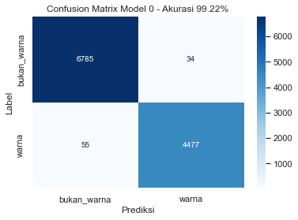

# ColorSkim Machine Learning AI


```python
# import modul
import os

# import pandas dan numpy
import pandas as pd
import numpy as np

# import daftar device terdeteksi oleh tensorflow
from tensorflow.python.client.device_lib import list_local_devices

# import utilitas umum tensorflow
from tensorflow.config import run_functions_eagerly # type: ignore
from tensorflow.data.experimental import enable_debug_mode # type: ignore

# import pembuatan dataset
from sklearn.model_selection import train_test_split

# import preprocessing data
from sklearn.preprocessing import OneHotEncoder, LabelEncoder

# import pipeline scikit untuk model_0
from sklearn.pipeline import Pipeline

# import layer neural network
from sklearn.feature_extraction.text import TfidfVectorizer
from sklearn.naive_bayes import MultinomialNB
from tensorflow.keras.layers import Conv1D # type: ignore

# import callbacks untuk tensorflow
from tensorflow.keras.callbacks import ModelCheckpoint, EarlyStopping, ReduceLROnPlateau # type: ignore

# import metriks dan alat evaluasi
from sklearn.metrics import accuracy_score, precision_recall_fscore_support, confusion_matrix

# import grafik
import matplotlib.pyplot as plt
import seaborn as sns

# import display untuk menampilkan dataframe berdasar settingan tertentu (situasional)
from IPython.display import display

# import library log untuk training
import wandb as wb
from wandb.keras import WandbCallback

# import kunci untuk login wandb
from rahasia import API_KEY_WANDB # type: ignore

# set output tensorflow
run_functions_eagerly(True)
enable_debug_mode()

# set matplotlib untuk menggunakan tampilan seaborn
sns.set()
```


```python
# cek ketersediaan GPU untuk modeling
# NVidia GeForce MX250 - office
# NVidia GeForce GTX1060 - home
list_local_devices()[1]
```


    name: "/device:GPU:0"
    device_type: "GPU"
    memory_limit: 1408103015
    locality {
      bus_id: 1
      links {
      }
    }
    incarnation: 236889098973226599
    physical_device_desc: "device: 0, name: NVIDIA GeForce MX250, pci bus id: 0000:02:00.0, compute capability: 6.1"
    xla_global_id: 416903419


## Variabel Global


```python
DIR_MODEL_CHECKPOINT = 'colorskim_checkpoint'
# kita akan mengatur toleransi_es sebagai fraksi (fraksi_toleransi) tertentu dari jumlah total epoch
# dan toleransi_rlop sebagai toleransi_es dibagi dengan jumlah kesempatan (kesempatan_rlop)
# dilakukannya reduksi pada learning_rate 
EPOCHS = 1000
FRAKSI_TOLERANSI = 0.2
KESEMPATAN_RLOP = 4
TOLERANSI_ES = int(EPOCHS*FRAKSI_TOLERANSI)
TOLERANSI_RLOP = int(TOLERANSI_ES/KESEMPATAN_RLOP)
FRAKSI_REDUKSI_LR = 0.1
RANDOM_STATE = 11
RASIO_TEST_TRAIN = 0.2

```

## Callbacks

Beberapa *callbacks* yang akan digunakan dalam proses *training* model diantaranya:
* `WandbCallback` - *Callback* ke [wandb.ai](https://wandb.ai) untuk mencatat log dari sesi *training* model.
* `ModelCheckpoint` - Untuk menyimpan model dengan *val_loss* terbaik dari seluruh *epoch* dalam *training* model.
* `EarlyStopping` (ES) - *Callback* ini digunakan untuk menghentikan proses *training* model jika selama beberapa *epoch* model tidak mengalami perbaikan pada metrik *val_loss*-nya. *Callback* ini juga digunakan bersama dengan `ReduceLROnPlateau` dimana *patience* ES > *patience* RLOP.
* `ReduceLROnPlateau` (RLOP) - *Callback* ini digunakan untuk memperkecil *learning_rate* dari model jika tidak mengalami perbaikan *val_loss* selama beberapa *epoch*.

*Patience* dari ES di-set lebih tinggi dari *patience* RLOP untuk memberikan kesempatan bagi RLOP untuk memperkecil *learning_rate* beberapa kali sebelum proses *training* model dihentikan oleh ES setelah tidak berhasil mendapatkan *val_loss* yang lebih baik selama beberapa *epoch*.


```python
# login ke wandb
wb.login(key=API_KEY_WANDB)

# Pembuatan fungsi callback
def wandb_callback():
    return WandbCallback(save_model=False, # model akan disimpan menggunakan callback ModelCheckpoint
                         log_weights=True, # weight akan disimpan untuk visualisasi di wandb
                         log_gradients=True) # gradient akan disimpan untuk visualisasi di wandb
def model_checkpoint(nama_model):
    return ModelCheckpoint(filepath=os.path.join(DIR_MODEL_CHECKPOINT, nama_model),
                           verbose=0,
                           save_best_only=True) # model dengan 'val_loss' terbaik akan disimpan
def early_stopping():
    return EarlyStopping(patience=TOLERANSI_ES)
def reduce_lr_on_plateau():
    return ReduceLROnPlateau(factor=FRAKSI_REDUKSI_LR, # pengurangan learning_rate diset sebesar 0.1 * learning_rate
                             patience=TOLERANSI_RLOP,
                             verbose=0)
```

    wandb: WARNING If you're specifying your api key in code, ensure this code is not shared publicly.
    wandb: WARNING Consider setting the WANDB_API_KEY environment variable, or running `wandb login` from the command line.
    wandb: Appending key for api.wandb.ai to your netrc file: C:\Users\jPao/.netrc
    

## Data

Data yang dipergunakan adalah sebanyak 101,077 kata. Terdapat 2 versi data, data versi 1 hanya memiliki 56,751 kata dan data versi 2 adalah data lengkap.
* Data 1: 56,751 kata, terdiri dari 34,174 kata dengan label `bukan_warna` dan 22,577 kata dengan label `warna` atau rasio 1.51 : 1 `bukan_warna` berbanding `warna`
* Data 2: 101,077 kata, rincian menyusul....

`brand`, `urut_kata` dan `total_kata` akan digunakan sebagai alternatif variabel independen tambahan dalam model tertentu.


```python
# Membaca data ke dalam DataFrame pandas
data = pd.read_csv('data/setengah_dataset_artikel.csv')
data[:10]
```


<div>
<style scoped>
    .dataframe tbody tr th:only-of-type {
        vertical-align: middle;
    }

    .dataframe tbody tr th {
        vertical-align: top;
    }

    .dataframe thead th {
        text-align: right;
    }
</style>
<table border="1" class="dataframe">
  <thead>
    <tr style="text-align: right;">
      <th></th>
      <th>brand</th>
      <th>nama_artikel</th>
      <th>kata</th>
      <th>label</th>
      <th>urut_kata</th>
      <th>total_kata</th>
    </tr>
  </thead>
  <tbody>
    <tr>
      <th>0</th>
      <td>ADI</td>
      <td>ADISSAGE-BLACK/BLACK/RUNWHT</td>
      <td>ADISSAGE</td>
      <td>bukan_warna</td>
      <td>1</td>
      <td>4</td>
    </tr>
    <tr>
      <th>1</th>
      <td>ADI</td>
      <td>ADISSAGE-BLACK/BLACK/RUNWHT</td>
      <td>BLACK</td>
      <td>warna</td>
      <td>2</td>
      <td>4</td>
    </tr>
    <tr>
      <th>2</th>
      <td>ADI</td>
      <td>ADISSAGE-BLACK/BLACK/RUNWHT</td>
      <td>BLACK</td>
      <td>warna</td>
      <td>3</td>
      <td>4</td>
    </tr>
    <tr>
      <th>3</th>
      <td>ADI</td>
      <td>ADISSAGE-BLACK/BLACK/RUNWHT</td>
      <td>RUNWHT</td>
      <td>warna</td>
      <td>4</td>
      <td>4</td>
    </tr>
    <tr>
      <th>4</th>
      <td>ADI</td>
      <td>ADISSAGE-N.NAVY/N.NAVY/RUNWHT</td>
      <td>ADISSAGE</td>
      <td>bukan_warna</td>
      <td>1</td>
      <td>4</td>
    </tr>
    <tr>
      <th>5</th>
      <td>ADI</td>
      <td>ADISSAGE-N.NAVY/N.NAVY/RUNWHT</td>
      <td>N.NAVY</td>
      <td>warna</td>
      <td>2</td>
      <td>4</td>
    </tr>
    <tr>
      <th>6</th>
      <td>ADI</td>
      <td>ADISSAGE-N.NAVY/N.NAVY/RUNWHT</td>
      <td>N.NAVY</td>
      <td>warna</td>
      <td>3</td>
      <td>4</td>
    </tr>
    <tr>
      <th>7</th>
      <td>ADI</td>
      <td>ADISSAGE-N.NAVY/N.NAVY/RUNWHT</td>
      <td>RUNWHT</td>
      <td>warna</td>
      <td>4</td>
      <td>4</td>
    </tr>
    <tr>
      <th>8</th>
      <td>ADI</td>
      <td>3 STRIPE D 29.5-BASKETBALL NATURAL</td>
      <td>3</td>
      <td>bukan_warna</td>
      <td>1</td>
      <td>6</td>
    </tr>
    <tr>
      <th>9</th>
      <td>ADI</td>
      <td>3 STRIPE D 29.5-BASKETBALL NATURAL</td>
      <td>STRIPE</td>
      <td>bukan_warna</td>
      <td>2</td>
      <td>6</td>
    </tr>
  </tbody>
</table>
</div>


### Eksplorasi Data


```python
# distribusi label dalam data
data['label'].value_counts()
```


    bukan_warna    34174
    warna          22577
    Name: label, dtype: int64


```python
# distribusi label dalam brand (data hanya menunjukkan 10 teratas)
data[['brand', 'label']].value_counts().unstack().sort_values(by='bukan_warna', ascending=False)[:10]
```


<div>
<style scoped>
    .dataframe tbody tr th:only-of-type {
        vertical-align: middle;
    }

    .dataframe tbody tr th {
        vertical-align: top;
    }

    .dataframe thead th {
        text-align: right;
    }
</style>
<table border="1" class="dataframe">
  <thead>
    <tr style="text-align: right;">
      <th>label</th>
      <th>bukan_warna</th>
      <th>warna</th>
    </tr>
    <tr>
      <th>brand</th>
      <th></th>
      <th></th>
    </tr>
  </thead>
  <tbody>
    <tr>
      <th>NIK</th>
      <td>13396.0</td>
      <td>10807.0</td>
    </tr>
    <tr>
      <th>ADI</th>
      <td>10028.0</td>
      <td>7073.0</td>
    </tr>
    <tr>
      <th>PUM</th>
      <td>4279.0</td>
      <td>2062.0</td>
    </tr>
    <tr>
      <th>BBC</th>
      <td>1174.0</td>
      <td>367.0</td>
    </tr>
    <tr>
      <th>CAO</th>
      <td>887.0</td>
      <td>61.0</td>
    </tr>
    <tr>
      <th>HER</th>
      <td>868.0</td>
      <td>287.0</td>
    </tr>
    <tr>
      <th>AGL</th>
      <td>611.0</td>
      <td>212.0</td>
    </tr>
    <tr>
      <th>KIP</th>
      <td>554.0</td>
      <td>321.0</td>
    </tr>
    <tr>
      <th>STN</th>
      <td>494.0</td>
      <td>255.0</td>
    </tr>
    <tr>
      <th>WAR</th>
      <td>404.0</td>
      <td>298.0</td>
    </tr>
  </tbody>
</table>
</div>


### Konversi Fitur dan Label ke dalam numerik

Kita akan melakukan pengkonversian fitur dan label ke dalam bentuk numerik, dikarenakan jaringan saraf buatan hanya dapat bekerja dalam data numerik. 

Terdapat dua jenis *encoding* untuk data yang bersifat kategorikal:
* `OneHotEncoder`
* `LabelEncoder`

**OneHotEncoder**
*Encoding* ini akan merubah data satu kolom menjadi multi-kolom dengan nilai 1 dan 0 dimana jumlah kolom sama dengan jumlah kategori, seperti berikut:

| brand | brand_NIK | brand_ADI | brand_SPE | brand_PIE | brand_... |
| --- | --- | --- | --- | --- | --- |
| NIK | 1 | 0 | 0 | 0 | ... |
| SPE | 0 | 0 | 1 | 0 | ... |
| PIE | 0 | 0 | 0 | 1 | ... |
| ADI | 0 | 1 | 0 | 0 | ... |
| SPE | 0 | 0 | 1 | 0 | ... |
| ... | ... | ... | ... | ... | ... |

**LabelEncoder**
*Encoding* ini akan merubah data pada satu kolom menjadi 0, 1, 2, 3.. dstnya sesuai dengan jumlah kategorinya, seperti berikut:

| brand | brand_label_encoded |
| --- | --- |
| NIK | 0 |
| SPE | 1 |
| PIE | 2 |
| ADI | 3 |
| SPE | 1 |
| ... | ... |

**Kapan menggunakan `OneHotEncoder` atau `LabelEncoder` dalam sebuah proses encoding?** Kita dapat menggunakan `OneHotEncoder` ketika kita tidak menginginkan suatu bentuk hubungan hirarki di dalam data kategorikal yang kita miliki. Dalam hal ini ketika kita tidak ingin jaringan saraf buatan untuk memandang ADI (3) lebih signifikan dari NIK (0) dalam hal nilainya jika dilakukan label *encoding*, maka kita dapat menggunakan `OneHotEncoder`.
Jika kategori bersifat biner seperti 'Pria' atau 'Wanita', 'Ya' atau 'Tidak' dsbnya, penggunaan `LabelEncoder` dinilai lebih efektif.

> Dengan pertimbangan di atas dan melihat struktur data kita, maka kita akan menggunakan `OneHotEncoder` untuk kolom *brand* (fitur) dan menggunakan `LabelEncoder` untuk kolom *label* (target), kecuali untuk **Model 0** yang akan menggunakan fungsi ekstraksi fitur dengan `TfIdfVectorizer` kita hanya akan menggunakan kolom 'label' yang belum di-*encode*.


```python
# OneHotEncoding pada fitur brand
fitur_encoder = OneHotEncoder(sparse=False)
brand_encoded = fitur_encoder.fit_transform(data['brand'].to_numpy().reshape(-1, 1))
df_fitur_encoded = pd.DataFrame(brand_encoded, columns=fitur_encoder.get_feature_names_out(['brand']))

# LabelEncoding pada target label
label_encoder = LabelEncoder()
label_encoded = label_encoder.fit_transform(data['label'])
df_label_encoded = pd.DataFrame(label_encoded, columns=['label_encoded'])

# gabungkan dengan dataframe awal
data_encoded = data.copy()
data_encoded = pd.concat([data_encoded,df_fitur_encoded, df_label_encoded], axis=1)
data_encoded
```


<div>
<style scoped>
    .dataframe tbody tr th:only-of-type {
        vertical-align: middle;
    }

    .dataframe tbody tr th {
        vertical-align: top;
    }

    .dataframe thead th {
        text-align: right;
    }
</style>
<table border="1" class="dataframe">
  <thead>
    <tr style="text-align: right;">
      <th></th>
      <th>brand</th>
      <th>nama_artikel</th>
      <th>kata</th>
      <th>label</th>
      <th>urut_kata</th>
      <th>total_kata</th>
      <th>brand_ADI</th>
      <th>brand_ADS</th>
      <th>brand_AGL</th>
      <th>brand_AND</th>
      <th>...</th>
      <th>brand_PTG</th>
      <th>brand_PUM</th>
      <th>brand_REL</th>
      <th>brand_SAU</th>
      <th>brand_SOC</th>
      <th>brand_STN</th>
      <th>brand_UME</th>
      <th>brand_VAP</th>
      <th>brand_WAR</th>
      <th>label_encoded</th>
    </tr>
  </thead>
  <tbody>
    <tr>
      <th>0</th>
      <td>ADI</td>
      <td>ADISSAGE-BLACK/BLACK/RUNWHT</td>
      <td>ADISSAGE</td>
      <td>bukan_warna</td>
      <td>1</td>
      <td>4</td>
      <td>1.0</td>
      <td>0.0</td>
      <td>0.0</td>
      <td>0.0</td>
      <td>...</td>
      <td>0.0</td>
      <td>0.0</td>
      <td>0.0</td>
      <td>0.0</td>
      <td>0.0</td>
      <td>0.0</td>
      <td>0.0</td>
      <td>0.0</td>
      <td>0.0</td>
      <td>0</td>
    </tr>
    <tr>
      <th>1</th>
      <td>ADI</td>
      <td>ADISSAGE-BLACK/BLACK/RUNWHT</td>
      <td>BLACK</td>
      <td>warna</td>
      <td>2</td>
      <td>4</td>
      <td>1.0</td>
      <td>0.0</td>
      <td>0.0</td>
      <td>0.0</td>
      <td>...</td>
      <td>0.0</td>
      <td>0.0</td>
      <td>0.0</td>
      <td>0.0</td>
      <td>0.0</td>
      <td>0.0</td>
      <td>0.0</td>
      <td>0.0</td>
      <td>0.0</td>
      <td>1</td>
    </tr>
    <tr>
      <th>2</th>
      <td>ADI</td>
      <td>ADISSAGE-BLACK/BLACK/RUNWHT</td>
      <td>BLACK</td>
      <td>warna</td>
      <td>3</td>
      <td>4</td>
      <td>1.0</td>
      <td>0.0</td>
      <td>0.0</td>
      <td>0.0</td>
      <td>...</td>
      <td>0.0</td>
      <td>0.0</td>
      <td>0.0</td>
      <td>0.0</td>
      <td>0.0</td>
      <td>0.0</td>
      <td>0.0</td>
      <td>0.0</td>
      <td>0.0</td>
      <td>1</td>
    </tr>
    <tr>
      <th>3</th>
      <td>ADI</td>
      <td>ADISSAGE-BLACK/BLACK/RUNWHT</td>
      <td>RUNWHT</td>
      <td>warna</td>
      <td>4</td>
      <td>4</td>
      <td>1.0</td>
      <td>0.0</td>
      <td>0.0</td>
      <td>0.0</td>
      <td>...</td>
      <td>0.0</td>
      <td>0.0</td>
      <td>0.0</td>
      <td>0.0</td>
      <td>0.0</td>
      <td>0.0</td>
      <td>0.0</td>
      <td>0.0</td>
      <td>0.0</td>
      <td>1</td>
    </tr>
    <tr>
      <th>4</th>
      <td>ADI</td>
      <td>ADISSAGE-N.NAVY/N.NAVY/RUNWHT</td>
      <td>ADISSAGE</td>
      <td>bukan_warna</td>
      <td>1</td>
      <td>4</td>
      <td>1.0</td>
      <td>0.0</td>
      <td>0.0</td>
      <td>0.0</td>
      <td>...</td>
      <td>0.0</td>
      <td>0.0</td>
      <td>0.0</td>
      <td>0.0</td>
      <td>0.0</td>
      <td>0.0</td>
      <td>0.0</td>
      <td>0.0</td>
      <td>0.0</td>
      <td>0</td>
    </tr>
    <tr>
      <th>...</th>
      <td>...</td>
      <td>...</td>
      <td>...</td>
      <td>...</td>
      <td>...</td>
      <td>...</td>
      <td>...</td>
      <td>...</td>
      <td>...</td>
      <td>...</td>
      <td>...</td>
      <td>...</td>
      <td>...</td>
      <td>...</td>
      <td>...</td>
      <td>...</td>
      <td>...</td>
      <td>...</td>
      <td>...</td>
      <td>...</td>
      <td>...</td>
    </tr>
    <tr>
      <th>56746</th>
      <td>WAR</td>
      <td>125CM PAISLEY WHITE FLAT</td>
      <td>PAISLEY</td>
      <td>warna</td>
      <td>2</td>
      <td>4</td>
      <td>0.0</td>
      <td>0.0</td>
      <td>0.0</td>
      <td>0.0</td>
      <td>...</td>
      <td>0.0</td>
      <td>0.0</td>
      <td>0.0</td>
      <td>0.0</td>
      <td>0.0</td>
      <td>0.0</td>
      <td>0.0</td>
      <td>0.0</td>
      <td>1.0</td>
      <td>1</td>
    </tr>
    <tr>
      <th>56747</th>
      <td>WAR</td>
      <td>125CM PAISLEY WHITE FLAT</td>
      <td>WHITE</td>
      <td>warna</td>
      <td>3</td>
      <td>4</td>
      <td>0.0</td>
      <td>0.0</td>
      <td>0.0</td>
      <td>0.0</td>
      <td>...</td>
      <td>0.0</td>
      <td>0.0</td>
      <td>0.0</td>
      <td>0.0</td>
      <td>0.0</td>
      <td>0.0</td>
      <td>0.0</td>
      <td>0.0</td>
      <td>1.0</td>
      <td>1</td>
    </tr>
    <tr>
      <th>56748</th>
      <td>WAR</td>
      <td>125CM VINTAGE ORANGE</td>
      <td>125CM</td>
      <td>bukan_warna</td>
      <td>1</td>
      <td>3</td>
      <td>0.0</td>
      <td>0.0</td>
      <td>0.0</td>
      <td>0.0</td>
      <td>...</td>
      <td>0.0</td>
      <td>0.0</td>
      <td>0.0</td>
      <td>0.0</td>
      <td>0.0</td>
      <td>0.0</td>
      <td>0.0</td>
      <td>0.0</td>
      <td>1.0</td>
      <td>0</td>
    </tr>
    <tr>
      <th>56749</th>
      <td>WAR</td>
      <td>125CM VINTAGE ORANGE</td>
      <td>VINTAGE</td>
      <td>warna</td>
      <td>2</td>
      <td>3</td>
      <td>0.0</td>
      <td>0.0</td>
      <td>0.0</td>
      <td>0.0</td>
      <td>...</td>
      <td>0.0</td>
      <td>0.0</td>
      <td>0.0</td>
      <td>0.0</td>
      <td>0.0</td>
      <td>0.0</td>
      <td>0.0</td>
      <td>0.0</td>
      <td>1.0</td>
      <td>1</td>
    </tr>
    <tr>
      <th>56750</th>
      <td>WAR</td>
      <td>125CM VINTAGE ORANGE</td>
      <td>ORANGE</td>
      <td>warna</td>
      <td>3</td>
      <td>3</td>
      <td>0.0</td>
      <td>0.0</td>
      <td>0.0</td>
      <td>0.0</td>
      <td>...</td>
      <td>0.0</td>
      <td>0.0</td>
      <td>0.0</td>
      <td>0.0</td>
      <td>0.0</td>
      <td>0.0</td>
      <td>0.0</td>
      <td>0.0</td>
      <td>1.0</td>
      <td>1</td>
    </tr>
  </tbody>
</table>
<p>56751 rows × 44 columns</p>
</div>


### Konversi Data ke dalam Train dan Test untuk Model 0

Data akan dibagi ke dalam train dan test data menggunakan metode `train_test_split` dari modul *sklearn.model_selection* dengan menggunakan rasio dan keacakan yang telah ditentukan di variabel global (lihat *RASIO_TEST_TRAIN* dan *RANDOM_STATE*).


```python
# Menyimpan header data
data_header = data_encoded.drop(['nama_artikel', 'label_encoded'], axis=1).columns
data_header

# Model 0 adalah MultinomialNB yang akan menggunakan feature_extraction TfIdfVectorizer
# dimana TfIdfVectorizer hanya dapat menerima satu kolom data yang akan diubah menjadi vector
# (angka), kecuali kita dapat menggabungkan kembali brand kata dan kolom kolom lainnya ke dalam
# satu kolom seperti['NIK GREEN 1 0 0 0 1'] alih - alih [['NIK', 'GREEN', '1', '0', '0', '0', '1']]
# Maka untuk Model 0 kita tetap akan hanya menggunakan kolom 'kata' sebagai fitur.
train_data_mnb, test_data_mnb, train_target_mnb, test_target_mnb = train_test_split(data_encoded['kata'].to_numpy(),
                                                                                    data_encoded['label_encoded'].to_numpy(),
                                                                                    test_size=RASIO_TEST_TRAIN,
                                                                                    random_state=RANDOM_STATE)

train_data, test_data, train_target, test_target = train_test_split(data_encoded.drop(['nama_artikel', 'label_encoded'], axis=1).to_numpy(),
                                                                    data_encoded['label_encoded'].to_numpy(),
                                                                    test_size=RASIO_TEST_TRAIN,
                                                                    random_state=RANDOM_STATE)
```


    Index(['brand', 'kata', 'label', 'urut_kata', 'total_kata', 'brand_ADI',
           'brand_ADS', 'brand_AGL', 'brand_AND', 'brand_ASC', 'brand_BAL',
           'brand_BBC', 'brand_BEA', 'brand_CAO', 'brand_CIT', 'brand_CRP',
           'brand_DOM', 'brand_FIS', 'brand_GUE', 'brand_HER', 'brand_JAS',
           'brand_KIP', 'brand_NEW', 'brand_NFA', 'brand_NFC', 'brand_NFL',
           'brand_NIB', 'brand_NIC', 'brand_NIK', 'brand_NPS', 'brand_ODD',
           'brand_PBY', 'brand_PSB', 'brand_PTG', 'brand_PUM', 'brand_REL',
           'brand_SAU', 'brand_SOC', 'brand_STN', 'brand_UME', 'brand_VAP',
           'brand_WAR'],
          dtype='object')


```python
# Eksplorasi contoh hasil split train dan test
train_target_unik, train_target_hitung = np.unique(train_target_mnb, return_counts=True)
test_target_unik, test_target_hitung = np.unique(test_target_mnb, return_counts=True)
print(f'2 data pertama di train_data:\n{np.squeeze(train_data_mnb)[:2]}\n') 
print(f'2 label pertama di train_target:\n{train_target_mnb[:2]}\n') 
print(f'2 data pertama di test_data:\n{test_data_mnb[:2]}\n')
print(f'2 label pertama di test_target:\n{test_target_mnb[:2]}\n')
train_target_distribusi = np.column_stack((train_target_unik, train_target_hitung))
test_target_distribusi = np.column_stack((test_target_unik, test_target_hitung))
print(f'Distribusi label (target) di train: \n{train_target_distribusi}\n')
print(f'Distribusi label (target) di test: \n{test_target_distribusi}\n')
print('Dimana label 0 = bukan warna dan label 1 = warna')
```

    2 data pertama di train_data:
    ['GREY' 'BLACK']
    
    2 label pertama di train_target:
    [1 1]
    
    2 data pertama di test_data:
    ['SESOYE' 'GHOST']
    
    2 label pertama di test_target:
    [1 0]
    
    Distribusi label (target) di train: 
    [[    0 27355]
     [    1 18045]]
    
    Distribusi label (target) di test: 
    [[   0 6819]
     [   1 4532]]
    
    Dimana label 0 = bukan warna dan label 1 = warna
    

## Model 0: model dasar

Model pertama yang akan kita buat adalah model *Multinomial Naive-Bayes* yang akan mengkategorisasikan *input* ke dalam kategori *output*. *Multinomial Naive-Bayes* adalah sebuah algoritma dengan metode *supervised learning* yang paling umum digunakan dalam pengkategorisasian data tekstual.
Pada dasarnya *Naive-Bayes* merupakan algoritma yang menghitung probabilitas dari sebuah event (*output*) berdasarkan probabilitas akumulatif kejadian dari event sebelumnya. Secara singkat algoritma ini akan mempelajari berapa probabilitas dari sebuah kata, misalkan 'ADISSAGE' adalah sebuah label `bukan_warna` berdasarkan probabilitas kejadian 'ADISSAGE' adalah `bukan_warna` pada event - event sebelumnya.

Formula dari probabilitias algoritma *Naive-Bayes*:

$P(A|B) = \frac{P(A) * P(B|A)}{P(B)}$

Sebelum melakukan training menggunakan algoritma *Multinomial Naive-Bayes* kita perlu untuk merubah data kata menjadi bentuk numerik yang kali ini akan dikonversi menggunakan metode TF-IDF (*Term Frequency-Inverse Document Frequency*). TF-IDF sendiri merupakan metode yang akan berusaha memvaluasi nilai relevansi dan frekuensi dari sebuah kata dalam sekumpulan dokumen. *Term Frequency* merujuk pada seberapa sering sebuah kata muncul dalam 1 dokumen, sedangkan *Inverse Document Frequency* adalah perhitungan logaritma dari jumlah seluruh dokumen dibagi dengan jumlah dokumen dengan kata yang dimaksud terdapat di dalamnya. Hasil perhitungan dari TF dan IDF ini akan dikalikan untuk mendapatkan nilai dari seberapa sering dan seberapa relevan nilai dari sebuah kata. Misalkan 'ADISSAGE' sering muncul dalam 1 dokumen tapi tidak terlalu banyak muncul di dokumen - dokumen lainnya, maka hal ini dapat mengindikasikan bahwa kata 'ADISSAGE' mungkin memiliki relevansi yang tinggi dalam kategorisasi sebuah dokumen, sebaliknya jika kata 'WHITE' sering muncul di 1 dokumen dan juga sering muncul di dokumen - dokumen lainnya, maka kata 'WHITE' ini mungkin merupakan sebuah kata yang umum dan memiliki nilai relevansi yang rendah dalam pengkategorisasian sebuah dokumen.

Untuk lebih lengkapnya mengenai *Naive-Bayes* dan TF-IDF dapat merujuk pada sumber berikut:
* https://towardsdatascience.com/naive-bayes-classifier-81d512f50a7c
* https://monkeylearn.com/blog/what-is-tf-idf/


```python
# Membuat pipeline untuk mengubah kata ke dalam tf-idf
model_0 = Pipeline([
    ("tf-idf", TfidfVectorizer()),
    ("clf", MultinomialNB())
])

# Fit pipeline dengan data training
model_0.fit(X=train_data_mnb, y=train_target_mnb)
```


<style>#sk-container-id-4 {color: black;background-color: white;}#sk-container-id-4 pre{padding: 0;}#sk-container-id-4 div.sk-toggleable {background-color: white;}#sk-container-id-4 label.sk-toggleable__label {cursor: pointer;display: block;width: 100%;margin-bottom: 0;padding: 0.3em;box-sizing: border-box;text-align: center;}#sk-container-id-4 label.sk-toggleable__label-arrow:before {content: "▸";float: left;margin-right: 0.25em;color: #696969;}#sk-container-id-4 label.sk-toggleable__label-arrow:hover:before {color: black;}#sk-container-id-4 div.sk-estimator:hover label.sk-toggleable__label-arrow:before {color: black;}#sk-container-id-4 div.sk-toggleable__content {max-height: 0;max-width: 0;overflow: hidden;text-align: left;background-color: #f0f8ff;}#sk-container-id-4 div.sk-toggleable__content pre {margin: 0.2em;color: black;border-radius: 0.25em;background-color: #f0f8ff;}#sk-container-id-4 input.sk-toggleable__control:checked~div.sk-toggleable__content {max-height: 200px;max-width: 100%;overflow: auto;}#sk-container-id-4 input.sk-toggleable__control:checked~label.sk-toggleable__label-arrow:before {content: "▾";}#sk-container-id-4 div.sk-estimator input.sk-toggleable__control:checked~label.sk-toggleable__label {background-color: #d4ebff;}#sk-container-id-4 div.sk-label input.sk-toggleable__control:checked~label.sk-toggleable__label {background-color: #d4ebff;}#sk-container-id-4 input.sk-hidden--visually {border: 0;clip: rect(1px 1px 1px 1px);clip: rect(1px, 1px, 1px, 1px);height: 1px;margin: -1px;overflow: hidden;padding: 0;position: absolute;width: 1px;}#sk-container-id-4 div.sk-estimator {font-family: monospace;background-color: #f0f8ff;border: 1px dotted black;border-radius: 0.25em;box-sizing: border-box;margin-bottom: 0.5em;}#sk-container-id-4 div.sk-estimator:hover {background-color: #d4ebff;}#sk-container-id-4 div.sk-parallel-item::after {content: "";width: 100%;border-bottom: 1px solid gray;flex-grow: 1;}#sk-container-id-4 div.sk-label:hover label.sk-toggleable__label {background-color: #d4ebff;}#sk-container-id-4 div.sk-serial::before {content: "";position: absolute;border-left: 1px solid gray;box-sizing: border-box;top: 0;bottom: 0;left: 50%;z-index: 0;}#sk-container-id-4 div.sk-serial {display: flex;flex-direction: column;align-items: center;background-color: white;padding-right: 0.2em;padding-left: 0.2em;position: relative;}#sk-container-id-4 div.sk-item {position: relative;z-index: 1;}#sk-container-id-4 div.sk-parallel {display: flex;align-items: stretch;justify-content: center;background-color: white;position: relative;}#sk-container-id-4 div.sk-item::before, #sk-container-id-4 div.sk-parallel-item::before {content: "";position: absolute;border-left: 1px solid gray;box-sizing: border-box;top: 0;bottom: 0;left: 50%;z-index: -1;}#sk-container-id-4 div.sk-parallel-item {display: flex;flex-direction: column;z-index: 1;position: relative;background-color: white;}#sk-container-id-4 div.sk-parallel-item:first-child::after {align-self: flex-end;width: 50%;}#sk-container-id-4 div.sk-parallel-item:last-child::after {align-self: flex-start;width: 50%;}#sk-container-id-4 div.sk-parallel-item:only-child::after {width: 0;}#sk-container-id-4 div.sk-dashed-wrapped {border: 1px dashed gray;margin: 0 0.4em 0.5em 0.4em;box-sizing: border-box;padding-bottom: 0.4em;background-color: white;}#sk-container-id-4 div.sk-label label {font-family: monospace;font-weight: bold;display: inline-block;line-height: 1.2em;}#sk-container-id-4 div.sk-label-container {text-align: center;}#sk-container-id-4 div.sk-container {/* jupyter's `normalize.less` sets `[hidden] { display: none; }` but bootstrap.min.css set `[hidden] { display: none !important; }` so we also need the `!important` here to be able to override the default hidden behavior on the sphinx rendered scikit-learn.org. See: https://github.com/scikit-learn/scikit-learn/issues/21755 */display: inline-block !important;position: relative;}#sk-container-id-4 div.sk-text-repr-fallback {display: none;}</style><div id="sk-container-id-4" class="sk-top-container"><div class="sk-text-repr-fallback"><pre>Pipeline(steps=[(&#x27;tf-idf&#x27;, TfidfVectorizer()), (&#x27;clf&#x27;, MultinomialNB())])</pre><b>In a Jupyter environment, please rerun this cell to show the HTML representation or trust the notebook. <br />On GitHub, the HTML representation is unable to render, please try loading this page with nbviewer.org.</b></div><div class="sk-container" hidden><div class="sk-item sk-dashed-wrapped"><div class="sk-label-container"><div class="sk-label sk-toggleable"><input class="sk-toggleable__control sk-hidden--visually" id="sk-estimator-id-10" type="checkbox" ><label for="sk-estimator-id-10" class="sk-toggleable__label sk-toggleable__label-arrow">Pipeline</label><div class="sk-toggleable__content"><pre>Pipeline(steps=[(&#x27;tf-idf&#x27;, TfidfVectorizer()), (&#x27;clf&#x27;, MultinomialNB())])</pre></div></div></div><div class="sk-serial"><div class="sk-item"><div class="sk-estimator sk-toggleable"><input class="sk-toggleable__control sk-hidden--visually" id="sk-estimator-id-11" type="checkbox" ><label for="sk-estimator-id-11" class="sk-toggleable__label sk-toggleable__label-arrow">TfidfVectorizer</label><div class="sk-toggleable__content"><pre>TfidfVectorizer()</pre></div></div></div><div class="sk-item"><div class="sk-estimator sk-toggleable"><input class="sk-toggleable__control sk-hidden--visually" id="sk-estimator-id-12" type="checkbox" ><label for="sk-estimator-id-12" class="sk-toggleable__label sk-toggleable__label-arrow">MultinomialNB</label><div class="sk-toggleable__content"><pre>MultinomialNB()</pre></div></div></div></div></div></div></div>


```python
# Evaluasi model_0 pada data test
skor_model_0 = model_0.score(X=test_data_mnb, y=test_target_mnb)
skor_model_0
```


    0.9921592811206061


### Eksplorasi Hasil Model 0
Pada hasil training dengan menggunakan model algoritma *Multinomial Naive-Bayes* kita mendapatkan akurasi sebesar ~99.22%

Secara sekilas model yang pertama ini (model 0) memberikan akurasi yang sangat tinggi dalam membedakan kata `warna` dan `bukan_warna`. Namun secara brand speisifik, akurasi ini mungkin akan lebih buruk karena di beberapa brand terutama 'PUM' kita dapat menjumpai artikel dengan nama misalkan 'PUMA XTG WOVEN PANTS PUMA BLACK-PUMA WHITE' dimana kata PUMA pertama adalah `bukan_warna` namun kata PUMA kedua dan ketiga adalah bagian dari `warna`.

Dengan demikian, nanti kita mungkin akan mengulas lebih mendalam model pertama ini menggunakan dataset yang dipisahkan berdasar brand. Untuk sementara kita akan melanjutkan mengembangkan model - model alternatif untuk pemisahan `bukan_warna` dan `warna` dari nama artikel.


```python
# Membuat prediksi menggunakan data test
pred_model_0 = model_0.predict(test_data_mnb)
pred_model_0
```


    array([1, 0, 1, ..., 0, 0, 0])


```python
# Membuat fungsi dasar untuk menghitung accuray, precision, recall, f1-score
def hitung_metrik(target, prediksi):
    """
    Menghitung accuracy, precision, recall dan f1-score dari model klasifikasi biner
    
    Args:
        target: label yang sebenarnya dalam bentuk 1D array
        prediksi: label yang diprediksi dalam bentuk 1D array
        
    Returns:
        nilai accuracy, precision, recall dan f1-score dalam bentuk dictionary
    """
    # Menghitung akurasi model
    model_akurasi = accuracy_score(target, prediksi)
    # Menghitung precision, recall, f1-score dan support dari model
    model_presisi, model_recall, model_f1, _ = precision_recall_fscore_support(target, prediksi, average='weighted')
    
    hasil_model = {'akurasi': model_akurasi,
                   'presisi': model_presisi,
                   'recall': model_recall,
                   'f1-score': model_f1}
    
    return hasil_model
```


```python
# Menghitung metrik dari model_0
model_0_metrik = hitung_metrik(target=test_target_mnb, 
                               prediksi=pred_model_0)
model_0_metrik
```


    {'akurasi': 0.9921592811206061,
     'presisi': 0.9921602131872556,
     'recall': 0.9921592811206061,
     'f1-score': 0.9921562044603152}


**Akurasi** merupakan metrik yang menghitung jumlah prediksi yang benar dibanding total jumlah label yang dijadikan evaluasi (test data, bukan training data).

$\frac{\text{prediksi benar}}{\text{total prediksi}}$

**Presisi** merupakan metrik yang menghitung *true positive* berbanding dengan *true positive* dan *false positive*

$\frac{\text{true positive}}{\text{true positive } + \text{ false positive}}$

**Recall** merupakan metrik yang menghitung *true positive* berbanding dengan *true positive* dan *false negative*

$\frac{\text{true positive}}{\text{true positive } + \text{ false negative}}$

**f1-score** merupakan metrik yang mengabungkan presisi dan recall

$2 * \frac{\text{presisi } * \text{ recall}}{\text{presisi } + \text{ recall}}$

Dimana:
* True Positive (TP): Prediksi `warna` pada target label `warna`
* False Positive (FP): Prediksi `warna` pada target label `bukan_warna`
* True Negative (TN): Prediksi `bukan_warna` pada target label `bukan_warna`
* False Negative (FN): Prediksi `bukan_warna` pada target label `warna`


```python
# Membuat confusion matrix untuk prediksi model_0
cf_matrix = confusion_matrix(test_target_mnb, pred_model_0)

# Menampilkan confusion matrix menggunakan seaborn
ax = sns.heatmap(cf_matrix, annot=True, fmt='d', cmap='Blues')

ax.set_title(f'Confusion Matrix Model 0 - Akurasi {skor_model_0:.2%}')
ax.set_xlabel('Prediksi')
ax.set_ylabel('Label')

# label tick
ax.xaxis.set_ticklabels(['bukan_warna', 'warna'])
ax.yaxis.set_ticklabels(['bukan_warna', 'warna'])

# Tampilkan
plt.show()
```


    

    


Pada tabel *Confusion Matrix* di atas kita dapat melihat bahwa Model 0 berhasil memprediksi secara tepat 6,786 kata dengan label `bukan_warna` dan 4,477 kata dengan label `warna`.

Terdapat setidaknya 55 kata yang merupakan `warna` namun diprediksi oleh Model 0 sebagai `bukan_warna` dan 34 kata yang merupakan `bukan_warna` namun diprediksi oleh Model 0 sebagai `warna`


```python
# Set inverse dari label encoder
inverse_label_encoder = list(label_encoder.inverse_transform([0, 1]))
data_test = pd.DataFrame(test_data, columns=data_header)[['brand', 'kata', 'urut_kata', 'total_kata', 'label']]
data_pred = pd.DataFrame(np.int32(pred_model_0), columns=['prediksi'])
data_final = pd.concat([data_test, data_pred], axis=1)
data_final['prediksi'] = data_final['prediksi'].astype(int).map(lambda x: inverse_label_encoder[x])
data_final = data_final.loc[data_final['label']!= data_final['prediksi']]
with pd.option_context('display.max_rows', None):
    display(data_final)

```


<div>
<style scoped>
    .dataframe tbody tr th:only-of-type {
        vertical-align: middle;
    }

    .dataframe tbody tr th {
        vertical-align: top;
    }

    .dataframe thead th {
        text-align: right;
    }
</style>
<table border="1" class="dataframe">
  <thead>
    <tr style="text-align: right;">
      <th></th>
      <th>brand</th>
      <th>kata</th>
      <th>urut_kata</th>
      <th>total_kata</th>
      <th>label</th>
      <th>prediksi</th>
    </tr>
  </thead>
  <tbody>
    <tr>
      <th>33</th>
      <td>STN</td>
      <td>AQUA</td>
      <td>3</td>
      <td>3</td>
      <td>warna</td>
      <td>bukan_warna</td>
    </tr>
    <tr>
      <th>298</th>
      <td>ADI</td>
      <td>BASKETBALL</td>
      <td>5</td>
      <td>6</td>
      <td>warna</td>
      <td>bukan_warna</td>
    </tr>
    <tr>
      <th>322</th>
      <td>NIC</td>
      <td>7</td>
      <td>11</td>
      <td>11</td>
      <td>warna</td>
      <td>bukan_warna</td>
    </tr>
    <tr>
      <th>950</th>
      <td>WAR</td>
      <td>OREO</td>
      <td>2</td>
      <td>3</td>
      <td>warna</td>
      <td>bukan_warna</td>
    </tr>
    <tr>
      <th>1106</th>
      <td>NIK</td>
      <td>FTR10PURE</td>
      <td>2</td>
      <td>7</td>
      <td>warna</td>
      <td>bukan_warna</td>
    </tr>
    <tr>
      <th>1427</th>
      <td>ADI</td>
      <td>CARDBOARD</td>
      <td>2</td>
      <td>2</td>
      <td>warna</td>
      <td>bukan_warna</td>
    </tr>
    <tr>
      <th>2006</th>
      <td>ADI</td>
      <td>FULL</td>
      <td>1</td>
      <td>3</td>
      <td>bukan_warna</td>
      <td>warna</td>
    </tr>
    <tr>
      <th>2370</th>
      <td>NIK</td>
      <td>VIALEBLACK</td>
      <td>2</td>
      <td>4</td>
      <td>warna</td>
      <td>bukan_warna</td>
    </tr>
    <tr>
      <th>2452</th>
      <td>PUM</td>
      <td>TRACE</td>
      <td>2</td>
      <td>7</td>
      <td>bukan_warna</td>
      <td>warna</td>
    </tr>
    <tr>
      <th>2466</th>
      <td>ADI</td>
      <td>CLOUD</td>
      <td>2</td>
      <td>3</td>
      <td>warna</td>
      <td>bukan_warna</td>
    </tr>
    <tr>
      <th>2555</th>
      <td>NIK</td>
      <td>SIGNAL</td>
      <td>2</td>
      <td>11</td>
      <td>bukan_warna</td>
      <td>warna</td>
    </tr>
    <tr>
      <th>2819</th>
      <td>ADI</td>
      <td>LEGIVY</td>
      <td>6</td>
      <td>6</td>
      <td>warna</td>
      <td>bukan_warna</td>
    </tr>
    <tr>
      <th>2833</th>
      <td>BBC</td>
      <td>WOODLAND</td>
      <td>1</td>
      <td>6</td>
      <td>bukan_warna</td>
      <td>warna</td>
    </tr>
    <tr>
      <th>3239</th>
      <td>WAR</td>
      <td>GLOW</td>
      <td>2</td>
      <td>6</td>
      <td>bukan_warna</td>
      <td>warna</td>
    </tr>
    <tr>
      <th>3296</th>
      <td>BBC</td>
      <td>FULL</td>
      <td>1</td>
      <td>8</td>
      <td>bukan_warna</td>
      <td>warna</td>
    </tr>
    <tr>
      <th>3428</th>
      <td>STN</td>
      <td>OATMEAL</td>
      <td>2</td>
      <td>2</td>
      <td>warna</td>
      <td>bukan_warna</td>
    </tr>
    <tr>
      <th>3483</th>
      <td>NIK</td>
      <td>EXPX14WHITE</td>
      <td>2</td>
      <td>4</td>
      <td>warna</td>
      <td>bukan_warna</td>
    </tr>
    <tr>
      <th>3543</th>
      <td>PUM</td>
      <td>CORE</td>
      <td>2</td>
      <td>6</td>
      <td>bukan_warna</td>
      <td>warna</td>
    </tr>
    <tr>
      <th>3733</th>
      <td>WAR</td>
      <td>PAISLEY</td>
      <td>2</td>
      <td>4</td>
      <td>warna</td>
      <td>bukan_warna</td>
    </tr>
    <tr>
      <th>3785</th>
      <td>ADI</td>
      <td>PK</td>
      <td>2</td>
      <td>4</td>
      <td>warna</td>
      <td>bukan_warna</td>
    </tr>
    <tr>
      <th>3799</th>
      <td>WAR</td>
      <td>FULL</td>
      <td>1</td>
      <td>6</td>
      <td>bukan_warna</td>
      <td>warna</td>
    </tr>
    <tr>
      <th>3823</th>
      <td>WAR</td>
      <td>GLOW</td>
      <td>2</td>
      <td>6</td>
      <td>bukan_warna</td>
      <td>warna</td>
    </tr>
    <tr>
      <th>3826</th>
      <td>AGL</td>
      <td>5</td>
      <td>5</td>
      <td>6</td>
      <td>warna</td>
      <td>bukan_warna</td>
    </tr>
    <tr>
      <th>3928</th>
      <td>PUM</td>
      <td>GLOW</td>
      <td>3</td>
      <td>7</td>
      <td>bukan_warna</td>
      <td>warna</td>
    </tr>
    <tr>
      <th>3995</th>
      <td>NIK</td>
      <td>PEELORANGE</td>
      <td>6</td>
      <td>7</td>
      <td>warna</td>
      <td>bukan_warna</td>
    </tr>
    <tr>
      <th>4053</th>
      <td>STN</td>
      <td>VOLT</td>
      <td>2</td>
      <td>2</td>
      <td>warna</td>
      <td>bukan_warna</td>
    </tr>
    <tr>
      <th>4156</th>
      <td>ADI</td>
      <td>LEGEND</td>
      <td>2</td>
      <td>3</td>
      <td>warna</td>
      <td>bukan_warna</td>
    </tr>
    <tr>
      <th>4274</th>
      <td>ADI</td>
      <td>CORE</td>
      <td>2</td>
      <td>4</td>
      <td>bukan_warna</td>
      <td>warna</td>
    </tr>
    <tr>
      <th>4524</th>
      <td>ADI</td>
      <td>TESIME</td>
      <td>6</td>
      <td>6</td>
      <td>warna</td>
      <td>bukan_warna</td>
    </tr>
    <tr>
      <th>4592</th>
      <td>ADI</td>
      <td>ACTIVE</td>
      <td>3</td>
      <td>7</td>
      <td>warna</td>
      <td>bukan_warna</td>
    </tr>
    <tr>
      <th>4719</th>
      <td>PUM</td>
      <td>GLOW</td>
      <td>3</td>
      <td>8</td>
      <td>bukan_warna</td>
      <td>warna</td>
    </tr>
    <tr>
      <th>4727</th>
      <td>ADI</td>
      <td>MAROON</td>
      <td>2</td>
      <td>2</td>
      <td>warna</td>
      <td>bukan_warna</td>
    </tr>
    <tr>
      <th>4729</th>
      <td>ADI</td>
      <td>METAL</td>
      <td>2</td>
      <td>3</td>
      <td>warna</td>
      <td>bukan_warna</td>
    </tr>
    <tr>
      <th>4739</th>
      <td>WAR</td>
      <td>NEON</td>
      <td>2</td>
      <td>5</td>
      <td>warna</td>
      <td>bukan_warna</td>
    </tr>
    <tr>
      <th>5541</th>
      <td>NIK</td>
      <td>REACTBRIGHT</td>
      <td>2</td>
      <td>7</td>
      <td>warna</td>
      <td>bukan_warna</td>
    </tr>
    <tr>
      <th>5609</th>
      <td>ADI</td>
      <td>ALUMINA</td>
      <td>3</td>
      <td>3</td>
      <td>warna</td>
      <td>bukan_warna</td>
    </tr>
    <tr>
      <th>5697</th>
      <td>PUM</td>
      <td>CORE</td>
      <td>2</td>
      <td>7</td>
      <td>bukan_warna</td>
      <td>warna</td>
    </tr>
    <tr>
      <th>5920</th>
      <td>ADI</td>
      <td>EASGRN</td>
      <td>7</td>
      <td>7</td>
      <td>warna</td>
      <td>bukan_warna</td>
    </tr>
    <tr>
      <th>5951</th>
      <td>ADI</td>
      <td>F17</td>
      <td>4</td>
      <td>4</td>
      <td>warna</td>
      <td>bukan_warna</td>
    </tr>
    <tr>
      <th>6292</th>
      <td>ADI</td>
      <td>ICEPUR</td>
      <td>2</td>
      <td>4</td>
      <td>warna</td>
      <td>bukan_warna</td>
    </tr>
    <tr>
      <th>6314</th>
      <td>ADI</td>
      <td>SGREEN</td>
      <td>2</td>
      <td>4</td>
      <td>warna</td>
      <td>bukan_warna</td>
    </tr>
    <tr>
      <th>6445</th>
      <td>ADI</td>
      <td>MAROON</td>
      <td>2</td>
      <td>2</td>
      <td>warna</td>
      <td>bukan_warna</td>
    </tr>
    <tr>
      <th>6582</th>
      <td>ADI</td>
      <td>SAVANNAH</td>
      <td>2</td>
      <td>2</td>
      <td>warna</td>
      <td>bukan_warna</td>
    </tr>
    <tr>
      <th>6597</th>
      <td>SAU</td>
      <td>TAN</td>
      <td>2</td>
      <td>3</td>
      <td>warna</td>
      <td>bukan_warna</td>
    </tr>
    <tr>
      <th>6598</th>
      <td>KIP</td>
      <td>SHADOW</td>
      <td>2</td>
      <td>4</td>
      <td>warna</td>
      <td>bukan_warna</td>
    </tr>
    <tr>
      <th>6663</th>
      <td>WAR</td>
      <td>ORANGE</td>
      <td>2</td>
      <td>5</td>
      <td>bukan_warna</td>
      <td>warna</td>
    </tr>
    <tr>
      <th>6684</th>
      <td>WAR</td>
      <td>RED</td>
      <td>1</td>
      <td>7</td>
      <td>bukan_warna</td>
      <td>warna</td>
    </tr>
    <tr>
      <th>6971</th>
      <td>AGL</td>
      <td>YELLOW</td>
      <td>2</td>
      <td>5</td>
      <td>bukan_warna</td>
      <td>warna</td>
    </tr>
    <tr>
      <th>7027</th>
      <td>PUM</td>
      <td>PUMA</td>
      <td>2</td>
      <td>5</td>
      <td>warna</td>
      <td>bukan_warna</td>
    </tr>
    <tr>
      <th>7063</th>
      <td>NIK</td>
      <td>23</td>
      <td>10</td>
      <td>11</td>
      <td>warna</td>
      <td>bukan_warna</td>
    </tr>
    <tr>
      <th>7120</th>
      <td>PTG</td>
      <td>ORANGE</td>
      <td>2</td>
      <td>3</td>
      <td>bukan_warna</td>
      <td>warna</td>
    </tr>
    <tr>
      <th>7254</th>
      <td>SAU</td>
      <td>BRN</td>
      <td>2</td>
      <td>3</td>
      <td>warna</td>
      <td>bukan_warna</td>
    </tr>
    <tr>
      <th>7327</th>
      <td>BBC</td>
      <td>DARK</td>
      <td>2</td>
      <td>6</td>
      <td>bukan_warna</td>
      <td>warna</td>
    </tr>
    <tr>
      <th>7343</th>
      <td>WAR</td>
      <td>THE</td>
      <td>2</td>
      <td>5</td>
      <td>warna</td>
      <td>bukan_warna</td>
    </tr>
    <tr>
      <th>7494</th>
      <td>ADI</td>
      <td>SESAME</td>
      <td>5</td>
      <td>7</td>
      <td>warna</td>
      <td>bukan_warna</td>
    </tr>
    <tr>
      <th>7523</th>
      <td>PUM</td>
      <td>CORE</td>
      <td>1</td>
      <td>7</td>
      <td>bukan_warna</td>
      <td>warna</td>
    </tr>
    <tr>
      <th>7544</th>
      <td>ADI</td>
      <td>CORE</td>
      <td>2</td>
      <td>4</td>
      <td>bukan_warna</td>
      <td>warna</td>
    </tr>
    <tr>
      <th>7877</th>
      <td>ADI</td>
      <td>CARGO</td>
      <td>4</td>
      <td>4</td>
      <td>warna</td>
      <td>bukan_warna</td>
    </tr>
    <tr>
      <th>7998</th>
      <td>ADI</td>
      <td>SESAME</td>
      <td>2</td>
      <td>4</td>
      <td>warna</td>
      <td>bukan_warna</td>
    </tr>
    <tr>
      <th>8194</th>
      <td>ADI</td>
      <td>SHOCK</td>
      <td>2</td>
      <td>3</td>
      <td>warna</td>
      <td>bukan_warna</td>
    </tr>
    <tr>
      <th>8308</th>
      <td>HER</td>
      <td>NIGHT</td>
      <td>2</td>
      <td>3</td>
      <td>warna</td>
      <td>bukan_warna</td>
    </tr>
    <tr>
      <th>8550</th>
      <td>BBC</td>
      <td>CLEAR</td>
      <td>2</td>
      <td>8</td>
      <td>bukan_warna</td>
      <td>warna</td>
    </tr>
    <tr>
      <th>8715</th>
      <td>ADI</td>
      <td>LEGEND</td>
      <td>2</td>
      <td>3</td>
      <td>warna</td>
      <td>bukan_warna</td>
    </tr>
    <tr>
      <th>8778</th>
      <td>NIK</td>
      <td>EXPZ07WHITE</td>
      <td>2</td>
      <td>3</td>
      <td>warna</td>
      <td>bukan_warna</td>
    </tr>
    <tr>
      <th>8779</th>
      <td>NIK</td>
      <td>35</td>
      <td>5</td>
      <td>11</td>
      <td>bukan_warna</td>
      <td>warna</td>
    </tr>
    <tr>
      <th>8860</th>
      <td>HER</td>
      <td>BRBDSCHRY</td>
      <td>2</td>
      <td>3</td>
      <td>warna</td>
      <td>bukan_warna</td>
    </tr>
    <tr>
      <th>8874</th>
      <td>ADI</td>
      <td>CORE</td>
      <td>2</td>
      <td>4</td>
      <td>bukan_warna</td>
      <td>warna</td>
    </tr>
    <tr>
      <th>9022</th>
      <td>ADI</td>
      <td>VAPOUR</td>
      <td>2</td>
      <td>3</td>
      <td>warna</td>
      <td>bukan_warna</td>
    </tr>
    <tr>
      <th>9112</th>
      <td>ADI</td>
      <td>ACTIVE</td>
      <td>3</td>
      <td>4</td>
      <td>warna</td>
      <td>bukan_warna</td>
    </tr>
    <tr>
      <th>9122</th>
      <td>ADI</td>
      <td>BOAQUA</td>
      <td>2</td>
      <td>4</td>
      <td>warna</td>
      <td>bukan_warna</td>
    </tr>
    <tr>
      <th>9328</th>
      <td>HER</td>
      <td>FLORAL</td>
      <td>2</td>
      <td>3</td>
      <td>warna</td>
      <td>bukan_warna</td>
    </tr>
    <tr>
      <th>9384</th>
      <td>HER</td>
      <td>600D</td>
      <td>3</td>
      <td>6</td>
      <td>bukan_warna</td>
      <td>warna</td>
    </tr>
    <tr>
      <th>9812</th>
      <td>AGL</td>
      <td>BROWN</td>
      <td>1</td>
      <td>4</td>
      <td>bukan_warna</td>
      <td>warna</td>
    </tr>
    <tr>
      <th>9833</th>
      <td>ADI</td>
      <td>ACTIVE</td>
      <td>2</td>
      <td>3</td>
      <td>warna</td>
      <td>bukan_warna</td>
    </tr>
    <tr>
      <th>9893</th>
      <td>PTG</td>
      <td>DOVE</td>
      <td>2</td>
      <td>3</td>
      <td>bukan_warna</td>
      <td>warna</td>
    </tr>
    <tr>
      <th>9912</th>
      <td>BEA</td>
      <td>35</td>
      <td>2</td>
      <td>3</td>
      <td>bukan_warna</td>
      <td>warna</td>
    </tr>
    <tr>
      <th>9974</th>
      <td>ADI</td>
      <td>BLK</td>
      <td>2</td>
      <td>5</td>
      <td>bukan_warna</td>
      <td>warna</td>
    </tr>
    <tr>
      <th>10002</th>
      <td>HER</td>
      <td>RED</td>
      <td>4</td>
      <td>8</td>
      <td>bukan_warna</td>
      <td>warna</td>
    </tr>
    <tr>
      <th>10232</th>
      <td>NIK</td>
      <td>35</td>
      <td>5</td>
      <td>10</td>
      <td>bukan_warna</td>
      <td>warna</td>
    </tr>
    <tr>
      <th>10241</th>
      <td>NIK</td>
      <td>8ASHEN</td>
      <td>3</td>
      <td>6</td>
      <td>warna</td>
      <td>bukan_warna</td>
    </tr>
    <tr>
      <th>10376</th>
      <td>PUM</td>
      <td>GLOW</td>
      <td>1</td>
      <td>5</td>
      <td>bukan_warna</td>
      <td>warna</td>
    </tr>
    <tr>
      <th>10459</th>
      <td>STN</td>
      <td>RASTA</td>
      <td>2</td>
      <td>2</td>
      <td>warna</td>
      <td>bukan_warna</td>
    </tr>
    <tr>
      <th>10545</th>
      <td>BBC</td>
      <td>FULL</td>
      <td>1</td>
      <td>8</td>
      <td>bukan_warna</td>
      <td>warna</td>
    </tr>
    <tr>
      <th>10627</th>
      <td>ADI</td>
      <td>BGREEN</td>
      <td>7</td>
      <td>7</td>
      <td>warna</td>
      <td>bukan_warna</td>
    </tr>
    <tr>
      <th>10630</th>
      <td>SAU</td>
      <td>VINTAGE</td>
      <td>2</td>
      <td>5</td>
      <td>bukan_warna</td>
      <td>warna</td>
    </tr>
    <tr>
      <th>10794</th>
      <td>ADI</td>
      <td>SESAME</td>
      <td>6</td>
      <td>7</td>
      <td>warna</td>
      <td>bukan_warna</td>
    </tr>
    <tr>
      <th>10867</th>
      <td>NIK</td>
      <td>23</td>
      <td>6</td>
      <td>6</td>
      <td>warna</td>
      <td>bukan_warna</td>
    </tr>
    <tr>
      <th>11051</th>
      <td>NIK</td>
      <td>CORE</td>
      <td>2</td>
      <td>6</td>
      <td>bukan_warna</td>
      <td>warna</td>
    </tr>
    <tr>
      <th>11214</th>
      <td>NIK</td>
      <td>LIGHTCARBON</td>
      <td>4</td>
      <td>6</td>
      <td>warna</td>
      <td>bukan_warna</td>
    </tr>
  </tbody>
</table>
</div>


## Vektorisasi dan Embedding Kata

### Lapisan Vektorisasi Kata


```python
# jumlah data (kata) dalam train_data
len(train_kata)
```


    28375


```python
# jumlah data unik (kata unik) dalam train_kata
jumlah_kata_train = len(np.unique(train_kata))
jumlah_kata_train
```


    2448


```python
# Membuat lapisan vektorisasi kata
from tensorflow.keras.layers import TextVectorization # type: ignore
lapisan_vektorisasi = TextVectorization(max_tokens=jumlah_kata_train,
                                        output_sequence_length=1,
                                        standardize='lower',
                                        name='lapisan_vektorisasi')
```


```python
# Mengadaptaasikan lapisan vektorisasi ke dalam train_kata
lapisan_vektorisasi.adapt(train_kata)
```


```python
# Uji vektorisasi kata
import random
target_kata = random.choice(train_kata)
print(f'Kata:\n{target_kata}\n')
print(f'Kata setelah vektorisasi:\n{lapisan_vektorisasi([target_kata])}')
```

    Kata:
    WMNS
    
    Kata setelah vektorisasi:
    [[18]]
    


```python
lapisan_vektorisasi.get_config()
```


    {'name': 'text_vectorization',
     'trainable': True,
     'batch_input_shape': (None,),
     'dtype': 'string',
     'max_tokens': 2448,
     'standardize': 'lower',
     'split': 'whitespace',
     'ngrams': None,
     'output_mode': 'int',
     'output_sequence_length': 1,
     'pad_to_max_tokens': False,
     'sparse': False,
     'ragged': False,
     'vocabulary': None,
     'idf_weights': None}


```python
# Jumlah vocabulary dalam lapisan_vektorisasi
jumlah_vocab = lapisan_vektorisasi.get_vocabulary()
len(jumlah_vocab)
```


    2448


### Membuat Text Embedding


```python
# Membuat lapisan embedding kata
from tensorflow.keras.layers import Embedding # type: ignore
lapisan_embedding = Embedding(input_dim=len(jumlah_vocab),
                              output_dim=64,
                              mask_zero=True,
                              name='lapisan_embedding')
```


```python
# Contoh vektorisasi dan embedding
print(f'Kata sebelum vektorisasi:\n{target_kata}\n')
kata_tervektor = lapisan_vektorisasi([target_kata])
print(f'\nKata sesudah vektorisasi (sebelum embedding):\n{kata_tervektor}\n')
kata_terembed = lapisan_embedding(kata_tervektor)
print(f'\nKata setelah embedding:\n{kata_terembed}\n')
print(f'Shape dari kata setelah embedding:\n{kata_terembed.shape}')
```

    Kata sebelum vektorisasi:
    WMNS
    
    
    Kata sesudah vektorisasi (sebelum embedding):
    [[18]]
    
    
    Kata setelah embedding:
    [[[ 3.4963731e-02  4.8215393e-02  6.2733516e-03  5.1901340e-03
        2.2898983e-02 -3.9663114e-02  4.8714224e-02 -3.7121892e-02
        2.7161241e-03 -8.7516084e-03  4.7124591e-02  1.4262687e-02
        7.5260289e-03 -2.4054421e-02  2.6290867e-02 -4.9074378e-02
        2.9274199e-02  5.0576106e-03  3.5100948e-02  1.1594355e-02
        2.0217869e-02  3.5937894e-02 -8.7981932e-03 -2.4823522e-02
       -1.6386397e-03  4.4990648e-02 -1.5357364e-02  3.2790724e-02
       -4.8587073e-02  7.9304948e-03  6.3098967e-05  1.4596883e-02
        3.4207132e-02 -9.8742247e-03 -2.2936240e-03 -4.9581755e-02
        4.0270891e-02  4.0548768e-02  1.3687339e-02 -3.7664153e-02
        4.8339281e-02  2.3454953e-02  4.1899238e-02 -2.0059235e-03
        1.0535013e-02 -8.5597746e-03 -1.9007698e-03 -3.8338244e-02
       -9.9762529e-04  2.0842645e-02 -2.3960805e-02 -3.8633596e-02
       -1.3471007e-02 -2.2540843e-02  2.4116103e-02 -5.6176186e-03
       -4.7617674e-02  3.7474785e-02  4.8199687e-02  7.5462349e-03
       -4.7364842e-02 -5.5571087e-03 -1.2407742e-02  3.1438183e-02]]]
    
    Shape dari kata setelah embedding:
    (1, 1, 64)
    

### Membuat TensorFlow Dataset


```python
# Membuat TensorFlow dataset
train_dataset = tf.data.Dataset.from_tensor_slices((train_kata, train_label_encode))
test_dataset = tf.data.Dataset.from_tensor_slices((test_kata, test_label_encode))

train_dataset
```


    <TensorSliceDataset element_spec=(TensorSpec(shape=(), dtype=tf.string, name=None), TensorSpec(shape=(), dtype=tf.int32, name=None))>


```python
# Membuat TensorSliceDataset menjadi prefetched dataset
train_dataset = train_dataset.batch(32).prefetch(tf.data.AUTOTUNE)
test_dataset = test_dataset.batch(32).prefetch(tf.data.AUTOTUNE)

train_dataset
```


    <BatchDataset element_spec=(TensorSpec(shape=(None,), dtype=tf.string, name=None), TensorSpec(shape=(None,), dtype=tf.int32, name=None))>


## Model 1: Conv1D dengan embedding


```python
# Membuat model_1 dengan layer Conv1D dari kata yang divektorisasi dan di-embed
from tensorflow.keras import layers # type: ignore

inputs = layers.Input(shape=(1,), dtype=tf.string, name='layer_input')
layer_vektor = lapisan_vektorisasi(inputs)
layer_embed = lapisan_embedding(layer_vektor)
x = layers.Conv1D(filters=64, kernel_size=5, padding='same', activation='relu')(layer_embed)
x = layers.GlobalMaxPooling1D(name='layer_max_pool')(x)
outputs = layers.Dense(units=1, activation='sigmoid', name='layer_output')(x)
model_1 = tf.keras.Model(inputs=inputs, outputs=outputs, name='model_1_Conv1D_embed')

# Compile
model_1.compile(loss=tf.keras.losses.BinaryCrossentropy(),
                optimizer=tf.keras.optimizers.Adam(),
                metrics=['accuracy'])
```


```python
# Ringkasa model_1
model_1.summary()
```

    Model: "model_1_Conv1D_embed"
    _________________________________________________________________
     Layer (type)                Output Shape              Param #   
    =================================================================
     layer_input (InputLayer)    [(None, 1)]               0         
                                                                     
     text_vectorization (TextVec  (None, 1)                0         
     torization)                                                     
                                                                     
     layer_token_embedding (Embe  (None, 1, 64)            156672    
     dding)                                                          
                                                                     
     conv1d (Conv1D)             (None, 1, 64)             20544     
                                                                     
     layer_max_pool (GlobalMaxPo  (None, 64)               0         
     oling1D)                                                        
                                                                     
     layer_output (Dense)        (None, 1)                 65        
                                                                     
    =================================================================
    Total params: 177,281
    Trainable params: 177,281
    Non-trainable params: 0
    _________________________________________________________________
    


```python
# Plot model_1
from tensorflow.keras.utils import plot_model # type: ignore
plot_model(model_1, show_shapes=True)
```


    

    


```python
# import WandbCallback
from wandb.keras import WandbCallback

# Setup wandb init dan config
wb.init(project='ColorSkim',
        entity='jpao',
        name='model_1_Conv1D_embed',
        config={'epochs': 3,
                'n_layers': len(model_1.layers)})

# Fit model_1
hist_model_1 = model_1.fit(train_dataset,
                           epochs=wb.config.epochs,
                           validation_data=test_dataset,
                           callbacks=[WandbCallback()])
```

    wandb: Currently logged in as: jpao. Use `wandb login --relogin` to force relogin
    


Tracking run with wandb version 0.12.21


Run data is saved locally in <code>d:\ColorSkim\wandb\run-20220711_115920-o6q99kym</code>


Syncing run <strong><a href="https://wandb.ai/jpao/ColorSkim/runs/o6q99kym" target="_blank">model_1_Conv1D_embed</a></strong> to <a href="https://wandb.ai/jpao/ColorSkim" target="_blank">Weights & Biases</a> (<a href="https://wandb.me/run" target="_blank">docs</a>)<br/>


    wandb: WARNING The save_model argument by default saves the model in the HDF5 format that cannot save custom objects like subclassed models and custom layers. This behavior will be deprecated in a future release in favor of the SavedModel format. Meanwhile, the HDF5 model is saved as W&B files and the SavedModel as W&B Artifacts.
    

    WARNING:tensorflow:Issue encountered when serializing table_initializer.
    Type is unsupported, or the types of the items don't match field type in CollectionDef. Note this is a warning and probably safe to ignore.
    'NoneType' object has no attribute 'name'
    WARNING:tensorflow:From c:\Users\jPao\anaconda3\envs\tf-py39\lib\site-packages\tensorflow\python\profiler\internal\flops_registry.py:138: tensor_shape_from_node_def_name (from tensorflow.python.framework.graph_util_impl) is deprecated and will be removed in a future version.
    Instructions for updating:
    Use `tf.compat.v1.graph_util.tensor_shape_from_node_def_name`
    Epoch 1/3
    887/887 [==============================] - ETA: 0s - loss: 0.1017 - accuracy: 0.9794

    wandb: ERROR Can't save model in the h5py format. The model will be saved as W&B Artifacts in the SavedModel format.
    WARNING:absl:Found untraced functions such as adapt_step while saving (showing 1 of 1). These functions will not be directly callable after loading.
    

    INFO:tensorflow:Assets written to: d:\ColorSkim\wandb\run-20220711_115920-o6q99kym\files\model-best\assets
    

    INFO:tensorflow:Assets written to: d:\ColorSkim\wandb\run-20220711_115920-o6q99kym\files\model-best\assets
    wandb: Adding directory to artifact (d:\ColorSkim\wandb\run-20220711_115920-o6q99kym\files\model-best)... Done. 0.3s
    

    887/887 [==============================] - 210s 225ms/step - loss: 0.1017 - accuracy: 0.9794 - val_loss: 0.0326 - val_accuracy: 0.9922 - _timestamp: 1657515766.0000 - _runtime: 205.0000
    Epoch 2/3
    887/887 [==============================] - ETA: 0s - loss: 0.0191 - accuracy: 0.9952

    WARNING:absl:Found untraced functions such as adapt_step while saving (showing 1 of 1). These functions will not be directly callable after loading.
    

    INFO:tensorflow:Assets written to: d:\ColorSkim\wandb\run-20220711_115920-o6q99kym\files\model-best\assets
    

    INFO:tensorflow:Assets written to: d:\ColorSkim\wandb\run-20220711_115920-o6q99kym\files\model-best\assets
    wandb: Adding directory to artifact (d:\ColorSkim\wandb\run-20220711_115920-o6q99kym\files\model-best)... Done. 0.1s
    

    887/887 [==============================] - 149s 168ms/step - loss: 0.0191 - accuracy: 0.9952 - val_loss: 0.0300 - val_accuracy: 0.9925 - _timestamp: 1657515924.0000 - _runtime: 363.0000
    Epoch 3/3
    887/887 [==============================] - 129s 146ms/step - loss: 0.0163 - accuracy: 0.9956 - val_loss: 0.0303 - val_accuracy: 0.9926 - _timestamp: 1657516060.0000 - _runtime: 499.0000
    


```python
# Evaluasi model_1
model_1.evaluate(test_dataset)
```

    887/887 [==============================] - 45s 51ms/step - loss: 0.0303 - accuracy: 0.9926
    


    [0.03030860796570778, 0.9925641417503357]


```python
# Membuat prediksi berdasarkan model_1
model_1_pred_prob = model_1.predict(test_dataset)
model_1_pred_prob[:10]
```


    array([[5.1793031e-05],
           [6.5180029e-05],
           [8.7126767e-07],
           [9.9771899e-01],
           [9.9969602e-01],
           [2.4920701e-06],
           [2.1196477e-04],
           [2.2293185e-03],
           [1.2963725e-04],
           [9.9663699e-01]], dtype=float32)


```python
# Mengkonversi model_1_pred_prob ke dalam label
model_1_pred = tf.squeeze(tf.round(model_1_pred_prob))
model_1_pred
```


    <tf.Tensor: shape=(28376,), dtype=float32, numpy=array([0., 0., 0., ..., 1., 0., 1.], dtype=float32)>


```python
# Menghitung metriks dari model_1
model_1_metrik = hitung_metrik(target=test_label_encode,
                              prediksi=model_1_pred)
model_1_metrik
```


    {'akurasi': 0.9925641387087679,
     'presisi': 0.9925790596107587,
     'recall': 0.9925641387087679,
     'f1-score': 0.9925584581306051}


## Model 2: Transfer Learning pretrained feature exraction menggunakan Universal Sentence Encoder (USE)


```python
# Download pretrained USE
import tensorflow_hub as hub
tf_hub_embedding = hub.KerasLayer('https://tfhub.dev/google/universal-sentence-encoder/4',
                                  trainable=False,
                                  name='universal_sentence_encoder')
```


```python
# Melakukan tes pretrained embedding pada contoh kata
kata_acak = random.choice(train_kata)
print(f'Kata acak:\n {kata_acak}')
kata_embed_pretrain = tf_hub_embedding([kata_acak])
print(f'\nKata setelah embed dengan USE:\n{kata_embed_pretrain[0][:30]}\n')
print(f'Panjang dari kata setelah embedding: {len(kata_embed_pretrain[0])}')
```

    Kata acak:
     QUESTAR
    
    Kata setelah embed dengan USE:
    [ 0.00866413 -0.06154143  0.05114514  0.04181407  0.0199904   0.05046864
     -0.01953758 -0.05738599  0.06517273 -0.00517753  0.00351421  0.02564281
      0.02964722  0.06797459 -0.00300142  0.0053544  -0.00830155 -0.03211842
      0.04801427 -0.00119406 -0.00043531  0.01120288  0.04401749 -0.01213133
     -0.00378824  0.04055084 -0.01255467  0.02171156  0.05214996  0.01138981]
    
    Panjang dari kata setelah embedding: 512
    


```python
# Membuat model_2 menggunakan USE
inputs = layers.Input(shape=[], dtype=tf.string, name='layer_input')
layer_embed_pretrained = tf_hub_embedding(inputs)
x = layers.Conv1D(filters=64, kernel_size=5, padding='same', activation='relu')(tf.expand_dims(layer_embed_pretrained, axis=-1))
x = layers.GlobalMaxPooling1D(name='layer_max_pooling')(x)
outputs = layers.Dense(1, activation='sigmoid', name='layer_output')(x)
model_2 = tf.keras.Model(inputs=inputs, outputs=outputs, name='model_2_Conv1D_USE_embed')
```


```python
# Ringkasan model_2
model_2.summary()
```

    Model: "model_2_Conv1D_USE_embed"
    _________________________________________________________________
     Layer (type)                Output Shape              Param #   
    =================================================================
     layer_input (InputLayer)    [(None,)]                 0         
                                                                     
     universal_sentence_encoder   (None, 512)              256797824 
     (KerasLayer)                                                    
                                                                     
     tf.expand_dims (TFOpLambda)  (None, 512, 1)           0         
                                                                     
     conv1d (Conv1D)             (None, 512, 64)           384       
                                                                     
     layer_max_pooling (GlobalMa  (None, 64)               0         
     xPooling1D)                                                     
                                                                     
     layer_output (Dense)        (None, 1)                 65        
                                                                     
    =================================================================
    Total params: 256,798,273
    Trainable params: 449
    Non-trainable params: 256,797,824
    _________________________________________________________________
    


```python
# Plot model_2
plot_model(model_2, show_shapes=True)
```


    

    


```python
# Compile model_2
model_2.compile(loss=tf.keras.losses.BinaryCrossentropy(),
                optimizer=tf.keras.optimizers.Adam(),
                metrics=['accuracy'])
```


```python
# Setup wandb init dan config
wb.init(project='ColorSkim',
        entity='jpao',
        name='model_2_Conv1D_USE_embed',
        config={'epochs': 3,
                'n_layers': len(model_2.layers)})

# Fit model_2
hist_model_2 = model_2.fit(train_dataset,
                           epochs=wb.config.epochs,
                           validation_data=test_dataset,
                           callbacks=[WandbCallback()])
```


Finishing last run (ID:o6q99kym) before initializing another...


Waiting for W&B process to finish... <strong style="color:green">(success).</strong>


<style>
    table.wandb td:nth-child(1) { padding: 0 10px; text-align: left ; width: auto;} td:nth-child(2) {text-align: left ; width: 100%}
    .wandb-row { display: flex; flex-direction: row; flex-wrap: wrap; justify-content: flex-start; width: 100% }
    .wandb-col { display: flex; flex-direction: column; flex-basis: 100%; flex: 1; padding: 10px; }
    </style>
<div class="wandb-row"><div class="wandb-col"><h3>Run history:</h3><br/><table class="wandb"><tr><td>accuracy</td><td>▁██</td></tr><tr><td>epoch</td><td>▁▅█</td></tr><tr><td>loss</td><td>█▁▁</td></tr><tr><td>val_accuracy</td><td>▁▆█</td></tr><tr><td>val_loss</td><td>█▁▂</td></tr></table><br/></div><div class="wandb-col"><h3>Run summary:</h3><br/><table class="wandb"><tr><td>GFLOPS</td><td>0.0</td></tr><tr><td>accuracy</td><td>0.99556</td></tr><tr><td>best_epoch</td><td>1</td></tr><tr><td>best_val_loss</td><td>0.03002</td></tr><tr><td>epoch</td><td>2</td></tr><tr><td>loss</td><td>0.01627</td></tr><tr><td>val_accuracy</td><td>0.99256</td></tr><tr><td>val_loss</td><td>0.03031</td></tr></table><br/></div></div>


Synced <strong style="color:#cdcd00">model_1_Conv1D_embed</strong>: <a href="https://wandb.ai/jpao/ColorSkim/runs/o6q99kym" target="_blank">https://wandb.ai/jpao/ColorSkim/runs/o6q99kym</a><br/>Synced 5 W&B file(s), 1 media file(s), 7 artifact file(s) and 1 other file(s)


Find logs at: <code>.\wandb\run-20220711_115920-o6q99kym\logs</code>


Successfully finished last run (ID:o6q99kym). Initializing new run:<br/>


Tracking run with wandb version 0.12.21


Run data is saved locally in <code>d:\ColorSkim\wandb\run-20220711_121421-3rlrlcvr</code>


Syncing run <strong><a href="https://wandb.ai/jpao/ColorSkim/runs/3rlrlcvr" target="_blank">model_2_Conv1D_USE_embed</a></strong> to <a href="https://wandb.ai/jpao/ColorSkim" target="_blank">Weights & Biases</a> (<a href="https://wandb.me/run" target="_blank">docs</a>)<br/>


    wandb: WARNING Unable to compute FLOPs for this model.
    

    Epoch 1/3
    887/887 [==============================] - 226s 246ms/step - loss: 0.6405 - accuracy: 0.6114 - val_loss: 0.5905 - val_accuracy: 0.8387 - _timestamp: 1657516765.0000 - _runtime: 297.0000
    Epoch 2/3
    887/887 [==============================] - 219s 247ms/step - loss: 0.5211 - accuracy: 0.8137 - val_loss: 0.4554 - val_accuracy: 0.8914 - _timestamp: 1657516982.0000 - _runtime: 514.0000
    Epoch 3/3
    887/887 [==============================] - 228s 257ms/step - loss: 0.4021 - accuracy: 0.8879 - val_loss: 0.3575 - val_accuracy: 0.9052 - _timestamp: 1657517211.0000 - _runtime: 743.0000
    


```python
# Evaluate model_2
model_2.evaluate(test_dataset)
```

    887/887 [==============================] - 67s 76ms/step - loss: 0.3575 - accuracy: 0.9052
    


    [0.3574761152267456, 0.9051663279533386]


```python
# Membuat prediksi dengan model_2
model_2_pred_prob = model_2.predict(test_dataset)
model_2_pred_prob[:10]
```


    array([[0.16605161],
           [0.15431982],
           [0.20437935],
           [0.6168258 ],
           [0.8310257 ],
           [0.19871134],
           [0.21265136],
           [0.17426637],
           [0.1890059 ],
           [0.4124583 ]], dtype=float32)


```python
# Mengkonversi model_2 menjadi label format
model_2_pred = tf.squeeze(tf.round(model_2_pred_prob))
model_2_pred
```


    <tf.Tensor: shape=(28376,), dtype=float32, numpy=array([0., 0., 0., ..., 1., 0., 1.], dtype=float32)>


```python
# Menghitung hasil metrik dari model_2
model_2_hasil = hitung_metrik(target=test_label_encode,
                              prediksi=model_2_pred)
model_2_hasil
```


    {'akurasi': 0.9051663377502115,
     'presisi': 0.9052541793259783,
     'recall': 0.9051663377502115,
     'f1-score': 0.9045830735846138}


## Model 3: Menggunakan positional kata dan custom embed dan concatenate layer


```python
# Test prediksi dengan model_1 (model_1_Conv1D_embed)
class_list = ['bukan_warna', 'warna']
article = 'PUMA XTG WOVEN PANTS PUMA BLACK-PUMA WHITE'
article_list = article.replace("-"," ").split()
model_test = tf.squeeze(tf.round(model_1.predict(article.replace("-"," ").split())))
for i in range(0, len(article_list)):
    print(f'Kata: {article_list[i]}\nPrediksi: {class_list[int(model_test[i])]}\n\n')
```

    Kata: PUMA
    Prediksi: bukan_warna
    
    
    Kata: XTG
    Prediksi: bukan_warna
    
    
    Kata: WOVEN
    Prediksi: bukan_warna
    
    
    Kata: PANTS
    Prediksi: bukan_warna
    
    
    Kata: PUMA
    Prediksi: bukan_warna
    
    
    Kata: BLACK
    Prediksi: warna
    
    
    Kata: PUMA
    Prediksi: bukan_warna
    
    
    Kata: WHITE
    Prediksi: warna
    
    
    


```python
model_test
```


    <tf.Tensor: shape=(8,), dtype=float32, numpy=array([0., 0., 0., 0., 0., 1., 0., 1.], dtype=float32)>


```python

```
