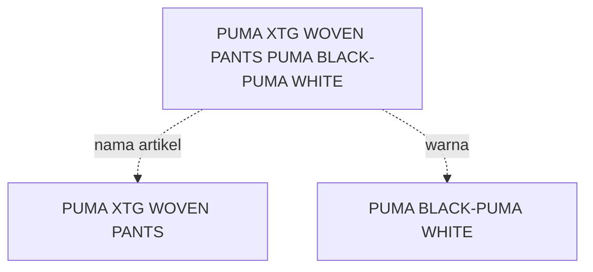

# Mengenai ColorSkim

<!-- ### Abstrak -->

### **I. Pendahuluan**

Di dalam dunia retail, suatu produk lebih dikenal dengan istilah artikel atau SKU (*Stock Keeping Unit*). Umumnya artikel atau SKU memiliki format dalam deret karakter alfanumerik yang dilabelkan pada suatu produk dan akan menjadi identitas pada produk tersebut.

Selain deret karakter alfanumerik, biasanya artikel juga memiliki beberapa atribut seperti `nama artikel`, `gender`, `ukuran`, `satuan`, `dimensi`, `warna` dan lain sebagainya yang mungkin cukup variatif tergantung jenis dari produknya.

Pada kasus kali ini, penulisan atribut `warna` dari sebuah artikel biasanya disatukan ke dalam `nama artikel` seperti misalnya 'PUMA XTG WOVEN PANTS PUMA BLACK-PUMA WHITE' dimana atribut `warna` dari artikel ini sebenarnya adalah 'PUMA BLACK-PUMA WHITE' sedangkan bagian 'PUMA XTG WOVEN PANTS' adalah bagian dari atribut `nama artikel`.



Terdapat kebutuhan untuk meng-ekstrak atribut `warna` ini dari `nama artikel` sehingga misalnya, `nama artikel` dapat dipergunakan sebagai tampilan yang lebih bersih di halaman produk di *e-commerce* tanpa kehilangan informasi mengenai `nama artikel` yang utuh, lengkap dengan atribut `warna`-nya yang diberikan oleh *vendor*.

Kebutuhan untuk meng-ekstrak `warna` dari `nama artikel` ini juga nantinya diharapkan dapat digunakan sebagai bagian dari pembelajaran mesin untuk mengklasifikasikan `warna` yang diekstrak menjadi `kode warna internal` yang lebih seragam seperti `BLA`, `GRN`, `WHT`, ..., `MTL`, `NOC`.

### **II. Metode**

#### II.1. Data Preprocessing

Sebelum data dapat dipergunakan dalam proses *training* jaringan saraf tiruan, beberapa hal berikut akan terlebih dahulu dilakukan:

1. *Pemrosesan raw data ke dalam potongan kata*
  
    Pada awalnya data merupakan daftar (*list*) dari semua `nama artikel` beserta `brand` yang ada saat ini, dalam bentuk *csv* sebagai berikut

    ??? info "*Raw* data"
        | brand | nama_artikel                       |
        | ----- | ---------------------------------- |
        | ADI   | ADISSAGE-BLACK/BLACK/RUNWHT        |
        | ADI   | ADISSAGE-N.NAVY/N.NAVY/RUNWHT      |
        | ADI   | 3 STRIPE D 29.5-BASKETBALL NATURAL |
        | ADI   | 3S RUBBER X-BLACK                  |
        | ...   | ...                                |
        | WAR   | 125CM VINTAGE ORANGE               |

    Data ini akan diproses dan dirubah menjadi file csv lainnya dengan format sebagai berikut

    ??? info "Script untuk konversi *raw data*"
        Script ini pertama kali dibuat di https://github.com/johanesPao/ColorSkim/commit/d0ce0ad8872274a81c25ea195ef9929354b95813.
        ``` py title="colorskim_csv_generator.py"
        """
        File ini digunakan untuk men-generate dataset per kata untuk colorskim artikel
        dengan membaca colorskim_articles.csv dan menuliskannya ke csv baru dengan nama
        colorskim_dataset.csv yang dikompresi dalam colorskim_dataset.zip
        """

        import pandas as pd

        # Membaca colorskim_articles.csv
        data = pd.read_csv("colorskim_articles.csv", names=["nama_artikel"], header=None)

        # Inisialisasi dataframe akhir
        dataset_kata = pd.DataFrame([])

        for i in range(len(data)):  # loop setiap baris dalam dataframe data
            # mengganti karakter '/' dan '-' dengan spasi ' '
            replace_karakter = "/-"
            artikel_full = data.loc[i, "nama_artikel"]
            artikel_untuk_split = artikel_full
            for c in replace_karakter:
                artikel_untuk_split = artikel_untuk_split.replace(c, " ")
            # split artikel berdasarkan spasi
            split_artikel = artikel_untuk_split.split()
            print(f"Memproses {i+1} dari {len(data)} baris...")
            for i in range(
                len(split_artikel)
            ):  # loop dalam list hasil split_artikel (per kata)
                # bentuk dataframe untuk menampung kata, label, urut_kata dan total_kata
                # edit: menambahkan full article name untuk referensi saat labeling
                artikel_df = pd.DataFrame(
                    [[artikel_full, split_artikel[i], "", i + 1, len(split_artikel)]],
                    columns=["nama_artikel", "kata", "label", "urut_kata", "total_kata"],
                )
                # menggabungkan dataframe yang dihasilkan ke dalam dataframe akhir
                dataset_kata = pd.concat([dataset_kata, artikel_df], ignore_index=True)

        # Set opsi untuk kompresi output
        nama_file = "colorskim_dataset"
        opsi_kompresi = dict(method="zip", archive_name=nama_file + ".csv")
        # Menulis dataframe ke dalam csv yang dikompresi
        dataset_kata.to_csv(nama_file + ".zip", index=False, compression=opsi_kompresi)
        # Print selesai
        print(f"File selesai dituliskan ke dalam {nama_file}.zip")
        ```

    ??? info "*Output* konversi data"
        | brand | nama_artikel                | kata     | label | urut_kata | total_kata |
        | ----- | --------------------------- | -------- | ----- | --------- | ---------- |
        | ADI   | ADISSAGE-BLACK/BLACK/RUNWHT | ADISSAGE |       | 1         | 4          |
        | ADI   | ADISSAGE-BLACK/BLACK/RUNWHT | BLACK    |       | 2         | 4          |
        | ADI   | ADISSAGE-BLACK/BLACK/RUNWHT | BLACK    |       | 3         | 4          |
        | ADI   | ADISSAGE-BLACK/BLACK/RUNWHT | RUNWHT   |       | 4         | 4          |
        | ...   | ...                         | ...      |       | ...       | ...        |
        | WAR   | 125CM VINTAGE ORANGE        | 125CM    |       | 1         | 3          |
        | WAR   | 125CM VINTAGE ORANGE        | VINTAGE  |       | 2         | 3          |
        | WAR   | 125CM VINTAGE ORANGE        | ORANGE   |       | 3         | 3          |

    Lalu akan dilakukan pengisian label pada kolom `label` secara manual untuk dijadikan variabel dependen yang dijadikan sebagai target dalam proses *training* jaringan saraf tiruan seperti di bawah ini

    ??? info "Data setelah proses pelabelan manual"
        | brand | nama_artikel                | kata     | label       | urut_kata | total_kata |
        | ----- | --------------------------- | -------- | ----------- | --------- | ---------- |
        | ADI   | ADISSAGE-BLACK/BLACK/RUNWHT | ADISSAGE | bukan_warna | 1         | 4          |
        | ADI   | ADISSAGE-BLACK/BLACK/RUNWHT | BLACK    | warna       | 2         | 4          |
        | ADI   | ADISSAGE-BLACK/BLACK/RUNWHT | BLACK    | warna       | 3         | 4          |
        | ADI   | ADISSAGE-BLACK/BLACK/RUNWHT | RUNWHT   | warna       | 4         | 4          |
        | ...   | ...                         | ...      | ...         | ...       | ...        |
        | WAR   | 125CM VINTAGE ORANGE        | 125CM    | bukan_warna | 1         | 3          |
        | WAR   | 125CM VINTAGE ORANGE        | VINTAGE  | warna       | 2         | 3          |
        | WAR   | 125CM VINTAGE ORANGE        | ORANGE   | warna       | 3         | 3          |

    File yang selesai diberikan label kemudian disimpan dalam format csv, namun untuk keamanan dan juga pemisahan data dari proses kerja, maka file tidak diikutsertakan dalam *git commit* dan disimpan di *remote storage* pribadi yang dimonitor menggunakan *data version control* [DagsHub](https://dagshub.com/) (https://github.com/johanesPao/ColorSkim/commit/6e814ad6e7724e35a65c4f7b31fbfd2bc10c2254)

    Data `nama_artikel` tidak dipergunakan dalam proses *training* jaringan saraf tiruan namun digunakan dalam evaluasi hasil model.

2. Pembagian data menjadi *training* dan *test*

    Data akan dipisah menjadi 2 set data *training* dan *test* menggunakan rasio tertentu. Data *training* akan dipergunakan dalam melatih jaringan saraf tiruan dan memutakhirkan bobot dalam *neuron* di jaringan saraf tiruan, sedangkan data *test* hanya akan dipergunakan dalam proses validasi di setiap akhir *epoch* dan menyimpan model dengan *val_accuracy* terbaik selama proses pelatihan, namun pemutakhiran bobot dari *neuron* (*backpropagation*) tidak akan dipengaruhi oleh data *test*.

3. *Encoding* kategori/label
   
    Untuk data dengan bentuk kategori seperti `brand`, `urut_kata` dan `total_kata` (input data) serta `label` (*output* data) dilakukan proses encoding untuk merubah data non-numerik menjadi data numerik dalam proses *training* model.

    Untuk input data `urut_kata` dan `total_kata` bisa saja dikecualikan dari proses *encoding* ini karena sudah berupa data numerik, alternatif lainnya yang mungkin adalah dengan membagi `urut_kata` dengan `total_kata` atau membiarkan kedua data tersebut apa adanya atau menormalisasi `urut_kata` dan membiarkan `total_kata` seperti apa adanya.

    Namun pada kasus ini kita tidak akan melakukan *feature engineering* atau rekayaasa variabel dan memilih untuk melakukan proses *OneHotEncoding* pada input data `brand`, `urut_kata` dan `total_kata` serta melakukan *LabelEncoding* untuk *output* data `label`.

4. Vektorisasi kata
   
    Sebelum kita dapat memasukkan input data yang paling penting (`kata`) ke dalam proses training, sangat penting untuk merubahnya menjadi data numerik seperti yang dilakukan di poin 2 pada input data lainnya (`brand`, `urut_kata`, `total_kata`). Pada satu kesempatan, vektorisasi ini akan dilakukan menggunakan `TfidfVectorizer` dari modul `scikit-learn` dan di kesempatan lainnya kita akan menggunakan lapisan vektorisasi custom `TextVectorizer` dari modul `tensorflow.keras.layers`.

5. *Embedding* kata

    Proses ini juga dilakukan pada input data `kata` supaya kita dapat memutakhirkan bobot dari *neuron* pada model sehingga hubungan dan relasi antar satu kata dengan kata lainnya bisa dibentuk.

6. Pembuatan Dataset, Batching dan Prefetching input data
   
    Proses ini dilakukan untuk mengkonversi data input yang siap untuk dilatih ke dalam format yang dapat meningkatkan performa dan kecepatan proses latihan dari jaringan saraf tiruan menggunakan TensorFlow (`tf.data.Dataset`) 

#### II.2. Permodelan

Ada setidaknya 4 jenis permodelan yang akan diujikan pada kesempatan kali ini.

1. Model *Multinomial Naive Bayes*
2. Model *Convolutional* 1 Dimensi dengan Lapisan *Embedding*
3. Model dengan ekstraksi fitur yang sudah terlatih (*Pretrained Feature Extraction*) *Universal Sentence Encoder*
4. Model *Quadbrid* dengan Lapisan *Embedding*

Penjelasan mengenai algoritma masing - masing permodelan dapat dilihat langsung di bagian [Dokumentasi ColorSkim](colorskim_notebook.md)

### **III. Hasil**

### **IV. Kesimpulan**

### **V. Saran**