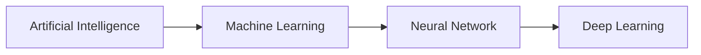

# Pembelajaran Mesin

Pembelajaran mesin merupakan satu percabangan dari kecerdasan buatan (AI) dan ilmu komputer yang berfokus pada penggunaan **data** dan **algoritma** untuk mengimitasi proses belajar manusia yang secara perlahan (**gradual**) memperbaiki akurasinya.

Pembelajaran mesin sendiri merupakan sub bagian dari kecerdasan buatan, dan di dalam pembelajaran mesin ini masih ada sub bagian lagi yang lebih dikenal dengan jaringan saraf tiruan (*neural network*) dan di dalamnya lagi ada yang dikenal dengan istilah *deep learning*.

## **Hierarki Kecerdasan Buatan (AI)**
Secara singkat berikut adalah susunan hierarki dalam kecerdasan buatan:

***Artificial Intelligence*** umumnya tidak hanya menerapkan statistik ke dalam permodelan, tapi juga kemampuan robotik atau sensorik.

***Machine Learning*** dan *Neural Network* secara teori dapat diartikan serupa namun *Machine Learning* lebih berfokus kepada algoritma dasar dalam permodelan statistik seperti *Naive Bayes Classifier*, *Random Forest*, *Linear Regression*, *Support Vector Machine*, *Time Series Forecasting* dll.

***Neural Network*** lebih mengacu kepada suatu topologi proses pembentukan struktur model diantaranya jumlah saraf (*neuron*)dalam lapisan, kedalaman lapisan (jumlah lapisan), metode aktivasi lapisan dan proses *update* bobot (*weight*) dan konstanta (*intercept*/*bias*).

***Deep Learning*** pada dasarnya adalah sama dengan *Neural Network*, namun ketika *Neural Network* memiliki lebih dari setidaknya 3 lapisan maka hal ini dikategorikan sebagai *Deep Learning*

## Dasar - dasar Jaringan Saraf Tiruan (*Neural Network*)

### Jenis Jaringan Saraf Tiruan
Pada dasarnya setidaknya terdapat tiga jenis pembelajaran dalam jaringan saraf tiruan:

* **Unsupervised Learning**
    
    Model jaringan saraf tiruan yang hanya memiliki input data dan tidak memiliki *output* data pada proses pelatihan (*training*) jaringan saraf tiruan, sehingga model ini dibebaskan untuk menemukan pola dari input data yang diberikan

* **Supervised Learning**

    Model jaringan saraf tiruan yang memiliki input dan *output* data pada proses pelatihan jaringan saraf tiruan, sehingga model ini memiliki target dan juga *loss* sebagai referensi seberapa akurat suatu model.

* **Reinforcement Learning** 
    
    Model jaringan saraf tiruan dengan fokus pada *reward* dan *punishment* dalam sebuah lingkungan (*environment*) dimana model diharuskan untuk memaksimalkan *reward* atau meminimalisir *punishment*. 

### Konsep Jaringan Saraf Tiruan dan Cara Kerja
Pada dasarnya jaringan saraf tiruan sebagai sub bagian dari kecerdasan buatan berusaha untuk memecahkan satu permasalahan, **pengambilan keputusan dengan proses pembelajaran yang dilakukan manusia dengan berdasarkan pendeteksian pola (*pattern recognition*)**. Konsep ini bisa dilihat pada gambar di bawah ini:

??? info "Contoh Jaringan Saraf Tiruan"
    

Dimana satu lapisan pada jaringan saraf tiruan memiliki setidaknya 4 komponen:

- [X] input data (*X*)
- [X] konstanta *bias* 
- [X] bobot (*weight*) *neuron* dalam lapisan
- [X] nilai *output* (*y*)

Atau di dalam simulasi persamaan matematik sebagai berikut:

$\sum_{i=1}^{n} {y_i} = {b} + {w_i^1}{X_i^1} + {w_i^2}{X_i^2} + {w_i^3}{X_i^3} + ... + {w_i^m}{X_i^m}$

Dimana idealnya suatu permasalahan dengan output ${y}$ ditentukan oleh perkalian bobot ${w}$ dengan masing - masing variabel independen ${X}$ dan ditambahkan dengan *bias* ${b}$. Proses menemukan $\hat{y}$ ini dikenal dengan istilah *forward propagation* dimana perhitungan dalam model dilakukan dari lapisan input, lapisan tersembunyi (*hidden*) dan sampai di lapisan *output*.

Pada kasus *regresi linear* nilai yang didapat dalam satu lapisan diteruskan ke lapisan berikutnya tanpa memerlukan aktivasi. Namun dalam kasus regresi yang tidak bersifat linear (*non-linear regression*) atau dalam kasus klasifikasi biner (*binary classification*) atau multi kelas (*multiclass classification*) biasanya dipergunakan fungsi aktivasi *sigmoid* (pada kasus *binary classification*) atau *softmax* (pada kasus *multiclass classification*).

???+ info "Sigmoid Function"
    ${S(x)} = \frac{1}{1 + {e}^{-z}}$ 
    
    dimana ${e}$ adalah [angka *euler*](https://en.wikipedia.org/wiki/E_(mathematical_constant))

???+ info "Softmax Function"
    ${\sigma(\vec{z})_i} = {\frac{e^{z_i}}{\sum_{j=1}{K}{e^{z_j}}}}$
    
    dimana ${\vec{z}}$ adalah input vektor dan ${K}$ adalah jumlah kelas dalam kasus *multiclass classifier*

Pada lapisan output akan dilakukan penghitungan selisih antara *output* ${y}$ yang sebenarnya dengan *output* $\hat{y}$ yang diprediksi oleh model (dengan input ${X}$ yang dimiliki) untuk menentukan *error*, *residual* atau lebih dikenal dengan istilah *loss* ${L}$ dari suatu model dalam memprediksi *output* yang biasanya terangkum dalam *Mean Absolute Error* (MAE) atau *Mean Squared Error* (MSE).

???+ info "Loss Function"
    ${L(y,\hat{y})} = \frac{1}{n}\sum_{i=1}^{n}|{y}-\hat{y_i}|$

Tujuan dari jaringan saraf tiruan adalah untuk melakukan pemutakhiran pada nilai - nilai bobot ${w}$ dalam setiap *neuron* di masing - masing lapisan dan *bias* ${b}$ untuk memperkecil *loss* ${L}$ dari suatu model. Proses pemutakhiran bobot dan *bias* pada jaringan saraf tiruan ini dikenal dengan istilah *back propagation* yang akan dimutakhirkan dengan fungsi optimisasi seperti SGD (*Stochastic Gradient Descent*) dan Adam (*Adaptive Momentum*).

???+ hint "Analogi Sederhana"
    Jika anda adalah penggemar k-drama dan pernah menyaksikan film berjudul *Startup (2020)*.
    
    Maka mungkin anda pernah menyaksikan adega ketika *Nam Do-San* memberikan gambaran yang sederhana tentang jaringan saraf buatan atau kecerdasan buatan secara umumnya kepada *Seo Dal-Mi* yang dapat diumpamakan sebagai Tarzan dan Jane. 
    
    Ketika Tarzan untuk pertama kali bertemu dengan manusia yang bernama Jane, Tarzan tidak tahu apa yang harus dilakukan. Seiring berjalannya waktu Tarzan memberikan batu (*forward propagation*) kepada Jane dan respon Jane adalah tidak senang (*loss* pada model tinggi dan akurasi rendah), maka Tarzan mempelajari sesuatu di dalam kepalanya (*back propagation* pemutakhiran bobot dan *bias* dalam jaringan saraf tiruan) dan kembali mencoba dengan benda - benda lainnya (*forward propagation* dan *back propagation*) dan mengamati respon Jane sebagai bahan pembelajarannya. Sampai suatu ketika Tarzan memberikan bunga dan respon Jane kali ini adalah senang (*loss* pada model rendah dan akurasi tinggi).

### Hambatan pada Penerapan Jaringan Saraf Tiruan

Beberapa hambatan yang umumnya dialami dalam penerapan jaringan saraf tiruan:

1. **Kotak Hitam**

    Jaringan saraf tiruan memiliki struktur lapisan yang sangat kompleks. Secara sederhana jaringan saraf tiruan dapat didefinisikan dalam dua ukuran yaitu lebar jaringan saraf dan kedalaman jaringan saraf. Dengan asumsi kita memiliki 1 *neuron* input, 5 lapisan tersembunyi (*NN depth*) dimana masing - masing lapisan tersembunyi memiliki 20 *neuron* (*NN width*) maka model kita akan memiliki 1 * 5 * 20 = 100 bobot dan 5 *bias*. Jika model kita memiliki lebih dari 1 variabel independen (*feature*), misalkan 10 fitur, maka jumlah bobot dengan struktur model yang sama kini memiliki 1000 bobot dan 5 *bias*. Dibandingkan dengan statistik sederhana dengan rumus $\sum_{i=1}^{10} {y_i} = {b} + {w_i^1}{X_i^1} + {w_i^2}{X_i^2} + {w_i^3}{X_i^3} + ... + {w_i^10}{X_i^10}$ yang hanya akan menghasilkan 10 bobot ${w}$ dan 1 bias ${b}$, jelas bahwa bobot dan *bias* dalam jaringan saraf tiruan terkadang sulit untuk diinterpretasikan dan ditelaah secara kasat mata.

2. **Durasi Pengembangan**

    Jaringan saraf tiruan membutuhkan waktu yang lama untuk dikembangkan dan juga dikelola secara terus - menerus untuk memastikan bahwa model dapat tetap menjawab permasalahan yang ada dengan data - data baru.

3. **Jumlah Data**

    Untuk mendapatkan akurasi model yang tinggi dibutuhkan data input dan juga data *output* yang jumlahnya sangat besar. Jika jumlah data yang dimiliki tidak banyak sebenarnya masih dapat diakali dengan melakukan pengulangan latihan berkali - kali (jumlah *epoch* yang banyak) atau dengan melakukan transformasi pada data. Namun mungkin muncul masalah *overfitting* pada model jika jumlah *epoch* yang dilakukan terlalu banyak dan model mulai merepresentasikan data training dengan sempurna namun gagal dalam menghasilkan *output* yang akurat pada data yang belum pernah dilihat (data testing).

4. **Biaya Komputasional yang Besar**

    Jaringan saraf tiruan yang dilatih pada struktur model pada poin 1 namun memiliki data sampel berjumlah 100,000 data akan melakukan perhitungan sebanyak 100,000 kali dalam satu epoch, jika dilatih pada 100 epoch, maka jaringan saraf tiruan akan melakukan 10,000,000 kali perhitungan. Belum lagi jika tipe data input adalah gambar atau video dimana tidak hanya memiliki lebar dan tinggi namun juga memiliki saluran RGB pada tiap pixelnya yang berarti 100,000 data menjadi 300,000 data yang perlu diproses.
    Sebagian besar jaringan saraf tiruan dilatih pada peralatan dengan GPU (*Graphical Processing Unit*) atau TPU (*Tensor Processing Unit*) yang kemampuan komputasinya bisa lebih cepat dari sekedar CPU berkat teknologi CUDA (*Compute Unified Device Architecture*). Biaya perolehan maupun penggunaan GPU secara intensif untuk kepentingan pelatihan jaringan saraf tiruan tidaklah murah, hal ini juga tercermin dengan makin maraknya jasa penyewaan GPU untuk pelatihan jaringan saraf tiruan di berbagai platform seperti [Google Colab](https://colab.research.google.com/signup), [Azure Machine Learning](https://azure.microsoft.com/en-us/services/machine-learning/), [Amazon SageMaker](https://aws.amazon.com/sagemaker/pricing/?p=ft&c=ml&z=3),  [Deepnote](https://deepnote.com/pricing), [Oracle Machine Learning](https://www.oracle.com/artificial-intelligence/pricing/) dan masih banyak lainnya.

## Penerapan Jaringan Saraf Tiruan di berbagai Industri

Capek nulis sama mikir, lanjut nanti lah....
<!--  -->
