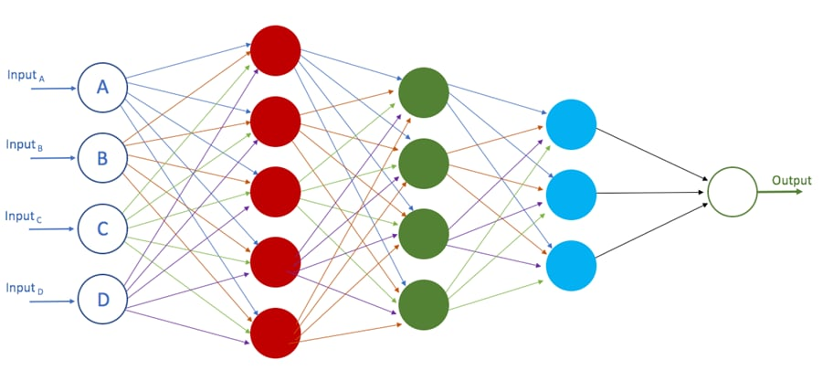

# Mengenai Pembelajaran Mesin

Pembelajaran mesin merupakan satu percabangan dari kecerdasan buatan (AI) dan ilmu komputer yang berfokus pada penggunaan **data** dan **algoritma** untuk mengimitasi proses belajar manusia yang secara perlahan (**gradual**) memperbaiki akurasinya.

Pembelajaran mesin sendiri merupakan sub bagian dari kecerdasan buatan, dan di dalam pembelajaran mesin ini masih ada sub bagian lagi yang lebih dikenal dengan jaringan saraf tiruan (*neural network*) dan di dalamnya lagi ada yang dikenal dengan istilah *deep learning*.

## **Hierarki Kecerdasan Buatan (AI)**
Secara singkat berikut adalah susunan hierarki dalam kecerdasan buatan:

***Artificial Intelligence*** umumnya tidak hanya menerapkan statistik ke dalam permodelan, tapi juga kemampuan robotik atau sensorik.

***Machine Learning*** dan *Neural Network* secara teori dapat diartikan serupa namun *Machine Learning* lebih berfokus kepada algoritma dasar dalam permodelan statistik seperti *Naive Bayes Classifier*, *Random Forest*, *Linear Regression*, *Support Vector Machine*, *Time Series Forecasting* dll.

***Neural Network*** lebih mengacu kepada suatu topologi proses pembentukan struktur model diantaranya jumlah saraf (*neuron*)dalam lapisan, kedalaman lapisan (jumlah lapisan), metode aktivasi lapisan dan proses *update* bobot (*weight*) dan konstanta (*intercept*/*bias*).

***Deep Learning*** pada dasarnya adalah sama dengan *Neural Network*, namun ketika *Neural Network* memiliki lebih dari setidaknya 3 lapisan maka hal ini dikategorikan sebagai *Deep Learning*

## **Dasar - dasar Jaringan Saraf Tiruan (*Neural Network*)**

### Jenis Jaringan Saraf Tiruan
Pada dasarnya setidaknya terdapat tiga jenis pembelajaran dalam jaringan saraf tiruan:

* **Unsupervised Learning**
    
    Model jaringan saraf tiruan yang hanya memiliki input data dan tidak memiliki *output* data pada proses pelatihan (*training*) jaringan saraf tiruan, sehingga model ini dibebaskan untuk menemukan pola dari input data yang diberikan

* **Supervised Learning**

    Model jaringan saraf tiruan yang memiliki input dan *output* data pada proses pelatihan jaringan saraf tiruan, sehingga model ini memiliki target dan juga *loss* sebagai referensi seberapa akurat suatu model.

* **Reinforcement Learning** 
    
    Model jaringan saraf tiruan dengan fokus pada *reward* dan *punishment* dalam sebuah lingkungan (*environment*) dimana model diharuskan untuk memaksimalkan *reward* atau meminimalisir *punishment*.

Untuk jenis - jenis dari jaringan saraf tiruan itu sendiri sebenarnya dapat dikelompokkan dalam 3 kategori besar di bawah ini:

* **Artificial Neural Network (ANN)**

    ANN merupakan bentuk jaringan saraf tiruan yang paling mendasar yang biasanya terbentuk dari sejumlah lapisan dalam jaringan yang tidak terlalu banyak. Umumnya lapisan pada jaringan saraf tiruan ini tidak memiliki fungsi aktivasi (linear) pada setiap lapisannya namun jika kita membayangkan jenis - jenis jaringan saraf tiruan lainnya, sebenarnya hanyalah pengembangan dari bentuk dasar ANN.

* **Convolution Neural Network (CNN)**

    CNN merupakan bentuk jaringan saraf tiruan yang sekarang menjadi tren di dalam komunitas *deep learning*. Jaringan saraf tiruan CNN ini dapat digunakan dalam berbagai bidang dan aplikasi, namun perannya sangat besar di dalam pemrosesan terkait gambar atau video. *Building block* dari CNN yang membedakan dengan jaringan saraf tiruan lainnya adalah pada penggunan *kernel* yang digunakan untuk meng-ekstrak fitur dari input menggunakan operasi konvolusional. 
    
    Arsitektural jaringan saraf tiruan pada CNN berusaha untuk menangkap fitur spasial (*spatial features*) dari sebuah gambar yang merujuk pada aturan susunan *pixel* dan hubungan diantara *pixel* dalam gambar. Untuk penjelasan yang sangat mendalam dan interaktif mengenai jaringan saraf tiruan CNN bisa dilihat di situs [CNN Explainer](https://poloclub.github.io/cnn-explainer/).

    Namun arsitektural CNN ini tidak saja dipergunakan dalam pemrosesan gambar atau video saja. Konsep dasar CNN yang menggunakan *kernel* dan juga berfokus pada ekstraksi fitur spasial juga dapat dipergunakan dalam struktur data lainnya yang memiliki sifat *sequence-to-sequence* atau *seq2seq* seperti pada kasus data *time series* (*forecasting*) ataupun dalam kasus data tekstual (*NLP - Natural Language Processing*).

    
    
    *Contoh arsitektural CNN dalam memproses data berupa gambar dalam kasus regresi logistik biner.*

* **Recurrent Neural Network (RNN)**

    RNN merupakan bentuk jaringan saraf tiruan yang utamanya memanfaatkan keadaan dari input sebelumnya (*previous state*) ke dalam faktor penilaian keadaan saat ini (*current input & state*) sehingga jariangan saraf tiruan ini disebut bersifat *recurrent* atau berulang. Ciri khas dari jaringan ini terletak pada struktur data input yang mengharuskan bentuk sekuensial seperti pada kasus tekstual kalimat atau data dengan *timestamp* yang konsisten (jika data memiliki interval *timestamp* yang tidak konsisten, harus dilakukan normalisasi terlebih dahulu). Interval *timestamp* yang konsisten pada data disebut sebagai *timestep* dalam jaringan saraf tiruan RNN dan konsep mengenai *timestep* seperti ukuran jendela (*window size*) dan ukuran horizon (*horizon size*) merupakan konsep yang cukup krusial.

    RNN umumnya digunakan secara spesifik dalam *forecasting* namun juga dapat digunakan dalam berbagai kasus *seq2seq* seperti CNN.

    Permasalahan yang sering timbul dalam jaringan saraf tiruan RNN adalah kasus menghilang atau meledaknya nilai *gradient* (*vanishing gradient* dan *exploding gradient*). Untuk kasus meledaknya nilai *gradient* masih dapat cukup dengan mudah ditangani dengan memangkas nilai *gradient* jika mencapai batas (*threshold*) tertentu dalam proses *back propagation*, namun permasalahan dengan nilai *gradient* yang menghilang sulit untuk diatasi, sehingga menyebabkan jaringan saraf tiruan berhenti "mempelajari". Namun untungnya, permasalahan *gradient* yang menghilang ini dapat diatasi sekitar tahun 1990 oleh *Sepp Hochreiter* dan *Juergen Schmidhuber* dengan memperkenalkan bentuk arsitektur *LSTM* (*Long Short Term Memory*) dalam jaringan saraf tiruan RNN.

    LSTM memiliki tiga gerbang untuk input, *forget* dan *output*. Ketiga gerbang ini akan menentukan apakah input baru yang masuk ke dalam *neuron* melalui *input gate* untuk menghapus informasi sebelumnya (*previous state*) karena dinilai tidak signifikan di *forget gate* atau membiarkan informasi mempengaruhi *output* pada *timestep* saat ini di *output gate*.

    

    *Contoh gerbang dalam arsitektur LSTM.*

    Dua arsitektural pada jaringan saraf tiruan RNN yang cukup populer penggunaannya adalah *LSTM* dan *GRU* (*Gated Recurrent Unit*).

### Konsep Jaringan Saraf Tiruan dan Cara Kerja
Pada dasarnya jaringan saraf tiruan sebagai sub bagian dari kecerdasan buatan berusaha untuk memecahkan satu permasalahan, **pengambilan keputusan dengan proses pembelajaran yang dilakukan manusia dengan berdasarkan pendeteksian pola (*pattern recognition*)**. Konsep *neuron* dalam jaringan saraf tiruan ini bisa dilihat pada gambar di bawah ini:

Sedangkan contoh jaringan saraf tiruan secara keseluruhan dapat dilihat pada gambar di bawah ini:

Dimana satu lapisan pada jaringan saraf tiruan memiliki setidaknya 4 komponen:

- [X] input data (*X*)
- [X] konstanta *bias* 
- [X] bobot (*weight*) *neuron* dalam lapisan
- [X] nilai *output* (*y*)

Atau di dalam simulasi persamaan matematik sebagai berikut:

$\sum_{i=1}^{n} {y_i} = {b} + {w_i^1}{X_i^1} + {w_i^2}{X_i^2} + {w_i^3}{X_i^3} + ... + {w_i^m}{X_i^m}$

Dimana idealnya suatu permasalahan dengan output ${y}$ (${y}$ aktual) ditentukan oleh perkalian bobot ${w}$ dengan masing - masing variabel independen ${X}$ dan ditambahkan dengan *bias* ${b}$. Proses menemukan $\hat{y}$ (${y}$ prediksi model) ini dikenal dengan istilah *forward propagation* dimana perhitungan dalam model dilakukan dari lapisan input, lapisan tersembunyi (*hidden*) dan sampai di lapisan *output*.

Pada kasus *regresi linear* nilai yang didapat dalam satu lapisan diteruskan ke lapisan berikutnya tanpa memerlukan aktivasi. Namun dalam kasus regresi yang tidak bersifat linear (*non-linear regression*) atau dalam kasus klasifikasi biner (*binary classification*) atau multi kelas (*multiclass classification*) biasanya dipergunakan fungsi aktivasi *ReLU* (*Rectified Linear Unit*) untuk memperkenalkan non-linearitas pada model, *Sigmoid* (pada kasus *binary classification*) atau *Softmax* (pada kasus *multiclass classification*).

???+ info "Sigmoid Function"
    ${S(x)} = \frac{1}{1 + {e}^{-z}}$ 
    
    dimana ${e}$ adalah [angka *euler*](https://en.wikipedia.org/wiki/E_(mathematical_constant))

???+ info "Softmax Function"
    ${\sigma(\vec{z})_i} = {\frac{e^{z_i}}{\sum_{j=1}{K}{e^{z_j}}}}$
    
    dimana ${\vec{z}}$ adalah input vektor dan ${K}$ adalah jumlah kelas dalam kasus *multiclass classifier*

Pada lapisan output akan dilakukan penghitungan selisih antara *output* ${y}$ yang sebenarnya dengan *output* $\hat{y}$ yang diprediksi oleh model (dengan input ${X}$ yang dimiliki) untuk menentukan *error*, *residual* atau lebih dikenal dengan istilah *loss* ${L}$ dari suatu model dalam memprediksi *output* yang biasanya terangkum dalam *Mean Absolute Error* (MAE) atau *Mean Squared Error* (MSE).

???+ info "Loss Function (MAE)"
    ${L(y,\hat{y})} = \frac{1}{n}\sum_{i=1}^{n}|{y}-\hat{y_i}|$

Tujuan dari jaringan saraf tiruan adalah untuk melakukan pemutakhiran pada nilai - nilai bobot ${w}$ dalam setiap *neuron* di masing - masing lapisan dan *bias* ${b}$ untuk memperkecil *loss* ${L}$ dari suatu model. Proses pemutakhiran bobot dan *bias* pada jaringan saraf tiruan ini dikenal dengan istilah *back propagation* yang akan dimutakhirkan menggunakan *learning rate* dalam fungsi optimisasi seperti *AdaGrad* (*Adaptive Gradient*), *RMSProp* (*Root Mean Square Propagation*), *SGD* (*Stochastic Gradient Descent*), *Adam* (*Adaptive Momentum*) dan masih banyak fungsi optimisasi lainnya.

???+ info "Optimizer Function (SGD)"
    dimana pada kasus regresi linear kita mungkin memiliki persamaan/fungsi dari ${x}$ atau ${f(x)}$ atau ${y}$ sebagai berikut:

    ${f({x}) = {y} = {w_0}{b} + {w_1}{x}}$ dimana bobot ${w_0}$ selalu sama dengan ${1}$

    yang memiliki *fungsi biaya* atau *loss function* sebagai berikut:

    ${Q({w})} = {\sum_{i=1}^{n}{{Q_i}({w})}} = {\sum_{i=1}^{n}{(\hat{y_i}\ -\ {y_i})^{2}}} = {\sum_{i=1}^{n}{({w_1}\ +\ {w_2}{x_i}\ -\ {y_i})}}$

    dan nilai bobot ${w}$ diupdate menggunakan formula *SGD* yang merupakan turunan (*derivative*) dari *loss function* sebagai berikut:

    ${w}^{baru} := {w}^{lama} - \eta\nabla{Q_i}({w}^{baru})$ dimana ${\eta}$ adalah *learning rate*

    dimana ${w}^{baru}$ muncul pada kedua sisi persamaan yang dapat diturunkan menjadi persamaan berikut:

    ${w}^{baru} = {w}^{lama}\ +\ \frac{\eta}{1\ +\ \eta||x_i||^2}{(y_i\ -\ x_i^{'}{w}^{lama}){x_i}}$

???+ hint "Analogi Sederhana"
    Jika anda adalah penggemar k-drama dan pernah menyaksikan film berjudul *Startup (2020)*.
    
    Maka mungkin anda pernah menyaksikan adegan ketika *Nam Do-San* memberikan gambaran yang sederhana tentang jaringan saraf tiruan atau kecerdasan buatan secara umumnya kepada *Seo Dal-Mi* yang dapat diumpamakan sebagai Tarzan dan Jane. 
    
    Ketika Tarzan untuk pertama kali bertemu dengan manusia yang bernama Jane, Tarzan tidak tahu apa yang harus dilakukan. Seiring berjalannya waktu Tarzan memberikan batu (*forward propagation*) kepada Jane dan respon Jane adalah tidak senang (*loss* pada model tinggi dan akurasi rendah), maka Tarzan mempelajari sesuatu di dalam kepalanya (*back propagation* pemutakhiran bobot dan *bias* dalam jaringan saraf tiruan) dan kembali mencoba dengan benda - benda lainnya (proses *forward propagation* dan *back propagation* yang berulang) dan mengamati respon Jane sebagai bahan pembelajarannya. Sampai suatu ketika Tarzan memberikan bunga dan respon Jane kali ini adalah senang (*loss* pada model rendah dan akurasi tinggi).

??? example "Penerapan non-linearitas pada proses pemutakhiran bobot *neuron* dan *bias* dalam lapisan jaringan saraf tiruan dengan fungsi aktivasi Sigmoid"
    *All credit goes to* [Daniel Kukiela](https://www.youtube.com/c/DanielKukie%C5%82a/videos) dan tim [Neural Network from Scratch](https://nnfs.io/) untuk animasi mengenai jaringan saraf tiruan berikut: 

    

### Hambatan pada Penerapan Jaringan Saraf Tiruan

Beberapa hambatan yang umumnya dialami dalam penerapan jaringan saraf tiruan:

1. **Kotak Hitam**

    Jaringan saraf tiruan memiliki struktur lapisan yang sangat kompleks. Secara sederhana jaringan saraf tiruan dapat didefinisikan dalam dua ukuran yaitu lebar jaringan saraf dan kedalaman jaringan saraf.
    
    Dengan asumsi kita memiliki 1 *neuron* pada lapisan input, 5 lapisan tersembunyi (*NN depth*) dimana masing - masing lapisan tersembunyi memiliki 20 *neuron* (*NN width*) dan 1 *neuron* pada lapisan *output*. Maka model kita akan memiliki (1 * 20) + (20 * 20) + (20 * 20) + (20 * 20) + (20 * 20) + (20 * 1) = 1,640 bobot dan 5 *bias*. Jika model kita memiliki lebih dari 1 variabel independen (*feature*), misalkan 10 fitur, maka jumlah bobot dengan struktur model yang sama kini memiliki 1,840 bobot (jumlah bobot antara lapisan input dengan 10 *neuron* dan lapisan tersembunyi pertama dengan 20 *neuron* menjadi 10 * 20 alih - alih 1 * 20) dan 5 *bias*. 

    Dibandingkan dengan permasalahan yang sama pada statistika sederhana dengan rumus $\sum_{i=1}^{10} {y_i} = {b} + {w_i^1}{X_i^1} + {w_i^2}{X_i^2} + {w_i^3}{X_i^3} + ... + {w_i^{10}}{X_i^{10}}$ untuk persamaan matematika dengan 10 variabel independen, hanya akan menghasilkan 10 bobot ${w}$ dan 1 bias ${b}$. 

    Jelas bahwa jumlah bobot dalam jaringan saraf tiruan berkali - kali lipat lebih banyak dibandingkan dengan pendekatan statistika klasik. Jumlah bobot yang sangat banyak ini dapat menyulitkan untuk diinterpretasikan dan ditelaah secara kasat mata.

2. **Durasi Pengembangan**

    Jaringan saraf tiruan membutuhkan waktu yang lama untuk dikembangkan dan juga dikelola secara terus - menerus untuk memastikan bahwa model dapat tetap menjawab permasalahan yang ada dengan data - data baru.

3. **Jumlah Data**

    Untuk mendapatkan akurasi model yang tinggi dibutuhkan data input dan juga data *output* yang jumlahnya sangat besar. Jika jumlah data yang dimiliki tidak banyak sebenarnya masih dapat diakali dengan melakukan pengulangan latihan berkali - kali (jumlah *epoch* yang banyak) atau dengan melakukan transformasi pada data. Namun mungkin muncul masalah *overfitting* pada model jika jumlah *epoch* yang dilakukan terlalu banyak dan model mulai merepresentasikan data training dengan sempurna namun gagal dalam menghasilkan *output* yang akurat pada data yang belum pernah dilihat (data testing).

4. **Biaya Komputasional yang Besar**

    Sebagai contoh, jaringan saraf tiruan yang dilatih pada struktur model pada poin 1 dengan jumlah data sampel berjumlah 100,000 data akan melakukan perhitungan *matrix* (*dot product*) sebanyak 100,000 kali dalam satu epoch (belum termasuk perhitungan pada proses *back propagation*), jika dilatih pada 100 epoch, maka jaringan saraf tiruan akan melakukan 10,000,000 kali perhitungan. Belum lagi jika tipe data input adalah gambar atau video dimana tidak hanya memiliki lebar dan tinggi namun juga memiliki saluran RGB pada tiap pixelnya yang berarti 100,000 data menjadi 300,000 data yang perlu diproses.

    Sebagian besar jaringan saraf tiruan dilatih pada peralatan dengan GPU (*Graphical Processing Unit*) atau TPU (*Tensor Processing Unit*) yang kemampuan komputasinya bisa lebih cepat dari sekedar CPU berkat teknologi CUDA (*Compute Unified Device Architecture*) pada GPU NVIDIA.

    * [Dokumentasi CUDA 11.7.1](https://nvidia.github.io/cuda-python/overview.html)
    * [Kemampuan komputasi GPU](https://developer.nvidia.com/cuda-gpus)
    
    Biaya perolehan maupun penggunaan GPU secara intensif untuk kepentingan pelatihan jaringan saraf tiruan tidaklah murah, hal ini juga tercermin dengan makin maraknya jasa penyewaan GPU untuk pelatihan jaringan saraf tiruan di berbagai platform seperti [Google Colab](https://colab.research.google.com/signup), [Azure Machine Learning](https://azure.microsoft.com/en-us/services/machine-learning/), [Amazon SageMaker](https://aws.amazon.com/sagemaker/pricing/?p=ft&c=ml&z=3), [Deepnote](https://deepnote.com/pricing), [Oracle Machine Learning](https://www.oracle.com/artificial-intelligence/pricing/) dan masih banyak lainnya.

## **Kapan Menggunakan Pembelajaran Mesin?**

Seiring dengan semakin banyak dan beragamnya data yang tersedia saat ini baik dalam ranah publik maupun privat (korporat), kebutuhan akan interpretasi data ke dalam bentuk informasi pun meningkat. Meski perkembangan pembelajaran mesin yang pesat dan juga kemampuannya sangat baik dalam menginterpretasikan berbagai macam masalah, kenyataannya tidak semua harus menggunakan pembelajaran mesin.

Pertama - tama kita harus dapat memahami perbedaan pendekatan antara pembelajaran mesin dengan pemrograman konvensional. [@mrdbourke](https://twitter.com/mrdbourke) sebagai salah satu praktisi pembelajaran mesin yang menjadi wadah bagi penulis untuk mempelajari pembelajaran mesin menganalogikan masalah ini sebagai berikut:

Pada gambar di atas kita dapat melihat bahwa **pendekatan pemrograman konvensional** ==dimulai dari input data (kalkun segar) dan runtutan perintah (*business logic*) untuk menghasilkan *output* kalkun goreng==, sedangkan **pendekatan pembelajaran mesin** ==dimulai dari input data dan *output* untuk memprediksi runtutan perintah (*business logic*)==.

Dengan pendekatan ini kita dapat menyimpulkan dua hal mengenai kapan pembelajaran mesin dapat digunakan alih - alih pemrograman konvensional:

* **Ketika runtutan peraturan tidak dapat dibuat secara eksplisit.** Beberapa permasalahan manusia tidak dapat dengan baik diselesaikan dengan solusi baku berbasis runtutan peraturan yang deterministik, misalkan pada permasalahan kategorisasi email spam atau bukan atau sentimen analisis pada media sosial. Ketika runtutan perintah ini bergantung kepada terlalu banyak faktor dan ada *overlap* atau kebutuhan untuk *fine-tuning* pada solusi, akan menjadi semakin sulit bagi kita untuk membuat *business logic* dalam pemrogaman konvensional.
* **Atau ketika proses ini bisa dilakukan secara manual namun pada skala yang besar tidak dapat ditangani secara manual.** Kita mungkin dapat mengenali beberapa ratus email spam atau bukan, namun proses ini akan menjadi sangat merepotkan ketika jumlah email menjadi jutaan.

Pada akhirnya sebenarnya baik pembelajaran mesin maupun pemrograman konvensional dapat hidup berdampingan dengan baik, karena proses pembelajaran mesin biasanya akan menghasilkan sebuah model yang dipergunakan di dalam pemrograman konvensional.

## **Penerapan Jaringan Saraf Tiruan dalam Ranah Publik dan Komersial**

**Dan Wellers**, Global Lead for Digital Futures di SAP, **Timo Elliott**, Innovation Evangelist di SAP dan **Markus Noga**, VP of Machine Learning di SAP menuliskan sebuah artikel berjudul [8 Ways Machine Learning Is Improving Companies’ Work Processes](https://hbr.org/2017/05/8-ways-machine-learning-is-improving-companies-work-processes) di situs Harvard Business Review memberikan contoh penerapan pembelajaran mesin pada ranah komersil sebagai berikut:

* **Personalisasi *customer service***
* **Meningkatkan *customer loyalty* dan *retention***
* **Memperkerjakan karyawan yang tepat**
* **Otomatisasi beberapa proses keuangan**
* **Mengukur eksposur *brand***
* **Deteksi *fraud***
* **Memprediksi *perawatan* mesin atau infrastruktur**
* **Meningkatkan efisiensi *supply chain***
* **Analisa rak di industri retail**

Spesifik di dalam industri retail, pembelajaran mesin dapat digunakan untuk hal - hal sebagai berikut:

<!--  -->
